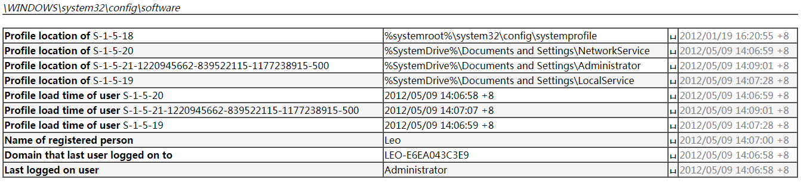
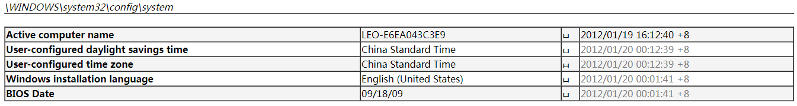
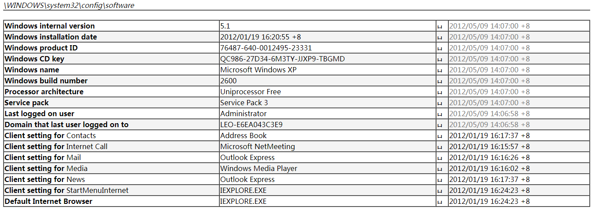
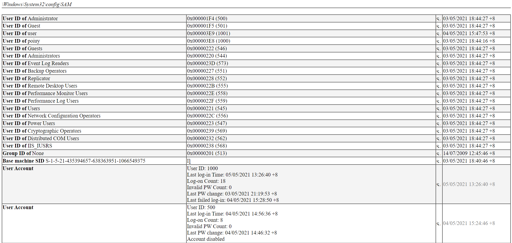

# X-Ways Forensics Windows 分析

对所有注册表进行所有预设的分析，然后得到report：

在software下面，直接就有 Last logged on user：

Computer Name：

系统基本信息，包括内部版本、Build ID 等：

## 索引

### 操作系统基本信息

CPU信息：`CPU`

磁盘信息：`IDE Device`

Windows 版本信息：`Windows internal version`，`Windows installation date`，`Windows product ID`，`Windows CD key`，`Windows name`，`Windows build number`，`Service pack`，`Last logged on user`，`Default Internet Browser`

计算机名称：`Active computer name`

Windows 安装语言（也不知道是不是正在使用的语言）：`Windows installation language`

Windows 安装时间：`Windows installation date`

可移动设备：`Windows portable devices`

启用的服务：`Services installed`

查看安装了的软件：`Install date of `，`Name of program Uninstall`，`Install date of Uninstall`，`Location of program Uninstall`，`Source of program Uninstall`，`Name of program`

### 网络信息

默认网关MAC：`Default Gateway MAC`

本机MAC（看起来可能会更齐全）：`This computer's MAC address`

DHCP指定的IP：`DHCP assigned IP Address`

本地连接网络：`Network connection`

TCP/IP网络名称：`Tcpip host name`

网卡信息：`Model description of installed network card`

### 用户信息

IE输入记录：`URLs typed in Internet Explorer`

打开过的文件：`Documents opened`，`Recent File List`

用户账户（但是看不到用户名，只能看到SID）：`User Account`

最后登录用户：`Last logged on user`

最后登录时的计算机名称（不知道具体什么作用）：`Last Computer Name`

用户设置的地区（NTUSER.DAT）：`Country`

用户自定义的文件夹（NTUSER.DAT）：`User-specific directories`

各个用户对应的UID（这个很有用，可以对照着查）：`User ID of Administrator`

