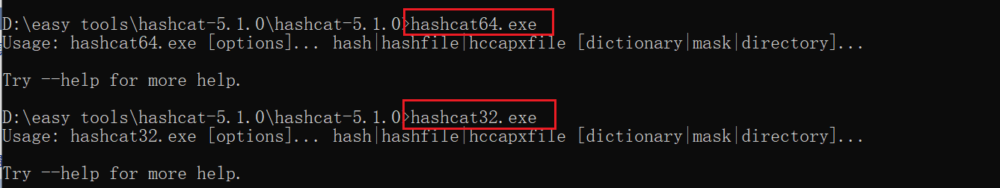

# 密码破解 - hashcat的简单使用

在我们抓取到系统的hash值之后，需要通过一些工具来破解密码

hashcat是一款`可以`基于显卡暴力破解密码的工具，几乎支持了所有常见的加密，并且支持各种姿势的密码搭配

在`kali Linux`中自带的有，也支持`Windows Mac`平台，可以在官网下载:[https://hashcat.net](https://hashcat.net/)

得到一个压缩包，加压后其中有各种版本的可执行文件`.sh .exe`
[](https://img2022.cnblogs.com/blog/2442110/202203/2442110-20220323145625996-1182942181.png)

这里我使用的是`windows`版，在`windows`中使用`hashcat`只需要在根目录进入命令行

[](https://img2022.cnblogs.com/blog/2442110/202203/2442110-20220323145831036-443117980.png)

进入命令行输入`hashcat64.exe`如果你是机器是`x32`位的可以使用`hashcat32.exe`

[](https://img2022.cnblogs.com/blog/2442110/202203/2442110-20220323150005802-834401071.png)

使用`hashcat64.exe -h`可以查看工具相关的帮助

会列出很多帮助，首先是命令参数，然后是命令参数的值

### -m hash的类型

指定hash的加密类型，默认是MD5类型

[](https://img2022.cnblogs.com/blog/2442110/202203/2442110-20220323151218880-546683178.png)

在对应的类型前面有它的id,可以通过id来指定类型

当我们想要找一个类型在`hashcat`支不支持的时候，例如windows系统加密的是NTML,可以执行命令

`hashcat64.exe -h | findstr NTLM`

[](https://img2022.cnblogs.com/blog/2442110/202203/2442110-20220323151441885-831306097.png)

可以看到`NTLM`的ID号为`1000`

### -a 攻击方式

破解密码的方式

分别有:

```
  0 | Straight  字典破解
  1 | Combination  组合破解
  3 | Brute-force  掩码破解
  6 | Hybrid Wordlist + Mask  混合字典 + 掩码
  7 | Hybrid Mask + Wordlist  混合掩码 +  字典
```

[](https://img2022.cnblogs.com/blog/2442110/202203/2442110-20220323150232206-1864847787.png)

### 掩码

当没有字典的时候，可以使用掩码指定密码的每一位是什么类型的字符，首先我们知道密码有多少位

[](https://img2022.cnblogs.com/blog/2442110/202203/2442110-20220323153207489-2145128247.png)

例如:`?d?d?d?d?d?d?d?d`代表密码为8为数字，`?u?l?l?l?l?d?d?d`代表密码为7位，首个字母大写，然后三个小写字母，最后三个数字

### 破解windows hash密码

**使用字典爆破windows hash**

`hashcat64.exe -a 0 -m 1000 hash或者hashfile 字典文件`

准备好我们的密码本，这里我使用的是手写的`2.txt`

[](https://img2022.cnblogs.com/blog/2442110/202203/2442110-20220323152446755-1468474769.png)

`hashcat64.exe -a 0 -m 1000 e45a314c664d40a227f9540121d1a29d 2.txt`

执行后会进入这样一个状态，这里每个可能不一样，在破解成功或者跑完字典后会自动停止

[](https://img2022.cnblogs.com/blog/2442110/202203/2442110-20220323152907726-1543846375.png)

[](https://img2022.cnblogs.com/blog/2442110/202203/2442110-20220323152938264-999245190.png)

可以看到我们的密码已经被破解出来，为`Admin123`

在破解后，会在根目录下的`hashcat.potfile`文件记录这个hash的缓存

[](https://img2022.cnblogs.com/blog/2442110/202203/2442110-20220323154735555-892319052.png)

这里我们将改文件清空，方便后续做实验

**使用掩码破解windows hash**
`hashcat64.exe -a 3 -m 1000 e45a314c664d40a227f9540121d1a29d ?u?l?l?l?l?d?d?d`

[](https://img2022.cnblogs.com/blog/2442110/202203/2442110-20220323155148658-906395823.png)

[](https://img2022.cnblogs.com/blog/2442110/202203/2442110-20220323155209806-1669173198.png)

破解成功

在我们爆破的同事，会有

```
[s]tatus [p]ause [b]ypass [c]heckpoint [q]uit =>
```

分别：查看破解状态，暂停，绕过，检查，退出

### 破解Linux hash密码

在`linux`中，我们知道，密码分别存储在/etc/passwd和/etc/shadow中，只需要`more /etc/shadow`，将其中的文件复制出来，使用工具破解即可

[](https://img2022.cnblogs.com/blog/2442110/202203/2442110-20220323193627170-854468310.png)

将root和jackson用户的密码保存到`/var/www/html/pass`Web服务目录中

```
root:$6$90/diajJs2fHcIGa$hB5wj4tMF8Qdd6o5VNRTY4v4vEpV8x0NP4O1N/tpJ8ns7JmJ8RyvSih7.W8TQdfwweUFh16dJejFpKw07i2uR1::0:99999:7:::
jackson:$6$Zje1WaoS$eH24JFr5n67149yBcDWWsfxME5cYlOXMmJxnf2uinbvYm8vWc0BmjvAoXIFY/0ZUJItRpPhHkCGDiqjXT10EV0:19066:0:99999:7:::
```

[

[](https://img2022.cnblogs.com/blog/2442110/202203/2442110-20220324083051894-306061497.png)
注意这里的换行，一个用户的hash值是一行

[](https://img2022.cnblogs.com/blog/2442110/202203/2442110-20220323195519376-1688604181.png)

启动Web服务

[](https://img2022.cnblogs.com/blog/2442110/202203/2442110-20220323195250088-790012495.png)

并在实验机器下载，这里使用certutil将pass文件内容下载到了D盘下的pass文件中去

[](https://img2022.cnblogs.com/blog/2442110/202203/2442110-20220323194800417-621412828.png)

**Linux使用的是 sha512crypt加密方式**，在hashcat中寻找是否有该方法

`hashcat64.exe -h|findstr sha512crypt`

[](https://img2022.cnblogs.com/blog/2442110/202203/2442110-20220323195736516-1164859720.png)

代号为`1800`

继续使用我们的`2.txt`对`d:\pass`文件进行暴力破解

`hashcat64.exe -a 0 -m 1800 d:\pass 2.txt`

[](https://img2022.cnblogs.com/blog/2442110/202203/2442110-20220323200929852-624191296.png)
[](https://img2022.cnblogs.com/blog/2442110/202203/2442110-20220323201016538-1015617615.png)

这里我更换了`root`和`jackson`用户在文件中的位置

爆破成功，得到`jackson`的密码为`root`，但是只爆破出了一个密码，应该只支持一个密码的破解

**`注意:复制的时候一定不要有换行，不然是无法破解成功的`**