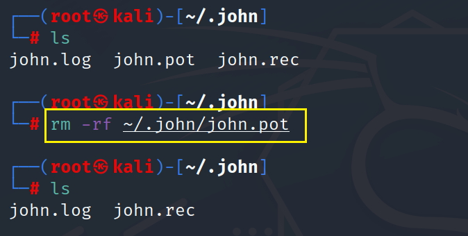
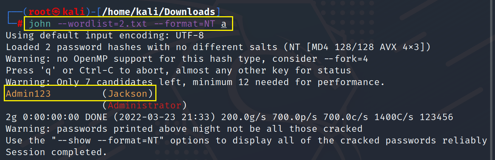

# 密码破解-john的使用

`john -w=password.lst shadow`

john类似于`hashcat`一样，也是一款密码破解方式，john跟专注于系统密码的破解，并且和`hashcat`一样在`kali`中自带

hash请见[hash的简单使用](https://www.cnblogs.com/Junglezt/p/16044372.html)

### 识别Hash类型

`john`会自动识别需要破解的`hash`，但是很多时候会识别错误，这不用担心，我们使用专门识别`hash类型`的工具[hash-identifier](https://gitlab.com/kalilinux/packages/hash-identifier/-/tree/kali/master)，幸运的是他在`kali`中自带，也可以使用网站来识别`hash`的类型[哈希类型标识符](https://hashes.com/en/tools/hash_identifier)

在对`hash`值的类型进行识别后，我们需要在`john`找到是否支持破解该类型的`hash`

`john --list=formats`可以列出所有可以支持破解的`hash`类型，我们可以配合`grep`进行筛选`john --list=formats | grep md5`

[](https://img2023.cnblogs.com/blog/2442110/202303/2442110-20230328152402592-1338416402.png)

找到`john`可以破解该类型`hash`的名称，我们可以直接使用`john`进行密码的破解，下面是`john`在使用的时候语法格式

```txt
john --format=[format] --wordlist=[path to wordlist] [path to file]
```

重要的参数

`--wordlist=字典`，`--format=加密类型`

### 破解windows hash

我们知道`windows hash`的加密为`NTLM`，需要我们`--format`指定，在`john`中，分别有`NT`和`LM`两种加密，这里我并不知道使用哪一个

`john --help`可以查看帮助

[](https://img2022.cnblogs.com/blog/2442110/202203/2442110-20220324091558475-1270750681.png)

在末尾可以看到`--list=formats`和`--list=subformats`可以查看所支持的破解类型

**不指定破解类型和字典直接破解**

> john会自动进行使用默认的字典，并识别我们的hash类型进行自动选择

这里我们的`hash`存储在`a`文件中
[](https://img2022.cnblogs.com/blog/2442110/202203/2442110-20220324091912097-512397852.png)

`john a`

[](https://img2022.cnblogs.com/blog/2442110/202203/2442110-20220324092048943-1542747862.png)

破解出来的密码为空，`Administrator`和`Guest`的密码确实为空，但是`Jackson`的密码并不是空的，所以这里`john`自动识别类型错误了

当我们破解成功后，john会将破解成功的hash缓存在我们家目录的`.john/john.pot`文件中，需要我们手动进行删除，否则下次爆破会出现
[](https://img2022.cnblogs.com/blog/2442110/202203/2442110-20220324092533171-1790928567.png)

意思就是让我们`--show`查看破解成功的密码，或者`--format=LM`指定破解类型

需要手动删除`rm -rf ~/.john/john.pot`
[](https://img2022.cnblogs.com/blog/2442110/202203/2442110-20220324092722184-817063347.png)

**指定类型进行破解**

`john --format=NT a`，这里的坑就是`john`推荐我们使用`LM`类型，但是并不是
[](https://img2022.cnblogs.com/blog/2442110/202203/2442110-20220324092948688-511619683.png)
并没有指定字典，使用默认字典`/usr/share/john/password.lst`进行破解，摁下`Enter`查看正在破解`1ms8wb..1m1L3R`

由于破解时间较长，`Ctrl + C`停止

同样删除`john.pot`文件

**使用字典进行暴力破解**

`john --wordlist=2.txt --format=NT a`

[](https://img2022.cnblogs.com/blog/2442110/202203/2442110-20220324093335099-1014764646.png)

成功将Jackson密码破解

### 破解Linux hash密码

**Linux**的密码存储在`/etc/shadow`中，只需要查看并复制即可破解

这里hash文件为`b`
[](https://img2022.cnblogs.com/blog/2442110/202203/2442110-20220324093737342-1333133193.png)

highlighter- apache

```
root:$6$90/diajJs2fHcIGa$hB5wj4tMF8Qdd6o5VNRTY4v4vEpV8x0NP4O1N/tpJ8ns7JmJ8RyvSih7.W8TQdfwweUFh16dJejFpKw07i2uR1::0:99999:7:::
jackson:$6$Zje1WaoS$eH24JFr5n67149yBcDWWsfxME5cYlOXMmJxnf2uinbvYm8vWc0BmjvAoXIFY/0ZUJItRpPhHkCGDiqjXT10EV0:19066:0:99999:7:::
```

Linux的加密算法为`sha512crypt`

破解`john -wordlist=2.txt b`

[](https://img2022.cnblogs.com/blog/2442110/202203/2442110-20220324093838969-380238753.png)

### unshadow

**John** 可能非常挑剔它需要数据的格式才能使用它，因此 - 为了破解 **/etc/shadow** 密码，您必须将它与 **/etc/passwd** 文件结合起来，以便 **John**了解所提供的数据。为此，我们使用了 **John** 工具套件中内置的一个名为 **unshadow** 的工具。**unshadow** 的基本语法如下：

```txt
unshadow [path to passwd] [path to shadow]
```

**unshadow**- 调用取消阴影工具

`[path to passwd]`- 包含您从目标机器获取的 **/etc/passwd** 文件副本的文件

`[path to shadow]`- 包含您从目标机器获取的 **/etc/shadow** 文件副本的文件

**用法示例：**

```txt
unshadow local_passwd local_shadow > unshadowed.txt
```

文件注意事项

使用 **unshadow** 时，您可以使用整个 **/etc/passwd** 和 **/etc/shadow** 文件 - 如果您有它们，或者您可以使用每个文件的相关行，例如：

文件 1 - **local_passwd**

包含根用户的 **/etc/passwd** 行：

```txt
root:x:0:0::/root:/bin/bash
```

文件 2 - **local_shadow**

包含根用户的 **/etc/shadow** 行：

```txt
root:$6$2nwjN454g.dv4HN/$m9Z/r2xVfweYVkrr.v5Ft8Ws3/YYksfNwq96UL1FX0OJjY1L6l.DS3KEVsZ9rOVLB/ldTeEL/OIhJZ4GMFMGA0:18576::::::
```

然后使用`john --format=sha512crypt --wordlist=/usr/share/wordlists/rokeyou.txt unshadow.txt`

## 单一破解模式

到目前为止，我们一直在使用 **John** 的单词列表模式来处理简单的暴力破解，而不是那么简单的哈希。但是 **John** 还有另一种模式，叫做 **Single Crack** 模式。

在这种模式下，**John** 仅使用用户名中提供的信息，通过略微更改用户名中包含的字母和数字，以启发式方式尝试并计算出可能的密码

词处理

展示什么是 **Single Crack** 模式以及什么是单词 **mangling** 的最好方法是实际通过一个示例：

如果我们使用用户名：**Markus**

一些可能的密码可能是：

- **Markus1, Markus2, Markus3 (etc.)**
- **MArkus, MARkus, MARKus (etc.)**
- **Markus!, Markus$, Markus\* (etc.)**

使用单一破解模式

要使用单一破解模式，我们使用与目前为止大致相同的语法，例如，如果我们想破解名为“**Mike**”的用户的密码，使用单一模式，我们将使用：

```txt
john --single --format=[format] [path to file]
```

`--single` 这个标志让 **john** 知道你想使用单一哈希破解模式

用法示例：

```txt
john --single --format=raw-sha256 hashes.txt
```

关于单破解模式下文件格式的说明：

如果您在单一破解模式下破解哈希，则需要更改您为 john 提供的文件格式，以便它了解从哪些数据创建单词列表。您可以通过在哈希之前添加哈希所属的用户名来执行此操作，因此根据上面的示例 ,我们将更改文件 **hashes.txt**

**From:**

```
1efee03cdcb96d90ad48ccc7b8666033
```

**To**

```
mike:1efee03cdcb96d90ad48ccc7b8666033
```

试着破解`Joker`的hash值`7bf6d9bb82bed1302f331fc6b816aada`

你的答案是什么呢？

## 破解受密码保护的 **Zip** 文件

是的！你没看错。我们可以使用 **John** 来破解受密码保护的 **Zip** 文件的密码。同样，我们将使用 **john** 工具套件的单独部分将 **zip** 文件转换为 **John** 可以理解的格式，但出于所有意图和目的，我们将使用您的语法你现在已经很熟悉了。

**Zip2John**
与我们之前使用的 **unshadow** 工具类似，我们将使用 **zip2john** 工具将 **zip** 文件转换为 **John** 能够理解并有望破解的哈希格式。基本用法是这样的：

```txt
zip2john [options] [zip file] > [output file]
```

`[options]`- 允许您将特定的校验和选项传递给 **zip2john**，这通常不是必需的

`[zip file]`- 您希望获取其哈希值的 **zip** 文件的路径

`>`- 这是输出导向器，我们用它来将这个文件的输出发送到...

`[output file]`- 这是将存储输出的文件

用法示例

```txt
zip2john zipfile.zip > zip_hash.txt
```

然后，我们可以在名为“**zip_hash.txt**”的示例用例中获取我们从 **zip2john** 输出的文件，并且就像我们对 **unshadow** 所做的那样，将它直接提供给 **John**，因为我们已经专门为它输入了内容。

```txt
john --wordlist=/usr/share/wordlists/rockyou.txt zip_hash.txt
```

练习`https://junglezt.lanzouf.com/iZLDf0rbr27a`,下载得到`secure.zip`,尝试解开这个zip压缩包吧

## 破解受密码保护的 RAR 存档

我们可以使用与上一个任务中使用的过程类似的过程来获取 **rar** 档案的密码。如果您不熟悉，**rar** 档案是由 **Winrar** 档案管理器创建的压缩文件。就像 **zip** 文件一样，它们可以压缩各种文件夹和文件。

**Rar2John**
哈哈，似曾相识的感觉，与我们刚刚使用的 **zip2john** 工具几乎相同，我们将使用 **rar2john** 工具将 **rar** 文件转换为 **John** 能够理解的哈希格式。基本语法如下：

```txt
rar2john [rar file] > [output file]
```

`rar2john`- 调用 **rar2john** 工具

`[rar file]`- 您希望获取其哈希值的 **rar** 文件的路径

`>`- 这是输出导向器，我们用它来将这个文件的输出发送到...

`[output file]`- 这是将存储输出的文件
用法示例

```txt
rar2john rarfile.rar > rar_hash.txt
```

再一次，我们可以在我们的示例用例中获取我们从 **rar2john** 输出的文件，称为“**rar_hash.txt**”，就像我们对 **zip2john** 所做的那样，我们可以将它直接提供给 **John**..

```txt
john --wordlist=/usr/share/wordlists/rockyou.txt rar_hash.txt
```

练习:`https://junglezt.lanzouf.com/iP8oZ0rbszzc`,下载得到`secure.rar`文件，尝试破解这个文件吧

## 破解SSH密钥密码

好的，好的，我听到了，不再有文件存档了！美好的！让我们探索 **John** 在 **CTF** 挑战中半频繁出现的另一种用法。使用**John**破解**id_rsa**文件的**SSH**私钥密码。除非另有配置，否则您将使用密码验证您的 **SSH** 登录。但是，您可以配置基于密钥的身份验证，它允许您使用您的私钥 **id_rsa** 作为身份验证密钥通过 **SSH** 登录到远程计算机。然而，这样做通常需要密码——在这里我们将使用 **John** 来破解此密码，以允许使用密钥通过 **SSH** 进行身份验证。

**ssh2john**
谁能猜到，另一个转换工具？好吧，这就是与 **John** 合作的意义所在。顾名思义，**ssh2john** 将您用于登录SSH会话的 **id_rsa** 私钥转换为 **john** 可以使用的哈希格式。撇开玩笑不谈，这是 **John** 多才多艺的另一个很好的例子。语法是关于你所期望的。请注意，如果您没有安装 **ssh2john**，则可以使用位于 **/opt/john/ssh2john.py** 中的 **ssh2john.py**。如果您这样做，请将**ssh2john**命令替换为`python3 /opt/ssh2john.py`,**Kali** 上的或，`python /usr/share/john/ssh2john.py`.

```txt
ssh2john [id_rsa private key file] > [output file]
```

`ssh2john` - 调用 **ssh2john** 工具

`[id_rsa private key file]`- 您希望获取其哈希值的 **id_rsa**文件的路径

`>`- 这是输出导向器，我们用它来将这个文件的输出发送到...

`[output file]`- 这是将存储输出的文件

用法示例

```txt
ssh2john id_rsa > id_rsa_hash.txt
```

最后一次，我们提供从 **ssh2john** 输出的文件，在我们的示例用例中称为“**id_rsa_hash.txt**”，就像我们对 **rar2john** 所做的那样，我们可以与 **John** 无缝地使用它：

```txt
john --wordlist=/usr/share/wordlists/rockyou.txt id_rsa_hash.txt
```

