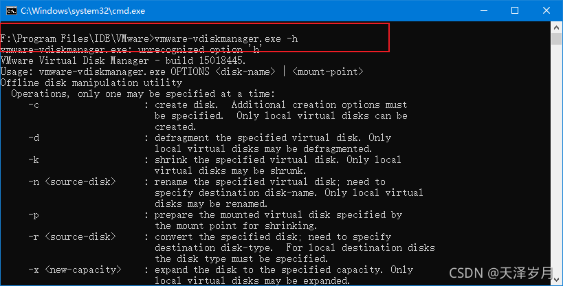
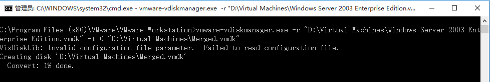

# VMWare vmdk 文件分割与合并

在vmware 安装位置打开，使用命令`vmware-vdiskmanager.exe -h`可以查看它所有的功能：



其中，-r参数指定源磁盘文件；-t参数指定输出虚拟磁盘文件的类型，其值为以下类型之一：

```
0：创建一个包含在单一虚拟文件中的可增长虚拟磁盘

1：创建一个被分割为每个文件2GB大小的可增长虚拟磁盘

2：创建一个包含在单一虚拟文件中的预分配虚拟磁盘

3：创建一个被分割为每个文件2GB大小的预分配虚拟磁盘
```

## 1.1 多个文件合并为单个文件

找到虚拟机文件位置

找到vmdk后缀的文件

使用命令 `vmware-vdiskmanager.exe -r "D:\xxx\xxx.vmdk" -t 0 "D:\xxx\重命名.vmdk"`

命令格式说明：

`vmware-vdiskmanager.exe -r [源文件] -t 0 [目标文件]`

[源文件]是待转换的文件,

[目标文件]是转换后生成的文件

-t后的参数是0表示将源文件合并为一个目标文件。



## 1.2 单个文件分割为多个文件

找到虚拟机文件位置

找到vmdk后缀的文件

使用命令 `vmware-vdiskmanager.exe -r "D:\xxx\xxx.vmdk" -t 1 "D:\xxx\重命名.vmdk"`，-t后的参数是1表示将源文件分割为多个目标文件。