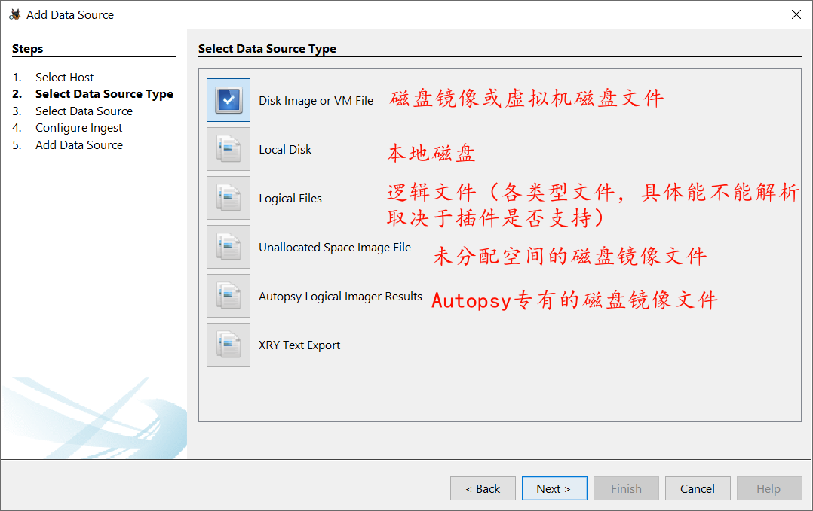
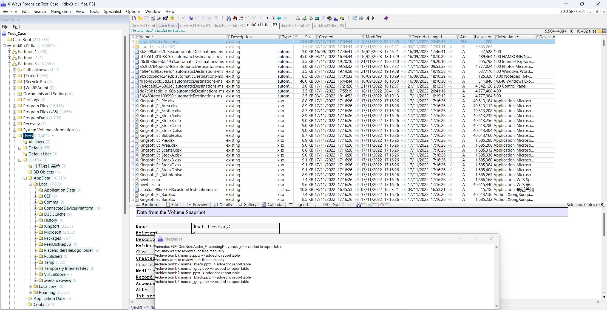
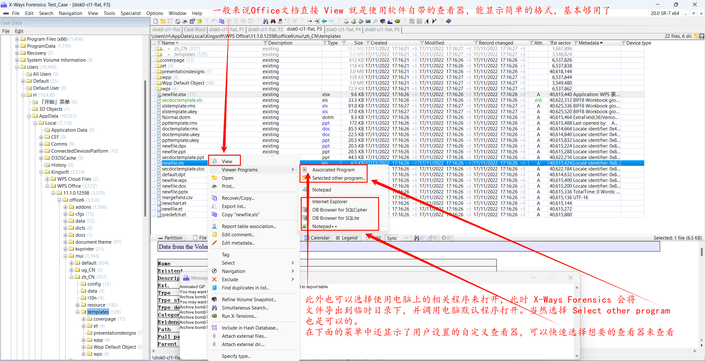

# 不氪金取证方法

## Autopsy

https://www.autopsy.com

> Autopsy® is the premier end-to-end open source digital forensics platform. Built by Basis Technology with the core features you expect in commercial forensic tools, Autopsy is a fast, thorough, and efficient hard drive investigation solution that evolves with your needs.

个人感觉 Autopsy 是有两个版本的，一个是Windows上的，由 Java 语言编写，目前大版本是 4，拥有比较完善的功能，页面布局和取证大师、Encase 等工具比较像；另外一个是 Linux 上面的，由C语言编写，提供了一个简易的Web前端（甚至没有用到 JavaScript），可以通过包管理器安装（Kali Linux 自带了），拥有镜像查看、关键词搜索、时间线分析等功能，这个 Autopsy 有比较长的开发历史了，准确说是 thesluthkit 的一个图形化界面，而不是 Windows 上面的 Autopsy 那种比较完备的综合取证工具。需要注意的是，我此处的说法并不严谨，使用 Java 语言编写的 Autopsy 也是提供了 Linux 和 MacOS 版本的，只是安装配置相对耗费时间，有需求的可以参考官网文档和下载的程序包里面的指引进行安装。

Windows 上的由 Java 编写的 Autopsy 可在此处下载：https://www.autopsy.com/download/，软件大小约 1 GB左右。

下载安装完成后，软件主界面如下：

插一句，Linux 下通过包管理器安装的 Autopsy 长这样：

---

### 开始分析工作

#### 输入案件名称与基本信息

案件基本信息（可不填）

#### 添加数据来源

##### **添加检材**

可以选择以下类型的文件或设备：

笔者此处选择第一项，磁盘镜像或虚拟机磁盘文件。此处的用例是 2023 第一届龙信杯的检材，使用了 Windows 的磁盘镜像，格式为 vmdk 虚拟机磁盘文件。

##### **选择解析用的插件**

Autopsy使用插件来对检材进行分析，具体插件可以从网上下载，并在设置中添加。以自带的插件为例：

选择 `Data Source Integrity` 插件，可以对磁盘内容进行哈希校验，校验结果在右上角消息菜单中查看（信封标志）。

需要注意的是，如果选择使用上图框选的解析工具来解析 Android 和 iOS 的检材，需要遵守这两个工具对检材的要求。原本笔者也是不了解的，后来单独使用了 aLEAPP 和 iLEAPP 后，才发现的。对于 Android 分析，要求提供 `data` 分区的文件夹或者 `tar`、`zip`、`gz` 包，而不能是常用的镜像文件，此外对于 iOS 也是同样的要求，这里是不能直接分析 iTunes 备份文件的。

这个是 aLEAPP 的软件界面：

这个是可以用来解析的 `data` （导出的文件）文件夹示意：

##### **分析结果查看**

此处赘述了，选择好解析插件后，继续下一步，完成分析后会是这样的界面（直接在图中标示了）：

将数据来源展开，以此处为例，展开到 `C:\Windows\System32\config`，打开注册表 `hive` 文件，Autopsy 会自动选择查看器，可以以树状的形式查看内容：

分析结果查看：

### 笔者个人观点，不喜勿喷

Autopsy 使用 Java 语言编写，感觉在性能上把握得不是很好，有时候查看文件能感到明显的卡顿感，此外分析数据时也稍显迟缓，一点数据就分析老半天，所以笔者在编写该文档时并没有选择具体的解析插件，而是将其作为检材查看器使用。实际分析中，可以选择有限的插件来进行分析，并且结合对常用文件（比如注册表文件）、目录（比如程序目录、用户目录等）手工分析，得到需要调取的信息。

## X-Ways Forensics

### 软件简介

> X-Ways Forensics is an advanced work environment for computer forensic examiners and our flagship product. Runs under Windows XP/2003/Vista/2008/7/8/8.1/2012/10/2016/2019/11*, 32 Bit/64 Bit, standard/[PE](https://articles.forensicfocus.com/2017/01/06/windows-10-pe-for-digital-forensics/)/FE. (Windows FE is described [here](http://courses.dfironlinetraining.com/windows-forensic-environment), [here](http://brettshavers.cc/index.php/brettsblog/tags/tag/winfe) and [here](http://reboot.pro/files/file/375-mini-winfe/).) Compared to its competitors, X-Ways Forensics is more efficient to use after a while, by far not as resource-hungry, often runs [much faster](https://binaryforay.blogspot.hk/2016/09/let-benchmarks-hit-floor-autopsy-vs.html), finds deleted files and search hits that the competitors will miss, offers many features that the others lack, as a German product is potentially more [trustworthy](https://en.wikipedia.org/wiki/National_security_letter), comes at a fraction of the cost, does not have any ridiculous hardware requirements, does not depend on setting up a complex database, etc.! X-Ways Forensics is fully portable and runs off a USB stick on any given Windows system without installation if you want. Downloads and installs within seconds (just a few MB in size, not GB). X-Ways Forensics is based on the [WinHex hex and disk editor](https://www.x-ways.net/winhex/index-m.html) and part of an efficient [workflow model](https://www.x-ways.net/investigator/X-Ways Investigator (English).pps) where computer forensic examiners share data and collaborate with investigators that use [X-Ways Investigator](https://www.x-ways.net/investigator/index-m.html).

X-Ways Forensics 是由 Stefan Fleischmann 编写的一个轻量化的应急响应及取证工具，是 WinHex 的法证版本，因此界面逻辑和 WinHex 较为相似。在配置好 mplayer 的情况下，程序总体积在 100MiB 左右，运行时内存占用极低，功能及其强大。以下是该程序包含的所有文件（一般来说 X-Ways Forensics 是自带了 WinHex 的，如果没有自带，将 `xwforensics.exe` 改为对应的32位 WinHex 的名称，即 `WinHex.exe`，那么打开的时候将会成为 WinHex，64位同理）：

X-Ways Forensics 并不是一个免费的取证软件，相反需要数万元的授权费用，但是由于众所周知的原因，大家可以在国内一些下载站内找到修改过的版本，对于学习来说是完全够用了的，但是在实际工作中，是万万不能使用非官方来源的软件的。

X-Ways是我个人最喜欢的应急响应及取证软件，虽然说没有取证大师、火眼取证、Autopsy 那些综合取证软件“直观”、“方便”，但是 X-Ways Forensics 拥有极高的性能、极低的资源占用和相对底层的逻辑，不论是学习还是工作，都能发挥很强的作用，而且该软件界面逻辑相对固定，一次学会使用，基本上可以无忧畅想数十年。此外，X-Ways Forensics 也支持通过可移动的方式（Portable）运行在目标计算机中，进行现场取证，包括创建内存转储、磁盘镜像以及现场分析等，在这种情况下 X-Ways Forensics 会尽量避免在目标计算机上创建文件。另外，由于不同使用者对软件的理解不同，不同版本的翻译也可能不同，因此我会使用英文版的软件进行演示。此外，对于我的个别不入流的描述，还请各位理解，能 get 到意思就行，我自己打着也觉得别扭，就差直接用英文写了。

### 软件资源

官网：https://www.x-ways.net

软件详情页（并不提供下载）https://www.x-ways.net/forensics/index-m.html

官方简介：https://www.x-ways.net/winhex/forensics.html

用户手册页：https://documentation.help/WinHex-X-Ways/topic97.htm

官方快速入门：https://www.x-ways.net/forensics/QuickGuide.pdf https://www.x-ways.net/forensics/XWFQuickStart.pdf https://www.youtube.com/playlist?list=PLB0pU0wP67A9LezmyZO5I6DnHPEWjgjOD

官方手册：https://www.x-ways.net/winhex/manual.pdf

推荐书籍：X-Ways Forensics Practitioner's Guide

软件实操博客：https://www.cnblogs.com/WXjzc/p/17353378.html https://www.cnblogs.com/WXjzc/p/17852716.html

---

### 软件设置

#### 语言设置

有需要的可以在此处修改软件界面语言：

#### 案件路径设置

在 Options/General 里面，可以对一些默认保存目录进行配置，包括案件存放目录、（采集到的）镜像存放目录、临时文件目录、哈希库目录等：

#### 查看器配置

在 Options/Viewer Programs 下可以对查看器进行设置，笔者建议将本机上其他常用的查看器添加进去，这样可以在右键菜单中快捷选择打开方式并查看

笔者主要添加了 DB Browser for SQLite 和 SQLCipher，以用来快速查看数据库文件，此外也在软件目录下配置了 MPlayer。

### 开始分析工作

#### 创建案件

在开始分析前，需要创建新案件：

创建完成后，可在此处添加检材，此处选择 添加镜像文件：

支持格式如下：

除了镜像文件外，X-Ways Forensics 也支持添加物理设备（Add Medium...）、目录（Add Directory...）、文件（Add File...）和内存镜像（Add Memory Dump），常用的主要是添加镜像文件和目录。

依旧以龙信杯的检材为例，添加检材后，界面如图：

正在加载中：

（左侧也可被称为案件栏、文件列表等）

至此，基本的案件创建已经完成。

记得计算（Compute Hash，Ctrl + F2）、查看文件哈希（以用于校验）：

查看校验信息：

#### 过滤文件

刚才的操作是对所有文件进行平铺，但是有时候并不需要这样，因此可以在展开文件夹到特定层级后再平铺，并且进行过滤。

比如现在展开到了 H 用户的主目录：

直接右键左侧案件菜单栏中的 H，就能平铺查看：

题外话，对于分区需要右键后选择平铺查看：

然后进行过滤：

（临时更改了一下过滤的内容，改成了 `Wechat*`）过滤结果如下：

右键过滤栏上的漏斗图标可以取消过滤（Deactivate），左键单击案件窗口中的任何层级可以取消平铺并跳转到单击的层级中。

此外， X-Ways Forensics 以文件类型过滤文件的功能，也是非常方便的，说起来也简单，就是在 Type（文件类型）处进行过滤，以过滤注册表文件为例：

在 `Windows Registry` 中选择具体的文件类型（也可以全选的，只是精确指定后能更快地找到想要的文件）：

选择好之后选择 `Activate`，就能显示过滤后的结果：

同样也是右键过滤图标取消过滤，点击左侧文件列表也能进一步精确过滤范围。

通过文件类型进行过滤非常方便，能够快速（几乎是瞬间）筛选出特定名称及文件类型的文件，非常建议大家熟练掌握过滤器。

#### Simultaneous Search 同步搜索（Alt + F10）

> You may use the simultaneous search to systematically search multiple hard disks or disk images in a single pass for words like "drug", "cocaine", (street synonym #1 for cocaine), (street synonym #2 for cocaine), (street synonym #3 for cocaine), (street synonym #3 for cocaine, alternative spelling), (name of dealer #1), (name of dealer #2), (name of dealer #3) etc. at the same time. The search results can narrow down the examination to a list of files upon which to focus.
>
> The simultaneous search can be used to search physically in sectors or logically in file or in a previously created [index](https://documentation.help/WinHex-X-Ways/topic124.htm). Physically, it searches the sectors on a medium in LBA order (except if you search upwards, then in reverse order). If you do not have WinHex list the hits of a physical search, you may use the F3 key to search for the next hit. Logically, the search proceeds file by file, which is preferable and much more powerful and thorough. [More about the ](https://documentation.help/WinHex-X-Ways/topic83.htm)[logical search](https://documentation.help/WinHex-X-Ways/topic83.htm).
>
> You can search the same search terms simultaneously in up to 6 code pages. The default code page, that is active in your Windows system, is marked with an asterisk and initially preselected. E.g. on computers in the US and in Western Europe, the usual default code page is 1252 ANSI Latin I. The code pages named "ANSI" are used in Microsoft Windows. "MAC" indicates an Apple Macintosh code page. "OEM" indicates a code page used in MS-DOS and Windows command prompts. If a search term cannot be converted to the specified code page because of characters unknown in that code page, a warning is issued. Code page independent GREP searches for exact byte values are possible when searching in a "non" code page called "Direct byte-wise translation for GREP", which translates byte values without any mapping for certain code pages or case matching. X-Ways Forensics also allows to search in both little-endian and big-endian UTF-16, and in any regional Windows code page plus UTF16 with the MS Outlook cipher (compressible encryption) applied.

这个我一直不知道怎么准确翻译，不过知道具体功能就行。位置在 Search/Simulataneous Search 里面，

这个可以理解为暴力搜索，一切文件里面，只要是能满足搜索内容的，都会显示出来，并且支持多数常用编码，此处搜索 BitLocker 试试：

搜索过程中可以在此处查看已经搜到的结果，搜索结束后是会自动跳转到结果页面的，这个时候可以通过这个按钮来切换：

切换到搜索结果界面后，点击左侧的目录，可以查看特定目录下的搜索结果。在目录列表下方，会显示不同关键词的搜索结果（如果在搜索页面中指定了多个搜索词），也可以通过一定的语法指定不同搜索词中的逻辑关系。

此外，其他搜索项也是非常有用的，建议读者都尝试一下，比如搜索 Hex 值，可以在文件系统损坏的情况下定位到某一类型的文件等，都是非常实用的数据恢复技巧，具体想了解的话可以去了解一下 WinHex 数据恢复的教程，两者基本通用。

#### 精炼磁盘快照 Refine Volume Snapshot F10

该功能是 X-Ways Forensics 的特色功能之一，可以对检材内容进行深度分析，打开方式在 Specialist/Refine Volume Snapshot：

其实这个能讲的非常多，但是基本用法很简单，所以笔者在此不过多赘述，大家可以在使用过程中自行摸索。

精炼之后，在主界面中会多一个 Metadata 的栏，在里面也可以过滤信息，查看精炼结果。

鼠标放到该列上可以显示预览，但是实在难以截图，就没放上来。

#### 文件查看(预览)

X-Ways Forensics 提供了非常完备的文件预览功能，支持大多数的文件格式，尤其是 Office 文档，可以查看大致内容（格式较为简单，如果有需要建议还是导出后查看，或者选择“使用关联的方式打开（Associated Program）”）：

文件简单预览的界面如下：

#### 文件恢复/复制（导出）

选择好想要导出文件后（结合使用 Ctrl、Shift 选择多个文件），右键，选择 恢复/复制（Recover/Copy...）：

会弹出文件恢复/复制（简单理解为导出吧）窗口：

选择好路径后导出就行。上图路径是软件默认指定的路径，为案件目录下以该分区名称（编号）命名的文件夹。文件夹内一般是保留了原本目录的结构的。

以上就是我所认为的初次接触 X-Ways Forensics 需要了解和掌握的特色功能，于 X-Ways Forensics 软件的强大功能而言仅仅是冰山一角，想要更深的了解，建议移步 X-Ways Forensics Practitioner's Guide（目前互联网上只能找到第一版，发行于2013年，但是已经完全够用了，可见 X-Ways Forensics 在软件基本逻辑上的坚持）和官方手册（https://www.x-ways.net/winhex/manual.pdf），资料为均全英文，无中文翻译版，但是技术英语难度并不高，耐着性子都能读完，相信收获还是非常大的。X-Ways Forensics 自2003年第一版发行以来（印象中是这样），一直处于积极开发中，目前已经开发到了 20.8 版本，我演示所使用的 20.0 SR-7 是2019年发行的，已经是非常过时的版本了，很多新功能都无法体验到，所以有条件的建议还是购买正版软件，并通过右键积极接收软件更新。该软件的国内代理厂商为天宇宁达，同时也有相应的培训、认证服务。

https://www.x-ways.net/winhex/forum/messages/1/1265.html?1104780865

## FTK Imager 

## Arsenal Image Mounter

## ALEAPP、ILEAPP

## Eric Zimmerman's Tools

### MFTExplorer

### ShellBagsExplorer

​	usrclass.dat

### RegistryExplorer

## iBackup Viewer

配合 iTunes 使用

## HxD

## DB Browser for SqLite

## Kali Linux

John, HashCat

