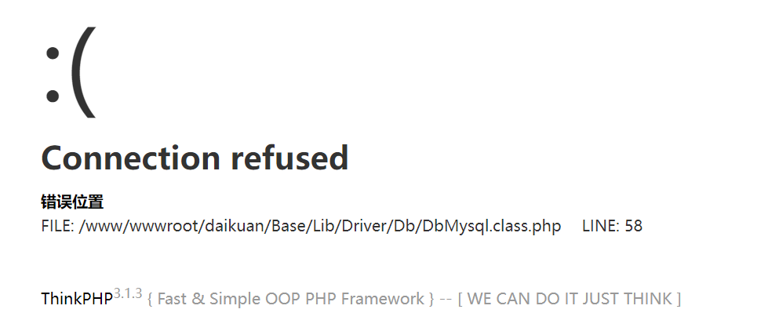
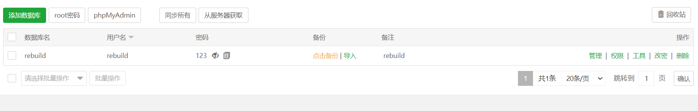
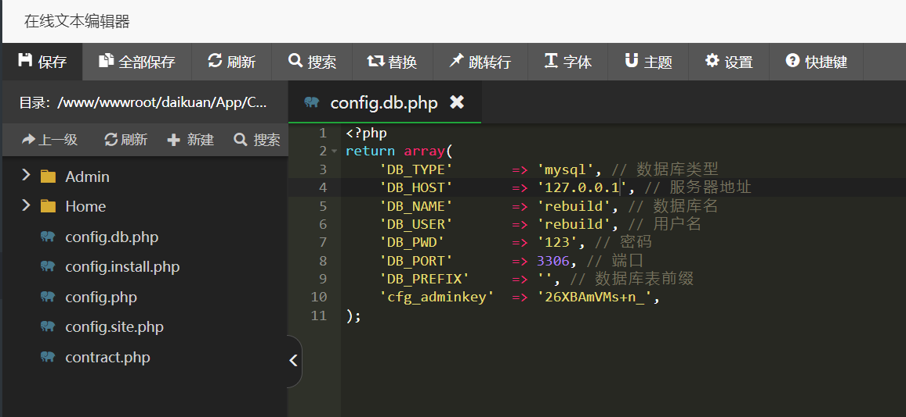
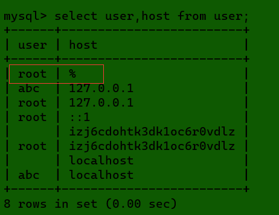
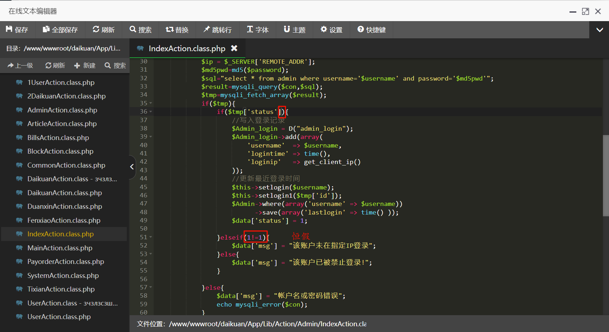
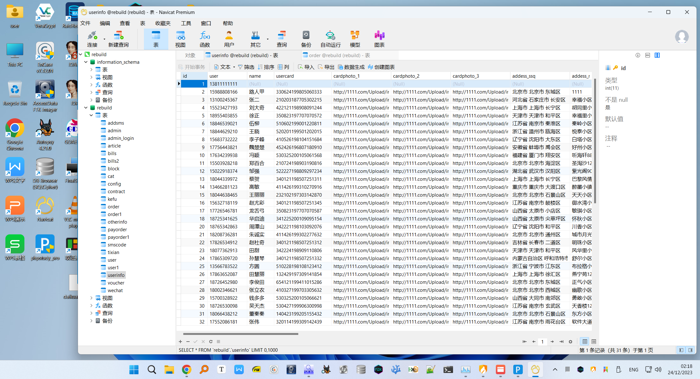
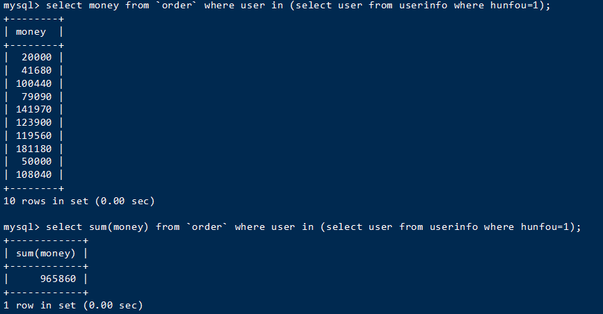
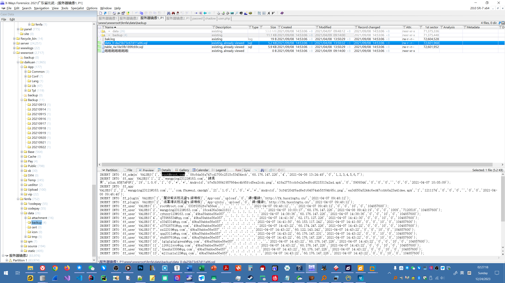

首先是要确保所有Web中间件都跑起来，比如 `nginx` 这些，跑起来之后，发现缺少数据库：



然后就是在宝塔里面创建一个新的数据库，并且导入 `.sql` 文件：



默认信息：`127.0.0.1：3306，rebuild, rebuild, 123`

紧接着修改配置文件：



`DB_HOST` 这里有个问题，如果有外部IP去访问的话，可能触发限制，如果触发：

> 表示数据库禁止远程连接，需要进行设置
>
> ```
> update user set host='%' where user='root';
> flush privileges;
> ```
>
> [](https://img2022.cnblogs.com/blog/2817142/202206/2817142-20220605223526648-1001641444.png)
>
> （在 `mysql` 表里面）


登录时提示 “未在指定IP登录”，于是用grep搜索，找到文件并修改：




之后的数据库分析：

使用 PHPStudy 搭了一个本地环境，然后用 Navicat 连上，方便查看



编写语句：

先筛选出已婚的 user，然后把 user 传到在 order 里面查询 money 的语句中，注意符号是 1 旁边的那个。



后面的fenfa：



总结：得多看mysql的备份文件，别怕麻烦，多导入。


## MySQL 取消本地验证

MySql数据库想要跳过密码进行登陆
修改/etc/my.cnf

```
vim /etc/my.cnf
```

在mysqld模块下面添加以下语句，保存并退出

```
skip-grant-tables
```