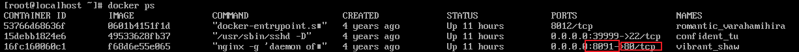
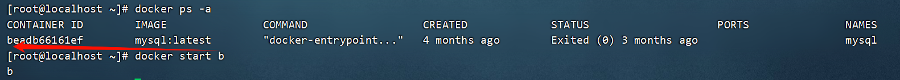

# Docker 取证知识点

在这个命令执行结果中，关于端口，应该这样理解：

0.0.0.0:8091，是Docker将端口映射到本机的8091上，也就是说通过访问本机的8091端口，可以直达这个Docker镜像的80端口。

`docker ps -a` 可以查看之前运行过的配置，然后用 `docker start` 就能按照之前的配置来启动。

之后使用 `docker exec -it b /bin/bash` 即可进入到 docker 里面。
