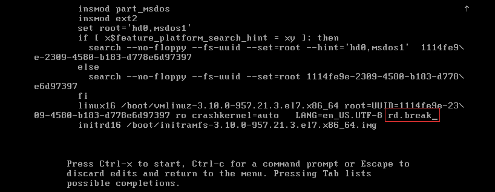
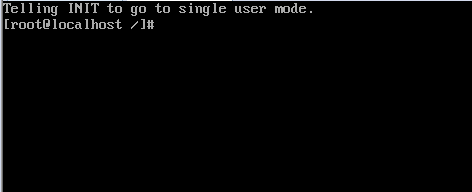

## 密码绕过（修改）

先进行密码绕过，在这个界面迅速按下方向键，然后按下e进入编辑模式

找到linux16这一行，将lang编码后面的全部删掉，加上`rd.break`

然后`Ctrl+x`直接启动进入switchroot界面，重新挂载根目录`mount -o remount ，rw /sysroot`，然后进入shell`chroot /sysroot`，接下来就可以正常使用命令了，更改原先的密码之前先将shadow备份一下，以免要用到`cp /etc/shadow /root/shadow`

重启后就可以用新密码登录了

仿真完成后要先确认开启ssh服务，方便我们后续进行操作

## 密码破解

主要是针对 `shadow` 文件，使用 `john` ，Kali Linux 自带了的。

> ### 2、查询服务器用户名“wangwu”的登录密码为【标准格式：123456】
>
> 如果直接问密码，那么大概率就是弱口令了，可以使用join来进行爆破，由于只需要wangwu的，就只保留wangwu和liumosheng，不去爆破root的密码，[点我查看如何安装 join](https://blog.csdn.net/zhydream77/article/details/98601128)
>
> 
>
> 
>
> 结果为`root`
>
> john -w=password.lst shadow

---

> # CentOS6 破解密码
>
>  1、重启服务器，在倒数读秒的时候按任意键，就会出现如下界面 2、按e进入grub模式，选中kernel，然后按e进入内核编辑模式 
>
> 3、进入内核编辑模式后，按空格+1回车（或按空格+single回车）退出内核编辑模式 
>
> 4、退出内核编辑模式后，再次进入到grub模式 
>
> 5、选中kernel，按b进入到单用户模式 
>
> 6、修改root密码，重启即可 
>
> # Kali
>
> [https://blog.csdn.net/weixin_44953600/article/details/110402058](https://blog.csdn.net/weixin_44953600/article/details/110402058)

## Linux 密码存储

`/etc/passwd`  `/etc/shadow` 