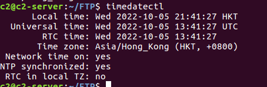
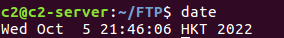

# Linux 查看时区

[技术|在 Linux 中查看你的时区](https://linux.cn/article-7970-1.html#:~:text=%E5%9C%A8%20Linux%20%E4%B8%AD%E6%9F%A5%E7%9C%8B%E4%BD%A0%E7%9A%84%E6%97%B6%E5%8C%BA%201%201%E3%80%81%E6%88%91%E4%BB%AC%E4%BB%8E%E4%BD%BF%E7%94%A8%E4%BC%A0%E7%BB%9F%E7%9A%84%20date%20%E5%91%BD%E4%BB%A4%E5%BC%80%E5%A7%8B,2%202%E3%80%81%E6%8E%A5%E4%B8%8B%E6%9D%A5%EF%BC%8C%E4%BD%A0%E5%90%8C%E6%A0%B7%E5%8F%AF%E4%BB%A5%E7%94%A8%20timedatectl%20%E5%91%BD%E4%BB%A4%203%203%E3%80%81%E8%BF%9B%E4%B8%80%E6%AD%A5%EF%BC%8C%E6%98%BE%E7%A4%BA%E6%96%87%E4%BB%B6%20%2Fetc%2Ftimezone%20%E7%9A%84%E5%86%85%E5%AE%B9)

### timedatectl

```java
timedatectl
```



### date

```java
date
```



```java
date -R
```

<br />

### /etc/timezone

```java
cat /etc/timezone
```


### /etc/localtime

```java
/etc/localtime
```

### ~/anaconda-ks.cfg

```java
~/anaconda-ks.cfg
```

