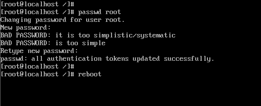
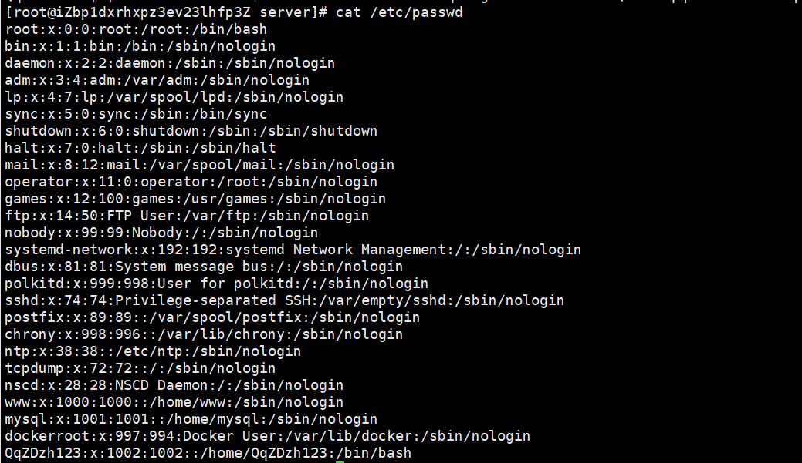
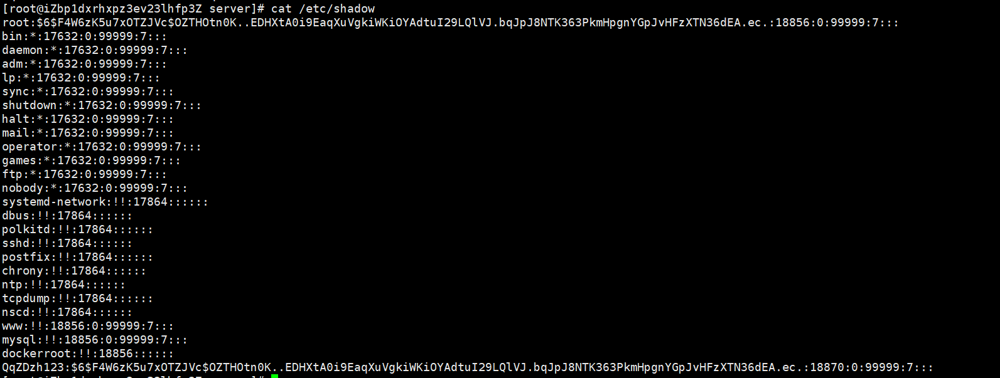

# Linux服务器取证 笔记

宝塔面板：


## 密码绕过（修改）

先进行密码绕过，在这个界面迅速按下方向键，然后按下e进入编辑模式

[](https://img2022.cnblogs.com/blog/2817142/202206/2817142-20220605223526580-1130207612.png)

找到linux16这一行，将lang编码后面的全部删掉，加上`rd.break`

[](https://img2022.cnblogs.com/blog/2817142/202206/2817142-20220605223526553-1224286858.png)

[](https://img2022.cnblogs.com/blog/2817142/202206/2817142-20220605223526579-1964895361.png)

然后`Ctrl+x`直接启动进入switchroot界面，重新挂载根目录`mount -o remount ，rw /sysroot`，然后进入shell`chroot /sysroot`，接下来就可以正常使用命令了，更改原先的密码之前先将shadow备份一下，以免要用到`cp /etc/shadow /root/shadow`

[](https://img2022.cnblogs.com/blog/2817142/202206/2817142-20220605223526646-1858171500.png)

重启后就可以用新密码登录了

[](https://img2022.cnblogs.com/blog/2817142/202206/2817142-20220605223526536-647090428.png)

仿真完成后要先确认开启ssh服务，方便我们后续进行操作

---

> # CentOS6 破解密码
>
> <br />1、重启服务器，在倒数读秒的时候按任意键，就会出现如下界面<br />2、按e进入grub模式，选中kernel，然后按e进入内核编辑模式<br />
>
> 3、进入内核编辑模式后，按空格+1回车（或按空格+single回车）退出内核编辑模式<br />
>
> 4、退出内核编辑模式后，再次进入到grub模式<br />
>
> 5、选中kernel，按b进入到单用户模式<br />
>
> 6、修改root密码，重启即可<br />
>
> # Kali
>
> [https://blog.csdn.net/weixin_44953600/article/details/110402058](https://blog.csdn.net/weixin_44953600/article/details/110402058)

## Linux 密码存储

`/etc/passwd`<br /><br />`/etc/shadow`<br />

## 查看时区

[技术|在 Linux 中查看你的时区](https://linux.cn/article-7970-1.html#:~:text=%E5%9C%A8%20Linux%20%E4%B8%AD%E6%9F%A5%E7%9C%8B%E4%BD%A0%E7%9A%84%E6%97%B6%E5%8C%BA%201%201%E3%80%81%E6%88%91%E4%BB%AC%E4%BB%8E%E4%BD%BF%E7%94%A8%E4%BC%A0%E7%BB%9F%E7%9A%84%20date%20%E5%91%BD%E4%BB%A4%E5%BC%80%E5%A7%8B,2%202%E3%80%81%E6%8E%A5%E4%B8%8B%E6%9D%A5%EF%BC%8C%E4%BD%A0%E5%90%8C%E6%A0%B7%E5%8F%AF%E4%BB%A5%E7%94%A8%20timedatectl%20%E5%91%BD%E4%BB%A4%203%203%E3%80%81%E8%BF%9B%E4%B8%80%E6%AD%A5%EF%BC%8C%E6%98%BE%E7%A4%BA%E6%96%87%E4%BB%B6%20%2Fetc%2Ftimezone%20%E7%9A%84%E5%86%85%E5%AE%B9)

### timedatectl

```java
timedatectl
```


### date

```java
date
```


```java
date -R
```

<br />

### /etc/timezone

```java
cat /etc/timezone
```


### /etc/localtime

```java
/etc/localtime
```

### ~/anaconda-ks.cfg

```java
~/anaconda-ks.cfg
```

