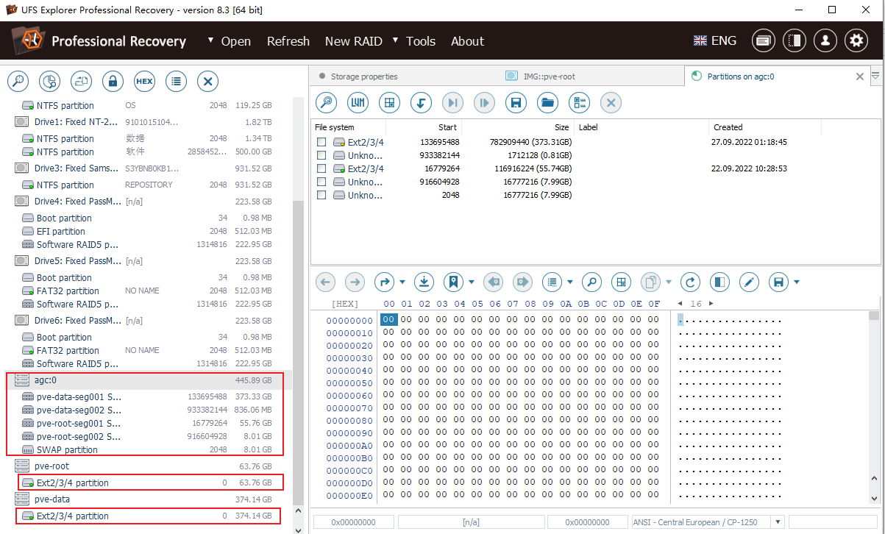
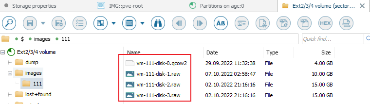
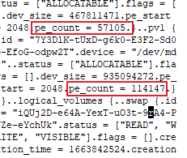
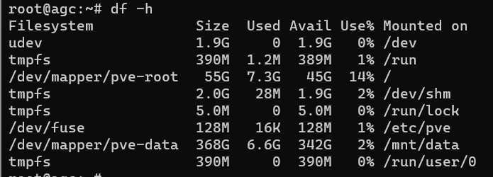

> ## 45. [填空题]AGC_Server里LVM (Logical Volume Management 逻辑卷轴管理) 的 VG (Volume Group 卷组) 'pve' 共有多少PE (Physical Extent 物理块) ? (以阿拉伯数字回答) (1分)
>
> 利用ufs进行raid重组，将识别出的raid制作e01镜像并导出数据盘中的虚拟机磁盘文件
>
> 
>
> 
>
> 查看重组出的镜像，在头部保存有数据
>
> 
>
> 仿真后使用命令`vgdisplay`也能查看
>
> 
>
> 结果为`114147`
>
> ## 46. [填空题]AGC_Server里LVM 的 LV(邏輯卷)"pve-data" 使用了多少百分比的空間? (不用填寫 '%'，以阿拉伯数字回答) (3分)
>
> 使用命令`df -h`查看
>
> 
>
> 结果为`2`