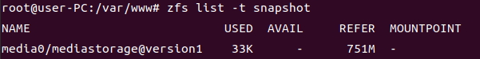
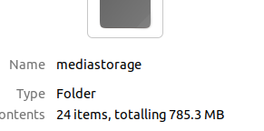

## ZFS Snapshot 操作

ZSF 列出快照：`zfs list -t snapshot`

回滚：`zfs rollback media0/mediastorage@version1` 

（）

> ## 15. [填空题]该基本镜像存储池 (pool) 有一个快照 (Snapshot)，快照的名称是什么? (不要输入符号，以大写英文及阿拉伯数字回答，如 media/mediapool@abc123，需回答MEDIAMEDIAPOOLABC123) (1分)
>
> 使用命令`zfs list -t snapshot`
>
> 
>
> 结果为`MEDIA0MEDIASTORAGEVERSION1`
>
> ## 16. [填空题]就上述所找到的基本镜像存储池快照 (Snapshot)，它储存了多少个档案? (以阿拉伯数字回答) (1分)
>
> 使用命令`zfs rollback media0/mediastorage@version1`回滚镜像，查看文件数量
>
> 
>
> 结果为`24`