# 宝塔面板 取证

https://www.kancloud.cn/chudong/bt2017/424204

## 宝塔面板指令


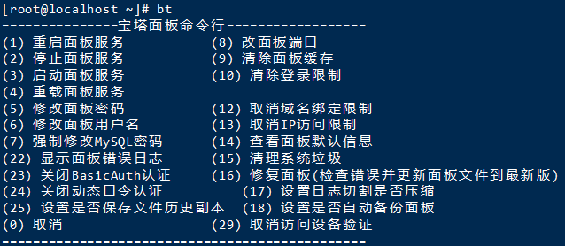


## 宝塔面板数据库分析

> ### 6、分析宝塔配置数据库，查询宝塔面板默认用户的加密盐值salt为【标准格式：abNf4iLiutU8】
>
> 这个加密盐值在宝塔中有固定的存储路径，在`/www/server/panel/data/default.db`中，可以使用sftp来传输文件，这就是为什么开头说要开启ssh，这都是同一个端口22

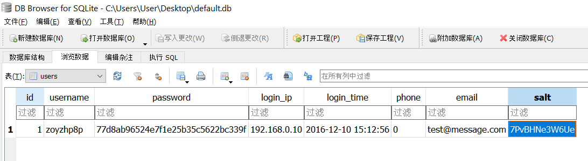

这个数据库包含了 网站目录、网站域名、防火墙配置、日志、用户配置等信息：


## 查看数据库密码

可以是看数据库：


也可以是在数据库页面里面修改：

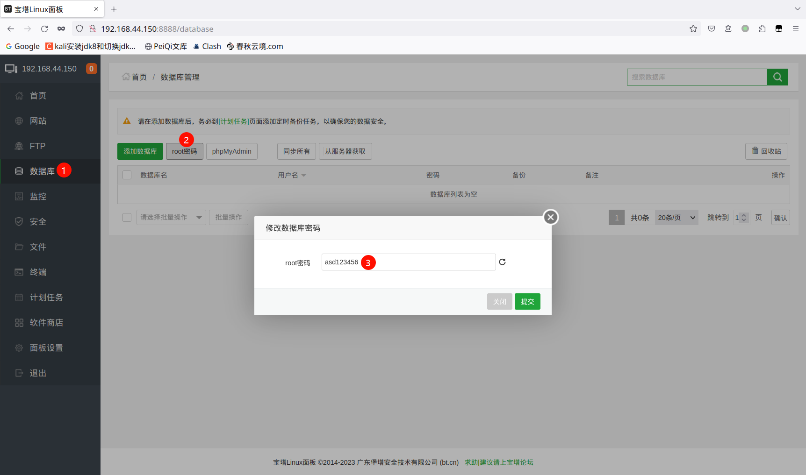

## 查看已安装的服务

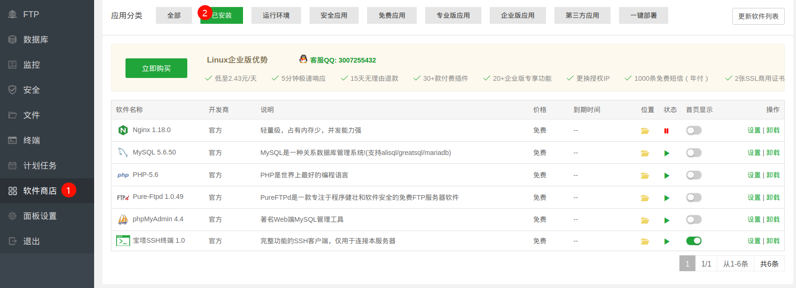

## 查看软件配置（以PHP为例）

分析涉案网站服务器中的PHP配置文件，查看运维人员是否有禁用“exec”该高危函数模块来保证网站的安全运行：这样看来就是了。

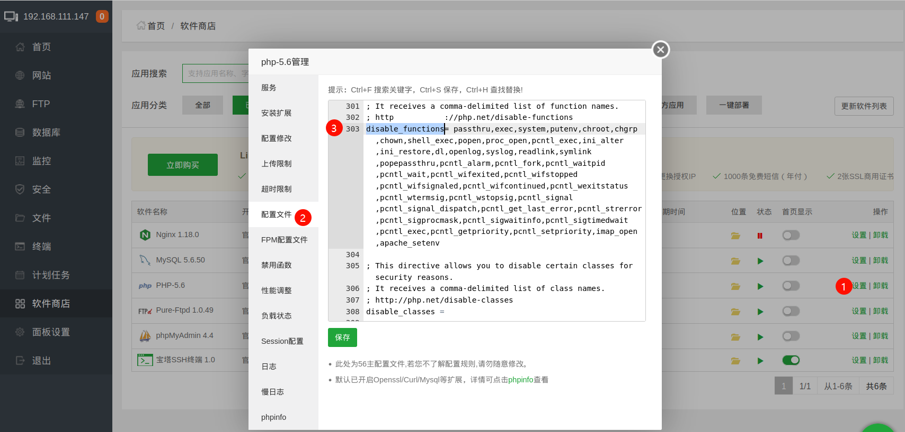

## 查看默认建站目录（在设置里面看，不要去看实际网站所在的地址）

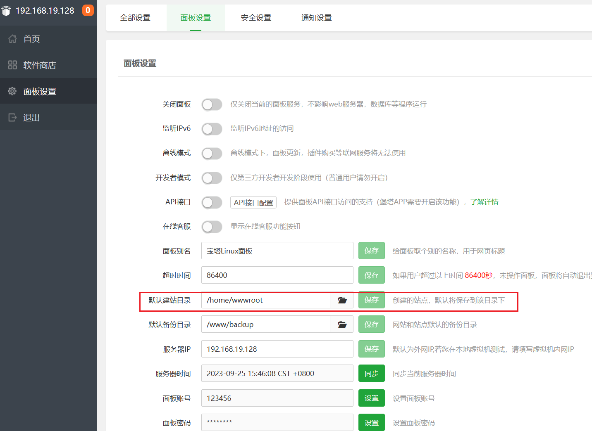

## 宝塔绕过手机号强制登录[¶](https://www.forensics-wiki.com/linux/bt/#_10)

请参考：https://github.com/weiwang3056/baota_release

> 生产环境中慎重使用开心版宝塔

## 查看面板绑定完整账号[¶](https://www.forensics-wiki.com/linux/bt/#_4)

```
cat /www/server/panel/data/userInfo.json
```


## 关闭安全登录限制[¶](https://www.forensics-wiki.com/linux/bt/#_5)

通常情况下，都可以使用 `bt` + `序号` 关闭限制


例如：关闭动态口令认证

```
bt 24
```


### 手动方法[¶](https://www.forensics-wiki.com/linux/bt/#_6)

#### 安全入口限制[¶](https://www.forensics-wiki.com/linux/bt/#_7)

```
rm -rf /www/server/panel/data/admin_path.pl
```

#### ip访问限制[¶](https://www.forensics-wiki.com/linux/bt/#ip)

```
rm -rf  /www/server/panel/data/limitip.conf
```

#### BasicAuth认证[¶](https://www.forensics-wiki.com/linux/bt/#basicauth)

用户名和密码保存在/www/server/panel/config/basic_auth.json 文件中,用户名和密码加密方式为MD5。

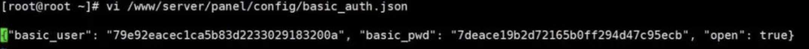

## 宝塔 绕过手机号验证
**（1）宝塔7.7.0版以下**

在服务器上执行如下命令强制删除/www/server/panel/data/目录下的文件bind.pl，该文件是宝塔面板中用来管理BIND配置的一个脚本文件，可以方便地进行域名管理、DNS记录设置和缓存管理等操作。

`rm -f /www/server/panel/data/bind.pl`

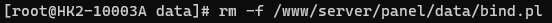

上述命令运行完成后重新登录宝塔面板，就可以正常进入首页了。

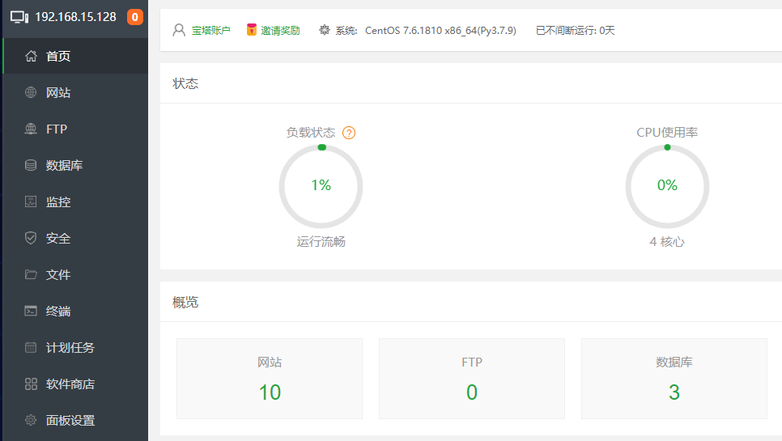


7.8.0及以上版本修改了判断逻辑，此方法失效。

**（2）宝塔7.7.0版以上**

新建 `userInfo.json`

`vi /www/server/panel/data/userInfo.json`

参考如下格式，保证键全部存在避免读取时出错，值随意填写即可：

```
{
 "id": 1,
 "uid": 1,
 "state": 1,
 "username": "",
 "secret_key": "",
 "access_key": "",
 "address": "",
 "addtime": 1,
 "idc_code": "",
 "area": "",
 "serverid": "",
 "ukey": ""
}
```

```
{
 "id": 1,
 "uid": 1,
 "state": 1,
 "username": "a",
 "secret_key": "a",
 "access_key": "a",
 "address": "a",
 "addtime": 1,
 "idc_code": "a",
 "area": "a",
 "serverid": "a",
 "ukey": "a"
}
```

修改 `public.py`

`vi /www/server/panel/class/public.py`

查找is_bind函数的定义：

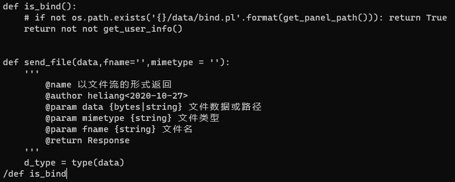

改为无条件返回 `True`。

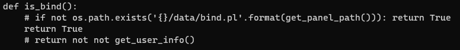

重新登录面板，虽然会弹出错误提示框，但关闭后不影响功能使用。

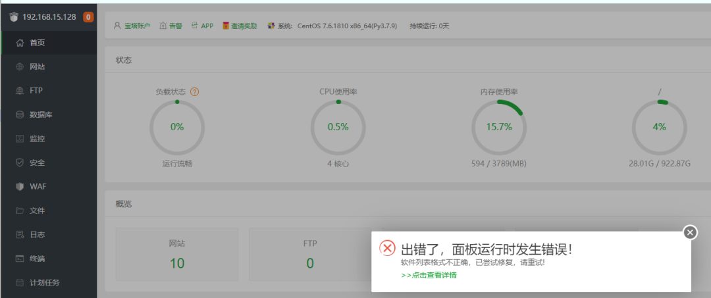

重新登录面板，成功正常进入首页，这样就可成功绕过宝塔强制登录手机账号。


