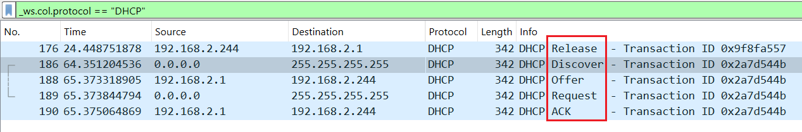
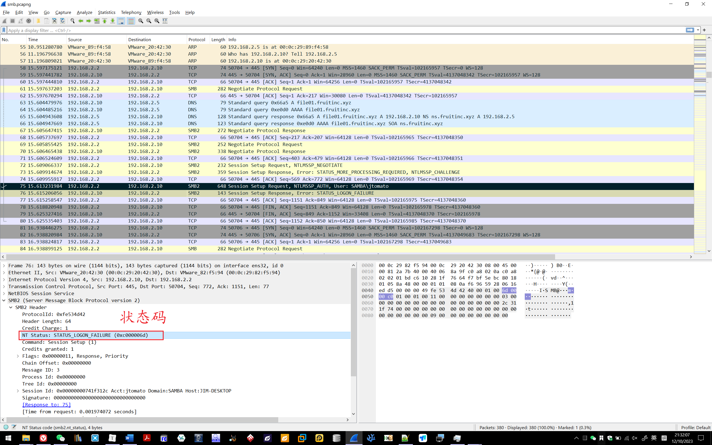
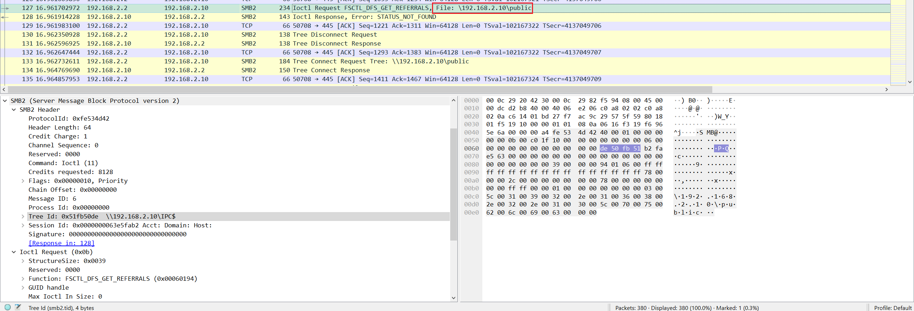

# WireShark 入门笔记

## DHCP

### 基本信息

过滤条件：

```
_ws.col.protocol == "DHCP"
```

DHCP 的请求内容在 Option 50 里面。


### Transaction ID



有Release、Discover、Offer、Request、ACK等。


## DNS

过滤语句：

```
_ws.col.protocol == "DNS"
```

DNS 就是发去一个查询请求，然后response一个，内容就是TXT里面的，所以 24 帧的回复就是：`ACOOLDNSFLAG`


### 查看是哪个根服务器回复了

过滤DNS的回复：

```
dns.response_to
```

## SMB

查看打开的文件：


也可以在这个里面查看文件：


### 登录状态码



### File smb.pcapng - What is the tree that is being browsed?



## TCP - Shell （明码）


### NTP - Network Time Protocol

NTP（Network Time Protocol，网络时间协议）是由RFC 1305定义的时间同步协议，用来在分布式时间服务器和客户端之间进行时间同步。NTP基于UDP报文进行传输，使用的UDP端口号为123。

使用NTP的目的是对网络内所有具有时钟的设备进行时钟同步，使网络内所有设备的时钟保持一致，从而使设备能够提供基于统一时间的多种应用。

对于运行NTP的本地系统，既可以接收来自其他时钟源的同步，又可以作为时钟源同步其他的时钟，并且可以和其他设备互相同步。


## VLAN 

> ## What is the number of the first VLAN to have a topology change occur?
>
> ##### *File: network.pcapgng*
>
> Using this filter “**stp.flags.tc**“, and since it’s a boolean, we need to set it to **== 1** (aka TRUE). The first one is **frame 42**, looking at its **Scanning Tree Protocol**:
>
> 
>
> **Answer:** 20

## CDP

Cisco Discovery Protocol

**思科发现协议CDP/链路层发现协议LLDP：**在网络割接/网络迁移时，用于了解当前网络拓扑，包含网络是如何连接的、当前网络设备的型号、当前网络设备的配置等；CDP属于思科私有协议，适用在纯思科的网络设备环境中使用；LLDP属于公有标准协议，适用在混合厂商的网络设备环境中使用。


## HTTPS - TLS

导入 TLS 证书：

Edit - Preferences - Protocols - TLS

