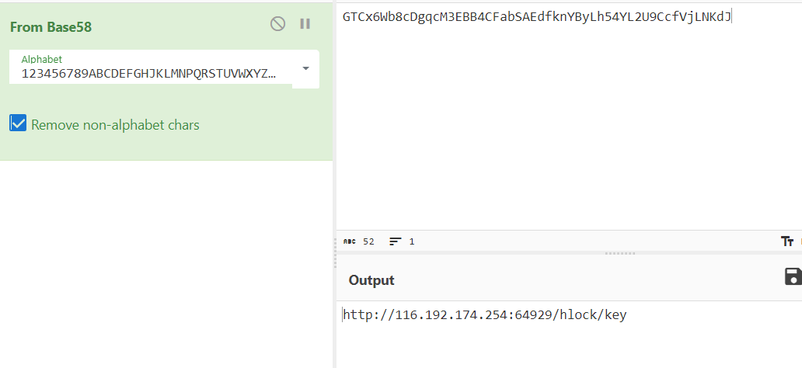

# APK 取证

## APK 分析平台

无糖信息-大狗（涉诈网站溯源打击平台）：https://dagou.nosugar.tech/

> 我们可以在无糖浏览器平台使用账号免费创建一个账号进行使用，上传样本后，后台分析得到下方的APK详情报告，报告内容如下:
>
> - - 反编译源码获取到样本APK分析基础信息包括：文件名、包名、哈希值、应用版本号等;
>   - 反编译源码获取接入SDK信息，并提供了所属公司的调证指南信息，以供参考;
>   - 后台动态模拟样本APK启动，获取到动态请求信息，暴露APK动态请求的一些重要的数据接口和服务器IP地址，并对请求网站进行分类统计：匹配数据库中的已知样本、正常网站等为下一步人工研判提供线索支持;
>   - 使用线索图谱将所有线索串并联，方便办案人员线索研判;

无糖信息-手机应用分析系统：http://browser.nosugar.tech

> 在无糖浏览器中直接使用手机应用分析系统上传样本APK，得到如下分析报告：
>
> - - 反编译源码获取到样本APK的基础信息包括：文件名、包名、哈希值、应用版本号等;
>   - 反编译源码获取到接入SDK信息、域名/IP信息、虚拟身份信息、签名信息、应用权限，支持直接下载反编译后的源码，进行拓展分析;

奇安信-情报沙箱：https://sandbox.ti.qianxin.com/sandbox/page

> 通过情报沙箱网站直接免费注册账号后，上传样本进行分析得到如下报告：
>
> - - 针对样本APK风险等级进行评估，判定其为恶意APK样本;
>   - 检测出APK文件中的威胁情报及对行为异常进行分析，为人工研判提供依据;
>   - 反编译APK获得基础信息：文件名、包名、哈希值、应用版本号、界面运行截图等；
>   - 提取出APK源码的文件列表、域名及URL、应用权限及组件信息;
>   - 未对样本APK进行深度分析，未获取到应用层文件、网络行为及运行截图。

360－沙箱云：https://ata.360.net/

> 通过沙箱云网站直接免费注册账号后，上传样本进行分析得到如下报告：
>
> - - 反编译APK获得基础信息：文件名、包名、哈希值、应用版本号、源码压缩文件列表等；
>   - 对APK风险等级进行了划分，未发现该样本APK中的威胁情报；
>   - 查看威胁指标与文件内容需要升级整体服务。

VirusTotal：https://www.virustotal.com/gui/home/upload

> 下载VirusTotal后上传样本进行分析得到如下报告：
>
> - - 反编译APK获得基础信息：文件名、包名、哈希值、应用版本号等；
>   - 对APK风险等级进行了划分，并判定出该APK文件中的恶意代码；
>   - 对APK软件成分进行详细分析。

微步云沙箱：https://www.threatbook.net/next/sandbox

> 在微步云沙箱上传样本后，得到如下详情报告：
>
> - - 反编译APK获得基础信息：文件名、包名、哈希值、应用版本号等；
>   - 对APK文件进行风险评估，多引擎检测恶意代码；
>   - 样本APK文件不支持动态分析。

摸瓜：https://mogua.co/

> 在摸瓜上传样本后，得到如下详情报告：
>
> - - 反编译APK获得基础信息：文件名、包名、哈希值、应用版本号等；
>   - 提供域名、邮箱、手机号等线索，可直接下载反编译后的源码，判定应用权限的敏感等级；
>   - 加壳分析及第三方插件需要会员才能查看。

| 工具名称         | APK反编译 | 威胁情报检测       | 网络请求提取            | 恶意代码分析 | 串并联线索                           |
| ---------------- | --------- | ------------------ | ----------------------- | ------------ | ------------------------------------ |
| 大狗             | 支持      | 匹配已知样本       | 提取网站请求与响应数据  | 支持         | 以线索图谱展示  ，支持线索扩线和挖掘 |
| 手机应用分析系统 | 支持      | 不支持             | 不支持                  | 不支持       | 不支持                               |
| 奇安信-情报沙箱  | 支持      | 威胁情报、行为异常 | 提取DNS、会话信息、HTTP | 支持         | 不支持                               |
| 360-沙箱云       | 支持      | 威胁指标           | 不支持                  | 支持         | 不支持                               |
| Virustotal       | 支持      | 安全分析           | 扫描网站及IP地址        | 支持         | 不支持                               |
| 微步云沙箱       | 支持      | 行为检测           | 样本APK不支持动态分析   | 支持         | 不支持                               |
| 摸瓜             | 支持      | 不支持             | 不支持                  | 不支持       | 不支持                               |


## 获取 APK

ADB 环境下：
1、连接手机
输入 adb 命令：`adb devices`

2、打开手机对应的软件

3、获取当前界面正在运行应用的包名：
输入 adb 命令：`adb shell dumpsys window | findstr  mCurrentFocus`

4、获取APK文件路径；注：package-name是上一步中获取的包名
输入 adb 命令：`adb shell pm path “package-name”`     

5、将 APK 导出到 PC 端进行保存
输入 adb 命令：`adb pull “手机APK文件路径” “PC文件夹路径”`


## 查看APP兼容性（即支持哪些安卓版本）

在ManiFest里面的`uses-sdk`里面能看到使用的SDK，可以查到对应的安卓版本：


https://developer.android.google.cn/studio/releases/platforms?hl=zh-cn


## APK 功能、函数定位技巧

https://www.cnblogs.com/WXjzc/protected/p/17842642.html

WXjzcccc17842642

> ## 2.APK程序在勒索的时候会向服务器申请钱包地址，请问申请后台IP地址为？
>
> 点击地址时会弹出`已复制地址`
>
> [](https://img2023.cnblogs.com/blog/2817142/202311/2817142-20231119205818898-1282813284.png)
>
> 因此在源码中搜索`clipboard`
>
> [](https://img2023.cnblogs.com/blog/2817142/202311/2817142-20231119205819261-233558930.png)
>
> [](https://img2023.cnblogs.com/blog/2817142/202311/2817142-20231119205819315-1381197137.png)
>
> 查找引用，发现是个textView组件，设置的值为`e`，下面一个`z`方法恰好设置了`e`的值，上面有一串字符，调用的是`f`方法
>
> [](https://img2023.cnblogs.com/blog/2817142/202311/2817142-20231119205818928-521951203.png)
>
> 一眼请求相关
>
> [](https://img2023.cnblogs.com/blog/2817142/202311/2817142-20231119205819266-737559474.png)
>
> 看引入字符的方法，就算没有异常里的提示，也可以通过字符集来判断是 `Base58`
>
> [](https://img2023.cnblogs.com/blog/2817142/202311/2817142-20231119205819155-1182437434.png)
>
> 解码
>
> [](https://img2023.cnblogs.com/blog/2817142/202311/2817142-20231119205818915-840724037.png)
>
> 结果为`116.192.174.254`

## 反编译查看加密算法

jeb反编译，找到和登录相关的部分


可以看到在`loadPWD()`方法中调用了`securityGet()`这个函数，继续跟进


可以看到在这个函数中有调用了一个加密相关的函数`encrypt()`，再跟进


得到加密算法

## 接上 - APK 加密方式逆向

30 请通过分析给出登录“大发”应用使用的密码。（30分）

这道题我们可以利用逆向思维，这个应用有记住密码的功能，那么我们先去分析应用是如何记住密码的

在网上查找一些Android实现记住密码的方法，可以找到一些文章

- [https://blog.csdn.net/deniro_li/article/details/79594352](https://cloud.tencent.com/developer/tools/blog-entry?target=https%3A%2F%2Fblog.csdn.net%2Fdeniro_li%2Farticle%2Fdetails%2F79594352&source=article&objectId=2272887)
- [https://blog.csdn.net/chaoyu168/article/details/53610211](https://cloud.tencent.com/developer/tools/blog-entry?target=https%3A%2F%2Fblog.csdn.net%2Fchaoyu168%2Farticle%2Fdetails%2F53610211&source=article&objectId=2272887)
- [https://blog.csdn.net/qq_33200967/article/details/77263076](https://cloud.tencent.com/developer/tools/blog-entry?target=https%3A%2F%2Fblog.csdn.net%2Fqq_33200967%2Farticle%2Fdetails%2F77263076&source=article&objectId=2272887)

可以看到这些方法都有一个共同的特点：使用 SharedPreferences 来保存密码

接下来我们再分析本题所给的应用，以工具jadx为例，搜索关键字`remember`可以看到一系列相关的内容，其中就包含了`rememberpassword`


双击跳转到`saveRememberPasswordStatus()`这个函数，可以看到本应用也同样是使用 SharedPreferences 来保存密码


image-20210609204214939

同时也可以看到在这个函数所在类的最开始也定义了一系列和用户登录相关的参数，其中也包括了用户名和密码


那么我们直接跳转到声明`SharedPreferencesManager`类的地方，在一开始可以看到默认存储的PreferencesName


可以初步确定保存在本地的用户名和密码存储在这个文件中，而 SharedPreferences 存储变量的文件路径为

```javascript
/data/data/[应用程序包]/shared_prefs
```

使用 SharedPreferences 储存的参数都是以键值对的形式保存在xml文件中

包名我们在第29题已经得到了，即完整路径为

```javascript
/data/data/com.elughkhktu.leohwiuirgk/shared_prefs/ds-preferences.xml
```

利用adb连shell，输出此文件的内容


可以看到用户登录账号为**djujjf**，即39题的答案

还有两个类似base64加密的非明文字符串

```javascript
PH1fbMBQcfO/9coO/+2vAA==
GmyQesTJK3mvE9Tf1wxfWA==
```

直接解base64为乱码，推测是加密过的密码，继续看源码，在下面可以看到加密相关的函数


加解密用到的函数为`SharedPreferencesAesCrypto`类下的encrypt和decrypt，直接跳转到类声明


可以看到是先AES/CBC/PKCS5Padding再base64，解密即可得到用户密码


```java
public SharedPreferencesManager(@Nullable Context context0) {
        this.mDefaultPreferencesName = "ds-preferences";
        if(context0 == null) {
            Intrinsics.throwNpe();
        }
```


## APPKEY

在 `AndroidManifest.xml` 中：


## APK 签名信息


```
Subject: CN=Bee Weng, OU=App Team, O=Desheng Group, L=Manila, ST=Republika ng Pilipinas, C=PH
```

```
Type: X.509
Version: 3
Serial number: 0x77eafba5
Subject: CN=Bee Weng, OU=App Team, O=Desheng Group, L=Manila, ST=Republika ng Pilipinas, C=PH
Valid from: Thu Apr 16 16:55:33 CST 2020
Valid until: Mon Apr 10 16:55:33 CST 2045
Public key type: RSA
Exponent: 65537
Modulus size (bits): 2048
Modulus: 24113815554259241190712748543559103358348757652048076207948831436754066718218643031017642828039061361876458380786284678473378164003366732065243658694419807232206557372325457054132545279567108612689890185839998418891104072120592975789111315336980220495548734356811759545973553255588126367270414155906541269252383256253836119291269091157417698969672315465333587997875790043570561664434458792178651437904684617939539673221234064142941103627882518590916805444158584508793801999879459465776348307202493500520439891317153753099498220175606248781304527478158713933692105181560427257431155393772764048965350421181491020184491
Signature type: SHA256withRSA
Signature OID: 1.2.840.113549.1.1.11
MD5 Fingerprint: D2 97 73 D0 8F 8B 4D 84 8A 6B B6 58 8A D6 EC BD 
SHA-1 Fingerprint: E0 FD 6D CC 38 E5 70 6B 50 34 56 DB 82 DA 45 E6 10 98 1E 22 
SHA-256 Fingerprint: C9 54 93 84 3F 28 E9 46 97 A2 14 96 A7 7F DE AD 1A 27 27 04 DD 64 E9 6C 53 C6 71 98 4C CF 0E 7D 
```


## Main Activity

28 请分析给出“大发”应用的主Activity。（10分）

主Activity在AndroidManifest.xml文件中，形如以下

```javascript
   <activity android:name=".MainActivity">
            <intent-filter >
                <action android:name="android.intent.action.MAIN"/>
                <category android:name="android.intent.category.LAUNCHER"/>
            </intent-filter>
        </activity>
```

在将apk反编译后，在AndroidManifest.xml中搜索对应的字符串即可


这部分acitivty上面对应的`android:name`就是此题的答案

```javascript
org.zywx.wbpalmstar.uex11818.activity.SplashActivity
```

