# Android 取证 杂知识点

# 小米手机基本信息

## 设备标识/序列号

`data\com.miui.systemAdSolution\shared_prefs\mi_stat_pref.xml`

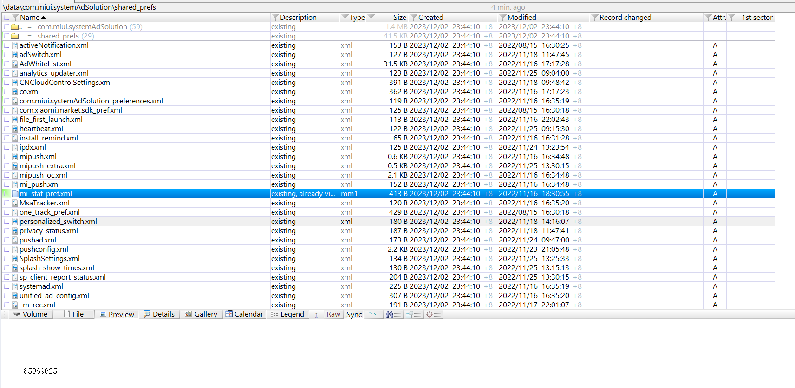

## 小米应用商店数据库

应用的安装路径（包括md5）：`/data/com.xiaomi.market/databases/market_2.db` ，在X-Ways里面直接过滤就行

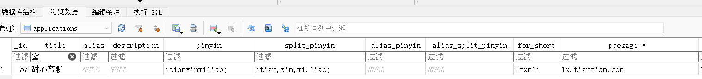

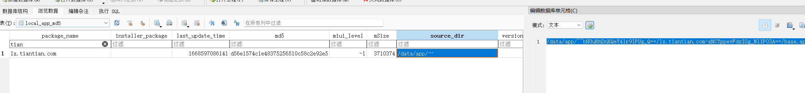

## WiFi 配置文件（原生应用）

`\misc\apexdata\com.android.wifi\WifiConfigStore.xml`

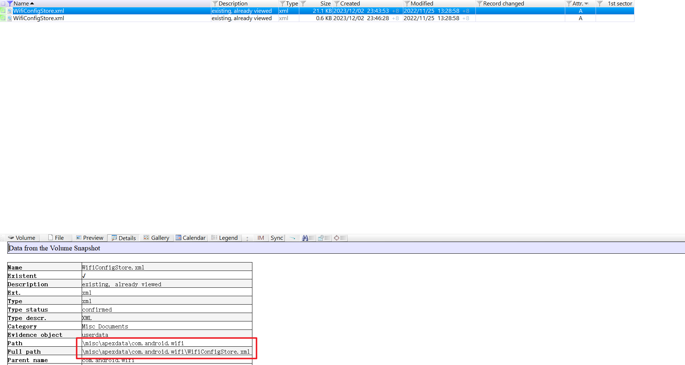

查看WiFi连接数：

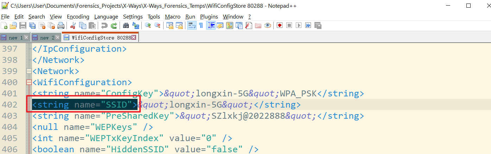

搜索一共有几个SSID即可。

## Android 手机短信记录（原生应用）

`mmssms.db`

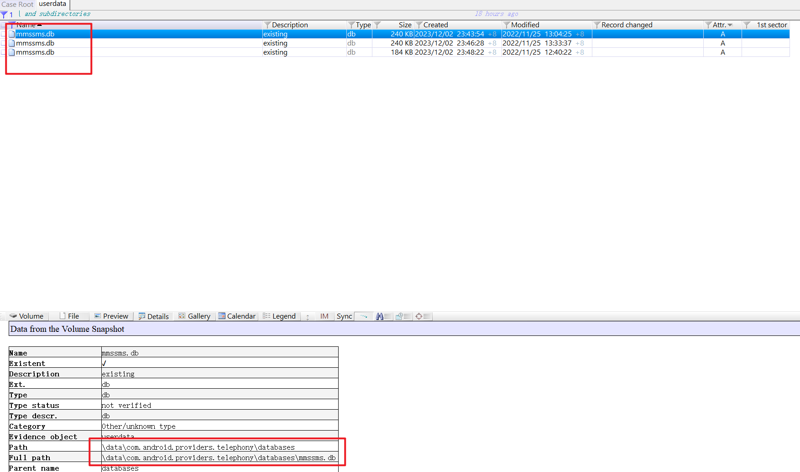

sms表中read字段值为0表示未读，type字段值为1表示接收的短信：

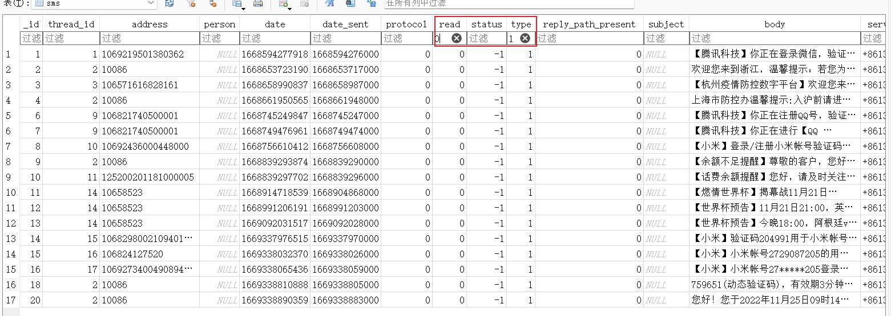


# Android Whatsapp 应用取证（非原生，通用）

`\data\com.whatsapp\databases\msgstore.db`


数据在 `chat` 表里面：

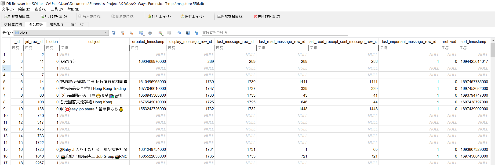

包括了 创建时间等，但是并没有找到WP里面的 `message_type`。

WP:

> ## 87.参考’潘志辉的手机镜像HUAWEIP30pro’,潘志辉手机华为P30Pro的WhatsApp的有多少个对话群组不包含对话讯息记录(系统自行发出的不作计算)?(2分)
>
> 先看一下有多少群组，根据chatid去看内容
>
> [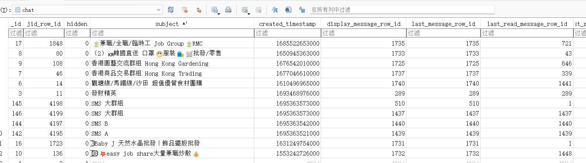](https://img2023.cnblogs.com/blog/2817142/202311/2817142-20231123224903232-2048110326.png)
>
> 通过分析，`message_type`的值为7表示系统消息，写个sql，剩下3个没有消息记录
>
> [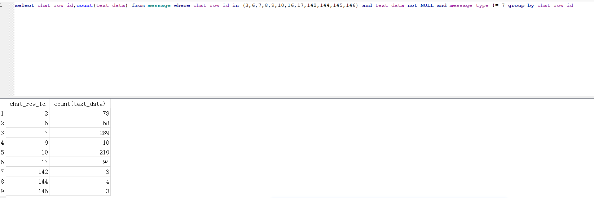](https://img2023.cnblogs.com/blog/2817142/202311/2817142-20231123224903025-998128093.png)
>
> 结果为`3`


# 安卓模拟器 图形密码绕过

安卓版本是 7.1.2，模拟器是夜神模拟器7.0.5，通过替换安装目录下虚拟机文件的方式来仿真，题目作者是用的软件来仿真的。

https://cloud.tencent.com/developer/article/2272887

---

此题仿真后打开模拟器，查看浏览器的设置即可，但是想要查看浏览器的设置，首先要解锁手机，单纯绕过密码解锁手机的方式很简单，在模拟器所在目录的bin目录下有adb.exe，可以用它来调用shell执行一些命令

首先打开模拟器，然后在bin目录打开cmd，执行`adb.exe shell`，接下来我们只需要找到储存锁屏密钥的文件并将其删去即可

我们通过夜神模拟器可以得知这个安卓虚拟机的版本是Android 7，此版本的锁屏密码相关文件如下

```javascript
/data/system/gatekeeper.pattern.key
/data/system/gatekeeper.password.key
```

我们先将这两个文件复制出来，在接下来解锁屏密码时会用到

```javascript
adb pull /data/system/gatekeeper.pattern.key C:\Users\poiuy\Desktop
adb pull /data/system/gatekeeper.password.key C:\Users\poiuy\Desktop
```

然后再删掉

```javascript
rm -rf /data/system/gatekeeper.pattern.key
rm -rf /data/system/gatekeeper.password.key
```

删除后重启即可直接进入模拟器

# APK 逆向

## 获取 APK

ADB 环境下：
1、连接手机
输入 adb 命令：`adb devices`

2、打开手机对应的软件

3、获取当前界面正在运行应用的包名：
输入 adb 命令：`adb shell dumpsys window | findstr  mCurrentFocus`

4、获取APK文件路径；注：package-name是上一步中获取的包名
输入 adb 命令：`adb shell pm path “package-name”`     

5、将 APK 导出到 PC 端进行保存
输入 adb 命令：`adb pull “手机APK文件路径” “PC文件夹路径”`


# Android WiFi 信息

`/misc/wifi`

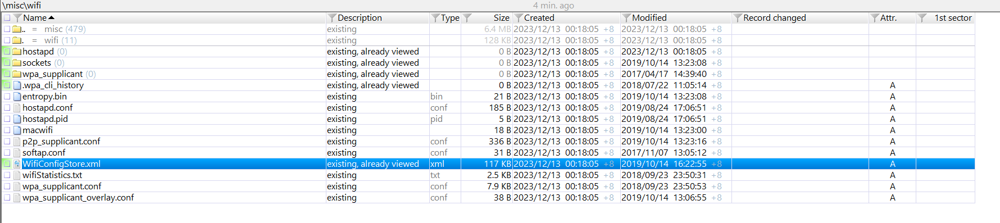