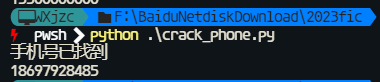
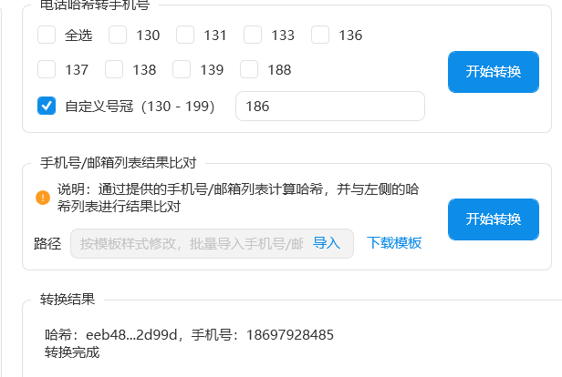

# iOS取证知识点

## iOS Note Storage


## iTunes Backup 密码爆破

用Passware爆破`Manifest.plist`这个文件

但是这个过程会非常慢，而且非常耗时，往往备份密码和锁屏密码是一样的，并且有可能是纯数字。


## AirDrop 日志取证

> ## 1.请分析苹果手机导出日志，airdrop所使用的扫描模式（Scanning mode）为？
>
> 启一个macos13以上的虚拟机，然后把日志`system_logs.logarchive`拖进去，访达中双击日志文件就可以查看日志了
>
> 搜索`Scanning mode`
>
> [](https://img2023.cnblogs.com/blog/2817142/202311/2817142-20231119205818891-1142795831.png)
>
> 结果为`Contacts Only`
>
> ## 2.AirDrop服务计划监听端口号是多少？
>
> 搜索`airdrop`
>
> [](https://img2023.cnblogs.com/blog/2817142/202311/2817142-20231119205818979-1553137613.png)
>
> 结果为`8770`
>
> ## 3.AirDrop中接收到图片的识别码（identifier）是多少？
>
> 查看`sharingd`进程的日志
>
> [](https://img2023.cnblogs.com/blog/2817142/202311/2817142-20231119205819238-997435814.png)
>
> [](https://img2023.cnblogs.com/blog/2817142/202311/2817142-20231119205818763-1757192661.png)
>
> 结果为`DC305C27-CB72-4786-8E0A-5346CD7B0D6A`
>
> ## 4.AirDrop日志中可以看到几条接收记录？
>
> 往上面翻一翻，可以找到关键字
>
> [](https://img2023.cnblogs.com/blog/2817142/202311/2817142-20231119205819339-1678660161.png)
>
> 搜索一下，看起来只有一条记录
>
> [](https://img2023.cnblogs.com/blog/2817142/202311/2817142-20231119205819243-1405082508.png)
>
> 结果为`1`
>
> ## 5.AirDrop日志中可以分析出图片发送人是谁？
>
> 还是`sharingd`慢慢翻
>
> [](https://img2023.cnblogs.com/blog/2817142/202311/2817142-20231119205818947-1460819607.png)
>
> 解一下unicode
>
> [](https://img2023.cnblogs.com/blog/2817142/202311/2817142-20231119205819068-386510242.png)
>
> 结果为`卢冠华`
>
> ## 6.AirDrop日志中可以分析出发送图片的设备名称是什么？
>
> 结果为`MatePad Pro 12.9`
>
> ## 7.AirDrop日志中可以分析出发送人AppleID邮箱是什么？
>
> 结果为`4979ecbb-5312-4801-851d-a959ec847463@inbox.appleid.apple.com`
>
> ## 8.AirDrop日志中可以分析出发送的图片文件名是什么？
>
> 结果为`IMG_3204.pvt`
>
> ## 9.AirDrop日志中可以分析投送嫌疑人的手机号的SHA256后五位是？
>
> [](https://img2023.cnblogs.com/blog/2817142/202311/2817142-20231119205819130-34231109.png)
>
> 结果为`2d99d`
>
> ## 10.请结合工具分析日志，找出Airdrop投送方的手机号码？
>
> 有了手机号的`sha256`的前后10位，就可以爆破出手机号，实际上复杂度并非没有很高，关键是爆破手机号时，需要附带区号（airdrop取证这个小领域，实际上是由于去年开hui期间遇到的不可说案件，就是利用日志寻找哈希，爆破手机号、邮箱去锁定投送人，关键点在于手机号爆破需要加上区号，不然一辈子也跑不出来）（这里我已经知道了手机号了，所以把186提前了，方便截个图）脚本可以优化，但没必要，我只是说明一下为什么可以获取到手机号
>
> 
>
> ```python
> from hashlib import sha256
> import sys
> 
> # 区号
> area_code = "86"
> # 常见手机号开头
> begins = ["186","133","142","144","146","148","149","153","180","181","189","130","131","132","141","143","145","155","156","185","134","135","136","137","138","139","140","147","150","151","152","157","158","159","182","183","187","188"]
> # 字符集
> for begin in begins:
>     for i in range(99999999):
>         s256 = sha256()
>         v = area_code+begin+"0"*(8-len(str(i))) + str(i)
>         s256.update(v.encode('utf-8'))
>         _hash = s256.hexdigest()
>         if _hash[:5] == "eeb48" and _hash[-5:] == "2d99d":
>             print("手机号已找到")
>             print(begin+"0"*(8-len(str(i))) + str(i))
>             sys.exit(0)
> ```
>
> [](https://img2023.cnblogs.com/blog/2817142/202311/2817142-20231119205818753-1543823883.png)
>
> 各家厂商都已经有工具能够以极快的速度破解出手机号，或者是从制作好的彩虹表中直接获取结果
>
> [](https://img2023.cnblogs.com/blog/2817142/202311/2817142-20231119205819104-400783567.png)
>
> 结果为`18697928485`

```Python
from hashlib import sha256
import sys

# 区号
area_code = "86"
# 常见手机号开头
begins = ["186","133","142","144","146","148","149","153","180","181","189","130","131","132","141","143","145","155","156","185","134","135","136","137","138","139","140","147","150","151","152","157","158","159","182","183","187","188"]
# 字符集
for begin in begins:
    for i in range(99999999):
        s256 = sha256()
        v = area_code+begin+"0"*(8-len(str(i))) + str(i)
        s256.update(v.encode('utf-8'))
        _hash = s256.hexdigest()
        if _hash[:5] == "eeb48" and _hash[-5:] == "2d99d":
            print("手机号已找到")
            print(begin+"0"*(8-len(str(i))) + str(i))
            sys.exit(0)
```

