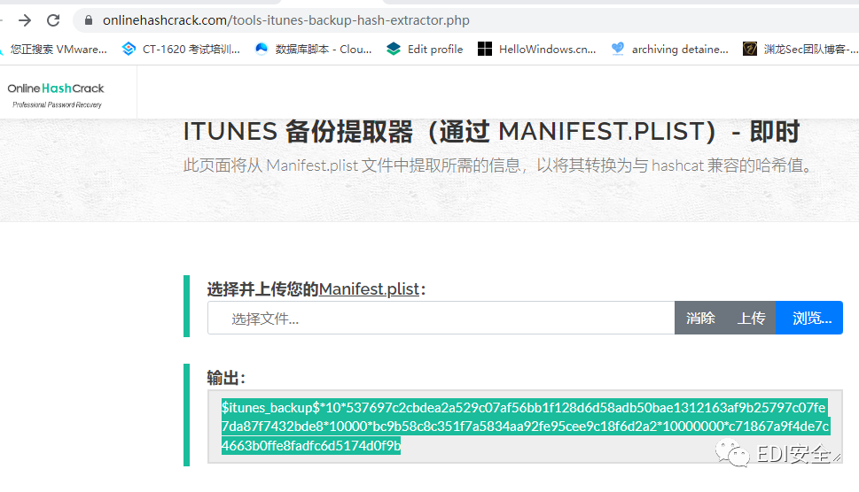

# 破解 iTunes 备份密码

[网络安全与取证研究](javascript:void(0);) *2023-12-12 08:01* *Posted on 北京*

前言

打完2022美亚杯趁火打铁，把自己觉得有意思的一部分总结一下。

首先是在mac电脑下找到了backup文件夹，一般路径都是在

```
~/Library/Application Support/MobileSync/Backup/
```

导出后发现备份文件加密了，但是在题目处提示了4位数字密码。

所以翻阅资料发现hashcat可以爆破iTunes密码。

所以我们要破解密码需要满足几个条件。

1.备份加密了

2.备份文件中包含Manifest.plist文件（备份密钥就是存放于本文件下）

3.hashcat版本3.4以上即可

满足以上3个条件时可以破解该备份文件密码

## iTunes备份的hash格式

```
$itunes_backup$*<ver>*<WPKY>*<ITER>*<SALT>*<DPIC>*<DPSL>
```

对于 10.2 之前的 iOS 版本，DPIC并且DPSL不是必需的，因此请将其留空。

```
$itunes_backup$*9*<WPKY>*<ITER>*<SALT>**
```

对于 iOS 10.2 及更高版本，将需要DPIC和DPSL参数。

## hashcat参数

- 见文末

```

```

了解完工具的用法后，咱们继续过来研究制作这个hash

我一共发现两个方法，第一种

```
https://github.com/philsmd/itunes_backup2hashcat
```

脚本跑出结果

```
VERS 3
TYPE 1
----------
UUID: b6ed25...d71a, HMCK: 0000...0000, WRAP: 0, SALT: 2b06ba3c6281ce101a0bd0249c1203cc9c8da1a8, ITER: 10000
UUID: 3a8bcc...baaf, CLAS: 11, WRAP: 3, KTYP: 0, WPKY: c1212e8754a1db6dfddc4fc6a386795eda88c18b865742e6fbd961b13e3229efda50dc0b69bdfc2e
UUID: 47386f...58d1, CLAS: 10, WRAP: 3, KTYP: 0, WPKY: d025009b7eaa016d756d6862c71856e76b060e1ee6f69e6c805852008757f1cb25110025a2e4fcb6
UUID: 24ac76...af0c, CLAS: 9, WRAP: 3, KTYP: 0, WPKY: baa24719f865afe330b85f26468e787c0115339407ad950935070cd5e7cc27a5d6c811e716b38741
```

使用脚本后可以算出特定的hash值，还得自己去构造，所以我选择第二种使用在线网站算出hash值

```
https://www.onlinehashcrack.com/tools-itunes-backup-hash-extractor.php
```

网站跑出来的hash格式

```
$itunes_backup$*10*537697c2cbdea2a529c07af56bb1f128d6d58adb50bae1312163af9b25797c07fe7da87f7432bde8*10000*bc9b58c8c351f7a5834aa92fe95cee9c18f6d2a2*10000000*c71867a9f4de7c4663b0ffe8fadfc6d5174d0f9b
```



```
hashcat64 -m 14700 -a 3 "$itunes_backup$*9*c1212e8754a1db6dfddc4fc6a386795eda88c18b865742e6fbd961b13e3229efda50dc0b69bdfc2e*10000*2b06ba3c6281ce101a0bd0249c1203cc9c8da1a8**" ?d?d?d?d
 
...
 
$itunes_backup$*9*c1212e8754a1db6dfddc4fc6a386795eda88c18b865742e6fbd961b13e3229efda50dc0b69bdfc2e*10000*2b06ba3c6281ce101a0bd0249c1203cc9c8da1a8**:1234
 
Session..........: hashcat
Status...........: Cracked
Hash.Type........: iTunes Backup < 10.0
Hash.Target......: $itunes_backup$*9*c1212e8754a1db6dfddc4fc6a386795eda88c18b865742e6fbd961b13e3229efda50dc0b69bdfc2e*10000*2b06ba3c6281ce101a0bd0249c1203cc9c8da1a8**
Time.Started.....: Thu Mar 02 22:16:09 2017 (9 secs)
Time.Estimated...: Thu Mar 02 22:16:18 2017 (0 secs)
Input.Mask.......: pa?l?l?l?l?l?l [8]
Input.Queue......: 1/1 (100.00%)
Speed.Dev.#1.....:    55659 H/s (6.43ms)
Recovered........: 1/1 (100.00%) Digests, 1/1 (100.00%) Salts
Progress.........: 540672/308915776 (0.18%)
Rejected.........: 0/540672 (0.00%)
Restore.Point....: 360448/308915776 (0.12%)
Candidates.#1....: paydbfer -> panpjurd
HWMon.Dev.#1.....: Temp: 47c Fan: 33% Util: 92% Core:1100Mhz Mem:1500Mhz Lanes:16
```

此时我们可以看到密码为：1234


## 延伸学习

```
深入的 iPhone 数据保护:
http://esec-lab.sogeti.com/static/publications/11-hitbamsterdam-iphonedataprotection.pdf
iphone-dataprotection code: 
https://code.google.com/archive/p/iphone-dataprotection/
```

最后讲点hashcat的工具使用方法

### MySQL

```
hashcat64.exe -a 3 -m 300 --force 6BB4837EB74329105EE4568DDA7DC67ED2CA2AD9 ?d?d?d?d?d?
```

### Sha512

```
hashcat64.exe -a 3 -m 1800 --force $6$mxuA5cdy$XZRk0CvnPFqOgVopqiPEFAFK72SogKVwwwp7gWaUOb7b6tVwfCpcSUsCEk64ktLLYmzyew/xd0O0hPG/yrm2X. ?l?l?l?l
```

### NT-Hash

```
hashcat64.exe -a 3 -m 1000 209C6174DA490CAEB422F3FA5A7AE634 ?l?l?l?l?l
```

### LM-Hash

```
hashcat64.exe -a 3 -m 3000 F0D412BD764FFE81AAD3B435B51404EE ?l?l?l?l?l
```

### MSSQL

```
hashcat64.exe -a 3 -m 132 --force 0x01008c8006c224f71f6bf0036f78d863c3c4ff53f8c3c48edafb ?l?l?l?l?l?d?d?d
```

### WordPress

```
hashcat64.exe -a 3 -m 400 --force $P$BYEYcHEj3vDhV1lwGBv6rpxurKOEWY/ ?d?d?d?d?d?d
```

### DIscuz

```
hashcat64.exe -a 3 -m 2611 --force 14e1b600b1fd579f47433b88e8d85291: ?d?d?d?d?d?d
```

### RAR 密码

首先使用rar2john

```
rar2john.exe 1.rar
```

之后进行破解：

```
hashcat64.exe -a 3 -m 13000 --force $rar5$16$639e9ce8344c680da12e8bdd4346a6a3$15$a2b056a21a9836d8d48c2844d171b73d$8$04a52d2224ad082e ?d?d?d?d?d?d
```

hashcat支持RAR3-hp和 RAR5

### ZIP密码

首先使用zip2john获取文件的hash值

```
zip2john.exe 1.ziphashcat64.exe -a 3 -m 13600 $zip2$*0*3*0*554bb43ff71cb0cac76326f292119dfd*ff23*5*24b28885ee*d4fe362bb1e91319ab53*$/zip2$ --force ?d?d?d?d?d?d
```

### Office密码

```
python office2john.py 11.docxhashcat64.exe -a 3 -m 9600 $office$*2013*100000*256*16*e4a3eb62e8d3576f861f9eded75e0525*9eeb35f0849a7800d48113440b4bbb9c*577f8d8b2e1c5f60fed76e62327b38d28f25230f6c7dfd66588d9ca8097aabb9 --force ?d?d?d?d?d?d
```

### WIFI密码

首先把我们的握手包转化为hccapx格式，现在最新版的hashcat只支持hccapx格式了，以前的hccap格式已经不支持了，官方在线转换：

```
https://hashcat.net/cap2hccapx/
```

```
hashcat64.exe -a 3 -m 2500 1.hccapx 1391040?d?d?d?d
```


## 附表 - HashCat 参数表

```

# | Name                                                       | Category
  ======+============================================================+======================================
    900 | MD4                                                        | Raw Hash
      0 | MD5                                                        | Raw Hash
    100 | SHA1                                                       | Raw Hash
   1300 | SHA2-224                                                   | Raw Hash
   1400 | SHA2-256                                                   | Raw Hash
  10800 | SHA2-384                                                   | Raw Hash
   1700 | SHA2-512                                                   | Raw Hash
  17300 | SHA3-224                                                   | Raw Hash
  17400 | SHA3-256                                                   | Raw Hash
  17500 | SHA3-384                                                   | Raw Hash
  17600 | SHA3-512                                                   | Raw Hash
   6000 | RIPEMD-160                                                 | Raw Hash
    600 | BLAKE2b-512                                                | Raw Hash
  11700 | GOST R 34.11-2012 (Streebog) 256-bit, big-endian           | Raw Hash
  11800 | GOST R 34.11-2012 (Streebog) 512-bit, big-endian           | Raw Hash
   6900 | GOST R 34.11-94                                            | Raw Hash
  17010 | GPG (AES-128/AES-256 (SHA-1($pass)))                       | Raw Hash
   5100 | Half MD5                                                   | Raw Hash
  17700 | Keccak-224                                                 | Raw Hash
  17800 | Keccak-256                                                 | Raw Hash
  17900 | Keccak-384                                                 | Raw Hash
  18000 | Keccak-512                                                 | Raw Hash
   6100 | Whirlpool                                                  | Raw Hash
  10100 | SipHash                                                    | Raw Hash
     70 | md5(utf16le($pass))                                        | Raw Hash
    170 | sha1(utf16le($pass))                                       | Raw Hash
   1470 | sha256(utf16le($pass))                                     | Raw Hash
  10870 | sha384(utf16le($pass))                                     | Raw Hash
   1770 | sha512(utf16le($pass))                                     | Raw Hash
    610 | BLAKE2b-512($pass.$salt)                                   | Raw Hash salted and/or iterated
    620 | BLAKE2b-512($salt.$pass)                                   | Raw Hash salted and/or iterated
     10 | md5($pass.$salt)                                           | Raw Hash salted and/or iterated
     20 | md5($salt.$pass)                                           | Raw Hash salted and/or iterated
   3800 | md5($salt.$pass.$salt)                                     | Raw Hash salted and/or iterated
   3710 | md5($salt.md5($pass))                                      | Raw Hash salted and/or iterated
   4110 | md5($salt.md5($pass.$salt))                                | Raw Hash salted and/or iterated
   4010 | md5($salt.md5($salt.$pass))                                | Raw Hash salted and/or iterated
  21300 | md5($salt.sha1($salt.$pass))                               | Raw Hash salted and/or iterated
     40 | md5($salt.utf16le($pass))                                  | Raw Hash salted and/or iterated
   2600 | md5(md5($pass))                                            | Raw Hash salted and/or iterated
   3910 | md5(md5($pass).md5($salt))                                 | Raw Hash salted and/or iterated
   3500 | md5(md5(md5($pass)))                                       | Raw Hash salted and/or iterated
   4400 | md5(sha1($pass))                                           | Raw Hash salted and/or iterated
   4410 | md5(sha1($pass).$salt)                                     | Raw Hash salted and/or iterated
  20900 | md5(sha1($pass).md5($pass).sha1($pass))                    | Raw Hash salted and/or iterated
  21200 | md5(sha1($salt).md5($pass))                                | Raw Hash salted and/or iterated
   4300 | md5(strtoupper(md5($pass)))                                | Raw Hash salted and/or iterated
     30 | md5(utf16le($pass).$salt)                                  | Raw Hash salted and/or iterated
    110 | sha1($pass.$salt)                                          | Raw Hash salted and/or iterated
    120 | sha1($salt.$pass)                                          | Raw Hash salted and/or iterated
   4900 | sha1($salt.$pass.$salt)                                    | Raw Hash salted and/or iterated
   4520 | sha1($salt.sha1($pass))                                    | Raw Hash salted and/or iterated
  24300 | sha1($salt.sha1($pass.$salt))                              | Raw Hash salted and/or iterated
    140 | sha1($salt.utf16le($pass))                                 | Raw Hash salted and/or iterated
  19300 | sha1($salt1.$pass.$salt2)                                  | Raw Hash salted and/or iterated
  14400 | sha1(CX)                                                   | Raw Hash salted and/or iterated
   4700 | sha1(md5($pass))                                           | Raw Hash salted and/or iterated
   4710 | sha1(md5($pass).$salt)                                     | Raw Hash salted and/or iterated
  21100 | sha1(md5($pass.$salt))                                     | Raw Hash salted and/or iterated
  18500 | sha1(md5(md5($pass)))                                      | Raw Hash salted and/or iterated
   4500 | sha1(sha1($pass))                                          | Raw Hash salted and/or iterated
   4510 | sha1(sha1($pass).$salt)                                    | Raw Hash salted and/or iterated
   5000 | sha1(sha1($salt.$pass.$salt))                              | Raw Hash salted and/or iterated
    130 | sha1(utf16le($pass).$salt)                                 | Raw Hash salted and/or iterated
   1410 | sha256($pass.$salt)                                        | Raw Hash salted and/or iterated
   1420 | sha256($salt.$pass)                                        | Raw Hash salted and/or iterated
  22300 | sha256($salt.$pass.$salt)                                  | Raw Hash salted and/or iterated
  20720 | sha256($salt.sha256($pass))                                | Raw Hash salted and/or iterated
  21420 | sha256($salt.sha256_bin($pass))                            | Raw Hash salted and/or iterated
   1440 | sha256($salt.utf16le($pass))                               | Raw Hash salted and/or iterated
  20800 | sha256(md5($pass))                                         | Raw Hash salted and/or iterated
  20710 | sha256(sha256($pass).$salt)                                | Raw Hash salted and/or iterated
  21400 | sha256(sha256_bin($pass))                                  | Raw Hash salted and/or iterated
   1430 | sha256(utf16le($pass).$salt)                               | Raw Hash salted and/or iterated
  10810 | sha384($pass.$salt)                                        | Raw Hash salted and/or iterated
  10820 | sha384($salt.$pass)                                        | Raw Hash salted and/or iterated
  10840 | sha384($salt.utf16le($pass))                               | Raw Hash salted and/or iterated
  10830 | sha384(utf16le($pass).$salt)                               | Raw Hash salted and/or iterated
   1710 | sha512($pass.$salt)                                        | Raw Hash salted and/or iterated
   1720 | sha512($salt.$pass)                                        | Raw Hash salted and/or iterated
   1740 | sha512($salt.utf16le($pass))                               | Raw Hash salted and/or iterated
   1730 | sha512(utf16le($pass).$salt)                               | Raw Hash salted and/or iterated
     50 | HMAC-MD5 (key = $pass)                                     | Raw Hash authenticated
     60 | HMAC-MD5 (key = $salt)                                     | Raw Hash authenticated
    150 | HMAC-SHA1 (key = $pass)                                    | Raw Hash authenticated
    160 | HMAC-SHA1 (key = $salt)                                    | Raw Hash authenticated
   1450 | HMAC-SHA256 (key = $pass)                                  | Raw Hash authenticated
   1460 | HMAC-SHA256 (key = $salt)                                  | Raw Hash authenticated
   1750 | HMAC-SHA512 (key = $pass)                                  | Raw Hash authenticated
   1760 | HMAC-SHA512 (key = $salt)                                  | Raw Hash authenticated
  11750 | HMAC-Streebog-256 (key = $pass), big-endian                | Raw Hash authenticated
  11760 | HMAC-Streebog-256 (key = $salt), big-endian                | Raw Hash authenticated
  11850 | HMAC-Streebog-512 (key = $pass), big-endian                | Raw Hash authenticated
  11860 | HMAC-Streebog-512 (key = $salt), big-endian                | Raw Hash authenticated
  28700 | Amazon AWS4-HMAC-SHA256                                    | Raw Hash authenticated
  11500 | CRC32                                                      | Raw Checksum
  27900 | CRC32C                                                     | Raw Checksum
  28000 | CRC64Jones                                                 | Raw Checksum
  18700 | Java Object hashCode()                                     | Raw Checksum
  25700 | MurmurHash                                                 | Raw Checksum
  27800 | MurmurHash3                                                | Raw Checksum
  14100 | 3DES (PT = $salt, key = $pass)                             | Raw Cipher, Known-plaintext attack
  14000 | DES (PT = $salt, key = $pass)                              | Raw Cipher, Known-plaintext attack
  26401 | AES-128-ECB NOKDF (PT = $salt, key = $pass)                | Raw Cipher, Known-plaintext attack
  26402 | AES-192-ECB NOKDF (PT = $salt, key = $pass)                | Raw Cipher, Known-plaintext attack
  26403 | AES-256-ECB NOKDF (PT = $salt, key = $pass)                | Raw Cipher, Known-plaintext attack
  15400 | ChaCha20                                                   | Raw Cipher, Known-plaintext attack
  14500 | Linux Kernel Crypto API (2.4)                              | Raw Cipher, Known-plaintext attack
  14900 | Skip32 (PT = $salt, key = $pass)                           | Raw Cipher, Known-plaintext attack
  11900 | PBKDF2-HMAC-MD5                                            | Generic KDF
  12000 | PBKDF2-HMAC-SHA1                                           | Generic KDF
  10900 | PBKDF2-HMAC-SHA256                                         | Generic KDF
  12100 | PBKDF2-HMAC-SHA512                                         | Generic KDF
   8900 | scrypt                                                     | Generic KDF
    400 | phpass                                                     | Generic KDF
  16100 | TACACS+                                                    | Network Protocol
  11400 | SIP digest authentication (MD5)                            | Network Protocol
   5300 | IKE-PSK MD5                                                | Network Protocol
   5400 | IKE-PSK SHA1                                               | Network Protocol
  25100 | SNMPv3 HMAC-MD5-96                                         | Network Protocol
  25000 | SNMPv3 HMAC-MD5-96/HMAC-SHA1-96                            | Network Protocol
  25200 | SNMPv3 HMAC-SHA1-96                                        | Network Protocol
  26700 | SNMPv3 HMAC-SHA224-128                                     | Network Protocol
  26800 | SNMPv3 HMAC-SHA256-192                                     | Network Protocol
  26900 | SNMPv3 HMAC-SHA384-256                                     | Network Protocol
  27300 | SNMPv3 HMAC-SHA512-384                                     | Network Protocol
   2500 | WPA-EAPOL-PBKDF2                                           | Network Protocol
   2501 | WPA-EAPOL-PMK                                              | Network Protocol
  22000 | WPA-PBKDF2-PMKID+EAPOL                                     | Network Protocol
  22001 | WPA-PMK-PMKID+EAPOL                                        | Network Protocol
  16800 | WPA-PMKID-PBKDF2                                           | Network Protocol
  16801 | WPA-PMKID-PMK                                              | Network Protocol
   7300 | IPMI2 RAKP HMAC-SHA1                                       | Network Protocol
  10200 | CRAM-MD5                                                   | Network Protocol
  16500 | JWT (JSON Web Token)                                       | Network Protocol
  29200 | Radmin3                                                    | Network Protocol
  19600 | Kerberos 5, etype 17, TGS-REP                              | Network Protocol
  19800 | Kerberos 5, etype 17, Pre-Auth                             | Network Protocol
  28800 | Kerberos 5, etype 17, DB                                   | Network Protocol
  19700 | Kerberos 5, etype 18, TGS-REP                              | Network Protocol
  19900 | Kerberos 5, etype 18, Pre-Auth                             | Network Protocol
  28900 | Kerberos 5, etype 18, DB                                   | Network Protocol
   7500 | Kerberos 5, etype 23, AS-REQ Pre-Auth                      | Network Protocol
  13100 | Kerberos 5, etype 23, TGS-REP                              | Network Protocol
  18200 | Kerberos 5, etype 23, AS-REP                               | Network Protocol
   5500 | NetNTLMv1 / NetNTLMv1+ESS                                  | Network Protocol
  27000 | NetNTLMv1 / NetNTLMv1+ESS (NT)                             | Network Protocol
   5600 | NetNTLMv2                                                  | Network Protocol
  27100 | NetNTLMv2 (NT)                                             | Network Protocol
  29100 | Flask Session Cookie ($salt.$salt.$pass)                   | Network Protocol
   4800 | iSCSI CHAP authentication, MD5(CHAP)                       | Network Protocol
   8500 | RACF                                                       | Operating System
   6300 | AIX {smd5}                                                 | Operating System
   6700 | AIX {ssha1}                                                | Operating System
   6400 | AIX {ssha256}                                              | Operating System
   6500 | AIX {ssha512}                                              | Operating System
   3000 | LM                                                         | Operating System
  19000 | QNX /etc/shadow (MD5)                                      | Operating System
  19100 | QNX /etc/shadow (SHA256)                                   | Operating System
  19200 | QNX /etc/shadow (SHA512)                                   | Operating System
  15300 | DPAPI masterkey file v1 (context 1 and 2)                  | Operating System
  15310 | DPAPI masterkey file v1 (context 3)                        | Operating System
  15900 | DPAPI masterkey file v2 (context 1 and 2)                  | Operating System
  15910 | DPAPI masterkey file v2 (context 3)                        | Operating System
   7200 | GRUB 2                                                     | Operating System
  12800 | MS-AzureSync PBKDF2-HMAC-SHA256                            | Operating System
  12400 | BSDi Crypt, Extended DES                                   | Operating System
   1000 | NTLM                                                       | Operating System
   9900 | Radmin2                                                    | Operating System
   5800 | Samsung Android Password/PIN                               | Operating System
  28100 | Windows Hello PIN/Password                                 | Operating System
  13800 | Windows Phone 8+ PIN/password                              | Operating System
   2410 | Cisco-ASA MD5                                              | Operating System
   9200 | Cisco-IOS $8$ (PBKDF2-SHA256)                              | Operating System
   9300 | Cisco-IOS $9$ (scrypt)                                     | Operating System
   5700 | Cisco-IOS type 4 (SHA256)                                  | Operating System
   2400 | Cisco-PIX MD5                                              | Operating System
   8100 | Citrix NetScaler (SHA1)                                    | Operating System
  22200 | Citrix NetScaler (SHA512)                                  | Operating System
   1100 | Domain Cached Credentials (DCC), MS Cache                  | Operating System
   2100 | Domain Cached Credentials 2 (DCC2), MS Cache 2             | Operating System
   7000 | FortiGate (FortiOS)                                        | Operating System
  26300 | FortiGate256 (FortiOS256)                                  | Operating System
    125 | ArubaOS                                                    | Operating System
    501 | Juniper IVE                                                | Operating System
     22 | Juniper NetScreen/SSG (ScreenOS)                           | Operating System
  15100 | Juniper/NetBSD sha1crypt                                   | Operating System
  26500 | iPhone passcode (UID key + System Keybag)                  | Operating System
    122 | macOS v10.4, macOS v10.5, macOS v10.6                      | Operating System
   1722 | macOS v10.7                                                | Operating System
   7100 | macOS v10.8+ (PBKDF2-SHA512)                               | Operating System
   3200 | bcrypt $2*$, Blowfish (Unix)                               | Operating System
    500 | md5crypt, MD5 (Unix), Cisco-IOS $1$ (MD5)                  | Operating System
   1500 | descrypt, DES (Unix), Traditional DES                      | Operating System
  29000 | sha1($salt.sha1(utf16le($username).':'.utf16le($pass)))    | Operating System
   7400 | sha256crypt $5$, SHA256 (Unix)                             | Operating System
   1800 | sha512crypt $6$, SHA512 (Unix)                             | Operating System
  24600 | SQLCipher                                                  | Database Server
    131 | MSSQL (2000)                                               | Database Server
    132 | MSSQL (2005)                                               | Database Server
   1731 | MSSQL (2012, 2014)                                         | Database Server
  24100 | MongoDB ServerKey SCRAM-SHA-1                              | Database Server
  24200 | MongoDB ServerKey SCRAM-SHA-256                            | Database Server
     12 | PostgreSQL                                                 | Database Server
  11100 | PostgreSQL CRAM (MD5)                                      | Database Server
  28600 | PostgreSQL SCRAM-SHA-256                                   | Database Server
   3100 | Oracle H: Type (Oracle 7+)                                 | Database Server
    112 | Oracle S: Type (Oracle 11+)                                | Database Server
  12300 | Oracle T: Type (Oracle 12+)                                | Database Server
   7401 | MySQL $A$ (sha256crypt)                                    | Database Server
  11200 | MySQL CRAM (SHA1)                                          | Database Server
    200 | MySQL323                                                   | Database Server
    300 | MySQL4.1/MySQL5                                            | Database Server
   8000 | Sybase ASE                                                 | Database Server
   8300 | DNSSEC (NSEC3)                                             | FTP, HTTP, SMTP, LDAP Server
  25900 | KNX IP Secure - Device Authentication Code                 | FTP, HTTP, SMTP, LDAP Server
  16400 | CRAM-MD5 Dovecot                                           | FTP, HTTP, SMTP, LDAP Server
   1411 | SSHA-256(Base64), LDAP {SSHA256}                           | FTP, HTTP, SMTP, LDAP Server
   1711 | SSHA-512(Base64), LDAP {SSHA512}                           | FTP, HTTP, SMTP, LDAP Server
  24900 | Dahua Authentication MD5                                   | FTP, HTTP, SMTP, LDAP Server
  10901 | RedHat 389-DS LDAP (PBKDF2-HMAC-SHA256)                    | FTP, HTTP, SMTP, LDAP Server
  15000 | FileZilla Server >= 0.9.55                                 | FTP, HTTP, SMTP, LDAP Server
  12600 | ColdFusion 10+                                             | FTP, HTTP, SMTP, LDAP Server
   1600 | Apache $apr1$ MD5, md5apr1, MD5 (APR)                      | FTP, HTTP, SMTP, LDAP Server
    141 | Episerver 6.x < .NET 4                                     | FTP, HTTP, SMTP, LDAP Server
   1441 | Episerver 6.x >= .NET 4                                    | FTP, HTTP, SMTP, LDAP Server
   1421 | hMailServer                                                | FTP, HTTP, SMTP, LDAP Server
    101 | nsldap, SHA-1(Base64), Netscape LDAP SHA                   | FTP, HTTP, SMTP, LDAP Server
    111 | nsldaps, SSHA-1(Base64), Netscape LDAP SSHA                | FTP, HTTP, SMTP, LDAP Server
   7700 | SAP CODVN B (BCODE)                                        | Enterprise Application Software (EAS)
   7701 | SAP CODVN B (BCODE) from RFC_READ_TABLE                    | Enterprise Application Software (EAS)
   7800 | SAP CODVN F/G (PASSCODE)                                   | Enterprise Application Software (EAS)
   7801 | SAP CODVN F/G (PASSCODE) from RFC_READ_TABLE               | Enterprise Application Software (EAS)
  10300 | SAP CODVN H (PWDSALTEDHASH) iSSHA-1                        | Enterprise Application Software (EAS)
    133 | PeopleSoft                                                 | Enterprise Application Software (EAS)
  13500 | PeopleSoft PS_TOKEN                                        | Enterprise Application Software (EAS)
  21500 | SolarWinds Orion                                           | Enterprise Application Software (EAS)
  21501 | SolarWinds Orion v2                                        | Enterprise Application Software (EAS)
     24 | SolarWinds Serv-U                                          | Enterprise Application Software (EAS)
   8600 | Lotus Notes/Domino 5                                       | Enterprise Application Software (EAS)
   8700 | Lotus Notes/Domino 6                                       | Enterprise Application Software (EAS)
   9100 | Lotus Notes/Domino 8                                       | Enterprise Application Software (EAS)
  26200 | OpenEdge Progress Encode                                   | Enterprise Application Software (EAS)
  20600 | Oracle Transportation Management (SHA256)                  | Enterprise Application Software (EAS)
   4711 | Huawei sha1(md5($pass).$salt)                              | Enterprise Application Software (EAS)
  20711 | AuthMe sha256                                              | Enterprise Application Software (EAS)
  22400 | AES Crypt (SHA256)                                         | Full-Disk Encryption (FDE)
  27400 | VMware VMX (PBKDF2-HMAC-SHA1 + AES-256-CBC)                | Full-Disk Encryption (FDE)
  14600 | LUKS v1 (legacy)                                           | Full-Disk Encryption (FDE)
  29541 | LUKS v1 RIPEMD-160 + AES                                   | Full-Disk Encryption (FDE)
  29542 | LUKS v1 RIPEMD-160 + Serpent                               | Full-Disk Encryption (FDE)
  29543 | LUKS v1 RIPEMD-160 + Twofish                               | Full-Disk Encryption (FDE)
  29511 | LUKS v1 SHA-1 + AES                                        | Full-Disk Encryption (FDE)
  29512 | LUKS v1 SHA-1 + Serpent                                    | Full-Disk Encryption (FDE)
  29513 | LUKS v1 SHA-1 + Twofish                                    | Full-Disk Encryption (FDE)
  29521 | LUKS v1 SHA-256 + AES                                      | Full-Disk Encryption (FDE)
  29522 | LUKS v1 SHA-256 + Serpent                                  | Full-Disk Encryption (FDE)
  29523 | LUKS v1 SHA-256 + Twofish                                  | Full-Disk Encryption (FDE)
  29531 | LUKS v1 SHA-512 + AES                                      | Full-Disk Encryption (FDE)
  29532 | LUKS v1 SHA-512 + Serpent                                  | Full-Disk Encryption (FDE)
  29533 | LUKS v1 SHA-512 + Twofish                                  | Full-Disk Encryption (FDE)
  13711 | VeraCrypt RIPEMD160 + XTS 512 bit (legacy)                 | Full-Disk Encryption (FDE)
  13712 | VeraCrypt RIPEMD160 + XTS 1024 bit (legacy)                | Full-Disk Encryption (FDE)
  13713 | VeraCrypt RIPEMD160 + XTS 1536 bit (legacy)                | Full-Disk Encryption (FDE)
  13741 | VeraCrypt RIPEMD160 + XTS 512 bit + boot-mode (legacy)     | Full-Disk Encryption (FDE)
  13742 | VeraCrypt RIPEMD160 + XTS 1024 bit + boot-mode (legacy)    | Full-Disk Encryption (FDE)
  13743 | VeraCrypt RIPEMD160 + XTS 1536 bit + boot-mode (legacy)    | Full-Disk Encryption (FDE)
  29411 | VeraCrypt RIPEMD160 + XTS 512 bit                          | Full-Disk Encryption (FDE)
  29412 | VeraCrypt RIPEMD160 + XTS 1024 bit                         | Full-Disk Encryption (FDE)
  29413 | VeraCrypt RIPEMD160 + XTS 1536 bit                         | Full-Disk Encryption (FDE)
  29441 | VeraCrypt RIPEMD160 + XTS 512 bit + boot-mode              | Full-Disk Encryption (FDE)
  29442 | VeraCrypt RIPEMD160 + XTS 1024 bit + boot-mode             | Full-Disk Encryption (FDE)
  29443 | VeraCrypt RIPEMD160 + XTS 1536 bit + boot-mode             | Full-Disk Encryption (FDE)
  13751 | VeraCrypt SHA256 + XTS 512 bit (legacy)                    | Full-Disk Encryption (FDE)
  13752 | VeraCrypt SHA256 + XTS 1024 bit (legacy)                   | Full-Disk Encryption (FDE)
  13753 | VeraCrypt SHA256 + XTS 1536 bit (legacy)                   | Full-Disk Encryption (FDE)
  13761 | VeraCrypt SHA256 + XTS 512 bit + boot-mode (legacy)        | Full-Disk Encryption (FDE)
  13762 | VeraCrypt SHA256 + XTS 1024 bit + boot-mode (legacy)       | Full-Disk Encryption (FDE)
  13763 | VeraCrypt SHA256 + XTS 1536 bit + boot-mode (legacy)       | Full-Disk Encryption (FDE)
  29451 | VeraCrypt SHA256 + XTS 512 bit                             | Full-Disk Encryption (FDE)
  29452 | VeraCrypt SHA256 + XTS 1024 bit                            | Full-Disk Encryption (FDE)
  29453 | VeraCrypt SHA256 + XTS 1536 bit                            | Full-Disk Encryption (FDE)
  29461 | VeraCrypt SHA256 + XTS 512 bit + boot-mode                 | Full-Disk Encryption (FDE)
  29462 | VeraCrypt SHA256 + XTS 1024 bit + boot-mode                | Full-Disk Encryption (FDE)
  29463 | VeraCrypt SHA256 + XTS 1536 bit + boot-mode                | Full-Disk Encryption (FDE)
  13721 | VeraCrypt SHA512 + XTS 512 bit (legacy)                    | Full-Disk Encryption (FDE)
  13722 | VeraCrypt SHA512 + XTS 1024 bit (legacy)                   | Full-Disk Encryption (FDE)
  13723 | VeraCrypt SHA512 + XTS 1536 bit (legacy)                   | Full-Disk Encryption (FDE)
  29421 | VeraCrypt SHA512 + XTS 512 bit                             | Full-Disk Encryption (FDE)
  29422 | VeraCrypt SHA512 + XTS 1024 bit                            | Full-Disk Encryption (FDE)
  29423 | VeraCrypt SHA512 + XTS 1536 bit                            | Full-Disk Encryption (FDE)
  13771 | VeraCrypt Streebog-512 + XTS 512 bit (legacy)              | Full-Disk Encryption (FDE)
  13772 | VeraCrypt Streebog-512 + XTS 1024 bit (legacy)             | Full-Disk Encryption (FDE)
  13773 | VeraCrypt Streebog-512 + XTS 1536 bit (legacy)             | Full-Disk Encryption (FDE)
  13781 | VeraCrypt Streebog-512 + XTS 512 bit + boot-mode (legacy)  | Full-Disk Encryption (FDE)
  13782 | VeraCrypt Streebog-512 + XTS 1024 bit + boot-mode (legacy) | Full-Disk Encryption (FDE)
  13783 | VeraCrypt Streebog-512 + XTS 1536 bit + boot-mode (legacy) | Full-Disk Encryption (FDE)
  29471 | VeraCrypt Streebog-512 + XTS 512 bit                       | Full-Disk Encryption (FDE)
  29472 | VeraCrypt Streebog-512 + XTS 1024 bit                      | Full-Disk Encryption (FDE)
  29473 | VeraCrypt Streebog-512 + XTS 1536 bit                      | Full-Disk Encryption (FDE)
  29481 | VeraCrypt Streebog-512 + XTS 512 bit + boot-mode           | Full-Disk Encryption (FDE)
  29482 | VeraCrypt Streebog-512 + XTS 1024 bit + boot-mode          | Full-Disk Encryption (FDE)
  29483 | VeraCrypt Streebog-512 + XTS 1536 bit + boot-mode          | Full-Disk Encryption (FDE)
  13731 | VeraCrypt Whirlpool + XTS 512 bit (legacy)                 | Full-Disk Encryption (FDE)
  13732 | VeraCrypt Whirlpool + XTS 1024 bit (legacy)                | Full-Disk Encryption (FDE)
  13733 | VeraCrypt Whirlpool + XTS 1536 bit (legacy)                | Full-Disk Encryption (FDE)
  29431 | VeraCrypt Whirlpool + XTS 512 bit                          | Full-Disk Encryption (FDE)
  29432 | VeraCrypt Whirlpool + XTS 1024 bit                         | Full-Disk Encryption (FDE)
  29433 | VeraCrypt Whirlpool + XTS 1536 bit                         | Full-Disk Encryption (FDE)
  23900 | BestCrypt v3 Volume Encryption                             | Full-Disk Encryption (FDE)
  16700 | FileVault 2                                                | Full-Disk Encryption (FDE)
  27500 | VirtualBox (PBKDF2-HMAC-SHA256 & AES-128-XTS)              | Full-Disk Encryption (FDE)
  27600 | VirtualBox (PBKDF2-HMAC-SHA256 & AES-256-XTS)              | Full-Disk Encryption (FDE)
  20011 | DiskCryptor SHA512 + XTS 512 bit                           | Full-Disk Encryption (FDE)
  20012 | DiskCryptor SHA512 + XTS 1024 bit                          | Full-Disk Encryption (FDE)
  20013 | DiskCryptor SHA512 + XTS 1536 bit                          | Full-Disk Encryption (FDE)
  22100 | BitLocker                                                  | Full-Disk Encryption (FDE)
  12900 | Android FDE (Samsung DEK)                                  | Full-Disk Encryption (FDE)
   8800 | Android FDE <= 4.3                                         | Full-Disk Encryption (FDE)
  18300 | Apple File System (APFS)                                   | Full-Disk Encryption (FDE)
   6211 | TrueCrypt RIPEMD160 + XTS 512 bit (legacy)                 | Full-Disk Encryption (FDE)
   6212 | TrueCrypt RIPEMD160 + XTS 1024 bit (legacy)                | Full-Disk Encryption (FDE)
   6213 | TrueCrypt RIPEMD160 + XTS 1536 bit (legacy)                | Full-Disk Encryption (FDE)
   6241 | TrueCrypt RIPEMD160 + XTS 512 bit + boot-mode (legacy)     | Full-Disk Encryption (FDE)
   6242 | TrueCrypt RIPEMD160 + XTS 1024 bit + boot-mode (legacy)    | Full-Disk Encryption (FDE)
   6243 | TrueCrypt RIPEMD160 + XTS 1536 bit + boot-mode (legacy)    | Full-Disk Encryption (FDE)
  29311 | TrueCrypt RIPEMD160 + XTS 512 bit                          | Full-Disk Encryption (FDE)
  29312 | TrueCrypt RIPEMD160 + XTS 1024 bit                         | Full-Disk Encryption (FDE)
  29313 | TrueCrypt RIPEMD160 + XTS 1536 bit                         | Full-Disk Encryption (FDE)
  29341 | TrueCrypt RIPEMD160 + XTS 512 bit + boot-mode              | Full-Disk Encryption (FDE)
  29342 | TrueCrypt RIPEMD160 + XTS 1024 bit + boot-mode             | Full-Disk Encryption (FDE)
  29343 | TrueCrypt RIPEMD160 + XTS 1536 bit + boot-mode             | Full-Disk Encryption (FDE)
   6221 | TrueCrypt SHA512 + XTS 512 bit (legacy)                    | Full-Disk Encryption (FDE)
   6222 | TrueCrypt SHA512 + XTS 1024 bit (legacy)                   | Full-Disk Encryption (FDE)
   6223 | TrueCrypt SHA512 + XTS 1536 bit (legacy)                   | Full-Disk Encryption (FDE)
  29321 | TrueCrypt SHA512 + XTS 512 bit                             | Full-Disk Encryption (FDE)
  29322 | TrueCrypt SHA512 + XTS 1024 bit                            | Full-Disk Encryption (FDE)
  29323 | TrueCrypt SHA512 + XTS 1536 bit                            | Full-Disk Encryption (FDE)
   6231 | TrueCrypt Whirlpool + XTS 512 bit (legacy)                 | Full-Disk Encryption (FDE)
   6232 | TrueCrypt Whirlpool + XTS 1024 bit (legacy)                | Full-Disk Encryption (FDE)
   6233 | TrueCrypt Whirlpool + XTS 1536 bit (legacy)                | Full-Disk Encryption (FDE)
  29331 | TrueCrypt Whirlpool + XTS 512 bit                          | Full-Disk Encryption (FDE)
  29332 | TrueCrypt Whirlpool + XTS 1024 bit                         | Full-Disk Encryption (FDE)
  29333 | TrueCrypt Whirlpool + XTS 1536 bit                         | Full-Disk Encryption (FDE)
  12200 | eCryptfs                                                   | Full-Disk Encryption (FDE)
  10400 | PDF 1.1 - 1.3 (Acrobat 2 - 4)                              | Document
  10410 | PDF 1.1 - 1.3 (Acrobat 2 - 4), collider #1                 | Document
  10420 | PDF 1.1 - 1.3 (Acrobat 2 - 4), collider #2                 | Document
  10500 | PDF 1.4 - 1.6 (Acrobat 5 - 8)                              | Document
  25400 | PDF 1.4 - 1.6 (Acrobat 5 - 8) - user and owner pass        | Document
  10600 | PDF 1.7 Level 3 (Acrobat 9)                                | Document
  10700 | PDF 1.7 Level 8 (Acrobat 10 - 11)                          | Document
   9400 | MS Office 2007                                             | Document
   9500 | MS Office 2010                                             | Document
   9600 | MS Office 2013                                             | Document
  25300 | MS Office 2016 - SheetProtection                           | Document
   9700 | MS Office <= 2003 $0/$1, MD5 + RC4                         | Document
   9710 | MS Office <= 2003 $0/$1, MD5 + RC4, collider #1            | Document
   9720 | MS Office <= 2003 $0/$1, MD5 + RC4, collider #2            | Document
   9810 | MS Office <= 2003 $3, SHA1 + RC4, collider #1              | Document
   9820 | MS Office <= 2003 $3, SHA1 + RC4, collider #2              | Document
   9800 | MS Office <= 2003 $3/$4, SHA1 + RC4                        | Document
  18400 | Open Document Format (ODF) 1.2 (SHA-256, AES)              | Document
  18600 | Open Document Format (ODF) 1.1 (SHA-1, Blowfish)           | Document
  16200 | Apple Secure Notes                                         | Document
  23300 | Apple iWork                                                | Document
   6600 | 1Password, agilekeychain                                   | Password Manager
   8200 | 1Password, cloudkeychain                                   | Password Manager
   9000 | Password Safe v2                                           | Password Manager
   5200 | Password Safe v3                                           | Password Manager
   6800 | LastPass + LastPass sniffed                                | Password Manager
  13400 | KeePass 1 (AES/Twofish) and KeePass 2 (AES)                | Password Manager
  29700 | KeePass 1 (AES/Twofish) and KeePass 2 (AES) - keyfile only mode | Password Manager
  23400 | Bitwarden                                                  | Password Manager
  16900 | Ansible Vault                                              | Password Manager
  26000 | Mozilla key3.db                                            | Password Manager
  26100 | Mozilla key4.db                                            | Password Manager
  23100 | Apple Keychain                                             | Password Manager
  11600 | 7-Zip                                                      | Archive
  12500 | RAR3-hp                                                    | Archive
  23800 | RAR3-p (Compressed)                                        | Archive
  23700 | RAR3-p (Uncompressed)                                      | Archive
  13000 | RAR5                                                       | Archive
  17220 | PKZIP (Compressed Multi-File)                              | Archive
  17200 | PKZIP (Compressed)                                         | Archive
  17225 | PKZIP (Mixed Multi-File)                                   | Archive
  17230 | PKZIP (Mixed Multi-File Checksum-Only)                     | Archive
  17210 | PKZIP (Uncompressed)                                       | Archive
  20500 | PKZIP Master Key                                           | Archive
  20510 | PKZIP Master Key (6 byte optimization)                     | Archive
  23001 | SecureZIP AES-128                                          | Archive
  23002 | SecureZIP AES-192                                          | Archive
  23003 | SecureZIP AES-256                                          | Archive
  13600 | WinZip                                                     | Archive
  18900 | Android Backup                                             | Archive
  24700 | Stuffit5                                                   | Archive
  13200 | AxCrypt 1                                                  | Archive
  13300 | AxCrypt 1 in-memory SHA1                                   | Archive
  23500 | AxCrypt 2 AES-128                                          | Archive
  23600 | AxCrypt 2 AES-256                                          | Archive
  14700 | iTunes backup < 10.0                                       | Archive
  14800 | iTunes backup >= 10.0                                      | Archive
   8400 | WBB3 (Woltlab Burning Board)                               | Forums, CMS, E-Commerce
   2612 | PHPS                                                       | Forums, CMS, E-Commerce
    121 | SMF (Simple Machines Forum) > v1.1                         | Forums, CMS, E-Commerce
   3711 | MediaWiki B type                                           | Forums, CMS, E-Commerce
   4521 | Redmine                                                    | Forums, CMS, E-Commerce
  24800 | Umbraco HMAC-SHA1                                          | Forums, CMS, E-Commerce
     11 | Joomla < 2.5.18                                            | Forums, CMS, E-Commerce
  13900 | OpenCart                                                   | Forums, CMS, E-Commerce
  11000 | PrestaShop                                                 | Forums, CMS, E-Commerce
  16000 | Tripcode                                                   | Forums, CMS, E-Commerce
   7900 | Drupal7                                                    | Forums, CMS, E-Commerce
   4522 | PunBB                                                      | Forums, CMS, E-Commerce
   2811 | MyBB 1.2+, IPB2+ (Invision Power Board)                    | Forums, CMS, E-Commerce
   2611 | vBulletin < v3.8.5                                         | Forums, CMS, E-Commerce
   2711 | vBulletin >= v3.8.5                                        | Forums, CMS, E-Commerce
  25600 | bcrypt(md5($pass)) / bcryptmd5                             | Forums, CMS, E-Commerce
  25800 | bcrypt(sha1($pass)) / bcryptsha1                           | Forums, CMS, E-Commerce
  28400 | bcrypt(sha512($pass)) / bcryptsha512                       | Forums, CMS, E-Commerce
     21 | osCommerce, xt:Commerce                                    | Forums, CMS, E-Commerce
  18100 | TOTP (HMAC-SHA1)                                           | One-Time Password
   2000 | STDOUT                                                     | Plaintext
  99999 | Plaintext                                                  | Plaintext
  21600 | Web2py pbkdf2-sha512                                       | Framework
  10000 | Django (PBKDF2-SHA256)                                     | Framework
    124 | Django (SHA-1)                                             | Framework
  12001 | Atlassian (PBKDF2-HMAC-SHA1)                               | Framework
  19500 | Ruby on Rails Restful-Authentication                       | Framework
  27200 | Ruby on Rails Restful Auth (one round, no sitekey)         | Framework
  30000 | Python Werkzeug MD5 (HMAC-MD5 (key = $salt))               | Framework
  30120 | Python Werkzeug SHA256 (HMAC-SHA256 (key = $salt))         | Framework
  20200 | Python passlib pbkdf2-sha512                               | Framework
  20300 | Python passlib pbkdf2-sha256                               | Framework
  20400 | Python passlib pbkdf2-sha1                                 | Framework
  24410 | PKCS#8 Private Keys (PBKDF2-HMAC-SHA1 + 3DES/AES)          | Private Key
  24420 | PKCS#8 Private Keys (PBKDF2-HMAC-SHA256 + 3DES/AES)        | Private Key
  15500 | JKS Java Key Store Private Keys (SHA1)                     | Private Key
  22911 | RSA/DSA/EC/OpenSSH Private Keys ($0$)                      | Private Key
  22921 | RSA/DSA/EC/OpenSSH Private Keys ($6$)                      | Private Key
  22931 | RSA/DSA/EC/OpenSSH Private Keys ($1, $3$)                  | Private Key
  22941 | RSA/DSA/EC/OpenSSH Private Keys ($4$)                      | Private Key
  22951 | RSA/DSA/EC/OpenSSH Private Keys ($5$)                      | Private Key
  23200 | XMPP SCRAM PBKDF2-SHA1                                     | Instant Messaging Service
  28300 | Teamspeak 3 (channel hash)                                 | Instant Messaging Service
  22600 | Telegram Desktop < v2.1.14 (PBKDF2-HMAC-SHA1)              | Instant Messaging Service
  24500 | Telegram Desktop >= v2.1.14 (PBKDF2-HMAC-SHA512)           | Instant Messaging Service
  22301 | Telegram Mobile App Passcode (SHA256)                      | Instant Messaging Service
     23 | Skype                                                      | Instant Messaging Service
  29600 | Terra Station Wallet (AES256-CBC(PBKDF2($pass)))           | Cryptocurrency Wallet
  26600 | MetaMask Wallet                                            | Cryptocurrency Wallet
  21000 | BitShares v0.x - sha512(sha512_bin(pass))                  | Cryptocurrency Wallet
  28501 | Bitcoin WIF private key (P2PKH), compressed                | Cryptocurrency Wallet
  28502 | Bitcoin WIF private key (P2PKH), uncompressed              | Cryptocurrency Wallet
  28503 | Bitcoin WIF private key (P2WPKH, Bech32), compressed       | Cryptocurrency Wallet
  28504 | Bitcoin WIF private key (P2WPKH, Bech32), uncompressed     | Cryptocurrency Wallet
  28505 | Bitcoin WIF private key (P2SH(P2WPKH)), compressed         | Cryptocurrency Wallet
  28506 | Bitcoin WIF private key (P2SH(P2WPKH)), uncompressed       | Cryptocurrency Wallet
  11300 | Bitcoin/Litecoin wallet.dat                                | Cryptocurrency Wallet
  16600 | Electrum Wallet (Salt-Type 1-3)                            | Cryptocurrency Wallet
  21700 | Electrum Wallet (Salt-Type 4)                              | Cryptocurrency Wallet
  21800 | Electrum Wallet (Salt-Type 5)                              | Cryptocurrency Wallet
  12700 | Blockchain, My Wallet                                      | Cryptocurrency Wallet
  15200 | Blockchain, My Wallet, V2                                  | Cryptocurrency Wallet
  18800 | Blockchain, My Wallet, Second Password (SHA256)            | Cryptocurrency Wallet
  25500 | Stargazer Stellar Wallet XLM                               | Cryptocurrency Wallet
  16300 | Ethereum Pre-Sale Wallet, PBKDF2-HMAC-SHA256               | Cryptocurrency Wallet
  15600 | Ethereum Wallet, PBKDF2-HMAC-SHA256                        | Cryptocurrency Wallet
  15700 | Ethereum Wallet, SCRYPT                                    | Cryptocurrency Wallet
  22500 | MultiBit Classic .key (MD5)                                | Cryptocurrency Wallet
  27700 | MultiBit Classic .wallet (scrypt)                          | Cryptocurrency Wallet
  22700 | MultiBit HD (scrypt)                                       | Cryptocurrency Wallet
  28200 | Exodus Desktop Wallet (scrypt)                             | Cryptocurrency Wallet
```

