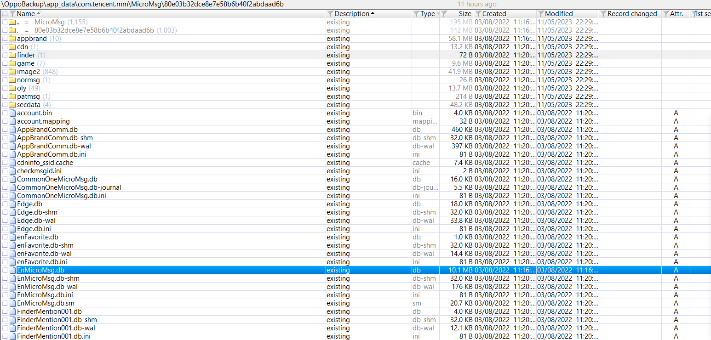
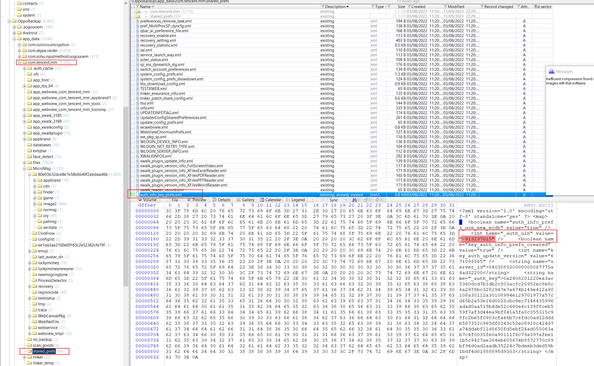
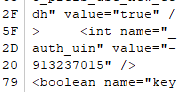
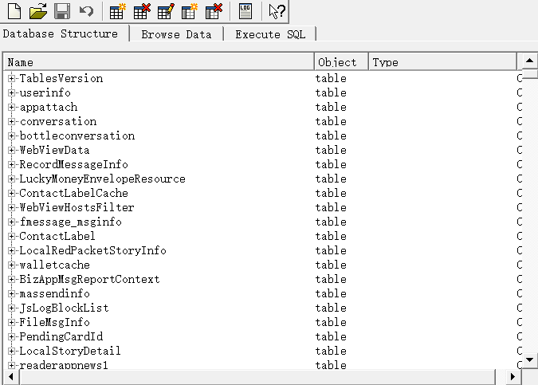
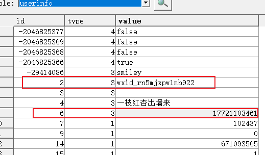

# 微信数据库取证

## Windows端

项目地址：https://github.com/AdminTest0/SharpWxDump

## 安卓端

数据库一般是这个文件：

密钥是`md5(IMEI+UIN)`的前七位（小写）：

UIN需要保留符号；

低版本安卓由于能够获取到IMEI，所以就是设备的IMEI，高版本的安卓可能无法直接获取到，所以会使用：`1234567890ABCDEF`。

UIN一般在 `com.tencent.mm/shared_prefs/auth_info_key_prefs.xml`里面获取：

解密的时候可以用。

> #### 2、该涉案人所使用的的微信ID和关联的手机号是：
>
> 微信数据库解密，从`OppoBackup/app_data/com.tencent.mm/shared_prefs/auth_info_key_prefs.xml`文件中读取`uin`为`-913237015`
>
> 
>
> 计算`1234567890ABCDEF`（安卓高版本下无法获取IMEI，低版本下该字符串应该换成IMEI）+`uin`的`md5`值，取前`7`位`e67c47e`以解密数据库`OppoBackup/app_data/com.tencent.mm/MicroMsg/80e03b32dce8e7e58b6b40f2abdaad6b/EnMicroMsg.db`
>
> 
>
> 其中`userinfo`表的`id`字段的值为`2`时，对应的是用户的`id`，值为`6`时，对应的是用户的手机号码
>
> 
>
> 结果为`wxid_rn5mjxpw1mb922 17721103461`

