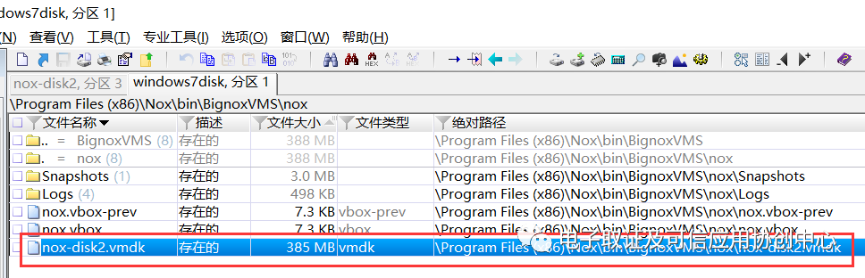
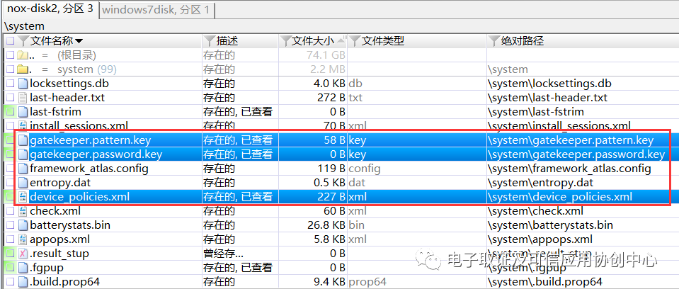
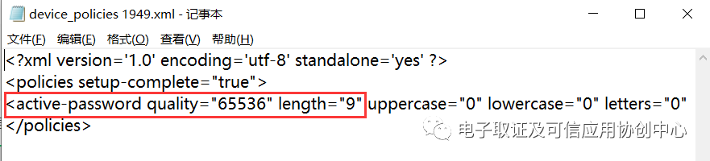
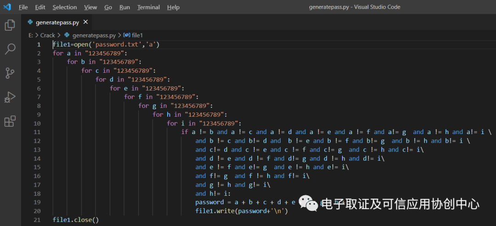
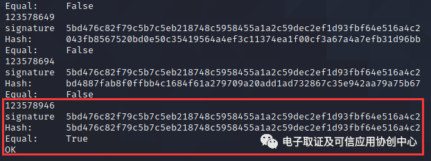
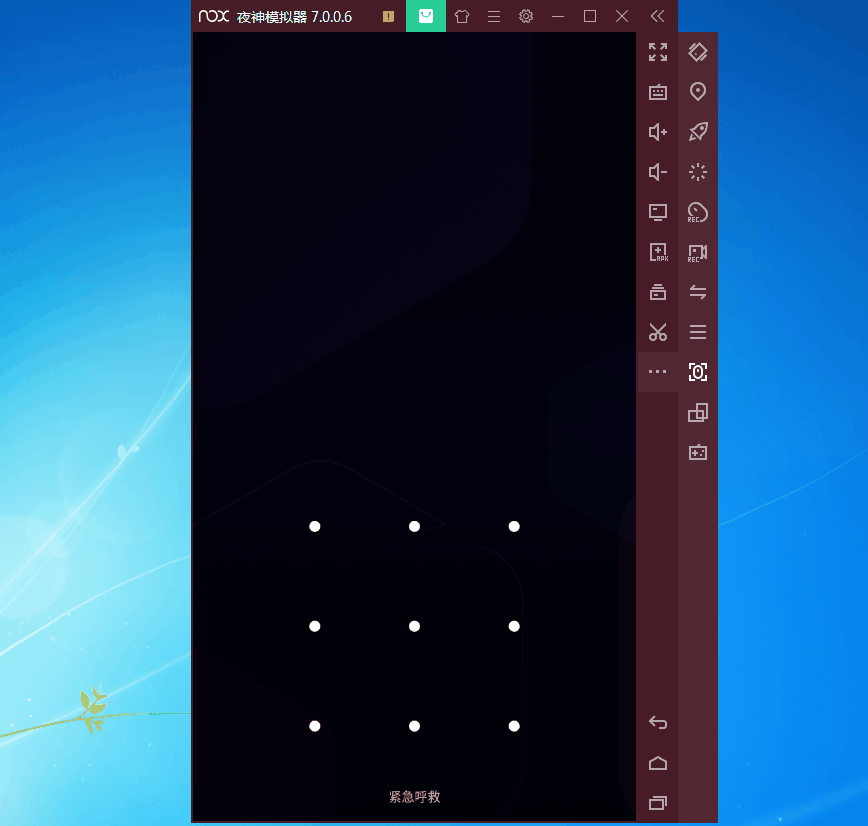
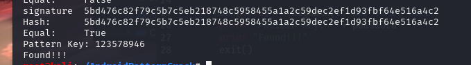

# 安卓图形解锁解析

参考文章：https://mp.weixin.qq.com/s?__biz=MzAxODA3NDc3NA==&amp;mid=2247484582&amp;idx=1&amp;sn=716471f5440de7305ae1a8075e5c7bf9

> ​    
>
> ​    在前段时间的中科实数比赛中，很多同学被一道破解Android模拟器锁屏图案的问题难住了，在这里我简单写一下破解的思路和脚本：
>
> **0x00 gatekeeper.pattern.key**
>
> 在早期版本(2.3-5.1)的Android手机中，锁屏密码相关的文件如下，这种类型的加密方式比较简单，只需要破解相关的SHA1的哈希值即可。
>
> ```
>/data/system/password.key/data/system/gesture.key
> ```
>
> ​    在6.0-8.0版本的Android手机中，锁屏密码相关的文件如下，该类型的加密方式则相对复杂，应该采用的是scrypt-hash算法（https://github.com/
> 
>dannycoates/scrypt-hash）。
> 
> ```
> /data/system/gatekeeper.pattern.key/data/system/gatekeeper.password.key
>```
> 
>
> 
>**0x01 解密**
> 
>    1.根据题目的信息，我们首先找到nox-disk2.vmdk
>
> 
> 
> 
>
> 
>
>    2.下一步，我们使用X-Ways Forensics 加载该文件，并看到
>
> gatekeeper.pattern.key，gatekeeper.password.key以及device_policies.xml文件
>
> 
>
> 
>
> 
>
>    3.根据device_policies.xml文件中，我们可以得到该解锁图案的长度为9.
>
> 
>
> 
>
> 
>
>   4.根据https://nelenkov.blogspot.com/2015/06/password-storage-in-android-m.html提供的信息，并结合scrypt-hash算法，然后对文中给出的m-pass-hash.py进行改进后编写如下Python脚本，至于具体的算法原理，见https://github.com/dannycoates/scrypt-hash。
>
> 
>```
> 
>
> #!/usr/bin/python
># -*- coding:utf-8 -*-
> import struct
>import binascii
> import scrypt
>N = 16384;
> r = 8;
> p = 1; 
> 
> f=open('gatekeeper.pattern.key', 'rb') #读取gatekeeper.pattern.key文件
> blob = f.read() 
> s = struct.Struct('<'+'17s 8s 32s')
> (meta, salt, signature) = s.unpack_from(blob) #提取其中关键的信息
> 
> f1=open('password.txt','r') #读取字典
> lines=f1.readlines()
> for data in lines:
>     password=data.strip()   
>     to_hash = meta
>     to_hash += password #将字典中读取的密码和meta信息组合成to_hash
>     hash = scrypt.hash(to_hash, salt, N, r, p)
>     print 'signature  %s' % signature.encode('hex')
>     print 'Hash:      %s' % hash[0:32].encode('hex') #取hash值的前32位
>     print 'Equal:     %s' % (hash[0:32] == signature)
> 
>     if hash[0:32] == signature: #如果相同，程序结束
>         print "OK"
>         exit()
> ```
> 
> 
> 
>    5.上面的py脚本中的password.txt实际上是所有不重复的9位数的组合，由以下代码生成（逻辑比较简单，同学们可自行优化）:
> 
>     
> 
> 
> 
> ``` Python
>file1=open('password.txt','a')
> for a in "123456789":
>    for b in "123456789":
>         for c in "123456789":
>            for d in "123456789":
>                 for e in "123456789":
>                    for f in "123456789":
>                         for g in "123456789":
>                             for h in "123456789":
>                                 for i in "123456789":
>                                     if a != b and a != c and a != d and a != e and a != f and a!= g  and a != h and a!= i \
>                                         and b != c and b!= d and  b != e and b != f and b!= g  and b != h and b!= i \
>                                         and c!= d and c != e and c != f and c!= g  and c != h and c!= i\
>                                         and d != e and d != f and d!= g and d != h and d!= i\
>                                         and e != f and e!= g  and e != h and e!= i\
>                                         and f!= g  and f != h and f!= i\
>                                         and g != h and g!= i\
>                                         and h!= i:
>                                         password = a + b + c + d + e + f + g + h + i
>                                         >file1.write(password+'\n')
> file1.close()
> ```
> 
> **0x02 运行该脚本（建议在Python2环境下运行），Pattern Get！**
> 
> 
> 
> 
> 
> 
> 
> **0x03 解锁成功！**
> 
>


来源：https://cloud.tencent.com/developer/article/2272887

镜像所给Android版本为7.1.2（33题已经提到过），在6.0~8.0的Android版本中，对锁屏密码采取的加密方式为[scrypt-hash](https://cloud.tencent.com/developer/tools/blog-entry?target=https%3A%2F%2Fgithub.com%2Fdannycoates%2Fscrypt-hash&source=article&objectId=2272887)

在第23题中，我们已经提到了此版本下Android的锁屏密码储存在本地的文件位置

```javascript
/data/system/gatekeeper.pattern.key
/data/system/gatekeeper.password.key
```

而有关锁屏密码的详细信息则储存在device_policies.xml文件中

```javascript
/data/system/device_policies.xml
```

将这三个文件都提取出来，xml文件内容如下

```javascript
<?xml version='1.0' encoding='utf-8' standalone='yes' ?>
<policies setup-complete="true">
<active-password quality="65536" length="9" uppercase="0" lowercase="0" letters="0" numeric="9" symbols="0" nonletter="9" />
</policies>
```

可以看到密码的长度为9，所以先生成一个由不重复9位数组成的密码字典，再对密码进行比对hash爆破即可

```javascript
import struct
import binascii
import scrypt

N = 16384;
r = 8;
p = 1; 

f=open('gatekeeper.pattern.key', 'rb')
blob = f.read() 
s = struct.Struct('<'+'17s 8s 32s')
(meta, salt, signature) = s.unpack_from(blob) #Extract the key information

f1=open('password.txt','r')
lines=f1.readlines()
for data in lines:
    password=data.strip()   
    to_hash = meta
    to_hash += password #to_hash = meta + passwd
    hash = scrypt.hash(to_hash, salt, N, r, p)
    print 'signature  %s' % signature.encode('hex')
    print 'Hash:      %s' % hash[0:32].encode('hex')
    print 'Equal:     %s' % (hash[0:32] == signature)
    
    if hash[0:32] == signature: #if same, over
        print "Pattern Key: " + password
        print "Found!!!"
        exit()
```



成功得到图形锁：123578946


