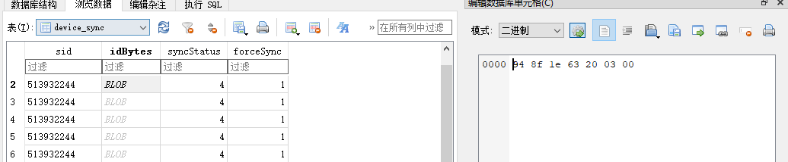

# 小米运动健康及数据库分析

数据库分析

对部分数据库中的数据进行分析

device_db

在`device`表中，会储存配对的设备的信息

[](https://img2022.cnblogs.com/blog/2817142/202210/2817142-20221020193245028-1125174694.png)

[](https://img2022.cnblogs.com/blog/2817142/202210/2817142-20221020193245025-2017805402.png)

如上图所示，连接的设备为`Redmi 手表 2`，它的设备id是`513932244`，mac地址`44:27:F3:38:D9:D8`，配对的手机的设备id是`e9d158d9-e284-476e-8cf3-418c5fd286a0`，sn序列号是`35796/AGAAJF1Y401267`

fitness_user

在`user_info_profile`表中，储存了用户信息，如`id`、`性别`、`身高`、`体重`、`生日`等信息

[](https://img2022.cnblogs.com/blog/2817142/202210/2817142-20221020193245008-1117066806.png)

如上图所示，用户id为`2452837599`，性别为`男`，生日为`2001-03-25`，体重为`60KG`

fitness_sync

在`device_sync`表中，储存对应设备可以同步的信息，以二进制储存

[](https://img2022.cnblogs.com/blog/2817142/202210/2817142-20221020193245031-2025633614.png)

fitness_data

保存在`fitness_user.user_info_profile`中的`name`字段的值同名的文件夹下

[](https://img2022.cnblogs.com/blog/2817142/202210/2817142-20221020193244985-457018466.png)

在`hr_record`表中，每半个小时插入一条心率数据

[](https://img2022.cnblogs.com/blog/2817142/202210/2817142-20221020193245033-1958378402.png)

在`sleep_segment`表中，会记录睡眠数据

[](https://img2022.cnblogs.com/blog/2817142/202210/2817142-20221020193245048-262239037.png)

内容如下


```
{
  "avg_hr":68,//平均心率
  "bedtime":1662995880,//进入睡眠的时间
  "sleep_deep_duration":110,//深度睡眠时长
  "device_bedtime":1662995880,
  "device_wake_up_time":1663022040,//苏醒时间
  "sleep_light_duration":325,//浅睡眠时长
  "max_hr":79,//最大心率
  "min_hr":57,//最小心率
  "protoTime":1663022040,
  "duration":435,//睡眠总时长
  "items":[{
    "end_time":1663000486,
    "state":3,//浅睡眠
    "start_time":1662995880},
    {
      "end_time":1663006447,
      "state":2,//深度睡眠
      "start_time":1663000486},
    {
      "end_time":1663013006,
      "state":3,
      "start_time":1663006447},
    {
      "end_time":1663013602,
      "state":2,
      "start_time":1663013006},
    {
      "end_time":1663019280,
      "state":3,
      "start_time":1663013602},
    {
      "end_time":1663019340,
      "state":5,//清醒
      "start_time":1663019280},
    {
      "end_time":1663022040,
      "state":3,
      "start_time":1663019340}],
  "timezone":32,
  "version":2,
  "awake_count":1,//清醒次数
  "sleep_awake_duration":1,//清醒时长
  "wake_up_time":1663022040//苏醒时间
}
```

在`spo2_record`表中会记录血氧饱和度

[](https://img2022.cnblogs.com/blog/2817142/202210/2817142-20221020193245057-1559849119.png)

在`stand_record`表中会记录有效站立，值为站立起始时间和结束时间

[](https://img2022.cnblogs.com/blog/2817142/202210/2817142-20221020193245059-834491868.png)

在`step_record`表中会记录每次行走的时间、卡路里、距离和步数

[](https://img2022.cnblogs.com/blog/2817142/202210/2817142-20221020193245084-2147421405.png)

在`stress_record`表中会记录压力数据

在`temperature_record`表中会记录温度数据

fitness_summary

在`daily_report`表中，每天北京时间8点整会更新数据，包括数据的类型和值

[](https://img2022.cnblogs.com/blog/2817142/202210/2817142-20221020193245050-12504448.png)

以步数举例，值的形式以字典加列表保存

[](https://img2022.cnblogs.com/blog/2817142/202210/2817142-20221020193245067-182992266.png)

下面是值及解释


```
{
  "activeStageList":[],
  "calories":133, //消耗了133卡路里
  "distance":3104, //行走距离为3104米
  "maxEndTime":1663450500,
  "minStartTime":1663396380,
  "sid":"default",
  "stepRecords":[ //每半个小时统计消耗的卡路里、行走的距离和步数
    {"calories":0,"distance":3,"steps":11,"time":1663396200},
    {"calories":0,"distance":5,"steps":9,"time":1663398000},
    {"calories":2,"distance":9,"steps":16,"time":1663401600},
    {"calories":30,"distance":714,"steps":1096,"time":1663403400},
    {"calories":13,"distance":203,"steps":338,"time":1663405200},
    {"calories":8,"distance":189,"steps":321,"time":1663407000},
    {"calories":3,"distance":121,"steps":201,"time":1663408800},
    {"calories":6,"distance":114,"steps":191,"time":1663410600},
    {"calories":2,"distance":47,"steps":79,"time":1663412400},
    {"calories":0,"distance":9,"steps":15,"time":1663414200},
    {"calories":3,"distance":168,"steps":287,"time":1663416000},
    {"calories":2,"distance":63,"steps":107,"time":1663417800},
    {"calories":9,"distance":253,"steps":422,"time":1663419600},
    {"calories":8,"distance":97,"steps":165,"time":1663421400},
    {"calories":0,"distance":75,"steps":125,"time":1663423200},
    {"calories":9,"distance":166,"steps":282,"time":1663425000},
    {"calories":5,"distance":51,"steps":85,"time":1663426800},
    {"calories":23,"distance":674,"steps":1063,"time":1663428600},
    {"calories":4,"distance":55,"steps":94,"time":1663435800},
    {"calories":2,"distance":15,"steps":26,"time":1663439400},
    {"calories":2,"distance":54,"steps":92,"time":1663446600},
    {"calories":2,"distance":19,"steps":32,"time":1663450200}],
  "steps":5057,"tag":"days","time":1663372800
}
```

APK分析

在之前数据分析时已经知道了一个表`hr_record`，直接跟着这个表的操作一步一步往上扒

[](https://img2022.cnblogs.com/blog/2817142/202210/2817142-20221020193245025-1184685134.png)

找到同步包

[](https://img2022.cnblogs.com/blog/2817142/202210/2817142-20221020193245035-1438496007.png)

------

做到这边想去抓蓝牙包，但是可能是手机问题，一直没找到日志文件，先留坑后续再说