# 虚拟货币取证

## 2023美亚杯团体赛WP 区块链部分（还没看）

> ## 94.参考’benckwindow10.e01’,在Ben电脑中，他在Opensea.io中使用了哪些区块链制造NFT?(2分)
>
> A.Ethereum
>
> B.Polygon PoS Chain
>
> C.Arbitrum
>
> D.Base
>
> [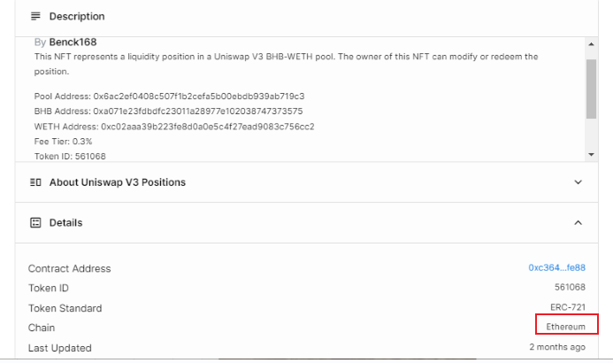](https://img2023.cnblogs.com/blog/2817142/202311/2817142-20231123224903149-514759731.png)
>
> [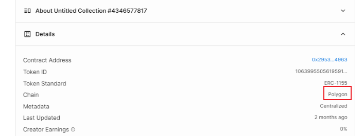](https://img2023.cnblogs.com/blog/2817142/202311/2817142-20231123224903132-1319886289.png)
>
> 结果为`AB`
>
> ## 95.参考’benckwindow10.e01’,在Ben电脑在Opensea.io中所创建的NFT(s)的CollectionID是？需以下例子的格式作答:CollectionID/NumberofNFT(s)sold，例:4561313456(2分)
>
> 附加资料
>
> [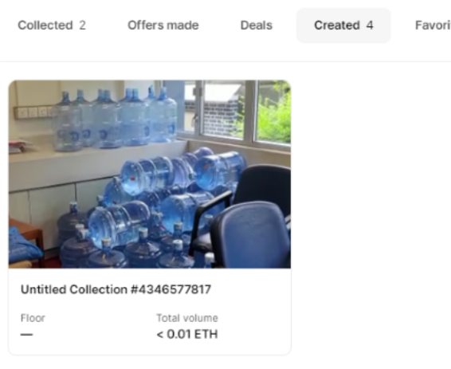](https://img2023.cnblogs.com/blog/2817142/202311/2817142-20231123224903347-356869930.png)
>
> 结果为`4346577817`
>
> ## 96.参考’benckwindow10.e01’,这个Opensea.io中的CollectionID一共卖出了多少个NFT(s)?提示:请参阅附加资料(1分)
>
> [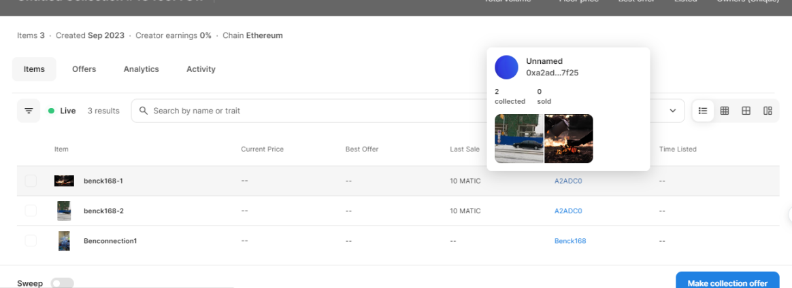](https://img2023.cnblogs.com/blog/2817142/202311/2817142-20231123224903193-1889462703.png)
>
> 结果为`2`
>
> ## 97.参考’benckwindow10.e01’,购买上述在Opensea.io中NFT(s)的加密货币地址是?提示:请参阅附加资料與请用大写字母作答,例子:0X1234567ABCDEF(1分)
>
> [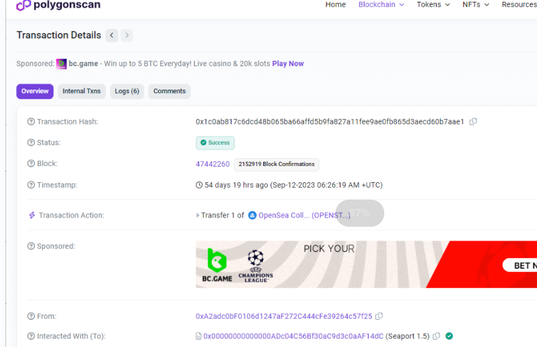](https://img2023.cnblogs.com/blog/2817142/202311/2817142-20231123224903462-1513154697.png)
>
> 结果为`0xA2adc0bF0106d1247aF272C444cFe39264c57f25`
>
> ## 98.参考’benckwindow10.e01’,哪些是购买上述CollectionID内的NFT(s)的交易哈希(TransactionHash)?提示:请参阅附加资料(2分)
>
> A.0x1c0ab817c6dcd48b065ba66affd5b9fa827a11fee9ae0fb865d3aecd60b7aae1
>
> B.0xcbf3523d199efd2f61fdbc3d7debf706f8eb42c0dbe4a07d0d9472ab7e04c566
>
> C.0xdc7f2e5362faf3b5ddc9ae0be83d3da7222b34f06e86862b9c0af1cc14e3c3e3
>
> D.0xaaa011a6b6af54b11f97217d63dfa5f13aef160ebf672b1476de0460ef5b043f
>
> 要注意买方，两个NFT的交易方是同一个
>
> [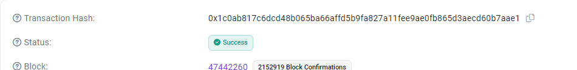](https://img2023.cnblogs.com/blog/2817142/202311/2817142-20231123224908158-1944988488.png)
>
> [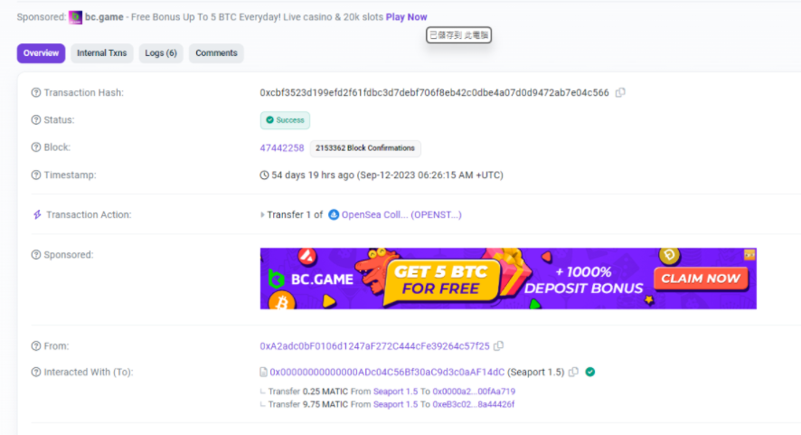](https://img2023.cnblogs.com/blog/2817142/202311/2817142-20231123224908566-976648720.png)
>
> 结果为`AB`
>
> ## 99.参考’benckwindow10.e01’,在Opensea.io中铸造上述NFT(s)的加密货币地址是?提示:请参阅附加资料与请用大写字母作答,例子(example):0X1234567890ABCDEFGHIJKLMNOPQRSTUVWXYZ0123(1分)
>
> 仿真进电脑可以看到metamask，试了密码是`P@ssw0rd`，地址复制出来就可以，当然这是瞎猫撞死耗子。。。
>
> [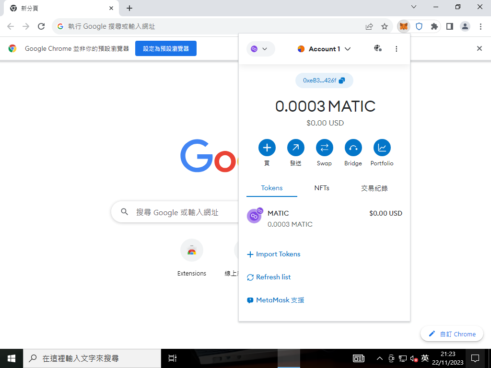](https://img2023.cnblogs.com/blog/2817142/202311/2817142-20231123224908731-1442921761.png)
>
> 由于交易的这两个NFT就是由这个地址铸造的，所以第一手就是铸造的地址
>
> [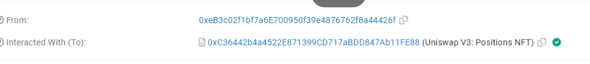](https://img2023.cnblogs.com/blog/2817142/202311/2817142-20231123224903155-783992832.png)
>
> 结果为`0xeB3c02f1bf7a6E700950f39e4876762f8a44426f`
>
> ## 100.参考’benckwindow10.e01’,在Opensea.io中，由上述加密货币地址所铸造没有CollectionID的NFT找到什么资讯?提示:请参阅附加资料(1分)
>
> A.Uniswap V3 BHB-WETH pool
>
> B.0xa071e23fdbdfc23011a28977e102038747373575
>
> C.Token ID:561068
>
> D.以上皆是
>
> [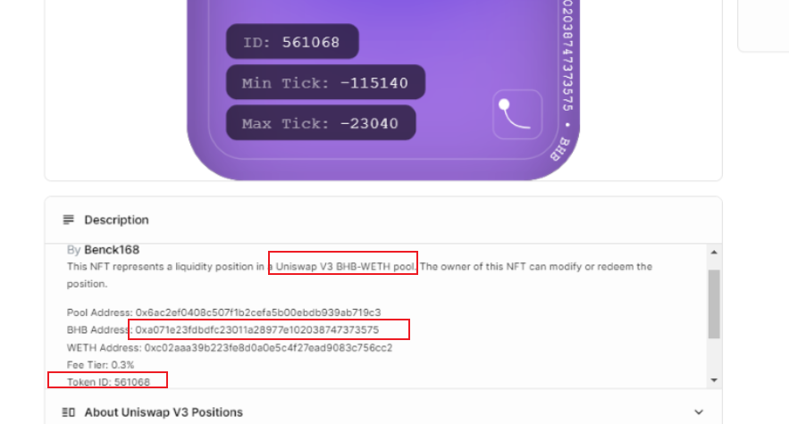](https://img2023.cnblogs.com/blog/2817142/202311/2817142-20231123224903197-1386345538.png)
>
> 结果为`D`
>
> ## 101.参考’benckwindow10.e01’,合约地址(ContractAddress):0xa071e23fdbdfc23011a28977e102038747373575所使用的是哪一个区块链?提示:请参阅附加资料(1分)
>
> [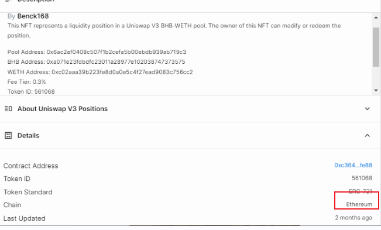](https://img2023.cnblogs.com/blog/2817142/202311/2817142-20231123224903176-1482467721.png)
>
> 结果为`Ethereum`
>
> ## 102.参考’benckwindow10.e01’,合约地址(ContractAddress):0xa071e23fdbdfc23011a28977e102038747373575的加密货币名称(Name)及简写(Symbol)是?提示:请参阅附加资料(1分)
>
> 结果为`Binince(BHB)`
>
> ## 103.参考’benckwindow10.e01’,加密货币合约地址(ContractAddress):0xa071e23fdbdfc23011a28977e102038747373575在区块链的创建日期时间是?提示:请参阅附加资料(1分)
>
> [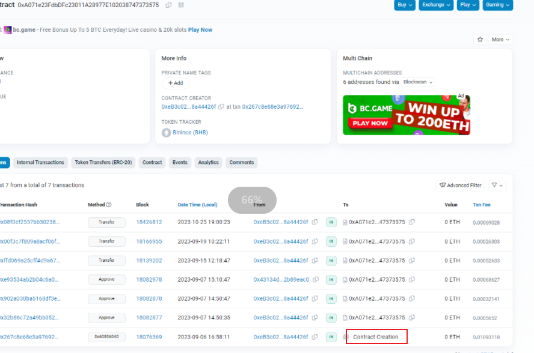](https://img2023.cnblogs.com/blog/2817142/202311/2817142-20231123224908815-85892871.png)
>
> 结果为`2023-09-06 16:58:11`
>
> ## 104.参考’benckwindow10.e01’,加密货币合约址(ContractAddress):0xa071e23fdbdfc23011a28977e102038747373575的总铸造数量是?提示:请参阅附加资料(1分)
>
> [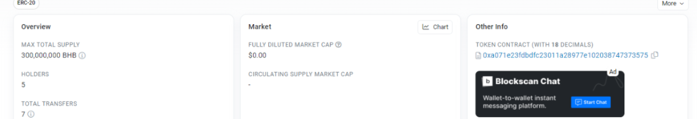](https://img2023.cnblogs.com/blog/2817142/202311/2817142-20231123224903179-1633173487.png)
>
> 结果为`300,000,000`
>
> ## 105.参考’benckwindow10.e01’回答以下题目,第一个储存加密货币合约(ContractAddress):0xa071e23fdbdfc23011a28977e102038747373575的地址是?提示:请参阅附加资料與请用大写字母作答,例子(example):0X1234567890ABCDEFGHIJKLMNOPQRSTUVWXYZ0123(1分)
>
> [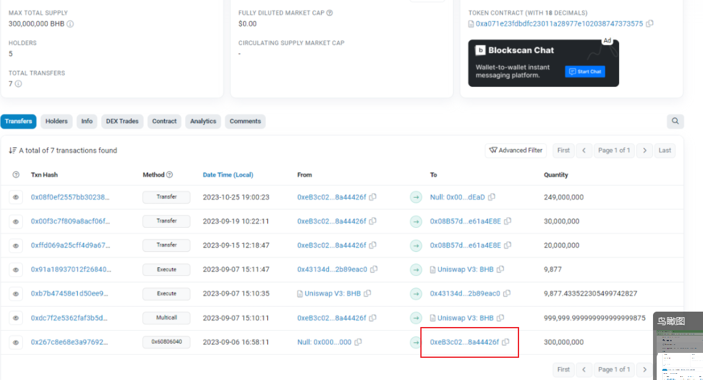](https://img2023.cnblogs.com/blog/2817142/202311/2817142-20231123224903189-566617952.png)
>
> 结果为`0xeB3c02f1bf7a6E700950f39e4876762f8a44426f`
>
> ## 106.参考’benckwindow10.e01’回答以下题目,铸造加密货币合约地址(ContractAddress):0xa071e23fdbdfc23011a28977e102038747373575的交易哈希(TransactionHash)是?提示:请参阅附加资料與请用大写字母作答,例子(example):0X1234567890ABCDEFGHIJKLMNOPQRSTUVWXYZ0123(1分)
>
> [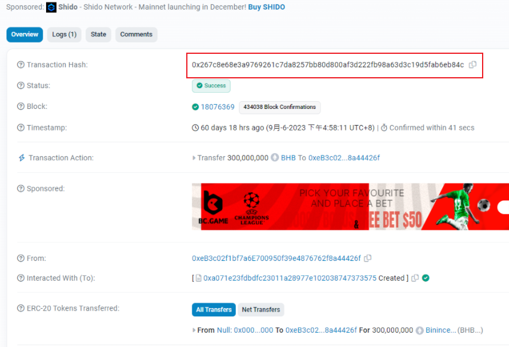](https://img2023.cnblogs.com/blog/2817142/202311/2817142-20231123224903284-879112263.png)
>
> 结果为`0x267c8e68e3a9769261c7da8257bb80d800af3d222fb98a63d3c19d5fab6eb84c`
>
> ## 107.参考’benckwindow10.e01’回答以下题目,承上題，请根据铸造加密货币合约地址(ContractAddress):0xa071e23fdbdfc23011a28977e102038747373575的交易哈希(TransactionHash)，在Ben电脑中，找出比在以太坊(Ethereum)上确认验证的日期时间早的文件名?提示:请参阅附加资料与请用大写字母作答(3分)
>
> 交易哈希的时间在上图，`16:58:11`，搜索
>
> [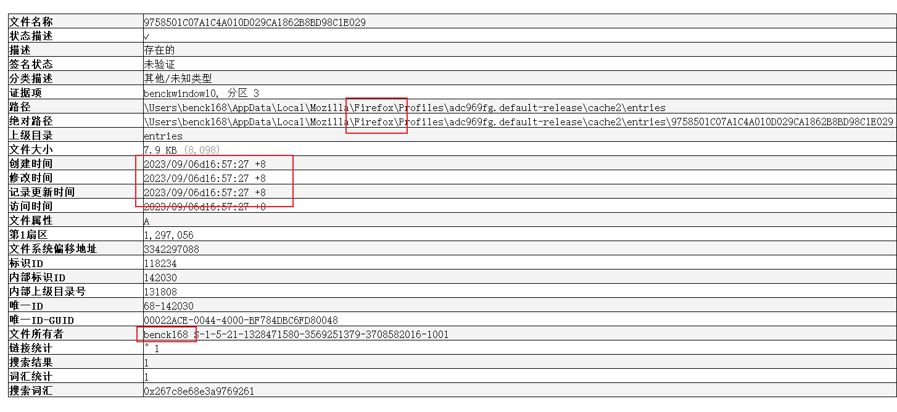](https://img2023.cnblogs.com/blog/2817142/202311/2817142-20231123224903263-1994737421.png)结果为`9758501C07A1C4A010D029CA1862B8BD98C1E029`
>
> ## 108.参考’benckwindow10.e01’,承上題，按照在以太坊(Ethereum)上确认验证的日期时间的文件的创建日期时间、路径及数据，下列哪些推论是正确的?(2分)
>
> A.Ben电脑内发现的交易哈希，比写上以太坊(Ethereum)被确认验证的交易哈希早出现
>
> B.此档案与Firefox浏览器有关
>
> C.此档案与Chrome浏览器有关
>
> D.此档案是由陈大昆电脑的用户benck168创建的
>
> 见上图
>
> 结果为`ABD`
>
> ## 109.参考’benckwindow10.e01’回答以下题目,以下哪个去中心化交易中心(Dex)能够成功兑换加密货币合约地址(ContractAddress):0xa071e23fdbdfc23011a28977e102038747373575?提示:请参阅附加资料(1分)
>
> [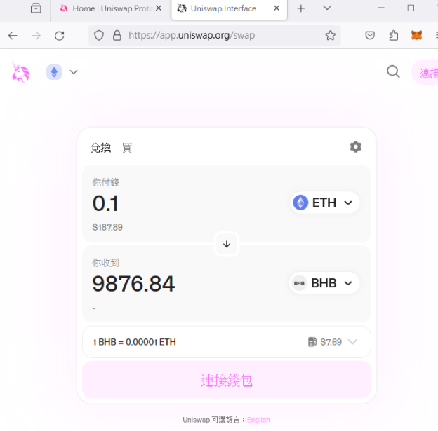](https://img2023.cnblogs.com/blog/2817142/202311/2817142-20231123224903200-1067808828.png)
>
> 结果为`Uniswap`
>
> ## 110.参考’benckwindow10.e01’,截至2023-09-07 1511时，加密货币合约地址(ContractAddress):0xa071e23fdbdfc23011a28977e102038747373575对美元(USD)的市场价格是?提示:请参阅附加资料(1分)
>
> 答案里没有。。。
>
> [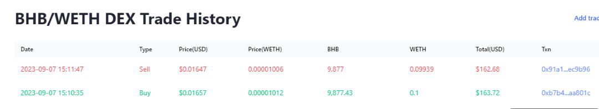](https://img2023.cnblogs.com/blog/2817142/202311/2817142-20231123224903212-577552299.png)
>
> 去网页自己查，得到结果
>
> [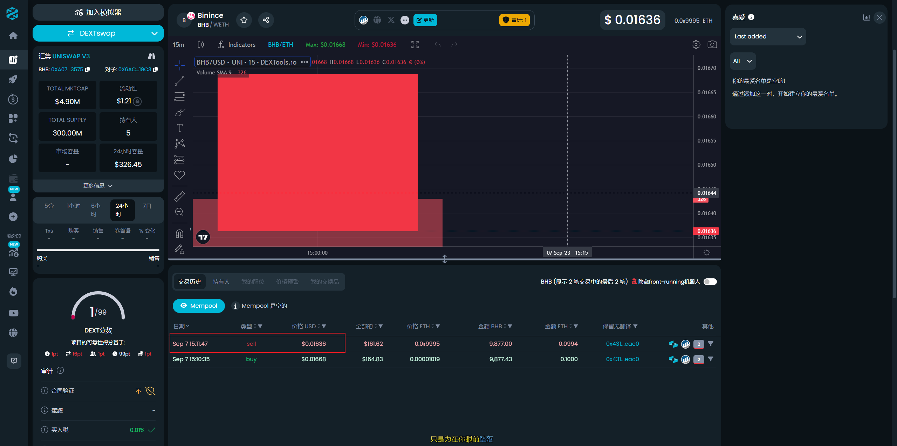](https://img2023.cnblogs.com/blog/2817142/202311/2817142-20231123224903306-207226760.png)
>
> 结果为`0.01636`
>
> ## 111.参考’benckwindow10.e01’回答以下题目,截至2023-09-20，持有50,000,000个加密货币合约地址(ContractAddress):0xa071e23fdbdfc23011a28977e102038747373575的加密货币地址是?提示:请参阅附加资料與请用大写字母作答(1分)
>
> [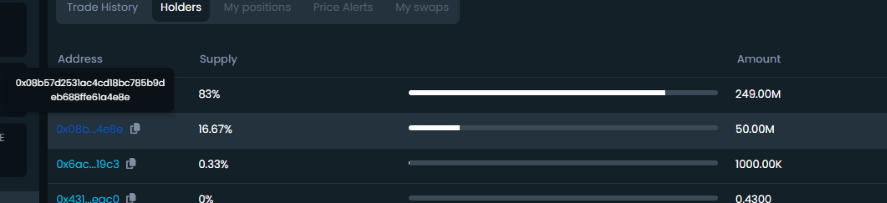](https://img2023.cnblogs.com/blog/2817142/202311/2817142-20231123224903270-634492780.png)
>
> 结果为`0x08b57d2531ac4cd18bc785b9deb688ffe61a4e8e`
>
> ## 112.参考’benckwindow10.e01’,按照时间线分析Ben电脑活动，在2023-09-06 16:58:10时及2023-09-06 16:58:21时，在”Access-Control-Allow-Origin”中显示了哪一个网站?(2分)
>
> [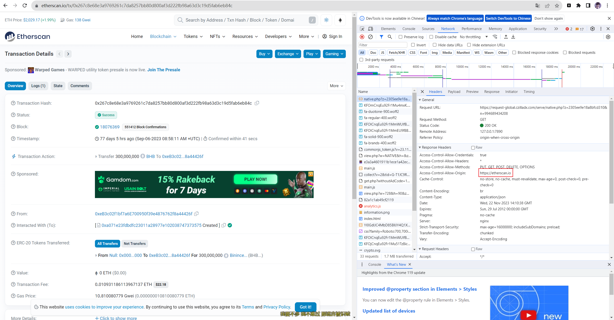](https://img2023.cnblogs.com/blog/2817142/202311/2817142-20231123224903344-218707525.png)
>
> [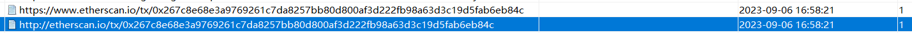](https://img2023.cnblogs.com/blog/2817142/202311/2817142-20231123224903582-1057923859.png)
>
> 结果为`https://etherscan.io`
>
> ## 113.参考’benckwindow10.e01’,承上題，在2023-09-0616:58:10时及2023-09-0616:58:21时，在”Access-Control-Allow-Origin”中显示的网站有什么功能?(1分)
>
> A.太坊区块链上的交易、地址、合约、代币等信息查询
>
> B.太坊基金会的网站分析工具，用于跟踪和分析网站访问者的行为和活动
>
> C.以太坊官方的在线IDE（集成开发环境），可用于编写、测试和部署智能合约
>
> D.网上搜索引擎
>
> 应该是问不对的？？官方在线IDE是`Remix`
>
> 结果为`ABD`
>
> ## 114.参考’benckwindow10.e01’,哪一个扩展名与创建加密货币有关?(1分)
>
> [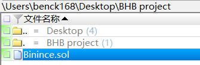](https://img2023.cnblogs.com/blog/2817142/202311/2817142-20231123224903944-468338320.png)
>
> 结果为`sol`
>
> ## 115.参考’benckwindow10.e01’回答以下题目,陈大昆被捕后拒绝提供虚疑货币钱包密码及恢复种子，并以挑战口吻响应：「重要信息已经放好在桌面上，难道你没看见吗?」。在Ben电脑内与恢复种子有关的两个文件的扩展名是?(3分)
>
> [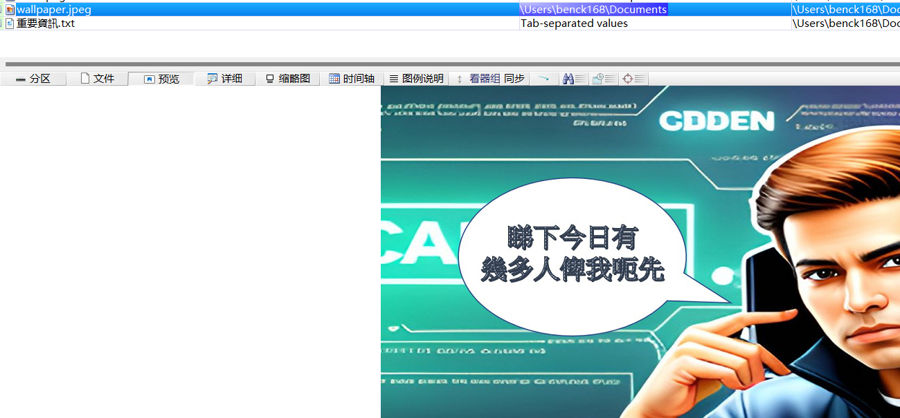](https://img2023.cnblogs.com/blog/2817142/202311/2817142-20231123224904298-2104246733.png)
>
> [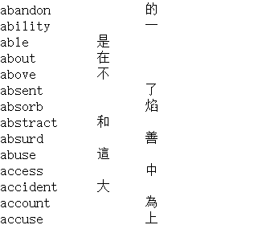](https://img2023.cnblogs.com/blog/2817142/202311/2817142-20231123224904331-1204254593.png)
>
> 结果为`jpeg`、`txt`
>
> ## 116.参考’benckwindow10.e01’,承上題，在陈大昆电脑内恢复种子的第八个英文单字是?提示:请用大写字母作答(3分)
>
> 图片中的文字恰好12个，跟恢复种子匹配，而字典文件中又有中文，因此就是对照着去找出恢复种子
>
> 找到的种子为
>
> 
>
> ```plain
> stable arrange expect popular train oak harsh grant quality mimic genre eternal
> ```
>
> 结果为`grant`
>
> ## 117.参考’benckwindow10.e01’回答以下题目,按照上述恢复种子,请计算出在以太坊(Ethereum)其BIP-44 derivation address=m/44’/60’/0’/0/0的公钥?提示:请用大写字母作答n例子:0X1234567890ABCDEFGHIJKLMNOPQRSTUVWXYZ0123(3分)
>
> 在线网站https://iancoleman.io/bip39/
>
> [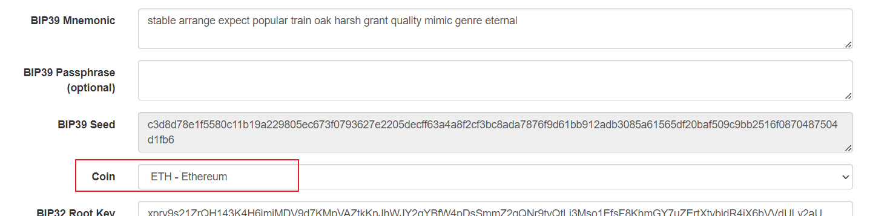](https://img2023.cnblogs.com/blog/2817142/202311/2817142-20231123224904453-970509206.png)
>
> [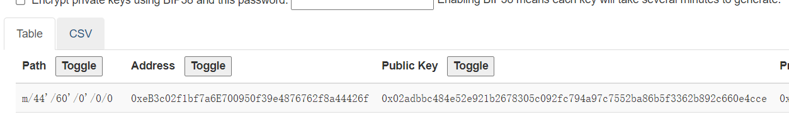](https://img2023.cnblogs.com/blog/2817142/202311/2817142-20231123224904649-982130929.png)
>
> 结果为`0x02adbbc484e52e921b2678305c092fc794a97c7552ba86b5f3362b892c660e4cce`
>
> ## 118.参考’benckwindow10.e01’,按照上述恢复种子,请计算出在波场网络(Tron Network)其BIP-44 derivation address=m/44’/195’/0’/0/2的私钥?提示:请用大写字母与阿拉伯数字作答(3分)
>
> [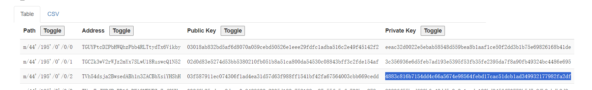](https://img2023.cnblogs.com/blog/2817142/202311/2817142-20231123224904679-28536610.png)
>
> 结果为`4883c816b7154dd4c66a5674e98564febd17cac51dcb1ad349932177982fa2df`